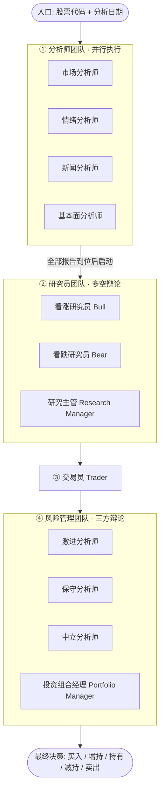

本页是 TradingAgents 文档的入口。它回答三个问题：**这是什么项目**、**它由哪些部分构成**、**作为初学者应该按什么顺序继续阅读**。这里只提供全局视角的骨架与地图，具体的运行步骤、配置细节与算法实现，会在后续各页展开。

## TradingAgents 是什么

TradingAgents 是一个**多智能体（Multi-Agent）LLM 金融交易研究框架**。它的核心思路是模仿一家真实交易公司的组织分工：把复杂的交易决策拆解给一组各自专精的智能体——基本面分析师、情绪分析师、新闻分析师、技术分析师，再到研究员、交易员与风险管理团队，让它们协作产出一份交易决策。

需要强调的是它的定位：这是一个**研究用途**的脚手架，而不是一个可直接落地执行的交易策略。官方明确说明交易表现会随所选的底层语言模型、温度、时间区间、数据质量等非确定性因素而波动，因此它不应被当作投资建议。理解这一点，是读懂后续所有设计取舍的前提。

Sources: [README.md](README.md#L30-L30) [README.md](README.md#L67-L75)

从工程角度看，包名与版本号在包根目录声明，当前版本为 `0.5.2`。项目引入包时会自动从工作目录加载 `.env` 文件（以及可选的 `.env.enterprise`），这样无论从哪个入口启动，用户的 API Key 都能被默认配置和所有 LLM 客户端看到——而已提前导出的环境变量永远不会被覆盖。

Sources: [tradingagents/__init__.py](tradingagents/__init__.py#L1-L13)

## 核心架构：LangGraph 编排的多智能体流水线

整个框架由 **LangGraph** 编排成一张有向状态图。理解这张图，就理解了 TradingAgents 的主干。流水线分为四个阶段，信息自下而上逐层收敛：



这张图直接对应代码中的图构建逻辑：分析师节点全部**从 `START` 出发并行运行**，只有当每一位分析师都提交了报告后，才汇聚到看涨研究员，从而启动研究辩论；研究辩论由条件边在 Bull / Bear / 研究主管之间路由；研究主管产出后交给交易员；交易员再进入激进、保守、中立三方风险辩论；最后由投资组合经理节点收尾，输出决策并连到 `END`。为了避免某个模型失控地反复调用工具导致触碰递归上限，每位分析师还被封装成一张**独立子图**，最多进行 `max_tool_rounds` 轮工具调用后就被要求直接写报告。

Sources: [tradingagents/graph/setup.py](tradingagents/graph/setup.py#L109-L118) [tradingagents/graph/setup.py](tradingagents/graph/setup.py#L140-L182) [tradingagents/graph/setup.py](tradingagents/graph/setup.py#L53-L90)

流程的"是否继续"由条件逻辑集中裁决。研究辩论按 `max_debate_rounds` 控制轮次（多空各发言一轮记为计数 +1，达到 `2 × max_debate_rounds` 时转交研究主管）；风险辩论则按 `max_risk_discuss_rounds` 控制，三方各发言一轮后计数 +1，达到 `3 × max_risk_discuss_rounds` 时转交投资组合经理。

Sources: [tradingagents/graph/conditional_logic.py](tradingagents/graph/conditional_logic.py#L12-L33)

## 状态模型：智能体之间如何传递信息

所有智能体共享一个贯穿全流程的状态对象 `AgentState`。它以 LangGraph 的 `MessagesState` 为基础，额外承载了运行所需的关键字段：待分析标的与资产类型、在运行开始时**确定性解析**出的标的身份、分析日期，以及四个分析师各自的报告、两场辩论的状态、交易员方案与最终决策。把"标的身份"在流程开始前一次性解析好并注入状态，是为了让每个智能体都锁定到真实的公司，而不是让模型从股价图里凭空臆想出另一家公司。此外，状态里还预留了 `past_context`（历史决策记忆）与 `portfolio_context`（调用方持仓）两个入口。

Sources: [tradingagents/agents/state.py](tradingagents/agents/state.py#L45-L73) [tradingagents/graph/propagation.py](tradingagents/graph/propagation.py#L13-L64)

最终决策采用一套**统一的五档评级**词汇表——`Buy`（买入）、`Overweight`（增持）、`Hold`（持有）、`Underweight`（减持）、`Sell`（卖出）。当模型输出无法解析出评级时，系统不会悄悄降级为 `Hold`，而是给出一个 `REVIEW` 哨兵值，明确提示这份输出需要人工复核或重跑，避免把"没人能读懂的决策"当成一个从未做过的"持有"被回传给下一次运行。

Sources: [tradingagents/agents/rating.py](tradingagents/agents/rating.py#L21-L31) [tradingagents/agents/rating.py](tradingagents/agents/rating.py#L85-L107)

## 项目目录结构

仓库在物理上分成两个顶层 Python 包：`tradingagents/`（核心框架库）与 `cli/`（命令行界面）。此外 `tests/` 存放了覆盖广泛的测试，`.archify/` 是架构交付物目录。核心库的组织方式如下：

```text
TradingAgents/
├── main.py                      # 最小可运行示例：初始化图并调用 propagate()
├── pyproject.toml               # 依赖声明与 CLI 入口 (tradingagents = "cli.main:app")
├── docker-compose.yml           # Docker 部署编排
├── .env.example                 # API Key 与配置项模板
├── cli/                         # 命令行界面层
│   ├── main.py                  # Typer 应用与所有标志 (--ticker / --date / --analysts ...)
│   ├── run.py                   # 单次分析的执行与实时视图流式渲染
│   ├── display.py / models.py   # 终端展示与模型
│   └── selections.py / prefs.py # 交互式选择与偏好记忆
└── tradingagents/               # 核心框架库
    ├── default_config.py        # 默认配置 + TRADINGAGENTS_* 环境变量覆盖
    ├── graph/                   # LangGraph 编排层
    │   ├── trading_graph.py     # 主类 TradingAgentsGraph（编排中枢）
    │   ├── setup.py             # 图节点与边的构建
    │   ├── conditional_logic.py # 辩论路由裁决
    │   ├── propagation.py       # 初始状态构造
    │   └── checkpointer.py      # 断点保存/恢复
    ├── agents/                  # 智能体实现层
    │   ├── analysts/            # 四位分析师
    │   ├── researchers/         # 看涨 / 看跌研究员
    │   ├── managers/            # 研究主管 / 投资组合经理
    │   ├── risk_mgmt/           # 激进 / 保守 / 中立风险分析师
    │   ├── trader/              # 交易员
    │   ├── tools.py             # 分析师可调用的数据工具
    │   └── state.py             # AgentState 状态定义
    ├── dataflows/               # 数据层
    │   ├── router.py            # 按类别把工具请求路由到供应商
    │   └── vendors/             # yahoo / sec_edgar / alpha_vantage / fred / polymarket ...
    ├── llm_clients/             # LLM 客户端层（工厂模式 + 供应商适配）
    ├── memory/                  # 记忆日志、结算与反思
    ├── backtest.py              # 网格回测与决策评估
    ├── portfolio.py             # 投资组合上下文
    └── reporting.py             # 报告树写出
```

Sources: [pyproject.toml](pyproject.toml#L42-L52) [README.md](README.md#L239-L247)

## 关键能力一览

下表高度概括了框架的主要能力及其与代码的对应关系，帮助你建立"功能 → 模块"的映射：

| 能力 | 说明 | 主要模块 |
| --- | --- | --- |
| 多智能体协作 | 分析师并行工作，研究员与风控团队各自辩论 | `tradingagents/graph/setup.py` |
| 多 LLM 供应商 | OpenAI、Google、Anthropic、DeepSeek、Qwen、GLM、Ollama、Bedrock 等（含任意 OpenAI 兼容端点） | `tradingagents/llm_clients/` |
| 供应商路由与回退 | 按类别（行情/指标/基本面/新闻/宏观/预测市场）配置供应商链 | `tradingagents/dataflows/router.py` |
| 配置与环境变量覆盖 | `TRADINGAGENTS_*` 变量按类型强制转换后覆盖默认配置 | `tradingagents/default_config.py` |
| 记忆与反思 | 每次决策记录在案，下次同标的运行时结算收益并生成反思 | `tradingagents/memory/` |
| 断点恢复 | 可选开启，崩溃后从上一成功节点续跑 | `tradingagents/graph/checkpointer.py` |
| 回测与评估 | 在标的 × 日期网格上运行同一流水线并按评级分组成交 alpha | `tradingagents/backtest.py` |
| 报告落盘 | 生成与 CLI 一致的分节 Markdown 报告树 | `tradingagents/reporting.py` |

Sources: [tradingagents/llm_clients/factory.py](tradingagents/llm_clients/factory.py#L36-L56) [tradingagents/dataflows/router.py](tradingagents/dataflows/router.py#L44-L94) [tradingagents/default_config.py](tradingagents/default_config.py#L73-L82) [tradingagents/backtest.py](tradingagents/backtest.py#L1-L15) [tradingagents/reporting.py](tradingagents/reporting.py#L1-L7)

## 两条使用路径：CLI 与 Python API

框架同时提供两种入口，它们最终都会走到同一个 `TradingAgentsGraph`。

**命令行路径**：通过 Typer 构建应用，入口点注册在 `pyproject.toml` 中，安装后可直接运行 `tradingagents`。CLI 既可以完全交互式地询问标的、日期、LLM 供应商、研究深度等信息，也可以通过 `--ticker`、`--date`、`--analysts` 等标志跳过对应问题以实现无提示运行。

Sources: [pyproject.toml](pyproject.toml#L42-L43) [cli/main.py](cli/main.py#L25-L60)

**编程路径**：核心编排类是 `TradingAgentsGraph`。在初始化时，它会根据配置构建两个 LLM 客户端（深度思考与快速思考各一）、加载记忆日志、组装条件逻辑、构建并编译状态图；其 `.propagate(股票代码, 日期)` 方法返回 `(最终状态, 信号)` 二元组，其中信号即五档评级之一（或在无法解析时为 `REVIEW`）。

Sources: [tradingagents/graph/trading_graph.py](tradingagents/graph/trading_graph.py#L51-L132) [tradingagents/graph/trading_graph.py](tradingagents/graph/trading_graph.py#L182-L205)

无论从哪条路径进入，一次完整运行的生命周期是统一的：**构造初始状态**（先结算该标的的历史待定决策，再注入历史记忆与解析好的标的身份）→ **执行图** → **记录决策**（写入状态日志与记忆日志）→ **成功后清理断点**。CLI 与 API 共享同一套状态构造与落盘逻辑，因此无头运行也会产出与 CLI 相同的报告。

Sources: [tradingagents/graph/trading_graph.py](tradingagents/graph/trading_graph.py#L305-L382)

## 技术栈与运行环境

框架要求 **Python 3.11 及以上**，以 LangGraph 作为编排内核，LangChain 系列作为 LLM 集成层。核心依赖还包括用于数据处理与指标计算的 `pandas` 与 `stockstats`、用于行情数据的 `yfinance`、以及用于终端交互的 `rich`、`typer`、`questionary`。Bedrock 支持被拆分为可选依赖 `tradingagents[bedrock]`，以保持核心安装精简。若选择 Docker 部署，结果、报告、记忆日志与缓存会写入数据卷以实现持久化。

Sources: [pyproject.toml](pyproject.toml#L10-L40) [README.md](README.md#L140-L150)

## 建议的阅读路线

本页只勾勒了骨架。接下来的内容按**从入门到深入**的顺序编排，建议逐层递进：

**第一层 · 先把系统跑起来**
1. [快速开始](2-kuai-su-kai-shi)——用最短的路径完成第一次分析运行。
2. [本地安装与依赖](3-ben-di-an-zhuang-yu-yi-lai)——本地虚拟环境与依赖安装的细节。
3. [Docker 部署与数据持久化](4-docker-bu-shu-yu-shu-ju-chi-jiu-hua)——容器化运行与数据卷管理。

**第二层 · 掌握日常使用**
4. [交互式 CLI 与运行流程](5-jiao-hu-shi-cli-yu-yun-xing-liu-cheng)——理解一次运行在界面上如何推进。
5. [无提示批处理运行（标志与环境变量）](6-wu-ti-shi-pi-chu-li-yun-xing-biao-zhi-yu-huan-jing-bian-liang)——面向定时任务的自动化运行。
6. [多市场行情与标的符号](7-duo-shi-chang-xing-qing-yu-biao-de-fu-hao)——跨市场标的的书写方式。
7. [回测命令行与结果解读](8-hui-ce-ming-ling-xing-yu-jie-guo-jie-du)——如何评估决策质量。

**第三层 · 以编程方式集成**
8. [Python API 与配置调整](9-python-api-yu-pei-zhi-diao-zheng)——直接在代码中调用框架。
9. [状态持久化与断点恢复](10-zhuang-tai-chi-jiu-hua-yu-duan-dian-hui-fu)——记忆日志与断点续跑。

**第四层 · 深入解析**

若你已有一定基础，可直接进入"深入解析"章节，从 [总体架构与多智能体协作](11-zong-ti-jia-gou-yu-duo-zhi-neng-ti-xie-zuo) 开始，逐步理解图编排、辩论路由、状态模型、数据层、LLM 客户端层、记忆与评估等各个子系统的设计取舍。

Sources: [README.md](README.md#L198-L213) [README.md](README.md#L365-L385)

> **一句话总结**：TradingAgents 用 LangGraph 把一组各司其职的 LLM 智能体串成一条从"分析"到"辩论"再到"风控决策"的流水线，并围绕它配套了多供应商数据层、多供应商 LLM 层、记忆反思、断点恢复与回测评估。它是理解多智能体金融研究的优秀载体，但请始终把它当作研究工具，而非投资建议。