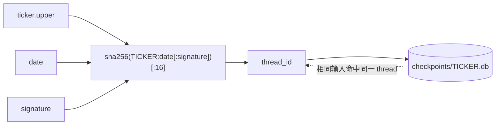
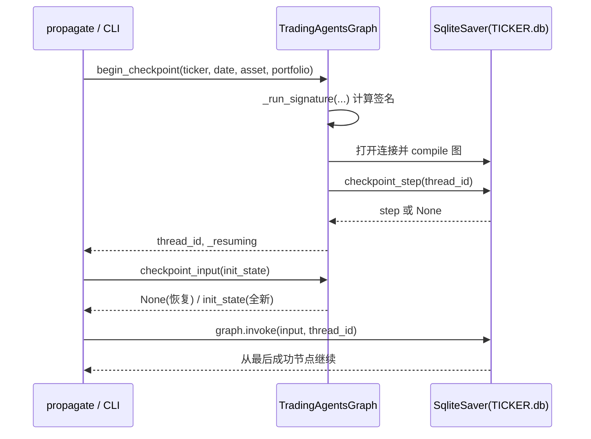
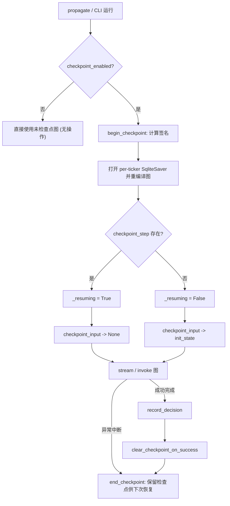

本页说明 TradingAgents 如何将一次分析的中间状态持久化到磁盘，并在进程崩溃或中断后从最后一个成功的节点继续运行。断点恢复（checkpoint resume）围绕 LangGraph 的检查点机制构建，默认关闭，通过配置键、环境变量或 CLI 标志**按需开启**。理解这一机制需要把握三层：底层的**每标的 SQLite 存储**、标识一次可恢复运行的**线程 ID 与运行签名**，以及被 `propagate()` 与 CLI 共享的**生命周期 API**。

Sources: [checkpointer.py](tradingagents/graph/checkpointer.py#L1-L4), [trading_graph.py](tradingagents/graph/trading_graph.py#L182-L197)

## 设计要点：为什么是每标的独立数据库

检查点存储层刻意采用**每个标的符号一个 SQLite 数据库**的布局，而非单一集中库。其直接动机是并发：一次运行可能同时分析多个标的，共享一个 SQLite 连接会因写锁相互争用，而分库让各标的的写入彼此隔离。

数据库路径由 `_db_path()` 计算，落在 `data_cache_dir/checkpoints/<TICKER>.db`，`<TICKER>` 会经 `safe_ticker_component()` 校验并大写 —— 这一步防止恶意或被注入的标的字符串（如 `../../../etc/foo`）逃逸出检查点目录。目录在首次访问时按需创建。

Sources: [checkpointer.py](tradingagents/graph/checkpointer.py#L3-L25), [symbols.py](tradingagents/dataflows/symbols.py#L155-L180)

真正的读写通过 `get_checkpointer()` 上下文管理器完成：它为标的打开一个 SQLite 连接（`check_same_thread=False`），构造 `SqliteSaver` 并调用 `saver.setup()` 建表，退出时关闭连接。这个上下文管理器是生命周期 API 得以安全配对的基础。

Sources: [checkpointer.py](tradingagents/graph/checkpointer.py#L41-L51)

一个容易忽略的细节是 SQLite 的 **WAL 边车文件**。提交的状态可能同时存在于 `-wal` 与 `-shm` 文件中，因此清理逻辑必须连带删除这些边车，否则“已清除”的检查点在磁盘上仍有残留状态 —— `clear_all_checkpoints()` 正是为此遍历 `<db>` 及其 `<db>-*` 命名伴侣。

Sources: [checkpointer.py](tradingagents/graph/checkpointer.py#L68-L82), [test_checkpoint_lifecycle.py](tests/test_checkpoint_lifecycle.py#L156-L171)

## 线程标识：可复现且对图结构敏感

LangGraph 通过 `thread_id` 定位某一具体运行的状态历史。TradingAgents 并不使用随机 UUID，而是从运行输入**确定性地推导**出 ID，使同一输入在下次调用时命中同一条线程。

`thread_id()` 计算 `sha256(f"{TICKER}:{date}[:{signature}]")` 的前 16 个十六进制字符。当 `signature` 为空时退化为旧版 ID（保持向后兼容）；一旦折叠进签名，同一标的+日期但不同图结构的运行就会落入**不同的线程**，从而无法错误地复用彼此的状态。

Sources: [checkpointer.py](tradingagents/graph/checkpointer.py#L28-L38), [test_checkpoint_resume.py](tests/test_checkpoint_resume.py#L141-L164)

## 运行签名：什么会作废一个检查点

`_run_signature()` 定义了**哪些运行输入一旦改变就必须放弃已存检查点**。它不是简单地哈希全部配置，而是一组显式的字段：所选分析师、辩论与风险轮数、资产模式（`stock`/`crypto`）、投资组合指纹、一个固定的 `analysts=parallel` 布局标记，以及一个对其余配置的摘要。

Sources: [trading_graph.py](trading_graph.py#L157-L180)

其中三个设计决策值得强调。**其一**，投资组合指纹来自 `PortfolioContext.fingerprint()`（`model_dump_json` 的 sha256 前 12 位），因此「无持仓」「空组合」与「变更后的组合」被视为三个不同的运行，不会互相恢复 —— 测试 `test_completed_run_clears_the_checkpoint_it_wrote` 专门验证清除时使用的指纹必须与写入时一致。

Sources: [portfolio.py](tradingagents/portfolio.py#L53-L55), [test_portfolio_context.py](tests/test_portfolio_context.py#L162-L187)

**其二**，`analysts=parallel` 这个字面量标记了图的布局本身。旧版顺序执行分析师的检查点会残留一个当前并行图中已不存在的待处理节点，若复用它，join 边永远不会触发；把布局计入签名即可让这类检查点自然失效。

Sources: [trading_graph.py](tradingagents/graph/trading_graph.py#L174-L179), [test_checkpoint_resume.py](tests/test_checkpoint_resume.py#L241-L244)

**其三**，摘要计算时通过 `_NOT_IN_SIGNATURE` 排除了一组**不改变运行产物**的键：`results_dir`、`data_cache_dir`、`memory_log_path`、`checkpoint_enabled` 与 `llm_max_retries`。其余配置（供应商、模型、端点、语言、供应商链、工具轮数、温度、推理强度）都会计入摘要，其理由是：一份报告里写明了某个供应商与模型组合，恢复时就不应携带另一组合产生的报告。

Sources: [trading_graph.py](tradingagents/graph/trading_graph.py#L44-L48), [trading_graph.py](tradingagents/graph/trading_graph.py#L166-L168), [test_checkpoint_resume.py](tests/test_checkpoint_resume.py#L193-L219)

下表概括签名中输入的分组：

| 分组 | 字段 | 改变后效果 |
| --- | --- | --- |
| 图规模 | `selected_analysts`、`max_debate_rounds`、`max_risk_discuss_rounds` | 换线程，全新运行 |
| 资产模式 | `asset_type`（stock / crypto） | 换线程，全新运行 |
| 组合上下文 | `portfolio.fingerprint()` / `none` | 换线程，全新运行 |
| 图布局 | 固定的 `analysts=parallel` | 旧顺序布局检查点失效 |
| 其余配置摘要 | 除 `_NOT_IN_SIGNATURE` 外的全部 config | 换线程，全新运行 |
| 排除项 | `results_dir`、`data_cache_dir`、`memory_log_path`、`checkpoint_enabled`、`llm_max_retries` | 不影响签名 |

Sources: [trading_graph.py](tradingagents/graph/trading_graph.py#L46-L48), [trading_graph.py](tradingagents/graph/trading_graph.py#L157-L180)

## 生命周期 API：两个入口共享同一套流程

检查点的开启、恢复与清理被抽象为 `TradingAgentsGraph` 上的一组方法，供 `propagate()` 与 CLI **共同调用**。这是一个重要的架构修正（#1249）：早期检查点逻辑只存在于 `propagate()` 内部，导致 CLI 流式运行的是一个**不带检查点的图**，`--checkpoint` 标志在 CLI 路径上形同虚设。

Sources: [trading_graph.py](tradingagents/graph/trading_graph.py#L207-L217), [CHANGELOG.md](CHANGELOG.md#L205-L208)

`begin_checkpoint()` 是入口：若 `checkpoint_enabled` 为假则返回 `None` 且**不重编译图**（纯粹的 no-op）；否则计算签名、打开 per-ticker saver、用该 saver 重新编译图，并查询已存的 `checkpoint_step` 来决定 `_resuming`。它返回调用方需要注入 stream/invoke config 的 `thread_id`。

Sources: [trading_graph.py](tradingagents/graph/trading_graph.py#L219-L234), [test_checkpoint_lifecycle.py](tests/test_checkpoint_lifecycle.py#L61-L83)

`checkpoint_input()` 处理恢复时的输入语义：**恢复使用 `None`，全新运行使用初始状态**。这不是可选的风格问题 —— LangGraph 用 `None` 调用来继续一个被中断的线程，而重新传入初始状态会经消息 reducer 再次追加，造成恢复状态中的消息重复。

Sources: [trading_graph.py](tradingagents/graph/trading_graph.py#L236-L244), [test_checkpoint_lifecycle.py](tests/test_checkpoint_lifecycle.py#L85-L114)

`end_checkpoint()` 在 `finally` 中把图还原为未检查点版本，并重置 `_resuming`；`checkpoint_scope()` 则是 begin/end 的上下文管理器封装，专供 `propagate()` 使用。`clear_checkpoint_on_success()` 仅在成功完成时按**同一签名**删除该线程的行，使后续运行全新开始。

Sources: [trading_graph.py](tradingagents/graph/trading_graph.py#L246-L268)

Sources: [trading_graph.py](tradingagents/graph/trading_graph.py#L254-L260), [trading_graph.py](tradingagents/graph/trading_graph.py#L350-L382)

## 两条调用路径的接线细节

在 `propagate()` 路径上，检查点通过 `checkpoint_scope()` 包裹整个 `_run_graph()`，`thread_id` 被注入到图参数中。`_run_graph()` 依次：构建初始状态、合并参数、用 `checkpoint_input()` 决定图输入、执行图、`record_decision()` 落盘并记录决策，最后在**成功路径上**清除检查点。

Sources: [trading_graph.py](tradingagents/graph/trading_graph.py#L200-L205), [trading_graph.py](tradingagents/graph/trading_graph.py#L350-L382)

在 CLI 路径上，`run_analysis()` 显式复刻同一序列。一个值得注意的差异是它会通过 `_announce_checkpoint_state()` 向消息缓冲写入「Resuming the saved run …」或「Starting fresh …」，因为 CLI 的实时视图占用了屏幕且未配置日志，否则恢复与否对用户不可见。

Sources: [run.py](cli/run.py#L44-L55), [run.py](cli/run.py#L223-L231), [test_cli_memory_log.py](tests/test_cli_memory_log.py#L177-L190)

CLI 的顺序保证同样被测试固化：先 `record_decision()`，再 `clear_checkpoint_on_success()`，且两者都由 `try/finally` 包住 —— 中断的运行会跳过这两步，从而**保留检查点**供下次恢复；而 `end_checkpoint()` 无论成功失败都会执行，恢复未检查点的图。

Sources: [run.py](cli/run.py#L347-L356), [test_cli_memory_log.py](tests/test_cli_memory_log.py#L163-L174)

## 配置与开关

检查点的开关遵循项目统一的 **「显式环境/标志优先」** 规则。默认值为关闭；`_build_run_config()` 只在 `--checkpoint/--no-checkpoint` 被显式给出时覆盖配置键，省略标志则保留环境变量或默认值所设的值。

Sources: [default_config.py](tradingagents/default_config.py#L113-L117), [run.py](cli/run.py#L90-L94), [test_cli_config_precedence.py](tests/test_cli_config_precedence.py#L57-L70)

| 开关 | 载体 | 默认 | 说明 |
| --- | --- | --- | --- |
| `checkpoint_enabled` | 配置字典键 | `False` | 核心开关，决定是否重编译带 saver 的图 |
| `TRADINGAGENTS_CHECKPOINT_ENABLED` | 环境变量 | 未设置 | 映射到 `checkpoint_enabled`，布尔值强校验 |
| `--checkpoint/--no-checkpoint` | CLI 选项 | `None` | 显式时覆盖；省略则保留环境/默认 |
| `--clear-checkpoints` | CLI 选项 | `False` | 运行前调用 `clear_all_checkpoints()` 强制全新开始 |

Sources: [default_config.py](tradingagents/default_config.py#L10-L30), [main.py](cli/main.py#L35-L45), [main.py](cli/main.py#L71-L74)

环境变量到配置键的映射由 `_ENV_OVERRIDES` 集中声明，值经 `_coerce()` 按既有默认值的类型强制转换。对布尔开关而言，拼写错误的值（如 `treu`）会**立即抛出 `ValueError`**，而不会静默回退 —— 这是为无人值守运行设计的，宁可启动失败也不悄悄错配。

Sources: [default_config.py](tradingagents/default_config.py#L10-L30), [default_config.py](tradingagents/default_config.py#L37-L57)

`--clear-checkpoints` 在分析前删除 `data_cache_dir` 下的全部检查点库（返回删除数量），配合 README 描述的手动使用方式，是「强制全新开始」的运维入口。

Sources: [main.py](cli/main.py#L71-L74), [README.md](README.md#L327-L343)

## 运维与清理辅助

除生命周期方法外，模块还提供三个独立的查询/清理函数，既服务于主流程也便于测试与运维。`checkpoint_step()` 返回最新检查点的步号（无则 `None`，并在库不存在时提前返回以避免建目录的副作用）；`clear_checkpoint()` 按线程 ID 删除 `writes` 与 `checkpoints` 两张表的对应行；`clear_all_checkpoints()` 删除整个检查点目录下的所有库及其边车。

Sources: [checkpointer.py](tradingagents/graph/checkpointer.py#L54-L99)

一点兼容性提醒：由于签名与图布局都会计入线程 ID，**0.5.1 版本产生的检查点，或在不同配置下保存的检查点，都不会被恢复**，而是被当作全新运行。

Sources: [CHANGELOG.md](CHANGELOG.md#L42)

## 与其它子系统的边界

断点恢复只负责**运行中间状态的持久化与续跑**，它与最终产物的落盘是两件事：成功运行结束后，报告树仍由 `save_reports()` 写入 `results_dir`，决策仍由 `record_decision()` 写入记忆日志 —— 检查点在成功时被清除，而非充当长期存储。

Sources: [trading_graph.py](tradingagents/graph/trading_graph.py#L290-L298), [trading_graph.py](tradingagents/graph/trading_graph.py#L336-L348)

由于检查点库位于 `data_cache_dir` 之下，它与 Docker 数据持久化共享同一挂载根；当以容器方式部署时，需确保该目录被持久化卷覆盖，否则容器重建后无从恢复。

Sources: [default_config.py](tradingagents/default_config.py#L80-L81)

**建议的下一步阅读**：若想了解配置系统如何统一处理这些开关与环境变量，见 [Python API 与配置调整](9-python-api-yu-pei-zhi-diao-zheng) 与 [配置系统与环境变量覆盖](29-pei-zhi-xi-tong-yu-huan-jing-bian-liang-fu-gai)；若想了解这些状态字段在图中如何流转，见 [智能体状态模型与数据流转](14-zhi-neng-ti-zhuang-tai-mo-xing-yu-shu-ju-liu-zhuan)；若关注最终产物的落盘，见 [报告树生成与保存](28-bao-gao-shu-sheng-cheng-yu-bao-cun)。