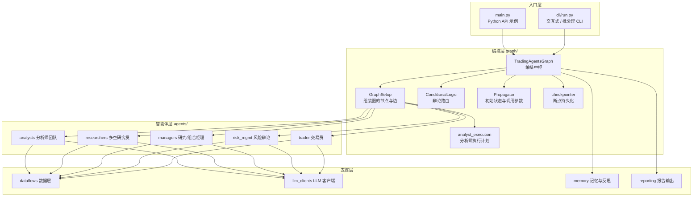
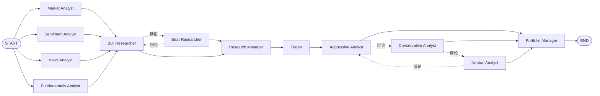

TradingAgents 是一个模拟真实交易公司运作方式的多智能体（multi-agent）LLM 交易分析框架。它将复杂的交易决策拆解为一组各司其职的专门角色——从基本面、市场、新闻与情绪分析师，到多空研究员、交易员、风险辩论团队，最终由研究经理与投资组合经理汇总裁决——协作完成对某一标的在特定交易日的评估。本页从**全局视角**梳理框架的分层结构、编排中枢与智能体之间的协作关系；关于图的具体构建细节、条件路由与状态字段流转，请分别参阅 [LangGraph 图构建与并行分析师执行](12-langgraph-tu-gou-jian-yu-bing-xing-fen-xi-shi-zhi-xing)、[辩论路由与条件逻辑](13-bian-lun-lu-you-yu-tiao-jian-luo-ji) 与 [智能体状态模型与数据流转](14-zhi-neng-ti-zhuang-tai-mo-xing-yu-shu-ju-liu-zhuan)。

Sources: [README.md](README.md#L67-L69), [README.md](README.md#L77-L85)

## 框架定位与设计哲学

框架的核心隐喻是**交易公司的组织分工**：不同的智能体扮演不同岗位，各自拥有专属工具与提示词，通过结构化辩论与层级汇报逐步收敛出一个可执行的交易评级。框架区分了两类 LLM——`quick_think_llm` 用于分析师、研究员、交易员等高频调用角色，`deep_think_llm` 用于研究经理与投资组合经理这类需要更深推理的裁决者。这种"双模型"设计在算力成本与推理深度之间取得平衡。

Sources: [tradingagents/graph/trading_graph.py](tradingagents/graph/trading_graph.py#L83-L97), [tradingagents/default_config.py](tradingagents/default_config.py#L89-L90)

框架的执行引擎是 **LangGraph** 的 `StateGraph`：整个多智能体协作被建模为一张有向图，节点是智能体（或其工具循环），边决定执行顺序，条件边决定辩论是否继续。所有智能体共享同一个 `AgentState`，协作的本质就是通过读写这份共享状态来传递信息。

Sources: [tradingagents/graph/setup.py](tradingagents/graph/setup.py#L140-L181), [tradingagents/agents/state.py](tradingagents/agents/state.py#L45-L73)

## 分层架构总览

框架在包结构上按"职责所在"组织模块，形成了清晰的依赖层次。入口层负责收集参数并驱动运行；编排层负责把智能体组装成图并管理运行生命周期；智能体层封装每个角色的推理逻辑；数据层是所有外部供应商调用的唯一出口；LLM 客户端层提供多供应商抽象；记忆层与输出层负责持久化。

下表概括每一层的职责与代表模块，便于按需深入。

| 层次 | 目录/文件 | 核心职责 | 关键产物 |
|------|-----------|----------|----------|
| 入口层 | `main.py`、`cli/` | 收集配置、驱动运行、实时展示 | 命令行运行/编程式调用 |
| 编排层 | `tradingagents/graph/` | 组装图、管理运行生命周期、路由条件 | 编译后的 LangGraph 图 |
| 智能体层 | `tradingagents/agents/` | 各角色的 prompt 与推理逻辑 | 报告、投资计划、最终裁决 |
| 数据层 | `tradingagents/dataflows/` | 供应商路由、回退、时点一致性 | 行情/新闻/基本面数据 |
| LLM 客户端层 | `tradingagents/llm_clients/` | 多供应商抽象与能力适配 | `deep`/`quick` 两个 LLM 实例 |
| 记忆层 | `tradingagents/memory/` | 记录决策、结算、反思 | 复用于后续运行的教训 |
| 输出层 | `tradingagents/reporting.py` | 生成报告树与状态日志 | markdown 报告与 JSON 日志 |

Sources: [tradingagents/graph/trading_graph.py](tradingagents/graph/trading_graph.py#L51-L132), [tradingagents/graph/setup.py](tradingagents/graph/setup.py#L93-L118), [tradingagents/agents/__init__.py](tradingagents/agents/__init__.py#L1-L31), [tradingagents/reporting.py](tradingagents/reporting.py#L1-L7)

## 编排中枢：TradingAgentsGraph

`TradingAgentsGraph` 是整个框架的门面（facade）与编排中枢。它的构造函数完成了运行前的全部准备工作：应用配置、创建数据缓存与结果目录、构建 `deep`/`quick` 两个 LLM 客户端、实例化记忆日志、条件逻辑、图组装器、状态传播器与反思器，并最终编译出一张可执行的图。构造函数还会校验工具轮数与递归上限的容量关系，避免分析师在写报告前就触及图的递归限制。

Sources: [tradingagents/graph/trading_graph.py](tradingagents/graph/trading_graph.py#L54-L132)

一次运行的完整生命周期由 `propagate()` 驱动。它首先校验交易日期（必须是规范 `YYYY-MM-DD` 且不晚于今天），随后在运行级配置上下文与（可选的）检查点作用域内调用 `_run_graph()`。`_run_graph()` 先经 `create_run_state()` 构建初始状态，再由图执行、记录决策、并在成功后清理检查点，最终返回 `(final_state, signal)` 二元组，其中 `signal` 是 5 档评级或 `"REVIEW"` 哨兵值。

Sources: [tradingagents/graph/trading_graph.py](tradingagents/graph/trading_graph.py#L182-L205), [tradingagents/graph/trading_graph.py](tradingagents/graph/trading_graph.py#L350-L382)

`create_run_state()` 是入口与图之间的关键缝合点：它会先结算该标的此前待处理的决策，然后注入两条跨运行上下文——其一是按交易日过滤的历史教训（`past_context`），其二是确定性解析出的标的身份（`instrument_context`）；编程式调用者若自行拼装状态就会跳过这些步骤，因此 CLI 也复用同一方法。关于这两类上下文如何进入各智能体提示词，详见 [时点一致性与防未来函数](19-shi-dian-zhi-xing-yu-fang-wei-lai-han-shu) 与 [标的符号归一化与公司身份解析](20-biao-de-fu-hao-gui-hua-yu-gong-si-shen-fen-jie-xi)。

Sources: [tradingagents/graph/trading_graph.py](tradingagents/graph/trading_graph.py#L305-L323), [tradingagents/graph/propagation.py](tradingagents/graph/propagation.py#L13-L64)

## 多智能体协作流水线

框架将协作组织成**四个依次推进、彼此依赖的阶段**。前一个阶段写入共享状态的报告，成为后一阶段的推理依据。分析师团队并行工作，之后的每一阶段都是串行的、且包含内部的对抗式辩论。

各阶段角色、输入与产物如下表所示。前三个阶段对应"分析—研究—交易"的决策链，第四阶段是风险视角的复核与最终裁决。

| 阶段 | 智能体 | 读取的状态 | 写入的状态 | 使用模型 |
|------|--------|------------|------------|----------|
| 1 分析师团队（并行） | 市场/情绪/新闻/基本面分析师 | `trade_date`、`instrument_context` | `market_report`、`sentiment_report`、`news_report`、`fundamentals_report` | quick |
| 2 研究员辩论 | 多头/空头研究员 | 四份分析师报告 + `investment_debate_state` | `investment_debate_state` | quick |
| 2 研究经理 | Research Manager | `investment_debate_state.history` | `investment_plan` | deep |
| 3 交易员 | Trader | `investment_plan` + 市场报告 + 组合上下文 | `trader_investment_plan` | quick |
| 4 风险辩论 | 激进/保守/中立分析师 | `trader_investment_plan` + 分析师报告 + `risk_debate_state` | `risk_debate_state` | quick |
| 4 投资组合经理 | Portfolio Manager | `risk_debate_state.history` + 计划 + 教训 | `final_trade_decision`、`final_rating` | deep |

Sources: [tradingagents/graph/setup.py](tradingagents/graph/setup.py#L123-L138), [tradingagents/graph/setup.py](tradingagents/graph/setup.py#L155-L179), [tradingagents/agents/state.py](tradingagents/agents/state.py#L45-L73)

**阶段一：并行分析师团队。** 所有被选中的分析师同时启动（都由 `START` 连出），各自在独立的子图中运行自己的工具循环，互不干扰，只有当最慢的一位也完成并提交报告后，研究辩论才开始。分析师分为两种模式：市场、新闻、基本面分析师是**工具型**（绑定真实工具，多轮调用），而情绪分析师是**预取型**（在调用模型前先把新闻、StockTwits、Reddit 数据抓进提示词，因此无需工具）。

Sources: [tradingagents/graph/setup.py](tradingagents/graph/setup.py#L53-L90), [tradingagents/agents/analysts/sentiment_analyst.py](tradingagents/agents/analysts/sentiment_analyst.py#L1-L18), [tradingagents/agents/analysts/market_analyst.py](tradingagents/agents/analysts/market_analyst.py#L8-L12)

**阶段二：多空研究员辩论。** 多头与空头研究员轮流发言，逐条反驳对方的上一轮论点。每轮新的发言都会被追加进 `investment_debate_state`，同时按发言人分别累积到 `bull_history` 或 `bear_history`。当辩论轮数达到上限（`max_debate_rounds` 的两倍，因双方各发言一次）后，研究经理介入，把整段辩论浓缩为一个结构化的投资计划。研究员在首轮会收到"对方尚未发言"的明确标记，以避免模型凭空编造对手立场。

Sources: [tradingagents/agents/researchers/bull_researcher.py](tradingagents/agents/researchers/bull_researcher.py#L10-L63), [tradingagents/agents/context.py](tradingagents/agents/context.py#L37-L48), [tradingagents/agents/managers/research_manager.py](tradingagents/agents/managers/research_manager.py#L17-L72)

**阶段三：交易员。** 交易员把研究经理的投资计划翻译成一个具体的方向性提案（Buy / Hold / Sell）。它会额外读取市场分析师的报告，以便把入场价、止损价与仓位规模锚定在真实的 ATR、支撑阻力与当前价格结构上；当市场分析师未被选中或报告为空时，这部分接地指令会自动省略。

Sources: [tradingagents/agents/trader/trader.py](tradingagents/agents/trader/trader.py#L23-L96)

**阶段四：风险辩论与最终裁决。** 激进、保守、中立三位风险分析师围绕交易员的提案进行三方辩论，并各自维护独立的发言历史。辩论结束后，投资组合经理综合整场风险辩论、投资计划、交易员提案以及历史教训，产出最终的 5 档评级（Buy / Overweight / Hold / Underweight / Sell）与决策文本。

Sources: [tradingagents/agents/risk_mgmt/aggressive_debator.py](tradingagents/agents/risk_mgmt/aggressive_debator.py#L10-L66), [tradingagents/agents/managers/portfolio_manager.py](tradingagents/agents/managers/portfolio_manager.py#L26-L104)

## 协作机制：共享状态、辩论与结构化交接

智能体之间没有直接的函数调用；它们的"对话"全部通过读写共享状态完成。这套机制有三个关键设计。

**其一，共享状态是唯一的协作总线。** `AgentState` 继承自 LangGraph 的 `MessagesState`，除携带完整的消息历史外，还定义了两组辩论子状态（`InvestDebateState`、`RiskDebateState`）以及各智能体的文本产物字段。这种"字段即接口"的设计让下游智能体只需读取约定的键，就能拿到上游的结论。

Sources: [tradingagents/agents/state.py](tradingagents/agents/state.py#L8-L73)

**其二，辩论状态按键累积，路由依据计数与发言人。** 辩论类智能体返回的是**整份更新后的** `investment_debate_state` 或 `risk_debate_state`：它们把新发言追加进总历史与各自的专属历史，同时递增 `count` 或更新 `latest_speaker`。条件逻辑正是依据 `count`（是否达到轮数上限）和 `current_response`/`latest_speaker`（该谁发言）来决定下一个节点。完整的路由规则参见 [辩论路由与条件逻辑](13-bian-lun-lu-you-yu-tiao-jian-luo-ji)。

Sources: [tradingagents/graph/conditional_logic.py](tradingagents/graph/conditional_logic.py#L12-L33), [tradingagents/agents/researchers/bull_researcher.py](tradingagents/agents/researchers/bull_researcher.py#L55-L63)

**其三，裁决类智能体使用结构化输出做类型化交接。** 研究经理、交易员与投资组合经理这三个"决策型"智能体共享同一套结构化输出模式：优先让 LLM 直接返回类型化的 Pydantic 实例，再将其渲染回与其他智能体一致的 markdown 文本。当供应商不支持结构化输出或调用失败时，框架会优雅降级为纯文本生成，保证流水线不中断。所有智能体的最终产物仍是供人阅读的散文，结构化只是叠加在其上的保证机制。

Sources: [tradingagents/agents/structured.py](tradingagents/agents/structured.py#L1-L17), [tradingagents/agents/schemas.py](tradingagents/agents/schemas.py#L1-L17)

这套机制还统一了几处横切关注点：评级词汇集中在 `rating.py`，确保研究经理、投资组合经理与记忆日志对 5 档评级的理解完全一致；输出语言指令集中在 `context.py`，让所有会进入报告的智能体产出同一种语言。

Sources: [tradingagents/agents/rating.py](tradingagents/agents/rating.py#L1-L13), [tradingagents/agents/context.py](tradingagents/agents/context.py#L14-L34)

## 模块交互与依赖边界

框架通过**分层依赖约束**保持数据访问的可控性：只有数据层（`tradingagents/dataflows/`）允许导入供应商库（如 `yfinance`），其余任何包都不得绕过数据层直接调用供应商。这一约束由一条测试显式守护，其理由是——只有集中管理才能保证供应商故障被规范地表示为"数据不可用"，而不是被误当作"关于市场的事实"。

Sources: [tests/test_layering.py](tests/test_layering.py#L1-L36)

配置在多图共存时的传播也是一个关键设计点。框架用 `contextvars` 承载"运行中的配置"，使每张图在整段运行期间绑定自己的供应商设置，即便同一进程内有多个图共享，也能保证数据工具读到的是发起调用的那张图的配置。`propagate()` 用 `run_config` 上下文管理器包裹运行，而 CLI 的流式路径因为会在步骤之间向调用者让出控制权，改用 `run_config_context` 提供的可跨步上下文。

Sources: [tradingagents/dataflows/config.py](tradingagents/dataflows/config.py#L10-L13), [tradingagents/dataflows/config.py](tradingagents/dataflows/config.py#L44-L62), [tradingagents/graph/trading_graph.py](tradingagents/graph/trading_graph.py#L399-L413)

同一个 `TradingAgentsGraph` 实例可被复用于多次运行（例如回测在整张网格上复用一个图对象），因此它刻意不在自身属性上保留任何单次运行的状态；每次运行的状态都写入磁盘而非内存。

Sources: [tests/test_graph_end_to_end.py](tests/test_graph_end_to_end.py#L167-L177), [tradingagents/graph/trading_graph.py](tradingagents/graph/trading_graph.py#L415-L454)

## 闭环：记忆、结算与反思

框架不止于一次性输出，而是形成**跨运行的反馈闭环**。每次运行结束时，`record_decision()` 会把最终决策连同其评级写入记忆日志；而每次运行开始时，`create_run_state()` 会先结算该标的此前"持有窗口已过"的待处理决策，并由反思器把结算出的收益结果转化为一段简短的教训。

Sources: [tradingagents/graph/trading_graph.py](tradingagents/graph/trading_graph.py#L336-L348), [tradingagents/memory/reflection.py](tradingagents/memory/reflection.py#L6-L34)

这些教训会在下一次同标的运行时，作为 `past_context` 注入投资组合经理的提示词中，形成一个"决策→市场检验→反思→影响下次决策"的完整回路。历史/回测运行会按交易日过滤教训，确保只看到当时已经可知的信息。

Sources: [tradingagents/graph/trading_graph.py](tradingagents/graph/trading_graph.py#L147-L155), [tradingagents/agents/managers/portfolio_manager.py](tradingagents/agents/managers/portfolio_manager.py#L35-L40)

## 延伸阅读路径

本页建立了框架的整体心智模型。若希望继续深入，建议按以下顺序阅读：

- **图与并行执行的具体实现** → [LangGraph 图构建与并行分析师执行](12-langgraph-tu-gou-jian-yu-bing-xing-fen-xi-shi-zhi-xing)
- **辩论如何路由、何时结束** → [辩论路由与条件逻辑](13-bian-lun-lu-you-yu-tiao-jian-luo-ji)
- **状态字段如何逐个流转** → [智能体状态模型与数据流转](14-zhi-neng-ti-zhuang-tai-mo-xing-yu-shu-ju-liu-zhuan)
- **各智能体的提示词与角色细节** → [分析师团队：基本面、市场、新闻与情绪](15-fen-xi-shi-tuan-dui-ji-ben-mian-shi-chang-xin-wen-yu-qing-xu)、[研究员辩论与结构化输出](16-yan-jiu-yuan-bian-lun-yu-jie-gou-hua-shu-chu)、[交易员与风险管理决策团队](17-jiao-yi-yuan-yu-feng-xian-guan-li-jue-ce-tuan-dui)
- **从入口开始动手运行** → [Python API 与配置调整](9-python-api-yu-pei-zhi-diao-zheng)、[交互式 CLI 与运行流程](5-jiao-hu-shi-cli-yu-yun-xing-liu-cheng)
- **底层数据与模型接入** → [数据供应商路由与回退链](18-shu-ju-gong-ying-shang-lu-you-yu-hui-tui-lian)、[多供应商客户端与工厂模式](22-duo-gong-ying-shang-ke-hu-duan-yu-gong-han-mo-shi)