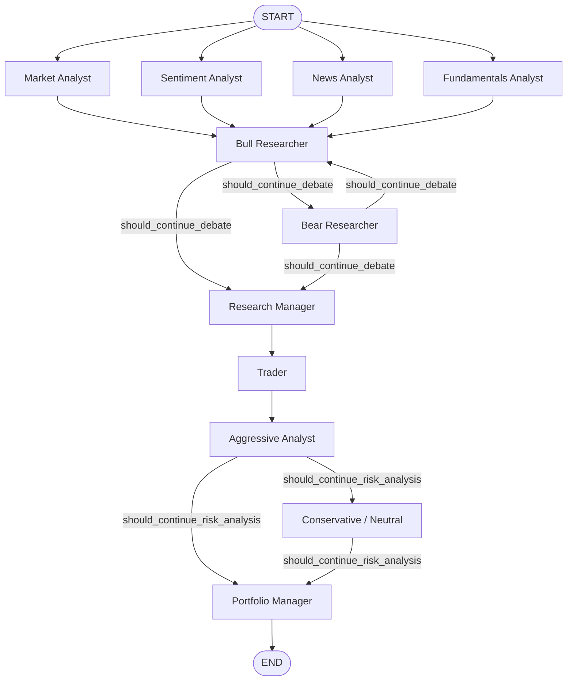
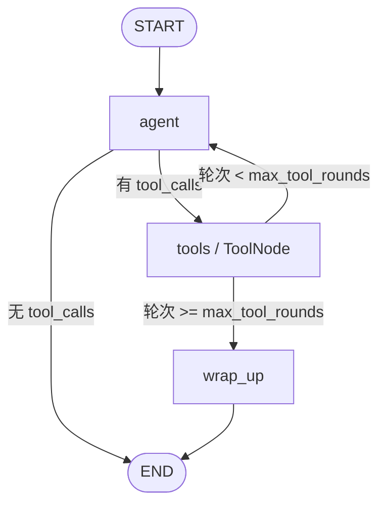

本页深入解析 `tradingagents/graph/` 包如何将多智能体协作编码为一张 LangGraph `StateGraph`，并重点说明 **v0.5.2 引入的并行分析师执行** 是如何通过「声明式执行计划 + 分析师子图 + 扇出/汇合屏障」三段式结构实现的。阅读本页后，你将能准确回答：分析师的节点与边由什么数据驱动生成？并行分析师为什么不互相污染状态？工具调用如何被限制在安全边界内而不触发递归上限？以及流式消费与检查点恢复如何与该图形态交互。

本页聚焦**图的构建与并行执行机制**本身。辩论轮次的路由细节见 [辩论路由与条件逻辑](13-bian-lun-lu-you-yu-tiao-jian-luo-ji)，状态字段的完整语义见 [智能体状态模型与数据流转](14-zhi-neng-ti-zhuang-tai-mo-xing-yu-shu-ju-liu-zhuan)，单个分析师提示词的构造见 [分析师团队：基本面、市场、新闻与情绪](15-fen-xi-shi-tuan-dui-ji-ben-mian-shi-chang-xin-wen-yu-qing-xu)。

## 图构建的三个协作组件

`trading_graph.py` 中 `TradingAgentsGraph.__init__` 是整个编排的装配点，它在构造阶段完成三件事：创建两个 LLM 客户端（快思考/深思考）、实例化三个图相关组件、并编译工作流。这三个组件职责分明——

- **`GraphSetup`**：把「分析师集合」翻译成一张 LangGraph `StateGraph`（`setup_graph` 返回未编译的 `workflow`）。
- **`ConditionalLogic`**：提供辩论与风险讨论的路由判定函数。
- **`Propagator`**：构造初始状态，并给出图调用的 `stream_mode` 与 `recursion_limit` 参数。

构造完成后，`self.workflow` 保留未编译的工作流，`self.graph = self.workflow.compile()` 得到可执行图。这种「保留 workflow、另行 compile」的设计是为检查点复用服务的：需要带检查点运行时，只需 `self.workflow.compile(checkpointer=saver)` 重新编译，而不必重建整张图。

Sources: [tradingagents/graph/trading_graph.py](tradingagents/graph/trading_graph.py#L113-L132)

`GraphSetup` 是一个纯装配器：它持有两个 LLM、`ConditionalLogic` 与 `max_tool_rounds`，不持有任何运行时状态，因此同一实例可被多轮运行复用。`Propagator` 则以 `max_recur_limit` 为唯一参数，它的 `get_graph_args()` 返回 `{"stream_mode": "values", "config": {"recursion_limit": ...}}`——这是非流式（`invoke`）路径的默认参数。

Sources: [tradingagents/graph/setup.py](tradingagents/graph/setup.py#L93-L107) · [tradingagents/graph/propagation.py](tradingagents/graph/propagation.py#L66-L79)

## 声明式执行计划：AnalystNodeSpec

图构建的第一手数据来自 `build_analyst_execution_plan(selected_analysts)`。它把用户选择的字符串键（如 `"market"`、`"social"`）映射为一组 `AnalystNodeSpec` 冻结数据类。每个 spec 携带四个字段：`key`（内部键）、`agent_node`（图节点名）、`report_key`（写入父状态的字段名）、`tools`（该分析师可用的工具元组）。

| 选择键 `key` | 图节点 `agent_node` | 报告字段 `report_key` | 工具 |
|---|---|---|---|
| `market` | `Market Analyst` | `market_report` | `get_stock_data`, `get_indicators`, `get_verified_market_snapshot` |
| `social` | `Sentiment Analyst` | `sentiment_report` | 无（数据预取入提示词） |
| `news` | `News Analyst` | `news_report` | `get_news`, `get_global_news`, `get_macro_indicators`, `get_prediction_markets` |
| `fundamentals` | `Fundamentals Analyst` | `fundamentals_report` | `get_fundamentals`, `get_balance_sheet`, `get_cashflow`, `get_income_statement`, `get_insider_transactions` |

这张表本身就是「键与节点解耦」的证据：`social` 键对应的可见节点名是 `Sentiment Analyst`——为兼容已保存的配置，键保持历史命名，而面向用户的标签跟随 v0.2.5 的重命名。`build_analyst_execution_plan` 保留选择顺序、拒绝未知键、并要求至少选择一个分析师，否则抛出 `ValueError`。

Sources: [tradingagents/graph/analyst_execution.py](tradingagents/graph/analyst_execution.py#L7-L62) · [tests/test_analyst_execution.py](tests/test_analyst_execution.py#L9-L31)

关键在于：**图的结构不是硬编码的，而是由这张 spec 列表循环生成的**。`setup_graph` 遍历 `plan.specs`，为每个 spec 调用 `_analyst_graph(...)` 并把结果作为节点加入父图。因此「选了哪几个分析师」直接决定了图的节点数与扇出宽度。

Sources: [tradingagents/graph/setup.py](tradingagents/graph/setup.py#L121-L160)

## 顶层 StateGraph 的装配与扇出/汇合

`setup_graph` 的装配逻辑可以概括为「先铺节点、再连线、最后加条件边」。父图的状态类型是 `AgentState`（继承自 LangGraph 的 `MessagesState`），它承载 `messages`、`market_report` 等报告字段、两个辩论状态以及 `trade_date` 等元数据。

装配顺序如下：先为每个 spec 添加一个以 `spec.agent_node` 命名的节点（节点值是一个已编译的分析师子图）；再添加研究员/交易员/风险分析师的具名节点；然后建立**并行扇出与汇合屏障**——对每个分析师节点 `add_edge(START, node)`，并用 `add_edge(analysts, "Bull Researcher")` 让所有分析师汇聚到 `Bull Researcher`。最后挂上辩论与风险讨论的条件边，并以 `add_edge("Portfolio Manager", END)` 收尾。

Sources: [tradingagents/graph/setup.py](tradingagents/graph/setup.py#L140-L181)

下面的流程图刻画了完整拓扑。注意 START 发出多条边、以及所有分析师汇聚到 `Bull Researcher` 形成的**屏障（barrier）**：只有最慢的分析师完成后，辩论才启动。



「并行」在 LangGraph 中的语义是：同一个超级步（superstep）内被激活的多个节点会被并发调度。`test_the_analysts_run_at_the_same_time` 用线程名集合断言了这一点——它证明确有多个线程参与工具绑定的模型调用，即分析师真正重叠执行，而非顺序执行。该测试还断言图中不存在以 `Msg Clear` 开头的节点，这标志着**从「顺序执行 + 消息清理节点」到「并行子图」的架构迁移**：旧设计需要在每个分析师之间插入清理节点以隔离消息，新设计用子图的输出 schema 实现了同样的隔离，无需清理节点。

Sources: [tests/test_graph_end_to_end.py](tests/test_graph_end_to_end.py#L180-L189)

## 单个分析师子图：私有消息历史与输出 schema

并行安全的核心在于 `_analyst_graph(spec, agent, max_tool_rounds)`。它返回一个**独立的、已编译的** `StateGraph`，该子图：

1. 输入状态类型为 `AgentState`（可读取 `messages`、`trade_date`、`company_of_interest` 等），
2. 输出状态类型被动态构造为一个仅含单一报告键的 `TypedDict`：`TypedDict(f"{spec.key.capitalize()}Report", {spec.report_key: str})`。

输出 schema 是隔离机制的钥匙：子图作为父图的一个节点时，只有该 `report_key` 会被写回父状态，分析师的中间 `AIMessage`、`tool_calls`、`ToolMessage` 全部留在子图内部。因此并行奔跑的多个分析师**永远不会写同一个状态键**，工具调用也**不会流入其他分析师的消息历史**。

Sources: [tradingagents/graph/setup.py](tradingagents/graph/setup.py#L53-L64)

对于**无工具**的分析师（此处即 `social`/`Sentiment Analyst`），子图退化为最简单形态：`START → agent → END`，因为它的数据是节点内部预取并注入提示词的，无需工具节点。

Sources: [tradingagents/graph/setup.py](tradingagents/graph/setup.py#L66-L68)

对于**使用工具**的分析师，子图结构为 `agent ⇄ tools` 的循环，并附加一个 `wrap_up` 出口。路由函数 `_tools_or_done` 检查最后一条消息是否携带 `tool_calls`：有则进 `tools`，无则直接 `END`（即以报告收尾）。`tools` 节点的出边由 `more_or_wrap_up` 决定：当已完成工具轮次达到 `max_tool_rounds` 时进入 `wrap_up`，否则回到 `agent` 继续。



Sources: [tradingagents/graph/setup.py](tradingagents/graph/setup.py#L70-L90)

## 工具轮次上限与 wrap-up 保护

`wrap_up` 节点解决的是一个具体的失效模式：一个不断调用工具的模型会让子图无限循环，最终撞上图的递归上限而**中断整场运行**（对应 #1420）。其做法是向消息历史追加一条 `WRAP_UP` 人类消息，然后再次调用 `agent`，最后无条件连到 `END`——**无论如何作答，这一轮都结束图**。

`WRAP_UP` 的文案与 `take_turn` 的收尾分支相呼应：`take_turn` 检测到历史末尾是 `WRAP_UP` 时，会以 `prompt.partial(tool_names="none; your tool rounds are spent")` 遮蔽工具清单，并把历史中所有 `tool_calls`/`ToolMessage` **展平为纯文本消息**（`_as_text`）后再调用模型。这同时规避了两个供应商侧陷阱：部分模型即使被告知不要再调用工具仍会尝试；以及当历史含有工具调用但未绑定任何工具时，某些供应商会拒绝该请求。

Sources: [tradingagents/graph/setup.py](tradingagents/graph/setup.py#L76-L83) · [tradingagents/agents/analysts/turn.py](tradingagents/agents/analysts/turn.py#L7-L42)

这里存在一个**必须成立的参数约束**：每个使用工具的分析师最多消耗 `2 * max_tool_rounds + 2` 个图步（`agent` 与 `tools` 各算一步，加首轮与收尾轮），若这一上限达到或超过 `max_recur_limit`，运行会在此处被截断而非正常收尾。`TradingAgentsGraph.__init__` 因此在构造阶段就校验并抛错：

```
if 2 * max_tool_rounds + 2 >= max_recur_limit:
    raise ValueError(...)
```

Sources: [tradingagents/graph/trading_graph.py](tradingagents/graph/trading_graph.py#L105-L112)

`test_an_analyst_that_keeps_calling_tools_writes_its_report_at_the_limit` 用持续调用工具的 `LoopingModel` 与 `max_tool_rounds=3` 验证了该机制：三个使用工具的分析师各消耗 3 轮（合计 9 次工具轮），最终仍写出报告并得出评级；`test_the_last_turn_is_offered_no_tools_and_reads_its_tool_results_as_text` 则验证收尾轮的历史中不含 `ToolMessage` 或 `tool_calls`，且系统提示词里写着「tool rounds are spent」。

Sources: [tests/test_graph_end_to_end.py](tests/test_graph_end_to_end.py#L255-L283)

## 条件路由与完整 path_map

父图中所有共享路由的分析师/研究员都使用**完整的 `path_map`**。`DEBATE_PATH_MAP` 覆盖 `{Bull Researcher, Bear Researcher, Research Manager}`，`RISK_ANALYSIS_PATH_MAP` 覆盖 `{Aggressive Analyst, Conservative Analyst, Neutral Analyst, Portfolio Manager}`。两个研究员节点共用同一个 `should_continue_debate` 判定，三个风险节点共用 `should_continue_risk_analysis`。

采用完整映射的目的是**崩溃安全**：如果条件函数的返回值（例如因提示词/国际化漂移导致说话人标签不匹配）落到了一个未在 `path_map` 中登记的节点上，LangGraph 会在运行中抛错。把路由器可能返回的**每个**目标都预先登记，可使任何「跌落」返回值命中一个合法路径而非崩溃（对应 #1088）。

Sources: [tradingagents/graph/setup.py](tradingagents/graph/setup.py#L31-L45) · [tradingagents/graph/setup.py](tradingagents/graph/setup.py#L162-L177)

路由判定本身按「轮次上限优先、否则按当前说话人轮转」的原则返回下一个节点——辩论以 `2 * max_debate_rounds` 为界，风险讨论以 `3 * max_risk_discuss_rounds` 为界。其细节属于 [辩论路由与条件逻辑](13-bian-lun-lu-you-yu-tiao-jian-luo-ji) 的范畴，此处仅点明它与图边的耦合方式。

Sources: [tradingagents/graph/conditional_logic.py](tradingagents/graph/conditional_logic.py#L12-L33)

## 结果流：subgraphs 与 tasks/values 双模式

并行带来一个观察上的难题：父状态的 `messages` 与报告字段只在**所有分析师完成后的汇合点**才更新，而 CLI 希望「每个分析师的报告一落地就显示，并停掉它的计时」。`stream_run` 正是为此设计的流式封装。

它把参数置为 `stream_mode=["values", "tasks"]` 并开启 `subgraphs=True`，于是 `self.graph.stream(...)` 产出的每一步都带有一个 `(namespace, mode, chunk)` 三元组。判定规则是：`namespace` 非空表示这是**分析师自己子图内部的一步**——此时取 `mode == "tasks"` 的 `chunk["result"]`，从中剥离 `messages` 得到该分析师的报告；`namespace` 为空表示**父图顶层的一步**——此时直接以完整状态作为输出。每次 `yield` 出 `(messages, report_or_state)`，CLI 侧以此区分「子图步骤（只有消息）」与「顶层步骤（带状态）」。

Sources: [tradingagents/graph/trading_graph.py](tradingagents/graph/trading_graph.py#L384-L413)

`test_each_report_streams_as_soon_as_its_analyst_files_it` 精确地锚定了这一语义：在流中**第一个**含任意报告的状态里，四个报告字段中恰有一个为真——证明报告是**逐个落地**的，而非等到最慢分析师完成后批量出现。CLI 侧则用 `AnalystWallTimeTracker` 在每个分析师报告进入 `chunk` 时停表，`mark_started` 在运行开始时对所有 spec 同时计时，呼应「分析师同时启动、各自完成时停表」。

Sources: [tests/test_graph_end_to_end.py](tests/test_graph_end_to_end.py#L204-L215) · [cli/display.py](cli/display.py#L574-L605) · [cli/run.py](cli/run.py#L203-L207)

`stream_run` 还有一层**上下文隔离**：它用 `run_config_context(self.config)` 包裹整个流，使图内每个工具调用读到的是本次运行的配置，而非进程级可能被其他调用改动的配置；同时每一步之间调用者的配置保持不变。`test_a_streamed_run_reads_its_own_graph_config` 验证了工具看到的是 `"French"`，而步骤之间调用者观察到的是 `"German"`。

Sources: [tradingagents/graph/trading_graph.py](tradingagents/graph/trading_graph.py#L395-L413) · [tests/test_graph_end_to_end.py](tests/test_graph_end_to_end.py#L218-L234)

## 图形态、检查点与恢复

并行重构对检查点机制有直接影响：一个在「分析师顺序执行」时代保存的检查点，其待处理节点（pending nodes）在新图中已不复存在，若被直接恢复会错乱。因此运行签名 `_run_signature` 显式地纳入 `"analysts=parallel"` 这一字面值，把**图本身的布局**计入签名，使不同图形态的检查点彼此隔离（对应 #1089）。

签名把「影响图形态的运行选择」全部折叠进线程 ID：分析师集合、辩论轮数、风险轮数、资产类型、投资组合指纹、以及其余配置的 SHA-256 摘要。仅把「文件写在哪里、是否检查点、重试次数」等不影响产物的键排除在外。

Sources: [tradingagents/graph/trading_graph.py](tradingagents/graph/trading_graph.py#L157-L180)

带检查点运行时，`begin_checkpoint` 用 `self.workflow.compile(checkpointer=saver)` 重新编译同一张工作流，并返回由 `thread_id(ticker, date, signature)` 计算出的确定性线程 ID；`checkpoint_input` 在恢复时返回 `None`（让 LangGraph 续跑中断线程，而非把初始状态重新经消息 reducer 追加造成重复），在新运行时返回初始状态。`end_checkpoint` 在结束后恢复无检查点的普通图，`clear_checkpoint_on_success` 在成功完成时删除该线程的行。

Sources: [tradingagents/graph/trading_graph.py](tradingagents/graph/trading_graph.py#L207-L268) · [tradingagents/graph/checkpointer.py](tradingagents/graph/checkpointer.py#L28-L38)

`test_an_interrupted_run_resumes_from_its_checkpoint` 量化验证了恢复的精确性：中断运行在 `fail_at=12` 处抛错后，恢复运行只发出「中断运行尚未完成的那部分调用」——即恢复调用数等于完整运行调用数减去已完成的 `fail_at - 1` 次。

Sources: [tests/test_graph_end_to_end.py](tests/test_graph_end_to_end.py#L149-L164)

## 初始状态与分析师子图的输入契约

并行分析师都从同一个初始状态出发。`Propagator.create_initial_state` 构造的字典包含：`messages`（以 `("human", company_name)` 起头）、`company_of_interest`、`asset_type`、`instrument_context`、`trade_date`、`past_context`、`portfolio_context`，两个辩论状态的空模板，以及四个报告字段的空字符串。

Sources: [tradingagents/graph/propagation.py](tradingagents/graph/propagation.py#L13-L64)

`messages` 的 reducer 语义来自 `AgentState` 继承的 `MessagesState`（`messages` 使用 `add_messages` 归并）。分析师子图读取这份消息作为起点，把各自的报告写入输出 schema 的单一键；父图的四个 `*_report` 字段在汇合点被四个并行分支分别填充。

Sources: [tradingagents/agents/state.py](tradingagents/agents/state.py#L45-L73)

下表汇总了构建与并行执行阶段的关键配置项：

| 配置键 | 默认值 | 对图形态/并行的影响 |
|---|---|---|
| `max_tool_rounds` | `20` | 每个使用工具的分析师子图的工具轮上限；参与递归上限校验 |
| `max_recur_limit` | `100` | 图调用的递归上限；必须满足 `2*max_tool_rounds+2 < max_recur_limit` |
| `max_debate_rounds` | `1` | 研究员辩论的轮数上限（进入 `_run_signature`） |
| `max_risk_discuss_rounds` | `1` | 风险讨论的轮数上限（进入 `_run_signature`） |
| `checkpoint_enabled` | `False` | 是否以带检查点的方式重新编译同一工作流 |

Sources: [tradingagents/default_config.py](tradingagents/default_config.py#L115-L126)

## 小结

TradingAgents 的图构建可归纳为一条清晰的数据流：**选择键 → `AnalystNodeSpec` 列表 → 循环生成分析师子图节点 → START 扇出 + 汇合屏障 → 辩论/风险条件路由**。并行安全性由「子图输出 schema 只暴露单一报告键」保证，工具调用的稳定性由「轮次上限 + wrap-up 收尾」保证，而观察与恢复能力分别由「subgraphs 双模式流式」与「图形态感知的检查点签名」提供。理解这一层后，建议继续阅读 [辩论路由与条件逻辑](13-bian-lun-lu-you-yu-tiao-jian-luo-ji) 与 [智能体状态模型与数据流转](14-zhi-neng-ti-zhuang-tai-mo-xing-yu-shu-ju-liu-zhuan)，以补全路由判定与状态字段的完整语义。