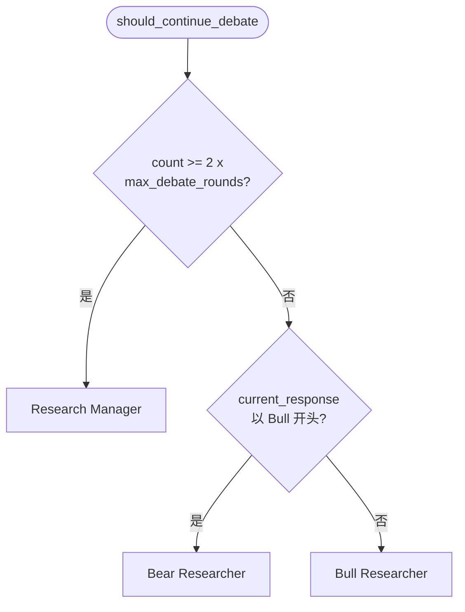
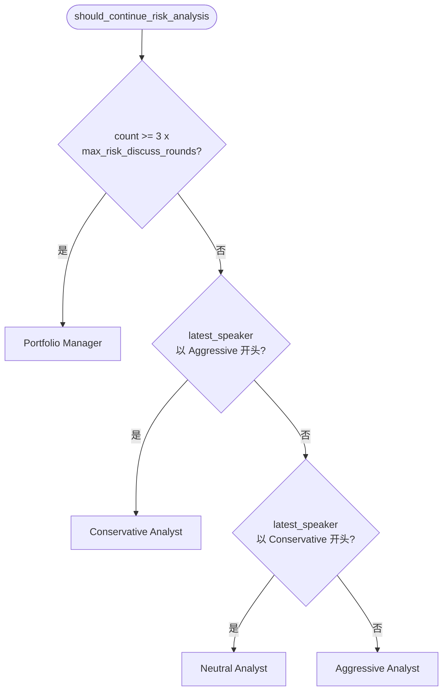
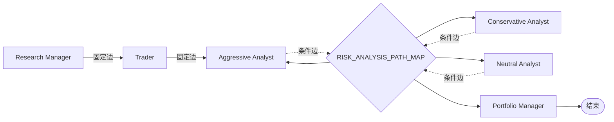

TradingAgents 的决策流程由**两场结构化辩论**驱动：研究员团队的多空辩论，以及风险管理团队的三方辩论。与顺序执行的智能体不同，辩论是循环结构——同一个节点会被反复调用，直到轮次耗尽才跳出。因此图（graph）必须依赖**条件边（conditional edges）**在每次发言后重新决定下一个说话者，或判定辩论结束。本页聚焦于这一路由层：`ConditionalLogic` 的两个路由器、驱动判定的状态信号、以及 `GraphSetup` 如何把路由器挂到多条边上。辩论参与者自身的提示词与输出格式参见 [研究员辩论与结构化输出](16-yan-jiu-yuan-bian-lun-yu-jie-gou-hua-shu-chu) 与 [交易员与风险管理决策团队](17-jiao-yi-yuan-yu-feng-xian-guan-li-jue-ce-tuan-dui)。

Sources: [conditional_logic.py](tradingagents/graph/conditional_logic.py#L1-L34)

## 两场辩论的结构对比

系统内共有两场辩论，它们共享同一套路由设计，但参与者和轮次倍率不同。研究员辩论在两位对立方之间交替（看多 `Bull Researcher` 与看空 `Bear Researcher`），由 `Research Manager` 收束为投资计划；风险辩论则在三位风险偏好不同的分析师之间轮转（激进 `Aggressive Analyst`、保守 `Conservative Analyst`、中性 `Neutral Analyst`），由 `Portfolio Manager` 收束为最终决策。

| 维度 | 研究员辩论 | 风险辩论 |
| --- | --- | --- |
| 参与者 | Bull / Bear Researcher | Aggressive / Conservative / Neutral Analyst |
| 路由函数 | `should_continue_debate` | `should_continue_risk_analysis` |
| 终止节点 | `Research Manager` | `Portfolio Manager` |
| 轮次上限配置 | `max_debate_rounds` | `max_risk_discuss_rounds` |
| 终止阈值 | `count >= 2 × max_debate_rounds` | `count >= 3 × max_risk_discuss_rounds` |
| 轮转依据字段 | `current_response` | `latest_speaker` |

Sources: [conditional_logic.py](tradingagents/graph/conditional_logic.py#L12-L33), [setup.py](tradingagents/graph/setup.py#L146-L177)

## 条件路由器：ConditionalLogic

`ConditionalLogic` 是承载全部辩论路由决策的类。它在构造时接收两个配置参数——`max_debate_rounds` 与 `max_risk_discuss_rounds`——并暴露两个纯函数式方法，二者都以 `AgentState` 为输入、以一个**节点名**字符串为输出。这些返回值不是状态，而是 LangGraph 用来选择下一跳的**路由目标**，因此必须与路径映射（下文详述）中的键严格对应。该类在图初始化阶段由 `TradingAgentsGraph` 从配置中实例化，并注入 `GraphSetup`。

Sources: [conditional_logic.py](tradingagents/graph/conditional_logic.py#L4-L10), [trading_graph.py](tradingagents/graph/trading_graph.py#L101-L104)

## 两个判定信号：回合计数与发言者标签

每个路由器都按固定的优先级检查两个信号，**先判终止、后判轮转**。这一顺序至关重要：当本轮的最后一位发言者让 `count` 恰好越过阈值时，必须先返回收束节点，而不是把控制权交回下一位辩手。

第一个信号是 `count`——即辩论至今的发言总数。研究员辩论的阈值是 `2 × max_debate_rounds`，因为每「轮」包含看多与看空各一次发言；风险辩论的阈值是 `3 × max_risk_discuss_rounds`，因为每轮包含三位分析师各一次发言。第二个信号是「上一位发言者」的标签：研究员辩论读取 `current_response` 是否以 `"Bull"` 开头，风险辩论读取 `latest_speaker` 是否以 `"Aggressive"` / `"Conservative"` 开头，从而把控制权交给对立方。两个路由器都设有**兜底分支**：若无任何发言者标签匹配，研究员辩论默认返回 `Bull Researcher`，风险辩论默认返回 `Aggressive Analyst`，确保函数永远返回一个目标而非 `None`。

Sources: [conditional_logic.py](tradingagents/graph/conditional_logic.py#L15-L33)

这一设计可以用状态机视角表达如下。研究员辩论的判定流程：

风险辩论的判定流程：

Sources: [conditional_logic.py](tradingagents/graph/conditional_logic.py#L12-L33)

以默认配置 `max_debate_rounds = 1`、`max_risk_discuss_rounds = 1` 为例，`count` 的推进序列直观展示了「每轮各发言一次即终止」的语义：

| 辩论 | 起始 count | 发言 1 | 发言 2 | 发言 3 | 终止 |
| --- | --- | --- | --- | --- | --- |
| 研究员 | 0 | Bull → count 1 | Bear → count 2 | — | count 2 ≥ 2，转 Research Manager |
| 风险 | 0 | Aggressive → count 1 | Conservative → count 2 | Neutral → count 3 | count 3 ≥ 3，转 Portfolio Manager |

Sources: [bull_researcher.py](tradingagents/agents/researchers/bull_researcher.py#L55-L63), [bear_researcher.py](tradingagents/agents/researchers/bear_researcher.py#L57-L63), [aggressive_debator.py](tradingagents/agents/risk_mgmt/aggressive_debator.py#L52-L64), [default_config.py](tradingagents/default_config.py#L122-L123)

## 路径映射：单路由器如何服务多条条件边

路由器返回节点名字符串，但 LangGraph 需要一张「返回值 → 实际节点」的映射表才能把控制权落到正确的节点上。`GraphSetup` 为此定义了两个**共享路径映射**：`DEBATE_PATH_MAP` 覆盖三个目标（`Bull Researcher`、`Bear Researcher`、`Research Manager`），`RISK_ANALYSIS_PATH_MAP` 覆盖四个目标（三位分析师加 `Portfolio Manager`）。

Sources: [setup.py](tradingagents/graph/setup.py#L31-L45)

这里的关键在于：**同一个路由器函数被挂到了多条边上**。研究员辩论的两条条件边（分别从 Bull 与 Bear 出发）共享 `should_continue_debate`；风险辩论的三条边（分别从三位分析师出发）共享 `should_continue_risk_analysis`。由于路由器可以返回其值域中的**任意**结果（例如从 `Bear Researcher` 节点出发时，兜底分支可能返回 `Bull Researcher`），每条边都必须映射**完整的值域**。若某条边只映射了它「预期」的少数目标，一次兜底返回就会命中缺失的映射项，导致 LangGraph 在运行中途崩溃。

Sources: [setup.py](tradingagents/graph/setup.py#L162-L177)

这正是 `test_risk_router_path_map.py` 所守护的性质：对每个路由器、在「正常标签」与「漂移标签」（空标签、被重命名的节点、被翻译的标签）的组合下，验证其返回值始终落在对应的路径映射内，且终止目标可达。这类漂移是真实风险——发言者标签在提示词或本地化改动中一旦变化，路由器便会走兜底分支。

Sources: [test_risk_router_path_map.py](tests/test_risk_router_path_map.py#L1-L81)

## 条件边接线：GraphSetup 中的装配

在 `setup_graph` 中，圆桌参与者先作为节点注册，随后用条件边把它们串成循环。研究员辩论通过一个循环把 `Bull Researcher` 与 `Bear Researcher` 各自的条件边都指向 `should_continue_debate` 与完整的 `DEBATE_PATH_MAP`；风险辩论同理，三条边共享 `should_continue_risk_analysis` 与 `RISK_ANALYSIS_PATH_MAP`。

Sources: [setup.py](tradingagents/graph/setup.py#L162-L179)

辩论的**入口是固定边**而非条件边：所有被选中的分析师节点汇入一个 fan-in 边指向 `Bull Researcher`，即研究员辩论在全部分析师报告完成后才开始（并行分析师的执行细节见 [LangGraph 图构建与并行分析师执行](12-langgraph-tu-gou-jian-yu-bing-xing-fen-xi-shi-zhi-xing)）。辩论结束后的交接同样是固定边：`Research Manager` 无条件交给 `Trader`，`Trader` 无条件开启风险辩论的首位发言者 `Aggressive Analyst`，`Portfolio Manager` 则直接连向 `END`。

Sources: [setup.py](tradingagents/graph/setup.py#L155-L170), [setup.py](tradingagents/graph/setup.py#L179)

## 发言者标签如何被写入状态

路由器所依赖的标签信号，由各辩论节点在返回新状态时写入。研究员节点把 `current_response` 设为带前缀的完整论证字符串（例如 `f"Bull Analyst: {response.content}"`），因此 `current_response` 天然以 `"Bull"` 开头——路由器的 `startswith("Bull")` 正是据此判断上一位是否为看多方。

Sources: [bull_researcher.py](tradingagents/agents/researchers/bull_researcher.py#L53-L61), [bear_researcher.py](tradingagents/agents/researchers/bear_researcher.py#L55-L63)

风险节点则写入独立的 `latest_speaker` 字段，取值分别为 `"Aggressive"`、`"Conservative"`、`"Neutral"`。这一字段与 `current_response` 分离，是因为风险辩论有三位参与者，仅凭「上一位是不是我说的那一方」不足以确定下一位，需要显式的发言者标识。上述字段的完整状态模型定义见 [智能体状态模型与数据流转](14-zhi-neng-ti-zhuang-tai-mo-xing-yu-shu-ju-liu-zhuan)。

Sources: [aggressive_debator.py](tradingagents/agents/risk_mgmt/aggressive_debator.py#L57-L63), [conservative_debator.py](tradingagents/agents/risk_mgmt/conservative_debator.py#L52-L66), [neutral_debator.py](tradingagents/agents/risk_mgmt/neutral_debator.py#L52-L64), [state.py](tradingagents/agents/state.py#L21-L42)

## 开场发言的防幻觉处理

辩论的第一位发言者面对的是**空的对手论证**。若把空字符串直接插入「反驳对手观点」的提示词模板，模型会凭空编造对手并不存在的立场。为此，所有五位辩手（Bull、Bear 及三位风险分析师）都通过共享辅助函数 `opponent_argument_or_opening` 处理对手文本：当文本为空时返回显式的开场标记「（对手尚未发言——请以自己的论点开场）」，非空时原样透传。这一处理在 `test_debate_opening.py` 中被逐节点验证。

Sources: [context.py](tradingagents/agents/context.py#L37-L48), [test_debate_opening.py](tests/test_debate_opening.py#L1-L112)

值得注意的是，该辅助函数**只影响传给 LLM 的提示词**，不改变写入状态的字段值：`current_response` / `latest_speaker` 仍然记录真实的发言标签，从而保证路由信号不被开场标记污染。

Sources: [bull_researcher.py](tradingagents/agents/researchers/bull_researcher.py#L15-L17), [aggressive_debator.py](tradingagents/agents/risk_mgmt/aggressive_debator.py#L16-L21)

## 终止与交接：辩论状态如何被冻结

辩论的终止节点并不推进 `count`，而是保留它并改写发言者标识，使终结者不会再被该路由器重新调度。`Research Manager` 把 `current_response` 替换为自己产出的投资计划，同时原样保留 `count` 与两侧历史，然后输出 `investment_plan`。`Portfolio Manager` 则把 `latest_speaker` 设为 `"Judge"`（一个不匹配任何轮转分支的值），并原样保留三份风险历史，最终产出 `final_trade_decision` 与 `final_rating`。

Sources: [research_manager.py](tradingagents/agents/managers/research_manager.py#L61-L72), [portfolio_manager.py](tradingagents/agents/managers/portfolio_manager.py#L88-L104)

## 轮次深度：配置与状态签名

辩论深度由两个配置项控制，默认为 `max_debate_rounds = 1`、`max_risk_discuss_rounds = 1`，可在初始化图时通过 config 覆盖。它们既可经环境变量 `TRADINGAGENTS_MAX_DEBATE_ROUNDS` / `TRADINGAGENTS_MAX_RISK_ROUNDS` 设置，也可在 `default_config.py` 中直接修改。

| 配置键 | 默认值 | 环境变量 | 影响的阈值 |
| --- | --- | --- | --- |
| `max_debate_rounds` | 1 | `TRADINGAGENTS_MAX_DEBATE_ROUNDS` | `2 ×` 该值 |
| `max_risk_discuss_rounds` | 1 | `TRADINGAGENTS_MAX_RISK_ROUNDS` | `3 ×` 该值 |

Sources: [default_config.py](tradingagents/default_config.py#L16-L18), [default_config.py](tradingagents/default_config.py#L122-L123)

这两个值不仅决定路由阈值，也被编入**运行签名**：`_run_signature` 会把 `max_debate_rounds` 与 `max_risk_discuss_rounds` 写入检查点线程 ID。这意味着若用不同轮次深度恢复同一次运行，会启用一个全新的检查点而非静默续跑，避免不同图形状之间产生状态错配（关于检查点的完整机制见 [状态持久化与断点恢复](10-zhuang-tai-chi-jiu-hua-yu-duan-dian-hui-fu)）。

Sources: [trading_graph.py](tradingagents/graph/trading_graph.py#L157-L180)

## 小结与延伸阅读

辩论路由的本质是一个**以状态为输入、以节点名为输出的条件函数**，其正确性依赖三点：终止判定优先于轮转判定；发言者标签由节点写入且与会话历史解耦；以及单路由器服务多条边时共享完整路径映射。理解了这一层，就能顺理成章地阅读辩论参与者如何生产这些标签与论证——继续前往 [研究员辩论与结构化输出](16-yan-jiu-yuan-bian-lun-yu-jie-gou-hua-shu-chu) 与 [交易员与风险管理决策团队](17-jiao-yi-yuan-yu-feng-xian-guan-li-jue-ce-tuan-dui)，或回顾 [LangGraph 图构建与并行分析师执行](12-langgraph-tu-gou-jian-yu-bing-xing-fen-xi-shi-zhi-xing) 了解这些条件边所处的完整拓扑。