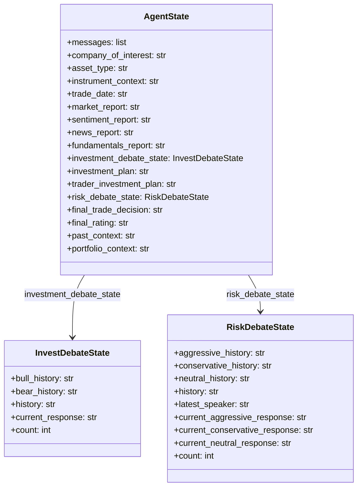
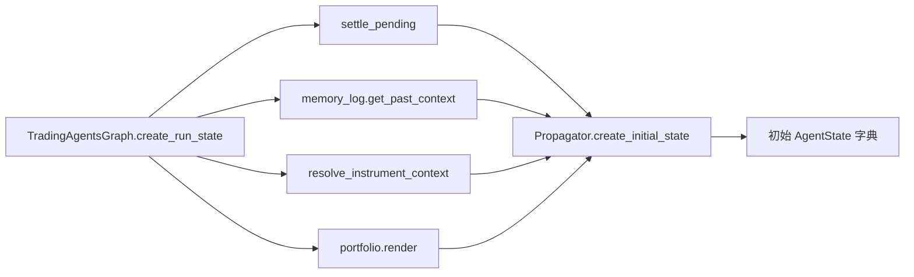
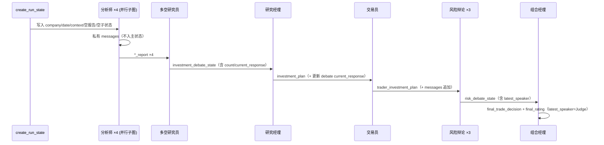

本页深入解析 TradingAgents 的核心运行时对象——**图状态（Graph State）**，说明它如何在 LangGraph 编排的一次分析运行中，经由各个智能体节点被初始化、读写、累积并最终落盘。理解状态模型是理解整条流水线协作方式的基础：所有智能体并不直接互相调用，而是围绕同一个共享状态字典（state）进行"读-写"式通信，状态字段的写入顺序即构成了数据在系统中的实际流动路径。本页聚焦于**状态的数据结构与键的流转语义**；各智能体的提示词与推理职责请参见 [分析师团队：基本面、市场、新闻与情绪](15-fen-xi-shi-tuan-dui-ji-ben-mian-shi-chang-xin-wen-yu-qing-xu)、[研究员辩论与结构化输出](16-yan-jiu-yuan-bian-lun-yu-jie-gou-hua-shu-chu)、[交易员与风险管理决策团队](17-jiao-yi-yuan-yu-feng-xian-guan-li-jue-ce-tuan-dui)，图的拓扑与并行编排请参见 [LangGraph 图构建与并行分析师执行](12-langgraph-tu-gou-jian-yu-bing-xing-fen-xi-shi-zhi-xing)。

## 状态模型的三层结构

整个运行时状态由三个 `TypedDict` 组成：一个顶层主状态 `AgentState`，以及分别嵌套在其中的两个辩论子状态 `InvestDebateState` 与 `RiskDebateState`。`AgentState` 直接继承自 LangGraph 的 `MessagesState`，从而自动获得带 `add_messages` reducer 的 `messages` 字段——这是系统中唯一一个"累积式"字段，其余字段均为"覆盖式"。

Sources: [state.py](tradingagents/agents/state.py#L1-L73)

主状态的字段可按"来源"分为三类：**运行输入字段**（由调用方在运行时提供）、**中间产物字段**（各智能体节点写入的报告与计划）、以及**终局字段**（收尾阶段的最终决策）。下表按数据流动顺序梳理每个字段的写入者与消费者。

| 状态字段 | 内容 | 写入者 | 主要消费者 |
|---|---|---|---|
| `company_of_interest` | 待分析标的 | 初始化 | 全部智能体 |
| `asset_type` | `stock` / `crypto` | 初始化 | 分析师、辩论者（措辞切换） |
| `instrument_context` | 运行开始时解析的确定性标的身份 | 初始化 | 全部智能体 |
| `trade_date` | 分析日期（数据以该日为基准） | 初始化 | 分析师（`current_date`） |
| `past_context` | 记忆日志注入的历史经验 | 初始化 | 组合经理 |
| `portfolio_context` | 调用方持仓与现金 | 初始化 | 交易员、辩论者、组合经理 |
| `*_report` × 4 | 四位分析师报告 | 各分析师子图 | 研究员、风险辩论者、交易员、报告树 |
| `investment_debate_state` | 多空辩论子状态 | 多头/空头研究员、研究经理 | 研究经理、条件路由 |
| `investment_plan` | 研究经理的投资计划 | 研究经理 | 交易员、组合经理 |
| `trader_investment_plan` | 交易员提案 | 交易员 | 风险辩论者、组合经理 |
| `risk_debate_state` | 风险辩论子状态 | 三位风险辩论者、组合经理 | 组合经理、条件路由 |
| `final_trade_decision` | 最终决策（markdown） | 组合经理 | 报告树、记忆日志 |
| `final_rating` | 五档评级 | 组合经理 | `run_rating`、记忆日志 |

Sources: [state.py](tradingagents/agents/state.py#L45-L73), [reporting.py](tradingagents/reporting.py#L32-L125), [trading_graph.py](tradingagents/graph/trading_graph.py#L415-L443)

## 辩论子状态的演进语义

两个辩论子状态都遵循"**整块返回、覆盖替换**"的更新方式，而非增量更新。原因在于 `AgentState` 的非 `messages` 字段没有 reducer，若某节点只返回子字典的一部分，LangGraph 会用该部分整体替换原值；因此每个辩论节点都显式重建完整字典再返回，以避免丢失其他字段。

Sources: [bull_researcher.py](tradingagents/agents/researchers/bull_researcher.py#L55-L63), [aggressive_debator.py](tradingagents/agents/risk_mgmt/aggressive_debator.py#L52-L66)

两个子状态各自维护一个全局 `history` 和每位发言者的私有 `*_history`，并都通过 `count` 计数。多空辩论用单一的 `current_response` 记录最后发言内容；风险辩论则用 `latest_speaker` 记录发言者标签，并为三方各存一份 `current_*_response`，以便每位辩论者在下一次发言时能读到另外两方的最新论点。执行时，每个辩论者把本轮发言同时追加进全局 `history` 与自己的私有历史，并递增 `count`。

Sources: [bear_researcher.py](tradingagents/agents/researchers/bear_researcher.py#L57-L65), [conservative_debator.py](tradingagents/agents/risk_mgmt/conservative_debator.py#L52-L68)

这些字段直接驱动路由决策：`should_continue_debate` 依据 `count` 是否达到 `2 × max_debate_rounds` 判断辩论是否结束，并依据 `current_response` 的前缀（`"Bull"` / `"Bear"`）决定下一个发言者；`should_continue_risk_analysis` 依据 `count` 是否达到 `3 × max_risk_discuss_rounds`，并依据 `latest_speaker` 在激进、保守、中立方之间轮转。因此，辩论者写入的 `current_response` / `latest_speaker` 不仅是内容数据，更是**路由控制信号**。

Sources: [conditional_logic.py](tradingagents/graph/conditional_logic.py#L12-L33), [neutral_debator.py](tradingagents/agents/risk_mgmt/neutral_debator.py#L57-L66)

## 状态初始化：Propagator

状态的起点由 `Propagator.create_initial_state` 构造。它一次性注入全部输入字段：`messages` 以 `("human", company_name)` 起始，四个报告键初始化为空字符串，两个辩论子状态初始化为 `count=0` 的骨架。`instrument_context`、`past_context` 与 `portfolio_context` 以关键字参数传入，缺省为空字符串——这为"裸程序化状态"（测试或直接构造）保留了回退路径。

Sources: [propagation.py](tradingagents/graph/propagation.py#L13-L64)

`Propagator` 同时负责图调用参数：`get_graph_args` 返回 `stream_mode="values"` 与 `recursion_limit`（`max_recur_limit`），可选注入回调。初始化状态的完整装配由 `TradingAgentsGraph.create_run_state` 完成——它在构造初始状态前先结算旧决策、拉取记忆日志的 `past_context`（历史运行按点位截断）、解析标的身份得到 `instrument_context`，并渲染 `portfolio_context`。

Sources: [propagation.py](tradingagents/graph/propagation.py#L66-L79), [trading_graph.py](tradingagents/graph/trading_graph.py#L305-L323)

## 分析师子图：私有消息历史与输出隔离

四位分析师在图中并非普通节点，而是各自被 `_analyst_graph` 包装成一个**独立编译的子图**。关键设计在于子图通过 `output_schema` 限定只向外暴露报告键，即动态生成的 `TypedDict({spec.report_key: str})`。这意味着分析师内部产生的 `messages`（含工具调用与工具返回）**不会**泄漏到主状态，也不会计入其他分析师的上下文——因为如果两个并行分析师都向同一个 `messages` 键写入，便会互相污染。

Sources: [setup.py](tradingagents/graph/setup.py#L53-L90), [analyst_execution.py](tradingagents/graph/analyst_execution.py#L7-L46)

在子图内部，分析师节点从状态读取 `trade_date`、`messages`、`company_of_interest`，经 `get_instrument_context_from_state` 取得标的身份，调用 `take_turn` 完成一轮模型+工具交互后，返回 `{"messages": [...], "<x>_report": report}`。其中 `report` 仅在模型不再发起工具调用时才为非空，因此报告键在工具轮次中保持为空，直到分析师"收敛"出最终报告。

Sources: [market_analyst.py](tradingagents/agents/analysts/market_analyst.py#L55-L82), [news_analyst.py](tradingagents/agents/analysts/news_analyst.py#L56-L61), [sentiment_analyst.py](tradingagents/agents/analysts/sentiment_analyst.py#L100-L116)

当子图用尽工具轮次上限后，`wrap_up` 节点会注入一条 `WRAP_UP` 人类消息并要求其直接成文；`take_turn` 检测到该消息后便以纯文本方式调用模型（剥离工具），以确保流程不会触达递归上限。这解释了为何报告键最终一定被填充。

Sources: [setup.py](tradingagents/graph/setup.py#L76-L90), [turn.py](tradingagents/agents/analysts/turn.py#L13-L27)

## 结构化输出与 markdown 渲染：状态里存的是文本

系统的一个核心数据流约定是：**状态字段存储的始终是渲染后的 markdown 文本**，而非 Pydantic 对象。研究经理、交易员、组合经理三个决策智能体在调用时使用 `with_structured_output` 获得类型化对象，随后立即通过 `render_*` 函数转回 markdown 再写入状态。这样做是为了让下游的显示、记忆日志与报告写盘逻辑对"结构化"无感知——它们一律消费 markdown。

Sources: [structured.py](tradingagents/agents/structured.py#L1-L17), [schemas.py](tradingagents/agents/schemas.py#L130-L138)

该模式由 `structured.py` 集中封装，包含两层优雅降级：其一，若供应商不支持 `with_structured_output`，`bind_structured` 返回 `None`，智能体改用自由文本；其二，即便结构化调用失败（弱模型输出畸形 JSON 等），`invoke_structured_or_freetext` 也会回退到 `plain_llm.invoke`。组合经理在这一步额外做了区分：结构化成功时 `final_rating` 直接取 `decision.rating.value`，失败时才用 `parse_rating` 从文本里抽取。

Sources: [structured.py](tradingagents/agents/structured.py#L42-L95), [portfolio_manager.py](tradingagents/agents/managers/portfolio_manager.py#L80-L104)

`schemas.py` 中定义了 `ResearchPlan`、`TraderProposal`、`PortfolioDecision`、`SentimentReport` 四类结构化输出，配套的 `render_*` 函数把字段拼回 `**Rating**:`、`FINAL TRANSACTION PROPOSAL:` 等固定标题，从而保持与下游解析器的向后兼容。

Sources: [schemas.py](tradingagents/agents/schemas.py#L95-L288), [rating.py](tradingagents/agents/rating.py#L1-L14)

## 数据在提示词中的流转：上下文字段的一致性读取

多个智能体需要读取同一批上下文字段，`context.py` 提供了统一的读取辅助函数，确保"缺失"被显式表达而不是被误读为空值。`report_or_absent` 把空报告替换为"本运行无该报告"的标记，防止阅读者把缺失报告当成空发现而凭空补全；`opponent_argument_or_opening` 把空的对手发言替换为"对方尚未发言"的提示，避免辩手虚构对手立场。

Sources: [context.py](tradingagents/agents/context.py#L37-L48), [context.py](tradingagents/agents/context.py#L190-L201), [bull_researcher.py](tradingagents/agents/researchers/bull_researcher.py#L15-L21)

`get_instrument_context_from_state` 优先读取状态中已解析的 `instrument_context`，缺失时回退为仅含 ticker 的轻量上下文，从而**避免在图中途发起网络查询**。`get_portfolio_context_from_state` 则在无持仓上下文时返回明确提示，阻止智能体把"未提供"误当作"空仓"。

Sources: [context.py](tradingagents/agents/context.py#L172-L187), [context.py](tradingagents/agents/context.py#L204-L218), [portfolio.py](tradingagents/portfolio.py#L37-L51)

值得注意的是，交易员还会额外读取 `market_report` 作为价格结构依据：只有当该报告非空时，才向提示词注入"以技术报告中的价格结构接地"的要求，从而在同一次运行中打通"分析师报告 → 交易员提案"的数据链路。

Sources: [trader.py](tradingagents/agents/trader/trader.py#L32-L44)

## 完整数据流转序列

将上述片段串起来，一次运行的键级数据流如下：`create_run_state` 装配初始状态 → 四位分析师并行写入四个 `*_report` → 多空研究员交替更新 `investment_debate_state` → 研究经理写入 `investment_plan` → 交易员写入 `trader_investment_plan`（并追加一条 `AIMessage` 到 `messages`）→ 三位风险辩论者交替更新 `risk_debate_state` → 组合经理写入 `final_trade_decision` 与 `final_rating`。

## 状态的消费与持久化

图运行结束后，`final_state` 被三处消费。其一，`record_decision` → `_log_state` 将该运行序列化为 JSON 日志；其二，`memory_log.store_decision` 以 `run_rating(final_state)` 作为标签写入记忆日志的 pending 条目；其三，`save_reports` → `write_report_tree` 依据各 `*_report`、`investment_plan`、`trader_investment_plan`、`final_trade_decision` 等键生成分节 markdown 与汇总报告。

Sources: [trading_graph.py](tradingagents/graph/trading_graph.py#L336-L348), [memory/log.py](tradingagents/memory/log.py#L31-L59), [reporting.py](tradingagents/reporting.py#L32-L125)

`_log_state` 只挑选部分字段落盘：`invest_debate_state` 只保留 `bull_history`、`bear_history`、`history`、`current_response`（丢弃 `count`），`risk_debate_state` 只保留三方历史与 `history`（丢弃 `latest_speaker`、`current_*_response`、`count`）。这说明状态的**运行时控制字段**（计数、当前发言者）与**持久化的内容字段**被有意区分：前者只在图执行期间有意义，后者才进入审计日志与报告。

Sources: [trading_graph.py](tradingagents/graph/trading_graph.py#L415-L443)

评级字段的读取还有一层防御：`run_rating` 优先使用组合经理直接写入的 `final_rating`，仅在其缺失时（例如旧版本遗留的检查点）才从 `final_trade_decision` 文本中解析；当两者都无法定位评级时会返回 `REVIEW` 哨兵而非降级为 `Hold`，以免把"无法读取的决策"伪造成一笔从未做出的交易。由于该哨兵不是五档评级之一，调用方映射到 `PortfolioRating` 枚举前需先用 `is_review` 判定。

Sources: [rating.py](tradingagents/agents/rating.py#L85-L107), [trading_graph.py](tradingagents/graph/trading_graph.py#L350-L382)

## 下一步阅读

状态模型明确了"什么被存储、何时被写入"，但每个字段背后的推理逻辑各成体系。若想深入单一智能体如何利用这些字段，请继续阅读 [分析师团队：基本面、市场、新闻与情绪](15-fen-xi-shi-tuan-dui-ji-ben-mian-shi-chang-xin-wen-yu-qing-xu)、[研究员辩论与结构化输出](16-yan-jiu-yuan-bian-lun-yu-jie-gou-hua-shu-chu) 与 [交易员与风险管理决策团队](17-jiao-yi-yuan-yu-feng-xian-guan-li-jue-ce-tuan-dui)；若关心路由如何依据状态字段驱动条件边，请回顾 [辩论路由与条件逻辑](13-bian-lun-lu-you-yu-tiao-jian-luo-ji)；若关心状态如何被序列化以支持断点恢复，请参见 [状态持久化与断点恢复](10-zhuang-tai-chi-jiu-hua-yu-duan-dian-hui-fu) 与 [报告树生成与保存](28-bao-gao-shu-sheng-cheng-yu-bao-cun)。