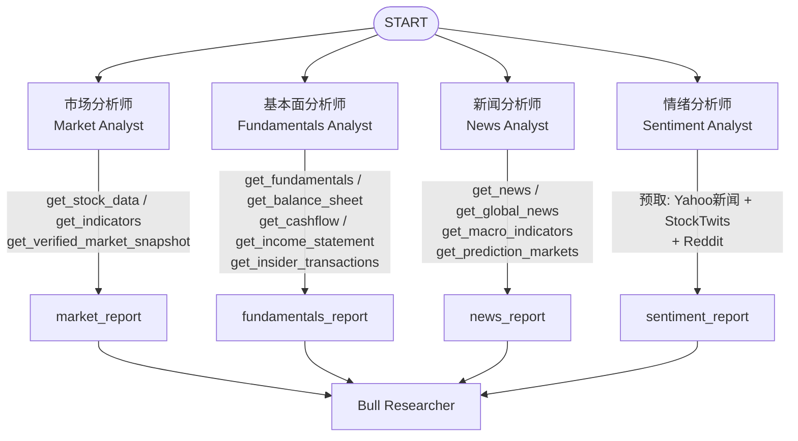
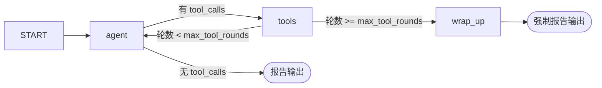

分析师团队是 TradingAgents 多智能体流水线的**第一道数据蒸馏层**：它在任何辩论或决策发生之前，把原始、嘈杂的市场数据转换成四份可被下游读取的结构化报告。本文聚焦这条流水线中最靠前的一段——四位分析师各自的职责边界、它们共享的执行模型、所调用的数据工具，以及各自的输出如何落到状态键上供后续消费。

四位分析师在 `tradingagents/agents/analysts/` 目录下各自成文件，由 `tradingagents/agents/__init__.py` 统一导出工厂函数（`create_market_analyst`、`create_fundamentals_analyst`、`create_news_analyst`、`create_sentiment_analyst`）。它们并非简单的提示词拼接，而是共享一套"私有消息历史 + 工具轮预算"的封装，并在 `graph/setup.py` 中被编排为一个独立的子图。

Sources: [__init__.py](tradingagents/agents/__init__.py#L1-L32)

## 团队构成与数据流总览

四位分析师在同一时刻并行运行，各自从不同数据源取材，最终产出四份互不覆盖的报告。它们的关键差异在于**数据获取方式**：市场、基本面、新闻三位分析师在运行时通过 LangChain 工具调用（tool-calling）按需拉取数据；而情绪分析师则在调用模型之前就把三路社交/新闻数据预取并注入提示词。

团队编排由 `GraphSetup.setup_graph` 完成：它先通过 `build_analyst_execution_plan` 得到本次运行选中的分析师规格，再把每位分析师的节点加入工作流、分别为每个节点连一条 `START` 边，最后用 `workflow.add_edge(analysts, "Bull Researcher")` 让多头研究员在所有分析师全部完成报告后才启动。这一"汇聚边"是多智能体协作的关键——研究员辩论必须看到全部四份报告。

Sources: [setup.py](tradingagents/graph/setup.py#L118-L133), [analyst_execution.py](tradingagents/graph/analyst_execution.py#L43-L60), [analyst_execution.py](tradingagents/graph/analyst_execution.py#L18-L40)

## 统一的执行模型：私有消息历史与工具轮预算

虽然四位分析师职责各异，但共享同一个执行骨架 `_analyst_graph`。它把每位分析师编译成一张**独立子图**，具有两个关键性质：其一，每位分析师运行在私有消息历史上，只返回自己的报告，因此并行运行的分析师永远不会写到同一个状态键，工具调用也不会泄漏到其他分析师的消息中；其二，工具轮数受 `max_tool_rounds` 预算约束，预算耗尽后分析师会被要求立即写报告。

Sources: [setup.py](tradingagents/graph/setup.py#L53-L91)

工具轮的控制逻辑如下：`_tools_or_done` 判断分析师最新一条消息是否含有工具调用——有则路由到 `tools` 节点执行，无则结束并输出报告。`more_or_wrap_up` 统计历史中含工具调用的消息数，一旦达到 `max_tool_rounds` 就路由到 `wrap_up` 节点。`wrap_up` 会向消息尾部追加一条 `WRAP_UP` 人类消息，并把该轮结果直接作为终局报告结束该分析师子图。

`WRAP_UP` 的措辞是刻意设计的——它要求模型"现在就用上方工具结果写最终报告，并说明哪些数据没能取到"，从而把"工具轮耗尽"这一技术约束转化为一份**显式声明数据缺口的报告**，而不是让模型编造一个漂亮的结论。

Sources: [turn.py](tradingagents/agents/analysts/turn.py#L7-L10), [setup.py](tradingagents/graph/setup.py#L76-L84)

单轮内，分析师通过 `take_turn` 与模型交互。这个函数处理了两个容易被忽视的边界情况：一是当上一轮是 `WRAP_UP` 时，它调用 `prompt.partial(tool_names="none; your tool rounds are spent")` 显式告知模型已无工具可用，因为"被告知有工具却无法调用"的模型仍可能尝试调用，部分供应商会因此返回空回复；二是收尾轮通过 `_as_text` 把历史中的工具调用与工具结果改写为纯文本消息，因为当模型未绑定任何工具时，某些供应商会拒绝含有工具调用的消息历史。返回值上，若模型生成了 `tool_calls` 则报告为空字符串（说明还在取数阶段），否则报告即为模型内容。

Sources: [turn.py](tradingagents/agents/analysts/turn.py#L13-L43)

## 工具即数据入口：分析师可用的工具集

三位基于工具调用的分析师，其工具集合以模块级 `TOOLS` 元组声明，该元组同时被分析师节点和其工具节点（`ToolNode`）复用——这在 `analyst_execution.py` 的 `AnalystNodeSpec` 中通过 `tools=market_analyst.TOOLS` 等绑定。工具本身定义在 `tradingagents/agents/tools.py`，是通往数据供应商路由层的统一入口。

| 分析师 | 可用工具 (`TOOLS`) | 数据维度 |
|---|---|---|
| 市场 | `get_stock_data`, `get_indicators`, `get_verified_market_snapshot` | OHLCV 行情、技术指标、确定性快照 |
| 基本面 | `get_fundamentals`, `get_balance_sheet`, `get_cashflow`, `get_income_statement`, `get_insider_transactions` | 公司概况、三大财务报表、内部交易 |
| 新闻 | `get_news`, `get_global_news`, `get_macro_indicators`, `get_prediction_markets` | 标的新闻、全球宏观新闻、FRED 宏观指标、Polymarket 预测市场 |
| 情绪 | 无工具（数据预取） | 预取 Yahoo 新闻、StockTwits、Reddit |

所有带日期的工具都用 `InjectedState("trade_date")` 从图状态注入运行日期，并配合 `as_of` / `as_of_window` 把模型请求的日期裁剪到不晚于运行日期，因此**无论模型要求什么日期，工具都不会返回运行日期之后的数据**。这一层防未来函数约束是工具模块的设计核心。

Sources: [tools.py](tradingagents/agents/tools.py#L1-L6), [tools.py](tradingagents/agents/tools.py#L17-L48), [analyst_execution.py](tradingagents/graph/analyst_execution.py#L18-L40)

## 市场分析师：技术面与确定性快照

市场分析师的职责是**从一组预定义指标中挑出最多 8 个互补的指标**，并据此写出技术面报告。它的系统提示词本身就是一份指标字典——涵盖移动平均（`close_50_sma`、`close_200_sma`、`close_10_ema`）、MACD 家族（`macd`、`macds`、`macdh`）、动量（`rsi`）、波动率（`boll`、`boll_ub`、`boll_lb`、`atr`）与量能（`vwma`），每个指标都附带用途与注意事项。提示词明确要求避免冗余（例如不要同时选 `rsi` 与 `stochrsi`）。

Sources: [market_analyst.py](tradingagents/agents/analysts/market_analyst.py#L7-L47)

其提示词中最具架构意义的约束是**引入 `get_verified_market_snapshot` 作为"事实来源"**：在写最终报告前，模型被要求先调用该工具，并把快照当作任何精确 OHLCV、价位或指标值声明的唯一依据；若其他工具输出与之冲突，应"标记差异而非编造一个调和后的数字"。同时提示词禁止模型在没有带日期、带价位的工具输出支撑时声称历史验证、支撑/阻力位反弹或精确百分比涨跌。这条规则把"防止幻觉式技术分析"写进了提示词层。

Sources: [market_analyst.py](tradingagents/agents/analysts/market_analyst.py#L48)

## 基本面分析师：财报与内部交易

基本面分析师的系统提示词要求它分析公司过去一周的基本面信息，包括财务文档、公司概况、基础财务数据与财务历史，并调用 `get_fundamentals`（综合公司分析）、`get_balance_sheet`、`get_cashflow`、`get_income_statement`（具体财务报表）以及 `get_insider_transactions`（近期内部买卖）。它被明确指示在报告末尾附加一张 Markdown 表格来组织要点。

Sources: [fundamentals_analyst.py](tradingagents/agents/analysts/fundamentals_analyst.py#L12-L33)

值得注意的是基本面路径上的**时点一致性约束**：在历史回测中，供应商的"公司概况"类端点（如 yfinance `Ticker.info`）不携带历史版本，会泄漏决策后的信息（市值、估值倍数、52 周区间、TTM 收入，甚至名称、行业分类都会变化）。因此 `withhold_live_profile` 会在历史运行中**扣留**这些数据，取而代之的是一段说明文本，告知用户为何不服务该数据。同理，无申报日期的内部交易（`withhold_undisclosed_trades`）与无申报日期的报表（`withhold_undated_statements`）也会在历史运行中被扣留。

Sources: [date_window.py](tradingagents/dataflows/date_window.py#L118-L167)

## 新闻分析师：公司、宏观与预测市场

新闻分析师横跨"标的新闻"与"全球宏观"两个层次。它根据 `asset_type` 动态调整措辞——若为股票则称 "company"，否则称 "asset"，同时对加密货币场景保持中性表述。其工具集在标的新闻 `get_news` 之外，还包含 `get_global_news`（宏观头条）、`get_macro_indicators`（FRED 经济数据，支持 `cpi`、`fed_funds_rate`、`10y_treasury` 等友好别名或原始 FRED 序列 ID）以及 `get_prediction_markets`（Polymarket 前瞻事件概率）。

Sources: [news_analyst.py](tradingagents/agents/analysts/news_analyst.py#L6-L32), [tools.py](tradingagents/agents/tools.py#L188-L283)

宏观与预测市场工具的引入，使新闻分析师能从"已发生的事实"延伸到"市场对未来事件的隐含定价"，为主观叙事之外增加一个可量化的前瞻维度。

## 情绪分析师：预取三源与结构化输出

情绪分析师与其他三位在架构上**显著不同**：它不进行工具调用，而是在调用模型之前就把三路数据预取并直接嵌入提示词。这三路数据是：来自 Yahoo Finance 的新闻标题（机构视角、慢变量）、来自 StockTwits 的 cashtag 流消息（自带 Bullish/Bearish 标签、快变量）、以及来自 r/wallstreetbets、r/stocks、r/investing 的 Reddit 帖子（社区讨论，不含投票/评论数）。

Sources: [sentiment_analyst.py](tradingagents/agents/analysts/sentiment_analyst.py#L1-L20), [sentiment_analyst.py](tradingagents/agents/analysts/sentiment_analyst.py#L118-L150)

预取顺序严格可控：先取新闻块 `get_news.func(...)`，再构造 `jev_screen(ticker)` 屏幕，然后用同一个 `screen` 分别取 StockTwits（`limit=30`）与 Reddit，全部按 7 天窗口 `[start_date, end_date]` 裁剪。把分析窗口传给社交数据抓取器，是为了让历史回测只看到窗口内的帖子，而不是把"今天的闲谈"泄漏进过去的分析。每个抓取器都优雅降级——它们返回字符串（真实数据或明确的占位符），不会向此处抛出异常，因此模型总能读到"某些东西"。

Sources: [sentiment_analyst.py](tradingagents/agents/analysts/sentiment_analyst.py#L53-L68)

社交输入的**筛选由 Jev 完成**（当设置了 `TYPESAFE_API_KEY` 时）。`jev_screen` 对每条帖子问两个问题：它是否在谈论该标的（`about`），以及它对标的股票持何种立场（`stance`：bullish/bearish/neutral）。明确"跑题"的帖子被丢弃，其余帖子的立场计数汇总成一行"来源块顶部注记"。若没有密钥，或任何请求失败，帖子将**不筛选**保留，并在块中说明"筛选不可用"。这把"数据质量"这一隐性维度显式暴露给了模型。

Sources: [post_screen.py](tradingagents/agents/post_screen.py#L1-L10), [post_screen.py](tradingagents/agents/post_screen.py#L126-L175)

情绪分析师的输出通过**结构化输出**获得：`bind_structured` 在节点创建时把 LLM 包装成 `SentimentReport` 结构化调用，`invoke_structured_or_freetext` 在调用时先走结构化路径，若失败或供应商不支持则回退到自由文本。`SentimentReport` 定义 `overall_band`（六档：Bullish / Mildly Bullish / Neutral / Mixed / Mildly Bearish / Bearish）、`overall_score`（0–10，5 为中性）、`confidence`（low/medium/high）与 `narrative`（逐源分析 + 分歧 + 主题 + 催化剂/风险 + 汇总表）。`render_sentiment_report` 把结构化结果渲染回系统其余部分消费的 Markdown 形态——**头部固定为 band + score + confidence**，从而让不同供应商产出的报告读起来一致。

Sources: [structured.py](tradingagents/agents/structured.py#L42-L96), [schemas.py](tradingagents/agents/schemas.py#L296-L380)

由于情绪路径不走工具调用，其提示词会附加 `NO_EXTERNAL_TOOLS` 约束——明确要求"只使用本提示词中提供的证据，不要调用外部工具或搜索网络"。这是必要的：schema-only 的结构化输出只绑定一个工具（即 schema 本身），若模型在此去调搜索工具，会产生未知工具调用并导致整个结构化尝试被丢弃而回退到自由文本。

Sources: [structured.py](tradingagents/agents/structured.py#L30-L40), [sentiment_analyst.py](tradingagents/agents/analysts/sentiment_analyst.py#L76-L96)

## 共享的上下文注入：标的身份、时点与语言

四位分析师的提示词都由同一套共享上下文装配。每个节点首先通过 `get_instrument_context_from_state` 取回标的上下文——它优先使用运行开始时一次性解析并存入状态的 `instrument_context`，仅在缺失时才回退到仅含 ticker 的上下文（不触发网络调用）。这一身份信息由 `resolve_instrument_identity` 从公司概况解析出公司名、行业、板块、交易所等，其存在意义是**防止流水线凭空捏造出另一家公司**：没有真名时，市场分析师会按价格图形匹配叙事并虚构一个身份，再级联污染所有下游分析师。

Sources: [context.py](tradingagents/agents/context.py#L107-L200), [context.py](tradingagents/agents/context.py#L61-L105)

时点处理上，`build_instrument_context` 在**历史运行**中只提供"当前名称"作为区分身份之用，并显式注明"在分析日期它可能另有其名"，同时不提供服务当前所属的行业/板块/交易所——因为它们在当时未必如此。加密资产则被标注为 "crypto asset"，并提示不要假设存在公司基本面。

Sources: [context.py](tradingagents/agents/context.py#L124-L170)

语言指令由 `get_language_instruction` 统一生成：英文（默认）返回空字符串以节省 token；非英文时追加指令要求整份报告用目标语言撰写，但把程序读取的标签行（如 `**Rating**:`、`FINAL TRANSACTION PROPOSAL:`）保留英文，因为被翻译或否定的标签行会被下游解析误读。

Sources: [context.py](tradingagents/agents/context.py#L14-L30)

## 分析师的选择与资产类型裁剪

选择哪些分析师运行由 `AnalystType` 枚举驱动，其 value 与 `ANALYST_NODE_SPECS` 的键一一对应：`market`、`social`（用户可见为 "Sentiment Analyst"）、`news`、`fundamentals`。CLI 的 `--analysts` 参数接受逗号分隔的人名，`parse_analysts` 会校验其合法性；若省略则默认运行该资产类型允许的全部分析师。

Sources: [analyst_execution.py](tradingagents/graph/analyst_execution.py#L18-L40), [models.py](cli/models.py#L4-L15), [main.py](cli/main.py#L122-L139)

加密资产场景会裁剪掉基本面分析师：`filter_analysts_for_asset_type` 在 `asset_type == crypto` 时从列表中移除 `FUNDAMENTALS`，因为这些数据路径对加密标的本就不可用。此外，`GraphSetup.setup_graph` 与 `build_analyst_execution_plan` 会拒绝未知的分析师键，并在一个都没选时抛错，确保图中至少有一位分析师。

Sources: [prompts.py](cli/prompts.py#L127-L136), [analyst_execution.py](tradingagents/graph/analyst_execution.py#L50-L59)

## 报告的去向与下游消费

四位分析师各自写入的状态键——`market_report`、`fundamentals_report`、`news_report`、`sentiment_report`——都在 `AgentState`（继承自 LangGraph `MessagesState`）中声明。`Propagator.create_initial_state` 把它们全部初始化为空字符串，表示"尚未产出"。每个分析师子图的 `output_schema` 只暴露自己的报告键，因此并行节点之间不存在写冲突。

Sources: [state.py](tradingagents/agents/state.py#L46-L55), [propagation.py](tradingagents/graph/propagation.py#L38-L57), [setup.py](tradingagents/graph/setup.py#L60-L66)

下游消费这些报告的路径有二：一是研究团队（研究员辩论）把四份报告作为上下文；二是报告导出层 `reporting.py` 逐份写出独立文件（`market.md`、`sentiment.md`、`news.md`、`fundamentals.md`）并附上对应的分析师标签，供用户阅读。值得注意的是，`report_or_absent` 会在报告为空时插入一段"未产出"标记，而不是让下游读到空白段落——因为空白会被读取方"从无到有地填充"，与空对手论点会诱发凭空反驳是同一类问题。

Sources: [reporting.py](tradingagents/reporting.py#L45-L60), [context.py](tradingagents/agents/context.py#L200-L219)

## 分析师对比一览

| 维度 | 市场 | 基本面 | 新闻 | 情绪 |
|---|---|---|---|---|
| 获取方式 | 工具调用 | 工具调用 | 工具调用 | 预取注入 |
| 工具数量 | 3 | 5 | 4 | 0 |
| 核心输出 | 技术面趋势 + 指标表 | 财报 + 内部交易 | 标的/宏观/预测市场 | band + score + confidence + 叙事 |
| 结构化输出 | 否 | 否 | 否 | 是（`SentimentReport`） |
| 事实来源约束 | `get_verified_market_snapshot` | 时点扣留机制 | — | Jev 筛选 + 占位符 |
| 状态键 | `market_report` | `fundamentals_report` | `news_report` | `sentiment_report` |

Sources: [analyst_execution.py](tradingagents/graph/analyst_execution.py#L18-L40), [schemas.py](tradingagents/agents/schemas.py#L311-L365)

## 下一步

分析师团队产出的四份报告汇聚到多头研究员节点后，流水线进入辩论阶段。要理解这四份报告如何被消费、研究员如何进行结构化交锋，请阅读 [研究员辩论与结构化输出](16-yan-jiu-yuan-bian-lun-yu-jie-gou-hua-shu-chu)。若想深入分析师所依赖的数据供应商路由与回退机制，请参阅 [数据供应商路由与回退链](18-shu-ju-gong-ying-shang-lu-you-yu-hui-tui-lian)；关于点内一致性如何贯穿所有带日期的工具，请参阅 [时点一致性与防未来函数](19-shi-dian-zhi-xing-yu-fang-wei-lai-han-shu)；关于分析师节点的图编排细节，请参阅 [LangGraph 图构建与并行分析师执行](12-langgraph-tu-gou-jian-yu-bing-xing-fen-xi-shi-zhi-xing)。