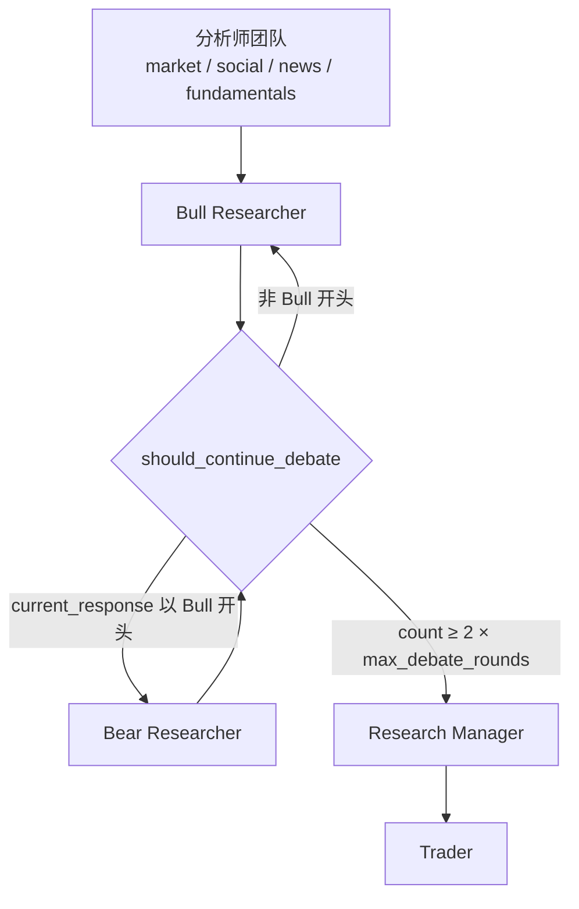
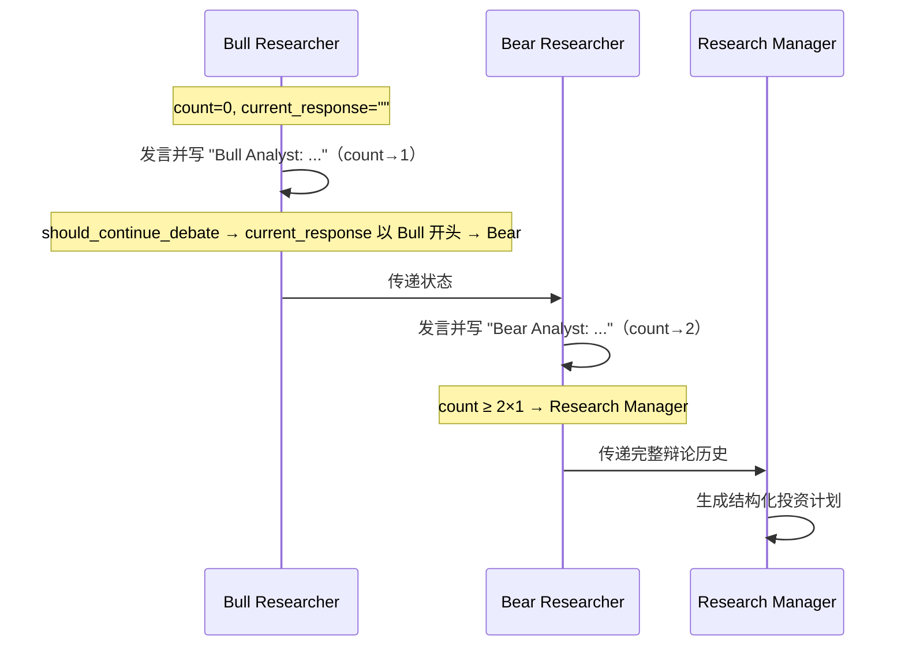
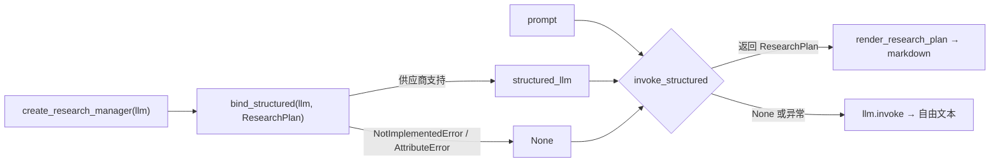
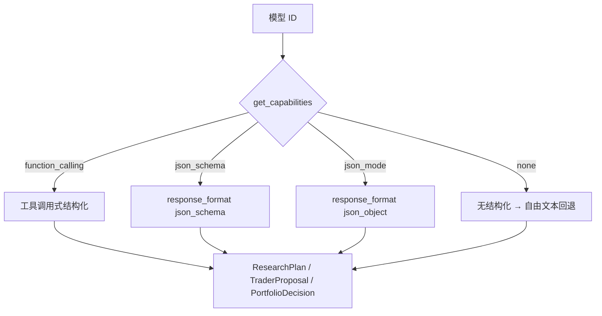

在分析师团队完成四份独立报告之后，系统进入**研究员团队（Researcher Team）**阶段：多头（Bull）与空头（Bear）研究员围绕同一标的展开对抗式辩论，随后由**研究经理（Research Manager）**担任辩论主持人，把双方论点收敛为一份可执行的**结构化投资计划**。本页聚焦这条"辩论 → 结构化决策"链路，说明辩论状态模型、路由条件、研究员提示词的构造方式，以及研究经理如何借助 Pydantic Schema 产出确定形状的结构化输出（并在供应商不支持时优雅回退）。交易员与风险团队的后续决策请见 [交易员与风险管理决策团队](17-jiao-yi-yuan-yu-feng-xian-guan-li-jue-ce-tuan-dui)；报告树的落盘细节请见 [报告树生成与保存](28-bao-gao-shu-sheng-cheng-yu-bao-cun)。

## 辩论在整体编排中的位置

研究员辩论是分析师阶段与交易员阶段之间的桥梁。四类分析师（market / social / news / fundamentals）以**并行**方式各自运行，全部完成后汇入 `Bull Researcher` 节点；牛熊两位研究员交替发言，直到达到轮数上限，再交由 `Research Manager` 收敛，最后由研究经理的 `investment_plan` 交给 `Trader`。这一拓扑在 `setup.py` 中显式声明：所有分析师节点都连向 `Bull Researcher`，牛熊两个节点共用同一个条件路由，`Research Manager` 则有固定边指向 `Trader`。

Sources: [setup.py](tradingagents/graph/setup.py#L155-L169)

辩论的**输入**是四份分析师报告；**输出**写入 `investment_debate_state`（辩论全程记录）与 `investment_plan`（结构化投资计划）两个状态键。报告落盘时，`manager.md` 直接写入 `investment_plan`，因此该键既是下游智能体的上下文，也是最终人类可读产物的一部分。

Sources: [research_manager.py](tradingagents/agents/managers/research_manager.py#L69-L72), [reporting.py](tradingagents/reporting.py#L78-L81)

## 辩论状态模型：InvestDebateState

研究员辩论的全部进展保存在一个专门的 `TypedDict`——`InvestDebateState` 中。它同时维护**合并历史**（`history`）、**分侧历史**（`bull_history` / `bear_history`）、**最新回应**（`current_response`）与**计数器**（`count`）。各字段在 `AgentState` 中以 `investment_debate_state` 键聚合。

Sources: [state.py](tradingagents/agents/state.py#L8-L17), [state.py](tradingagents/agents/state.py#L58-L61)

| 字段 | 类型 | 语义 | 在路由中的作用 |
|------|------|------|----------------|
| `history` | `str` | 完整对话记录，追加上每轮论点 | 传给研究经理作为辩论全稿 |
| `bull_history` | `str` | 仅多头论点 | 供分侧引用 |
| `bear_history` | `str` | 仅空头论点 | 供分侧引用 |
| `current_response` | `str` | 最近一条发言 | **路由依据**：判断下一个该谁发言 |
| `count` | `int` | 已发言次数 | **终止依据**：达到上限则结束辩论 |

在图的入口处，`Propagator.create_initial_state` 将上述字段全部初始化为空字符串、`count` 为 0。这一步很关键：`current_response` 初值为空串，决定了第一位发言者是多头，也决定了空头首次发言时其"对手论点"为空——这正是下一节要解决的"幽灵对手"问题。

Sources: [propagation.py](tradingagents/graph/propagation.py#L38-L46)

## 牛熊研究员：交替的自由文本辩论

两位研究员都遵循同一套工厂函数模式：`create_bull_researcher(llm)` 与 `create_bear_researcher(llm)` 返回一个接受 `state` 的节点函数。它们使用**快速思考模型**（`quick_thinking_llm`），因为辩论需要高频、快速的多轮生成。每个节点函数都从状态中读取辩论历史、对手的最近回应、四份分析师报告与标的上下文，拼成一段提示词，然后调用 `llm.invoke(prompt)`。

Sources: [bull_researcher.py](tradingagents/agents/researchers/bull_researcher.py#L9-L31), [setup.py](tradingagents/graph/setup.py#L130-L132)

多头与空头的提示词结构镜像对称，核心差异在于立场与要点清单。下表对比两者的提示词骨架：

| 维度 | 多头（Bull） | 空头（Bear） |
|------|-------------|-------------|
| 角色定位 | 强调增长潜力、竞争优势、正向指标 | 强调风险、竞争劣势、负向指标 |
| 反驳任务 | 逐条拆解空头论点并说明多头更强 | 逐条拆解多头论点并暴露乐观假设 |
| 交互风格 | 对话式、直接回应对手 | 对话式、直接回应对手 |
| 共享输入 | 标的上下文、四份报告、辩论历史、对手最近论点 | 同左 |
| 状态写入 | 追加 `bull_history` + `history` | 追加 `bear_history` + `history` |

Sources: [bull_researcher.py](tradingagents/agents/researchers/bull_researcher.py#L31-L49), [bear_researcher.py](tradingagents/agents/researchers/bear_researcher.py#L31-L51)

### 幽灵对手问题：opponent_argument_or_opening

每轮辩论的**首位发言者**会拿到一个空的对手论点。如果把空串直接插进"请反驳对手"的提示词，模型会凭空捏造对手立场。`opponent_argument_or_opening` 正是为此设计的守卫函数：当文本为空（或仅含空白）时，它返回一句明确的**开场标记**——"(The bear analyst has not spoken yet — open the debate with your own case.)"；否则原样透传真实论点。两位研究员都在构造提示词前对 `current_response` 调用该函数，从而把"对手未发言"这一事实如实告知模型，而不是留白诱发幻觉。

Sources: [context.py](tradingagents/agents/context.py#L37-L48), [bull_researcher.py](tradingagents/agents/researchers/bull_researcher.py#L15-L17), [bear_researcher.py](tradingagents/agents/researchers/bear_researcher.py#L15-L17)

### 缺席报告的显式标记：report_or_absent

同理，当某个分析师未被选中、拒绝回答或返回空时，其报告为空串。若直接把空报告填进标注区块，会读成一个"空白发现"，诱发下游智能体从虚无中补全。`report_or_absent` 返回一句显式标记——"(No market report in this run: it is not available, not an empty finding.)"——把"报告不存在"与"报告为空结论"区分开。四个研究员节点都通过该函数获取各分报告文本。

Sources: [context.py](tradingagents/agents/context.py#L190-L201), [bull_researcher.py](tradingagents/agents/researchers/bull_researcher.py#L18-L21)

### 论点前缀与发言身份

研究员在把模型回复写入状态前，会给论点加上固定的身份前缀：多头写 `f"Bull Analyst: {response.content}"`，空头写 `f"Bear Analyst: {response.content}"`。这个前缀不只是可读性标记——它同时是**路由判定字符串**，被 `should_continue_debate` 用来识别"最后一位发言者是谁"（见下一节）。因此前缀的措辞与路由逻辑是强耦合的。

Sources: [bull_researcher.py](tradingagents/agents/researchers/bull_researcher.py#L53-L61), [bear_researcher.py](tradingagents/agents/researchers/bear_researcher.py#L55-L63)

## 辩论路由：条件逻辑与图边

辩论的推进由 `ConditionalLogic.should_continue_debate` 决定。它按两个规则判断：若 `count >= 2 * max_debate_rounds`，说明牛熊各发言的轮次已满，转向 `Research Manager`；否则检查 `current_response` 是否以 `"Bull"` 开头——是则轮到空头，否则轮到多头。默认 `max_debate_rounds` 为 1，即"多头一轮、空头一轮"共两轮发言后进入研究经理。

Sources: [conditional_logic.py](tradingagents/graph/conditional_logic.py#L12-L21), [default_config.py](tradingagents/default_config.py#L122)

为防止路由逻辑漂移（例如提示词或 i18n 改动导致发言标签变化）造成 LangGraph 命中不存在的边，`setup.py` 定义了完整的 `DEBATE_PATH_MAP`，把三个可能的返回目标——`Bull Researcher`、`Bear Researcher`、`Research Manager`——全部映射到同名节点，使任何回退返回都不会缺边崩溃。

Sources: [setup.py](tradingagents/graph/setup.py#L35-L39), [setup.py](tradingagents/graph/setup.py#L162-L168)

## 研究经理：从辩论到结构化投资计划

研究经理是研究员团队的"收敛器"，也是本页**结构化输出**的主角。它使用**深度思考模型**（`deep_thinking_llm`），因为要在双方对抗论点之间做出权衡判断。节点函数读取辩论的完整 `history`，套用一份包含五档评级量表的提示词，然后调用结构化的共享工具链产出投资计划。

Sources: [setup.py](tradingagents/graph/setup.py#L132-L132), [research_manager.py](tradingagents/agents/managers/research_manager.py#L14-L51)

产出形状由 `ResearchPlan` 这个 Pydantic 模型定义。其字段描述**直接充当模型输出指令**，因此提示词正文只需承载上下文与评级量表，无需重复说明格式。

Sources: [schemas.py](tradingagents/agents/schemas.py#L95-L127)

| 字段 | 类型 | 说明 |
|------|------|------|
| `recommendation` | `PortfolioRating` | 五档评级之一：Buy / Overweight / Hold / Underweight / Sell |
| `rationale` | `str` | 双方论点的对话式总结，收束到最终结论 |
| `strategic_actions` | `str` | 给交易员的具体执行步骤，含相对标准仓位的规模指引 |

`recommendation` 的字段描述中嵌入了一条**关键判定规则**：单纯的论点冲突不构成 Hold 的理由，必须押注更强的一方，Hold 仅在权衡后证据仍然均衡或过于稀薄时才选。该规则在 schema 描述与研究经理提示词正文中一致重复，保证结构化路径与自由文本回退路径给出同样的行为约束。

Sources: [schemas.py](tradingagents/agents/schemas.py#L104-L112), [research_manager.py](tradingagents/agents/managers/research_manager.py#L29-L36)

结构化调用返回 `ResearchPlan` 实例后，`render_research_plan` 会把它渲染成马可当量（markdown）：`**Recommendation**`、`**Rationale**`、`**Strategic Actions**` 三段固定标题。这样下游的展示层、记忆日志与报告写入器**无需改动**——它们读取的仍是既有形状的文本，而结构化只是在生成侧加了一层类型保障。

Sources: [schemas.py](tradingagents/agents/schemas.py#L130-L138), [schemas.py](tradingagents/agents/schemas.py#L1-L17)

## 结构化输出的通用模式

研究经理、交易员与投资组合经理三者共享同一套 canonical 模式，集中在 `structured.py` 中。其核心思想是：**建模期**用 `with_structured_output(Schema)` 绑定类型化输出，**调用期**运行结构化调用并在失败时回退到自由文本。下图为该模式的组件交互。

Sources: [structured.py](tradingagents/agents/structured.py#L1-L29)

三个函数各自承担一个职责，形成清晰的降级链：

| 函数 | 时机 | 行为 | 失败结果 |
|------|------|------|----------|
| `bind_structured` | 智能体创建时 | 尝试 `llm.with_structured_output(schema)` | 返回 `None` 并告警（该供应商全程走自由文本） |
| `invoke_structured` | 每次调用 | 执行结构化调用；`None` 结果亦视为失败 | 返回 `None` 并告警（本次回退一次） |
| `invoke_structured_or_freetext` | 每次调用 | 结构化成功则渲染，否则 `llm.invoke(prompt).content` | 永不阻塞流水线 |

Sources: [structured.py](tradingagents/agents/structured.py#L42-L95)

### NO_EXTERNAL_TOOLS：约束搜索工具的诱惑

`with_structured_output` 只绑定**一个**工具（即 schema 本身）。若提示词同时暗示可以使用搜索工具，模型可能发出一个未知的工具调用，导致整次结构化尝试被丢弃并强制自由文本重试——既浪费一轮 LLM 往返，又丢失类型化输出。为此，`NO_EXTERNAL_TOOLS` 常量提供一句显式约束，要求模型**仅使用提示词中提供的证据**，研究经理与交易员、投资组合经理都会把它嵌入渲染后的提示词。

Sources: [structured.py](tradingagents/agents/structured.py#L36-L39), [research_manager.py](tradingagents/agents/managers/research_manager.py#L51-L51)

### 供应商能力表与结构化方法

结构化输出并非所有供应商都支持，且不同模型接受的 API 形状不同。`capabilities.py` 用声明式的能力表（`ModelCapabilities`）记录每个模型的偏好方法：`function_calling`（用 tools）、`json_mode`、`json_schema` 或 `none`。例如 DeepSeek 思考模型与 MiniMax M2.x 都接受 tools 数组但拒绝 `tool_choice` 参数，因此标记为 `function_calling` 并让客户端抑制该参数。当某模型的能力为 `none` 时，调用方会回退到自由文本——正是 `bind_structured` 所处理的场景。

Sources: [capabilities.py](tradingagents/llm_clients/capabilities.py#L21-L26), [capabilities.py](tradingagents/llm_clients/capabilities.py#L54-L90)

## 评分词汇与确定性解析

研究经理的 `recommendation` 使用一套统一的五档评级，与投资组合经理、记忆日志共享同一词汇表，集中定义在 `rating.py` 中，避免多处定义漂移。该词汇表按"最看多到最看空"排序，并派生出一组用于读回文本的正则解析器。

Sources: [rating.py](tradingagents/agents/rating.py#L1-L24)

`extract_rating` 是一个**确定性启发式解析器**，专门用于两类场景：结构化路径解析失败后的自由文本回退，以及从最终决策文本中读取评级。其设计要点在于——**只认显式的 "Rating: X" 标签**（容忍 markdown 加粗、各种连字符与全角冒号），优先取第一个独占一行的标签，其次取全文最后一个标签；同时跳过"Rating Scale: Buy, ..."这类量表回声。若文本中只有散落的评级词而无标签（例如"不建议卖出 (Sell)"），则返回 `None`，因为把文中被反驳的评级词误读成决策，比不读更危险。

Sources: [rating.py](tradingagents/agents/rating.py#L34-L82)

当无法解析出评级时，`parse_rating` 返回哨兵值 `RATING_REVIEW`（字符串 `"REVIEW"`），而非默认成 Hold。`REVIEW` **不是可交易仓位**，它标记"需要人工复查或重跑"的输出。这样，信号、记忆日志与回测三者对同一段文本给出一致结论——一个没人能读懂的决定不会被伪装成一个从未做出的 Hold 调用。

Sources: [rating.py](tradingagents/agents/rating.py#L26-L30), [rating.py](tradingagents/agents/rating.py#L85-L101)

## 语言与输出本地化

辩论与决策支持多语言输出。`get_language_instruction` 读取配置中的 `output_language`：当为英语（默认值）时返回空串，不额外消耗 token；否则返回一条指令，要求整份回复使用目标语言。但有一条**例外规则**：程序要读取的标签行——`**Rating**:` 行与 `FINAL TRANSACTION PROPOSAL:` 行——必须保持英文标签与英文取值。这是因为翻译后的评级行会让解析器失去可锚定的标签，而否定式译文（如"非卖出"）更容易被误读为决策本身。

Sources: [context.py](tradingagents/agents/context.py#L14-L34), [default_config.py](tradingagents/default_config.py#L118-L120)

## 测试与保证

本链路的健壮性由若干针对性测试守护，覆盖辩论开场、结构化路径与评级一致性：

| 测试文件 | 守护的核心保证 |
|----------|----------------|
| `test_debate_opening.py` | 首位发言者不得反驳不存在的对手；真实对手论点原样透传 |
| `test_structured_agent_prompts.py` | 各结构化智能体的渲染提示词都含 `NO_EXTERNAL_TOOLS` 约束 |
| `test_structured_agents.py` | `ResearchPlan` 渲染、五档评级、结构化与自由文本两条路径 |
| `test_rating_integrity.py` | 信号与记忆日志对同一文本给出一致评级；量表回声不误判 |

Sources: [test_debate_opening.py](tests/test_debate_opening.py#L1-L112), [test_structured_agent_prompts.py](tests/test_structured_agent_prompts.py#L1-L149), [test_structured_agents.py](tests/test_structured_agents.py#L141-L351), [test_rating_integrity.py](tests/test_rating_integrity.py#L1-L68)

其中，`test_structured_agents.py` 中的参数化测试 `test_conflict_alone_is_not_a_hold_trigger` 会同时校验 schema 字段描述与研究经理、投资组合经理提示词正文，确保"冲突本身不构成 Hold"这条规则在**所有四个决策点**保持一致，防止某一处漂移导致方向性判断被吞没。

Sources: [test_structured_agents.py](tests/test_structured_agents.py#L491-L505)

## 小结与延伸阅读

研究员辩论链路体现了本项目的两个架构取向：**辩论环节保持自由文本**，以保证多轮对抗的推理质量与自然表达；**收敛环节引入结构化输出**，以获得确定形状、可机读、可回退的决策产物。两者的接缝由一个可降级的共享工具链（`structured.py`）缝合，并由确定性评级解析器兜底。

理解本页后，建议按执行顺序继续阅读：

- 上游输入从何而来：[分析师团队：基本面、市场、新闻与情绪](15-fen-xi-shi-tuan-dui-ji-ben-mian-shi-chang-xin-wen-yu-qing-xu)
- 下游如何消费 `investment_plan`：[交易员与风险管理决策团队](17-jiao-yi-yuan-yu-feng-xian-guan-li-jue-ce-tuan-dui)
- 辩论状态如何贯穿全图：[智能体状态模型与数据流转](14-zhi-neng-ti-zhuang-tai-mo-xing-yu-shu-ju-liu-zhuan)
- 路由与并行编排的全局视角：[LangGraph 图构建与并行分析师执行](12-langgraph-tu-gou-jian-yu-bing-xing-fen-xi-shi-zhi-xing)、[辩论路由与条件逻辑](13-bian-lun-lu-you-yu-tiao-jian-luo-ji)
- 结构化输出依赖的模型适配细节：[模型能力表与结构化输出适配](23-mo-xing-neng-li-biao-yu-jie-gou-hua-shu-chu-gua-pei)