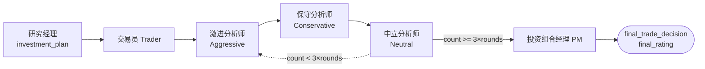

本页聚焦于 TradingAgents 决策流水线的最后一环：**交易员（Trader）如何把研究经理的投资计划翻译成可执行的交易提案**，以及**风险管理团队（三名风险辩论分析师 + 投资组合经理）如何对该提案进行对抗式评审并产出最终评级**。二者共享同一套"结构化输出 + 自由文本回退"的工程模式，并通过 LangGraph 的条件路由串联成一次有序辩论。阅读本页前，建议先了解上游的 [研究员辩论与结构化输出](16-yan-jiu-yuan-bian-lun-yu-jie-gou-hua-shu-chu) 与下游的 [智能体状态模型与数据流转](14-zhi-neng-ti-zhuang-tai-mo-xing-yu-shu-ju-liu-zhuan)。

## 团队构成与整体数据流

整个下游阶段由五个节点构成：一个**交易员**节点、三个**风险辩论分析师**节点（激进 / 保守 / 中立）和一个**投资组合经理**节点。交易员接收研究经理的 `investment_plan` 并产出 `trader_investment_plan`；三名风险分析师围绕该提案展开多轮辩论；投资组合经理作为"法官"综合辩论历史，产出 `final_trade_decision` 与 `final_rating`。

在 `GraphSetup.setup_graph` 中，各节点由对应的工厂函数创建：交易员与三名风险分析师使用 `quick_thinking_llm`（快速思考模型），而研究经理与投资组合经理使用 `deep_thinking_llm`（深度思考模型），体现了"高频对抗辩论用快模型、关键裁决用强模型"的分工。节点命名采用固定的字符串标识（如 `"Trader"`、`"Aggressive Analyst"`、`"Portfolio Manager"`），并由条件边驱动流转。

Sources: [setup.py](tradingagents/graph/setup.py#L130-L181)

## 交易员（Trader）：从研究计划到交易提案

交易员是连接"研究结论"与"风险评审"的枢纽。它的核心职责是把研究经理计划中的**方向性判断**转化为一个具体的交易动作（Buy / Hold / Sell），并给出可选的入场价、止损价与仓位建议。这是流水线中唯一直接产出"执行方向"的节点——更细的 Overweight / Underweight 仓位分级与最终裁决留待投资组合经理。

交易员的 prompt 采用一个关键的**接地（grounding）策略**：只有当市场分析师的 `market_report` 非空时，才会把技术面报告注入上下文，并附加一段要求把入场价、止损、仓位"锚定在真实价格结构（当前价、支撑阻力、ATR、波动率）上"的指令；若市场分析师未被选中，则不注入这段报告与指令，避免让模型凭空臆造价格水平。此外，系统提示明确要求入场价与止损必须是报价货币中的**绝对价格**（如 `189.5`），而非百分比或区间——因为这两个字段是数值型，写百分比会导致结构化解析失败。

Sources: [trader.py](tradingagents/agents/trader/trader.py#L23-L83)

交易员的输出由 `TraderProposal` 这一 Pydantic 模型约束。其中 `action` 是 `TraderAction` 枚举（Buy / Hold / Sell 三档），而 `entry_price`、`stop_loss` 是可选浮点、`position_sizing` 是可选字符串。为应对 LLM 的常见"畸形输出"，`entry_price` 与 `stop_loss` 注册了 `mode="before"` 的字段校验器 `_coerce_optional_float`，在验证前做归一化。

Sources: [schemas.py](tradingagents/agents/schemas.py#L146-L188)

`_coerce_optional_float` 处理了三种真实世界中常见的输入形态：一是占位符字符串（`"None"`、`"N/A"` 等）会被折算为 `None`；二是**百分比**（如 `"15%"`）会被直接丢弃为 `None`——注释特别说明，把 `"15%"` 当作 15 会在一只 600 美元的股票上设置 15 美元的止损，因此宁可让单个字段为空也不接受错误数值；三是带格式的价格（如 `"$1,234.50"`）会被剥离货币符号与千分位后转为浮点。任何无法解析为单一数字的值（如区间 `"150-160"`、模糊表述 `"around 150"`）同样被丢弃，从而让一个坏字段"置空"而不是让整个提案验证失败。

Sources: [schemas.py](tradingagents/agents/schemas.py#L33-L58)

结构化结果通过 `render_trader_proposal` 重新渲染回 markdown。渲染器会为每个字段生成带标签的行，即使字段为空也会显式写出 `not provided`——这样读者能区分"交易员选择不给出该价位"与"schema 根本没要求该字段"。最后一行固定输出 `FINAL TRANSACTION PROPOSAL: **BUY/HOLD/SELL**`，以保持对旧版向下游 grep 该停止信号的兼容性。

Sources: [schemas.py](tradingagents/agents/schemas.py#L191-L213)

## 风险管理辩论团队：三种对立视角

风险管理团队由激进、保守、中立三名分析师组成，它们围绕交易员的提案进行对抗式辩论。三者的角色定位截然不同：**激进分析师**（Aggressive）主动为高风险高回报方案辩护，强调上行空间、增长潜力与创新收益，并逐条反驳保守与中立观点；**保守分析师**（Conservative）以保护资产、降低波动为首要目标，审视提案中的高风险要素并论证低风险路径更稳妥；**中立分析师**（Neutral）提供平衡视角，同时挑战激进方的过度乐观与保守方的过度谨慎，主张兼顾增长与防波动的温和策略。

Sources: [aggressive_debator.py](tradingagents/agents/risk_mgmt/aggressive_debator.py#L32-L46) Sources: [conservative_debator.py](tradingagents/agents/risk_mgmt/conservative_debator.py#L32-L46) Sources: [neutral_debator.py](tradingagents/agents/risk_mgmt/neutral_debator.py#L32-L46)

每名分析师都遵循同一套 `def create_xxx_debator(llm)` → 闭包节点的工厂模式。节点从 `state["risk_debate_state"]` 中读取辩论历史与对手最新发言，从 `state` 中拼装上下文（工具身份、投资组合、四份分析师报告、交易员提案），调用 `llm.invoke(prompt)` 得到自由文本回应，然后把回应追加进历史并返回更新后的 `risk_debate_state`。与交易员不同，风险辩论分析师**不使用结构化输出**——它们的产出是对话式的自由文本，直接写入 `risk_debate_state` 的历史字段。

Sources: [neutral_debator.py](tradingagents/agents/risk_mgmt/neutral_debator.py#L10-L68)

两个共享的上下文辅助函数为辩论注入健壮性。`opponent_argument_or_opening` 处理"每轮首位发言者拿到空对手回应"的情况：如果对手尚未发言，就返回一句明确的"对手尚未开口，请自行开篇"标记，而不是把空字符串塞进"反驳对手"的指令里——后者会诱导模型凭空捏造对手立场（对应 #1176）。`report_or_absent` 则对缺失的分析师报告（未选中、拒绝或返回空）返回"本轮无此报告"的标记，避免把缺席伪装成空白发现而被下游填满。

Sources: [context.py](tradingagents/agents/context.py#L37-L48) Sources: [context.py](tradingagents/agents/context.py#L190-L201)

每名分析师返回的 `risk_debate_state` 都精确维护着一组字段：把自己的发言追加到全局 `history` 与各自的 `xxx_history`，更新全局 `current_xxx_response`，设置 `latest_speaker` 为自己，并把 `count` 自增 1。`latest_speaker` 是路由的关键信号，`count` 则是终止辩论的计数依据。

Sources: [aggressive_debator.py](tradingagents/agents/risk_mgmt/aggressive_debator.py#L52-L66)

## 辩论路由与回合控制

风险辩论的路由由 `ConditionalLogic.should_continue_risk_analysis` 决定，它依据两条信息：`risk_debate_state` 的 `count` 与 `latest_speaker`。当 `count >= 3 * max_risk_discuss_rounds` 时（保守、激进、中立各发言一轮算一轮，故乘 3），路由到 `"Portfolio Manager"` 结束辩论；否则依据 `latest_speaker` 的前缀依次轮转：激进 → 保守 → 中立 → （默认）激进，形成循环。默认分支返回 `"Aggressive Analyst"`，因此中立发言后回到激进。

Sources: [conditional_logic.py](tradingagents/graph/conditional_logic.py#L23-L33)

`max_risk_discuss_rounds` 的默认值为 `1`（`max_debate_rounds` 同）。它可通过环境变量 `TRADINGAGENTS_MAX_RISK_ROUNDS` 覆盖，并作为图结构指纹（graph-shape signature）的一部分写入检查点线程 ID——若续跑时改变了风险辩论轮数，会重新开始而非静默复用旧图。

Sources: [default_config.py](tradingagents/default_config.py#L121-L124) Sources: [trading_graph.py](tradingagents/graph/trading_graph.py#L169-L173)

为避免路由返回一个未映射的目标而让 LangGraph 在运行中途崩溃，三条风险边共享一份**完整的** `RISK_ANALYSIS_PATH_MAP`（含 Aggressive / Conservative / Neutral / Portfolio Manager 四个条目）。这样即便 prompt、i18n 或重构导致 `latest_speaker` 标签漂移，任何一个"落到默认值"的返回也总能命中已映射的路径（对应 #1088）。同一机制也用于研究员辩论边。

Sources: [setup.py](tradingagents/graph/setup.py#L35-L45) Sources: [setup.py](tradingagents/graph/setup.py#L160-L177)

## 投资组合经理：终审与最终评级

投资组合经理是风险辩论的"法官"，也是整条流水线最终决策的产出者。它读取 `risk_debate_state["history"]`、研究经理的 `investment_plan`、交易员的 `trader_investment_plan`，以及可选的 `past_context`（历史决策与教训）。prompt 明确给出五档评级尺度（Buy / Overweight / Hold / Underweight / Sell），并要求模型的结论必须"扎根于分析师辩论中的具体证据"——同时强调"风险辩论必然包含对立立场，判断哪一方更强正是职责所在，因此仅仅存在分歧不构成 Hold 的理由"。

Sources: [portfolio_manager.py](tradingagents/agents/managers/portfolio_manager.py#L26-L76)

最终决策由 `PortfolioDecision` 模型约束，包含 `rating`（`PortfolioRating` 五档枚举）、`executive_summary`（操作计划）、`investment_thesis`（论证）、以及可选的 `price_target` 与 `time_horizon`；`price_target` 同样走 `_coerce_optional_float` 归一化。

Sources: [schemas.py](tradingagents/agents/schemas.py#L221-L265)

评级尺度在两个"决策型"智能体间共享：`PortfolioRating`（五档，用于研究经理与投资组合经理）与 `TraderAction`（三档，仅用于交易员）。其设计意图是——交易员只回答"这一轮买 / 卖 / 持有"，而 Overweight / Underweight 这类更精细的仓位分级留到投资组合经理层面处理。

Sources: [schemas.py](tradingagents/agents/schemas.py#L66-L88)

投资组合经理使用 `invoke_structured`（而非交易员所用的 `invoke_structured_or_freetext`），因为其逻辑需要区分"拿到类型化决策"与"回退到自由文本"两条路径：若能拿到结构化的 `PortfolioDecision`，则用 `render_pm_decision` 渲染为 markdown 并直接取 `decision.rating.value` 作为 `final_rating`；否则调用 `llm.invoke(prompt)` 取自由文本，并用 `parse_rating` 从文本中启发式地读取评级。源代码注释指出：类型化评级即决策本身，渲染文本只是承载它——若直接从文本读回，论述中引用到的评级可能覆盖真实决策。

Sources: [portfolio_manager.py](tradingagents/agents/managers/portfolio_manager.py#L78-L104)

`parse_rating` 是五档评级词汇表的确定性启发式解析器。它优先匹配"独占一行并以 `Rating:` 开头的标签"（容忍 markdown 粗体与各类破折号、冒号），其次是文本中任意位置的最后一个评级标签；同时会跳过形如"Rating Scale: ..."的刻度说明行。当找不到任何可识别评级时，它返回 `REVIEW` 哨兵——这是一个**不可交易**的信号，专门用于标记"需要人工或重跑"的输出，而不是静默降级为 Hold（对应 #1170）。

Sources: [rating.py](tradingagents/agents/rating.py#L22-L106)

## 状态模型与产物落地

风险辩论的状态由 `RiskDebateState`（TypedDict）定义，字段包括三方的独立历史 `aggressive_history` / `conservative_history` / `neutral_history`、全局 `history`、`latest_speaker`、三方的 `current_xxx_response` 以及 `count`。它在图运行起始由 `Propagator.create_initial_state` 全部初始化为空字符串 / 0。

Sources: [state.py](tradingagents/agents/state.py#L20-L42) Sources: [propagation.py](tradingagents/graph/propagation.py#L47-L59)

运行结束后，`record_decision` 会调用 `_log_state` 把整套状态写入 JSON，其中包含交易员的 `trader_investment_plan`、风险辩论的三方历史与全局历史、`investment_plan`、`final_trade_decision` 以及 `final_rating`。同时，最终决策会以 `run_rating(final_state)` 作为评级标签存入记忆日志，供同一标的的下一次运行反思。

Sources: [trading_graph.py](tradingagents/graph/trading_graph.py#L336-L348) Sources: [trading_graph.py](tradingagents/graph/trading_graph.py#L415-L443)

在报告树层面，本页涉及的产物被组织为固定的目录结构：`3_trading/trader.md`（交易员计划）、`4_risk/{aggressive,conservative,neutral}.md`（三方辩论历史）、`5_portfolio/decision.md`（最终决策），并汇总进 `complete_report.md` 的第 III、IV、V 节。CLI 显示层则以"Trading Team → Trader""Portfolio Management → Portfolio Manager"的分组面板呈现同一批数据。

Sources: [reporting.py](tradingagents/reporting.py#L86-L116) Sources: [display.py](cli/display.py#L30-L53)

当 `run_rating` 返回 `REVIEW` 时，CLI 会在分析完成后明确提示"无法从最终决策中读取评级，本轮被记为待审而非持仓，建议重跑或自行阅读决策文本"——把"读不动"与"正常结果"区分开来，而不是让一次失败看起来像一次正常产出。

Sources: [run.py](cli/run.py#L375-L382)

## 健壮性设计与工程模式小结

本团队的两个工程模式——**结构化输出模式**与**防捏造上下文的模式**——共用了若干跨智能体的共享组件，下表汇总其要点与对应的问题编号：

| 组件 / 机制 | 作用 | 关键约束 / 编号 |
| --- | --- | --- |
| `bind_structured` + `invoke_structured_or_freetext` | 优先用 provider 原生结构化输出，失败时回退自由文本 | 交易员 / 研究经理用 `or_freetext` |
| `invoke_structured` | 需要区分"类型化决策"与"回退文本"两路径 | 投资组合经理专用 |
| `NO_EXTERNAL_TOOLS` | 结构化模式只绑定 schema 一个工具，显式禁止模型调用外部工具 | #1130 |
| `_coerce_optional_float` | 归一化可选数值字段（占位符 / 百分比 / 格式化价格 / 区间） | #1058、#1288 |
| `opponent_argument_or_opening` | 空对手回应替换为"尚未发言"标记，防捏造立场 | #1176 |
| `report_or_absent` | 缺失报告替换为"本轮无此报告"标记 | #1176 |
| `RISK_ANALYSIS_PATH_MAP` | 三条风险边共享完整路径表，防漂移导致运行崩溃 | #1088 |
| `parse_rating` / `RATING_REVIEW` | 无法读取评级时返回不可交易的 REVIEW 哨兵 | #1170 |

`bind_structured` 在智能体创建时尝试 `llm.with_structured_output(schema)`，若 provider 不支持（多为较旧的 Ollama 模型）则返回 `None` 并记录警告；`invoke_structured` 在调用时执行结构化请求，任何异常（弱模型产生畸形 JSON、瞬时 provider 故障、或思考模型返回空解析结果）都返回 `None`，由调用方回退到自由文本生成，从而保证流水线永不阻塞。

Sources: [structured.py](tradingagents/agents/structured.py#L31-L96)

此外，输出语言由 `get_language_instruction` 统一控制：当配置的 `output_language` 非英文时，会追加一段指令要求整篇以目标语言书写，但**保留格式所需的英文标签行**（如 `**Rating**:` 与 `FINAL TRANSACTION PROPOSAL:`）——注释解释这些被程序读取的行若被翻译，会让读者在散文中搜索，而一个被否定的评级（如"并非 Sell"）可能被误读为实际呼叫。交易员、投资组合经理与三名风险分析师均在 prompt 末尾拼接该指令。

Sources: [context.py](tradingagents/agents/context.py#L14-L34)

总结来说，交易员负责把研究计划落地为可执行的交易方向，风险管理团队以三种对立视角对其进行压力测试，投资组合经理在辩论基础上作出终审裁决并输出五档评级。三者通过 `risk_debate_state` 共享辩论上下文，通过条件路由完成轮转，并以"结构化优先、自由文本兜底、缺失显式标记"的一致模式保证稳健性。若想继续了解该评级如何进入记忆与反思闭环，可阅读 [记忆日志与决策记录](25-ji-yi-ri-zhi-yu-jue-ce-ji-lu) 与 [反思与结算：Alpha 归因](26-fan-si-yu-jie-suan-alpha-gui-yin)。