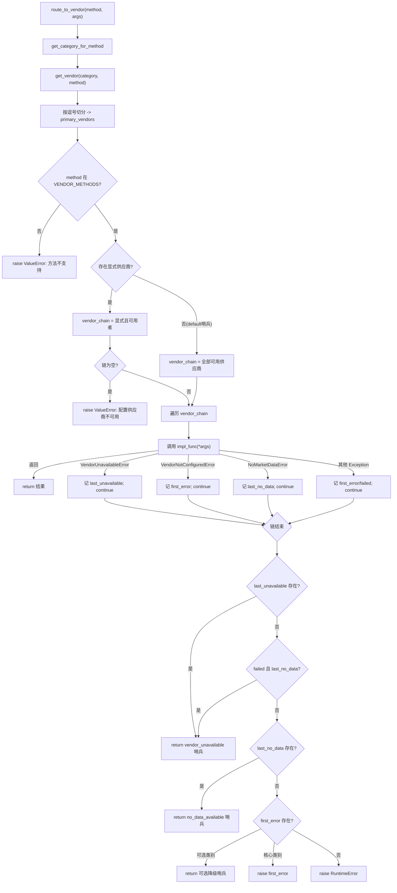

本页解析 TradingAgents 数据层的中枢——**供应商路由与回退链**。所有分析师工具最终都要透过一个统一入口 `route_to_vendor` 取数，该入口依据运行期配置决定「由哪个（或哪些）供应商」来服务某类数据请求，并在首选供应商失败时按序回退。理解这条链路是理解整个数据层行为的前提：它决定了工具调用何时返回真实数据、何时返回降级哨兵、何时抛错终止运行。

本页聚焦路由层本身的机制：方法到供应商的映射、供应商链的解析与优先级、逐级回退算法、驱动回退的错误分类学，以及终态决议语义。供应商的具体抓取实现、时点一致性守卫、符号归一化等横切关注点另见 [时点一致性与防未来函数](19-shi-dian-zhi-xing-yu-fang-wei-lai-han-shu) 与 [标的符号归一化与公司身份解析](20-biao-de-fu-hao-gui-hua-yu-gong-si-shen-fen-jie-xi)。

## 路由层总览：一个入口，六类数据

路由层的静态骨架由三张表构成，全部定义在 `router.py` 中。`TOOLS_CATEGORIES` 把工具方法归纳为六个语义类别，并为每类给出人类可读的描述；`VENDOR_METHODS` 则把每个方法映射到一个「供应商名 → 实现函数」的字典，这是回退链的数据来源。方法本身是字符串键（如 `"get_stock_data"`、`"get_balance_sheet"`），实现函数是从各 vendor 模块聚合导入的真实抓取函数（如 `get_alpha_vantage_stock`、`get_YFin_data_online`）。

Sources: [router.py](tradingagents/dataflows/router.py#L45-L149)

| 类别 | 描述 | 工具方法 | 可用供应商（映射键序） |
|---|---|---|---|
| `core_stock_apis` | OHLCV 价格数据 | `get_stock_data` | alpha_vantage, yfinance |
| `technical_indicators` | 技术分析指标 | `get_indicators` | alpha_vantage, yfinance |
| `fundamental_data` | 公司基本面 | `get_fundamentals`, `get_balance_sheet`, `get_cashflow`, `get_income_statement` | alpha_vantage, sec_edgar, yfinance |
| `news_data` | 新闻与内部人交易 | `get_news`, `get_global_news`, `get_insider_transactions` | alpha_vantage, yfinance |
| `macro_data` | 宏观经济指标 | `get_macro_indicators` | fred |
| `prediction_markets` | 预测市场隐含概率 | `get_prediction_markets` | polymarket |

上表中「映射键序」是 `VENDOR_METHODS[method]` 字典的插入顺序。注意 `get_global_news` 的键序是 `yfinance` 在前、`alpha_vantage` 在后，与其它多数方法相反——因此在「`default` 哨兵使用全部供应商」的场景下，全局新闻默认先走 yfinance。此外 `macro_data` 与 `prediction_markets` 是**单一供应商类别**：FRED 与 Polymarket 各自是唯一实现，本身不构成多供应商回退链。

Sources: [router.py](tradingagents/dataflows/router.py#L97-L149)

类别还被进一步划分为**核心类别**与**可选增强类别**。`OPTIONAL_CATEGORIES` 包含 `macro_data` 与 `prediction_markets`，其设计意图是：这些数据为新闻分析师提供宏观/事件上下文，但并非决策核心，因此供应商失败时应降级为哨兵而非中止运行；而核心类别（价格、基本面、新闻）的失败必须「响亮」地暴露出来，因为它们承载了决策所依赖的一手数据。

Sources: [router.py](tradingagents/dataflows/router.py#L89-L94)

## 供应商链的解析：get_vendor 与配置优先级

被调用的方法经由 `get_category_for_method` 反查其所属类别，再由 `get_vendor` 决定该用什么供应商。`get_vendor` 实现了**两级优先级**：先查 `config["tool_vendors"]` 中是否有针对该具体方法的覆盖（方法级配置），若命中则直接返回；否则退回 `config["data_vendors"]` 中该类别级的配置，类别未配置时返回字符串哨兵 `"default"`。这使得用户既能按整个类别统一指定供应商，也能对个别工具做精细化覆盖。

Sources: [router.py](tradingagents/dataflows/router.py#L152-L173)

配置的默认值定义在 `default_config.py`。默认情形下价格与技术指标走 `yfinance`，基本面声明走 `sec_edgar,yfinance`（SEC EDGAR 提供按申报日归档的报表，Yahoo 兜底），新闻走 `yfinance`，宏观走 `fred`，预测市场走 `polymarket`。`tool_vendors` 默认为空字典，留给用户做方法级覆盖。

Sources: [default_config.py](tradingagents/default_config.py#L142-L160)

配置的写入遵循「嵌套字典一层深合并」的语义：`set_config` 与 `run_config` 都会把 `data_vendors`、`tool_vendors` 这类字典值与原值做一层深度的 `update`，而标量键整体替换。因此传入 `{"data_vendors": {"core_stock_apis": "alpha_vantage"}}` 时，其余类别（如 `technical_indicators`）仍保留默认值，不会被清空。

Sources: [config.py](tradingagents/dataflows/config.py#L23-L41)

## 回退算法：route_to_vendor 的逐级尝试

`route_to_vendor(method, *args, **kwargs)` 是整个数据层的收口点，其算法可分为三个阶段：**解析链 → 逐级尝试 → 终态决议**。

首先它把 `get_vendor` 返回的配置字符串按逗号切分（`"yfinance,alpha_vantage"` → 有序列表），得到 `primary_vendors`。随后区分显式配置与 `default` 哨兵：配置里剔除空串与 `"default"` 后若仍有显式供应商，则 `vendor_chain` 就是这些显式供应商中、对该方法确实可用者的子集；若一个都不匹配，抛 `ValueError` 并在消息里列出该方法可用供应商。若没有任何显式配置（即 `default`），则使用该方法在 `VENDOR_METHODS` 中登记的**全部**可用供应商。

Sources: [router.py](tradingagents/dataflows/router.py#L200-L225)

这里有一条关键的设计约束：**配置的供应商列表就是回退链本身，路由不会静默回退到用户未选择的供应商**。代码注释明确指出这是为了修复 #988/#289 —— 未经用户选择的供应商返回数据会造成跨供应商不一致。若用户希望多供应商按序回退，必须显式写出顺序，例如 `data_vendors="yfinance,alpha_vantage"`。这一约束在测试 `test_explicit_single_vendor_does_not_fall_back` 中被固化：当只配置 `yfinance` 且它返回无数据时，未被选中的 `alpha_vantage` 实现根本不会被调用。

Sources: [router.py](tradingagents/dataflows/router.py#L211-L225), [test_vendor_routing.py](tests/test_vendor_routing.py#L58-L72)

进入逐级尝试后，路由按 `vendor_chain` 的顺序对每个供应商依次调用其实现函数并 `return` 首个成功结果。实现函数既可能是单函数，也可能是「元组/列表」形式——后者取第一个元素作为可调用对象（`impl_func = vendor_impl[0] if isinstance(vendor_impl, list) else vendor_impl`），为将来在同一方法下挂载额外元数据预留了结构。

Sources: [router.py](tradingagents/dataflows/router.py#L231-L236)

每个供应商的出参、返回值与异常会按类型分派到四条不同的继续路径：`VendorUnavailableError` 记入 `last_unavailable`；`VendorNotConfiguredError` 记入 `first_error`（首个）；`NoMarketDataError` 记入 `last_no_data`；其余未分类异常记入 `first_error` 与 `failed`。无论哪种，循环都 `continue` 到下一个供应商，且每次失败都会写一条 `WARNING` 日志——一个损坏的首选供应商必须可见（#989），不能被兜底结果掩盖。

Sources: [router.py](tradingagents/dataflows/router.py#L227-L259)

下面的流程图刻画了 `route_to_vendor` 的完整决策路径：

## 错误分类学：按行为而非供应商分派

回退算法之所以能对任意供应商使用同一套 `except` 子句，是因为数据层定义了一套**以行为为纲**的错误层级。所有「供应商无法返回可用数据」的情形都派生自基类 `VendorError`，而路由只捕获基类。新增供应商只需抛出这些类型（或一个薄薄的、以供应商命名的子类），无需改动路由的 `except` 子句。

Sources: [errors.py](tradingagents/dataflows/errors.py#L1-L22)

层级分为三类，其数目等于路由的**不同反应数**，而非人类可描述的原因数：

- `NoMarketDataError`——供应商返回了无可用行（空结果或数据陈旧）。它同时携带用户请求的 `symbol`、实际查询用的规范符号 `canonical` 及自由文本 `detail`，使调用方能构造清晰消息，而不是向数据通道里塞一个供应商特有的空字符串。
- `VendorUnavailableError`——供应商被限流或请求失败。它「对标的只字未提」，路由据此跳到下一个供应商。
- `VendorNotConfiguredError`——供应商被选中但缺少 API key/配置。它**同时继承 `ValueError`**，以便既有捕获 `ValueError` 的调用方继续工作，同时路由层又能把它当作「供应商不可用」处理。

Sources: [errors.py](tradingagents/dataflows/errors.py#L25-L58)

空数据与陈旧数据之所以共享 `NoMarketDataError`，是因为它们触发**完全相同**的举动（回退到下一供应商），只在 `detail` 文本上区分。这种「类型数目 = 反应种类数」的收敛，是路由无需针对具体供应商写分支的根本原因。

Sources: [errors.py](tradingagents/dataflows/errors.py#L13-L15)

供应商侧则以**薄子类**的方式接入这套层级，从而既可复用路由逻辑、又能保留供应商语义。Alpha Vantage 定义了 `AlphaVantageNotConfiguredError`（继承 `VendorNotConfiguredError`，仍是 `ValueError`）与 `AlphaVantageRateLimitError`（继承 `VendorUnavailableError`）；FRED 定义了 `FredNotConfiguredError`。`AlphaVantageRateLimitError` 被基类 `VendorUnavailableError` 捕获，因此路由会跳到链中下一个供应商——这一行为由 `test_rate_limit_subclass_caught_by_base` 验证。

Sources: [alpha_vantage/common.py](tradingagents/dataflows/vendors/alpha_vantage/common.py#L18-L25), [alpha_vantage/common.py](tradingagents/dataflows/vendors/alpha_vantage/common.py#L65-L67), [fred.py](tradingagents/dataflows/vendors/fred.py#L82-L99), [test_vendor_errors.py](tests/test_vendor_errors.py#L38-L67)

## 终态决议：不可用、无数据与抛错

当回退链耗尽后，路由依据尝试期间记录的状态做终态决议，其优先级顺序本身编码了重要的语义区分。**第一优先是「供应商不可用」**：只要 `last_unavailable` 非空（即有供应商被限流/无法连通），就返回 `vendor_unavailable(method, error)` 哨兵。原因是——一个被限流或请求失败的供应商**从未告诉我们它是否有该标的**，因此其它供应商的「无数据」不能代表整条链的结论；此时应把问题归因于供应商，而非标的。同理，当某个供应商抛出未分类异常（`failed`）而链中另有供应商报「无数据」时，也返回不可用哨兵。

Sources: [router.py](tradingagents/dataflows/router.py#L261-L268)

**第二优先是「无数据」**：仅当所有答复过的供应商都一致报「无数据」时，才返回 `no_data_available(error)` 哨兵，代表标的确实不可得。若此时还叠加了某个供应商的真实错误（`first_error`），路由会额外写一条 `WARNING`，以防「无数据」的结论掩盖了一个损坏的首选供应商。

Sources: [router.py](tradingagents/dataflows/router.py#L270-L282)

**第三优先是抛错或可选降级**：若没有任何供应商返回数据、也没有干净的「无数据」结论，则看 `first_error`——对可选类别（`macro_data`、`prediction_markets`）返回降级哨兵，让分析在不含该风味数据的情况下继续；对核心类别则直接 `raise first_error`，让损坏的首选供应商「响亮」地失败。这一分支由 `test_optional_category_degrades_instead_of_raising` 与 `test_core_category_still_raises_on_error` 分别固化。

Sources: [router.py](tradingagents/dataflows/router.py#L284-L295), [test_vendor_routing.py](tests/test_vendor_routing.py#L103-L120)

三个哨兵构造器把内部状态翻译成面向 LLM 的**指令性文本**。`vendor_unavailable` 的措辞强调「这与标的相关性无关，请将其报告为不可用，不要估算或编造数值」；`no_data_available` 则额外拼上规范符号与 `detail`，并列出可能原因（无效、退市、未被覆盖或数据陈旧），同样禁止编造。注意 `no_data_available` 只在规范符号与请求符号不同时才渲染「resolved to」片段。

Sources: [router.py](tradingagents/dataflows/router.py#L176-L197)

这三种终态在语义上泾渭分明，可用下表概括其「说了什么」与「没说什么」：

| 终态 | 触发条件 | 对标的的断言 | 对运行的后果 |
|---|---|---|---|
| `vendor_unavailable` 哨兵 | 有供应商限流/失败 | 无（供应商才是问题） | 继续运行 |
| `no_data_available` 哨兵 | 所有答复者一致无数据 | 标的不可得 | 继续运行 |
| 可选降级哨兵 | 可选类别 + 首个错误 | 无 | 继续运行 |
| `raise first_error` | 核心类别 + 首个错误 | 无 | 中止该工具调用 |

## 运行期配置作用域：ContextVar 承载的供应商选择

供应商选择是配置的一部分，而配置的作用域管理直接决定了「当一个进程内并发运行多个图时，每个图读到谁的供应商」。`dataflows/config.py` 用一个进程级 `_config` 加上一个 `ContextVar` 类型的 `_run_config` 来解决这一问题：`_run_config` 承载**当前进行中的那次运行**的配置，图在运行期间绑定自己的这一份，于是即使多个图共享进程，数据工具读到的也是各自图的供应商。

Sources: [config.py](tradingagents/dataflows/config.py#L8-L13)

`get_config` 的读取顺序是：先取 `_run_config` 的当前值，非空则返回其深拷贝（运行期作用域优先）；否则回落到进程级 `_config`（并确保其已初始化）。`run_config` 是一个上下文管理器，进入时把「默认配置与传入配置一层合并」的结果写入 ContextVar，退出时 `reset` 令牌还原；`run_config_context` 则返回一个 `Context` 对象，供「运行步骤之间会让出控制权」的场景使用，避免 `run_config` 块在持有结果时仍占据调用方上下文。

Sources: [config.py](tradingagents/dataflows/config.py#L44-L72)

图在执行时显式绑定这份作用域。`propagate` 用 `with run_config(self.config), ...` 包裹整次运行；`settle_pending`（结算）与 `stream_run`（流式）也各自绑定本图配置——后者尤其依赖 LangGraph 会把调用方上下文带入工具调用的特性，因此每个步骤都在本图上下文中执行，调用方在步骤之间保留自己的上下文。

Sources: [trading_graph.py](tradingagents/graph/trading_graph.py#L200-L205), [trading_graph.py](tradingagents/graph/trading_graph.py#L333-L334), [trading_graph.py](tradingagents/graph/trading_graph.py#L399-L400)

这一作用域的动机在测试中被明确记录：`set_config` 会合并，构建图 A 时写入的供应商会「泄漏」给随后用默认配置构建的图 B；只有把配置**绑定在运行开始时**，才能保证早先构建的图 A 仍以自己的配置运行，且两个并发运行各读自己的 `get_vendor` 结果。`test_tools_inside_a_langgraph_run_see_the_run_config` 进一步验证了 LangGraph 确实把调用方上下文带入了工具调用。

Sources: [test_dataflows_config.py](tests/test_dataflows_config.py#L89-L192)

## 供应商契约与错误信号

所有被路由的供应商实现共享一条**隐性契约**：函数签名与路由传入的参数一一对应（如 `get_stock_data(symbol, start, end)`），成功时返回可直接注入提示词/报告的字符串；失败时抛出上文的类型化错误而非返回散文。是否遵循这一契约，决定了回退链能否正确工作。Yahoo 的实现把「空结果」与「传输失败」严格区分：`raise_for_empty` 会先探测主机是否可达——不可达则抛 `VendorUnavailableError`，可达才抛 `NoMarketDataError`；`yf_retry` 对 429 指数退避重试，耗尽后统一抛 `VendorUnavailableError`。

Sources: [yahoo/common.py](tradingagents/dataflows/vendors/yahoo/common.py#L17-L76)

Alpha Vantage 的 `_make_api_request` 则把响应体中的 `Information`/`Note` 通知**分类**为限流或密钥问题：先匹配限流措辞（因为限流通知也会提到「API key」），命中则抛 `AlphaVantageRateLimitError`；再匹配密钥措辞，抛 `AlphaVantageNotConfiguredError`——把无效密钥当作真实配置错误，而非被误标为可重试的限流（#991）。

Sources: [alpha_vantage/common.py](tradingagents/dataflows/vendors/alpha_vantage/common.py#L103-L122)

一个微妙但关键的契约细节：**路由把「返回 prose」视为成功**。因此供应商若无法计算某指标，绝不能返回一段「不支持」的提示文本——那会让链停在该供应商而错过下一个能算的供应商。Alpha Vantage 的指标实现因此在遇到它不具备的指标（如 `vwma`、`mfi`）时**抛出** `VendorError`，让链继续走到 yfinance，见 `test_an_indicator_this_vendor_lacks_lets_the_next_one_serves_it`。

Sources: [test_alpha_vantage_hardening.py](tests/test_alpha_vantage_hardening.py#L170-L179)

SEC EDGAR 供应商展示了核心类别中「无数据」与「不可用」的典型划分：请求失败或无响应时抛 `VendorUnavailableError`；而标的不是美国申报主体、无 us-gaap 事实、或截至分析日无该频率报表时，抛 `NoMarketDataError`——后者使路由在 `fundamental_data="sec_edgar,yfinance"` 的默认链上正确回退到 Yahoo。

Sources: [sec_edgar.py](tradingagents/dataflows/vendors/sec_edgar.py#L107-L119), [sec_edgar.py](tradingagents/dataflows/vendors/sec_edgar.py#L190-L218)

## 未纳入路由的供应商与配置呈现

并非所有数据源都走 `route_to_vendor`。Reddit 与 StockTwits 这两个社交供应商由情绪分析师**直接调用**，各自实现内部回退，而不进入供应商链：Reddit 在遇到 429 时依据 `Retry-After` 退避一次再重试，且严格区分「抓取失败」返回 `None` 与「查询成功但无匹配」返回 `[]`；StockTwits 在端点不可达时返回 `<stocktwits unavailable: ...>` 占位符。它们是本页所述「回退」概念在链外的另一种形态，详细分析见 [分析师团队：基本面、市场、新闻与情绪](15-fen-xi-shi-tuan-dui-ji-ben-mian-shi-chang-xin-wen-yu-qing-xu)。

Sources: [reddit.py](tradingagents/dataflows/vendors/reddit.py#L171-L212), [stocktwits.py](tradingagents/dataflows/vendors/stocktwits.py#L74-L106)

最后，供应商选择的最终结果会被写入运行报告。`run_settings` 以白名单方式记录 `data_vendors` 与 `tool_vendors`（端点、密钥、本地路径一律不记录），`reporting.py` 的 `_header` 再把二者合并后渲染成报告头部的「Data vendors」一行，使每次运行产出都自带「这份报告用了哪些供应商」的可追溯信息。

Sources: [trading_graph.py](tradingagents/graph/trading_graph.py#L270-L288), [reporting.py](tradingagents/reporting.py#L13-L29)

## 小结与建议阅读路径

路由层可凝练为一条决策主线：**方法 → 类别 → 配置的供应商链（显式即链，`default` 即全部）→ 逐级尝试并分类异常 → 依据「不可用 / 无数据 / 抛错」三态做终态决议**。贯穿其中的两条设计原则——「配置即链，绝不静默兜底」与「类型数目等于反应种类数」——使这套机制既对用户可预测，又能让任何新供应商零成本接入。

若想继续深入数据层，建议顺序阅读：[时点一致性与防未来函数](19-shi-dian-zhi-xing-yu-fang-wei-lai-han-shu)（路由之下的日期钳制与覆盖率守卫）、[标的符号归一化与公司身份解析](20-biao-de-fu-hao-gui-hua-yu-gong-si-shen-fen-jie-xi)（供应商查询前如何解析规范符号）、以及 [确定性市场快照与数值校验](21-que-ding-xing-shi-chang-kuai-zhao-yu-shu-zhi-xiao-yan)（在链之上提供确定性事实源）。配置体系的全貌可参见 [配置系统与环境变量覆盖](29-pei-zhi-xi-tong-yu-huan-jing-bian-liang-fu-gai)。