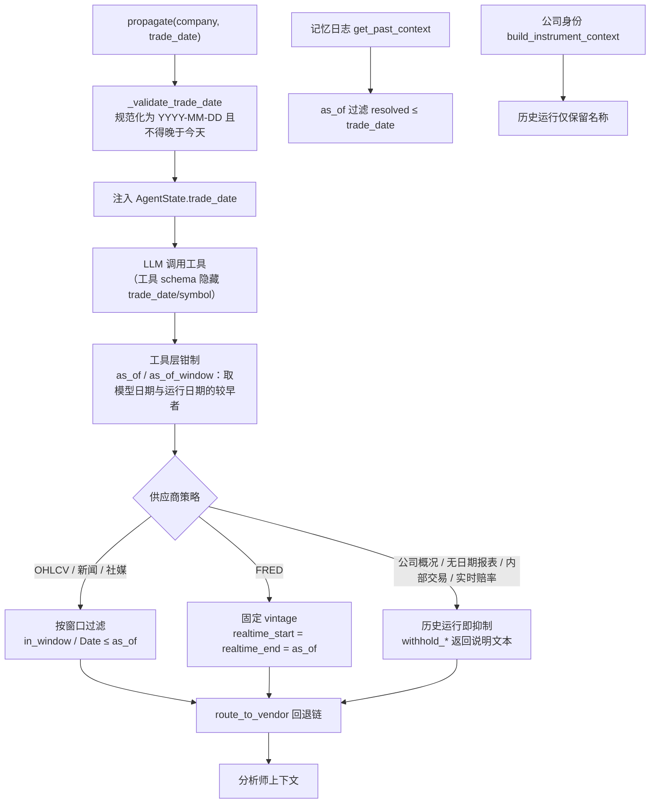

本页深入解析 TradingAgents 的**时点一致性（point-in-time, PIT）纪律**：系统如何保证任何一次分析所消费的数据，只反映运行日期（`trade_date`）当天及之前**已经可知**的信息。这一纪律贯穿四个层次——图入口的日期校验、工具层的日期钳制、供应商层的数据过滤与 vintage 固定，以及记忆日志与公司身份解析的时点安全——并共享同一组原语（`tradingagents/dataflows/date_window.py`）。本页只讨论"防未来函数"这条横切关注点；数据供应商的选路与回退链属于 [数据供应商路由与回退链](18-shu-ju-gong-ying-shang-lu-you-yu-hui-tui-lian)，确定性数值校验属于 [确定性市场快照与数值校验](21-que-ding-xing-shi-chang-kuai-zhao-yu-shu-zhi-xiao-yan)。

## 未来函数的威胁模型

在回测或历史分析中，"未来函数"指任何把运行日期之后才出现的信息泄漏进决策上下文的行为。本系统面对的泄漏源可归为两类。**第一类是模型越权传参**：一个日期感知的工具（如 `get_fundamentals(curr_date, ...)`）若信任模型给出的日期，模型只要省略日期或传入"今天"，就会绕过工具背后所有的时点防线，让分析读到现在才存在的数据。**第二类是供应商数据本身缺少历史时点**：yfinance 的 `Ticker.info`、Alpha Vantage 的 `OVERVIEW` 只提供当下快照，连公司名、行业分类都随今日而变；FRED 默认返回每条观测的**最新修订值**；Yahoo/StockTwits/Reddit 的信息流只供应最近条目。这些端点在语义上无法回答"某个历史日期当时的取值"。

文档化的两条核心不变式由此确立：**运行日期是最早也是最终的上界**（`trade_date` 之后的数据永不进入），且**无法证明在时点上可知的数据宁可抑制、也不假设其成立**。前者由 `date_window.as_of` / `as_of_window` 强制，后者由一组 `withhold_*` 守卫与 `coverage_gap` 表达。

Sources: [date_window.py](tradingagents/dataflows/date_window.py#L1-L11), [fundamentals.py](tradingagents/dataflows/vendors/alpha_vantage/fundamentals.py#L5-L29), [fred.py](tradingagents/dataflows/vendors/fred.py#L156-L193)

## 分层防御体系总览

防未来函数不是一个单点检查，而是一条**纵深防御链**：即使某一层被绕过，下一层仍会拦截。下面的流程图展示了从运行发起、工具调用到供应商取数的完整路径，以及每一层的职责。

理解这张图的关键前提是：**工具是模型与供应商之间唯一的闸门**（`tradingagents/agents/tools.py`），而闸门的开关参数 `trade_date` 通过 LangGraph 的 `InjectedState` 从图状态注入，**不出现在模型可见的 schema 中**。因此模型无从伪造运行日期，只能收窄（请求更早的日期），不能放宽。测试 `test_tool_date_enforcement.py` 与 `test_undated_tools_as_of.py` 正是校验了这一属性。

Sources: [tools.py](tradingagents/agents/tools.py#L1-L5), [trading_graph.py](tradingagents/graph/trading_graph.py#L30-L41), [test_tool_date_enforcement.py](tests/test_tool_date_enforcement.py#L1-L7)

## 第一道防线：运行日期校验与状态注入

防线从图入口开始。`TradingAgentsGraph.propagate` 在进入 `_run_graph` 前调用 `_validate_trade_date`，它做两件事：把日期规范化并校验为严格 `YYYY-MM-DD` 格式（拒绝 `2026-9-10`、`2026-09-10 00:00`、`Sept 10` 等非规范值），以及拒绝晚于今天的**未来日期**。任何违规都会在分析开始前抛 `ValueError`，避免图在错误时点上运行。

通过校验后，`trade_date` 经 `Propagator.create_initial_state` 注入状态，并作为 `AgentState.trade_date` 字段（注解为"The analysis date; data is served as of it"）随图流转。与此同时，`create_run_state` 用 `_memory_as_of` 计算记忆日志的时间截点，并把身份上下文一并写入。`_memory_as_of` 的语义是：**历史运行返回交易日期本身（启用过滤），当日运行返回 `None`（关闭过滤）**，从而在不影响实时行为的前提下只约束回测。

Tools 层对应的隐私保护由 `InjectedState` 实现：`trade_date` 从状态注入，`symbol`/`ticker` 同样从 `company_of_interest` 注入，两者都被排除在 `tool_call_schema` 之外。这既阻断了模型对日期的越权，也顺带防止了模型把指标名误当作代码传入（"rsi"、"atr" 是真实存在的 ticker）。

Sources: [trading_graph.py](tradingagents/graph/trading_graph.py#L30-L41), [trading_graph.py](tradingagents/graph/trading_graph.py#L147-L155), [propagation.py](tradingagents/graph/propagation.py#L30-L37), [state.py](tradingagents/agents/state.py#L45-L50), [test_tool_date_enforcement.py](tests/test_tool_date_enforcement.py#L65-L85)

## 第二道防线：工具层的日期钳制原语

工具层用两个纯函数把模型请求"钳制"到运行日期，二者都实现**取较早日期**的语义。`as_of(requested, trade_date)` 返回两者中较早者：模型请求晚于运行日期则截断为运行日期，早于则按其请求收窄（允许，因为更早的数据仍在时点之内）；请求缺失或无法解析也回退为运行日期。`as_of_window(start_date, end_date, trade_date)` 处理区间：只把 `end` 钳到运行日期；若整个窗口都晚于运行日期，则**保留原窗口长度并整体前移**到以运行日期结尾，而不是压缩为空区间。

一个易被忽视的细节是"直通"约定：当 `trade_date` 为空字符串时（在图层之外直接调用工具），`as_of` 原样返回请求值。这正是测试 `test_direct_call_without_state_is_unchanged` 所守护的行为，使工具在无图状态下仍可被独立调用。

下表汇总了各日期感知工具与其钳制原语的对应关系，可见所有涉时工具都被覆盖，无遗漏。

| 工具 | 钳制原语 | 参数来源 |
|---|---|---|
| `get_stock_data(start_date, end_date)` | `as_of_window` | end 钳到运行日期 |
| `get_indicators(curr_date, ...)` | `as_of` | curr_date 钳到运行日期 |
| `get_fundamentals(curr_date)` | `as_of` | 同上 |
| `get_balance_sheet / get_cashflow / get_income_statement(curr_date)` | `as_of` | 缺省日期回退为运行日期 |
| `get_news(start_date, end_date)` | `as_of_window` | end 钳到运行日期 |
| `get_global_news(curr_date)` | `as_of` | curr_date 钳到运行日期 |
| `get_macro_indicators(curr_date, ...)` | `as_of` | curr_date 钳到运行日期 |
| `get_verified_market_snapshot(curr_date, ...)` | `as_of` | curr_date 钳到运行日期 |
| `get_insider_transactions()` | 无模型日期 | 直接注入 `trade_date` |
| `get_prediction_markets(topic, ...)` | 无模型日期 | 直接注入 `trade_date` |

其中 `get_insider_transactions` 与 `get_prediction_markets` 根本不接受模型日期，而是把注入的 `trade_date` 直接交给供应商作为 `as_of_date`。这体现了"缺省即最安全"的设计：能不给模型日期就不给。

Sources: [date_window.py](tradingagents/dataflows/date_window.py#L78-L101), [tools.py](tradingagents/agents/tools.py#L34-L35), [tools.py](tradingagents/agents/tools.py#L212-L223), [tools.py](tradingagents/agents/tools.py#L258-L282), [test_tool_date_enforcement.py](tests/test_tool_date_enforcement.py#L24-L48)

## 时间窗语义：半开区间、UTC 归一化与无日期条目

处理带时间戳条目（新闻、StockTwits、Reddit）时，统一的过滤函数是 `in_window(pub_dt, start_dt, end_dt)`，它定义为**半开区间 `[start, end + 1 天)`**。这里的"半天"边界极其关键：上界取 `end` 之后次日零点、且**不包含**该时刻，因此一篇恰好落在 `end_date` 次日零点发布的文章不会被误纳入；而 `end_date` 当天 23:59:59 的文章仍被保留。这是对 #1126 的修复——旧实现用闭区间，导致"次日零点"文章泄漏。

函数内部先经 `to_utc` 归一化：带偏移量的时间戳被**转换为 UTC 而非截断时区**，因此 `2025-05-10T01:00+05:00` 被正确理解为 `2025-05-09T20:00Z`、落在窗口内，而不是被旧逻辑误读为 05-10 而丢弃。对**无日期条目**（`pub_dt is None`），规则取决于窗口是否触及"现在"：只有窗口上界不早于昨天（即覆盖到当下）时才保留，因为回测无法证明一个无日期条目不是来自未来（#1126、#1220）。这条规则同时防住了两类漏洞——#992 中"扁平结构文章缺 `pub_date` 因而绕过过滤"，与 #1007 中"全局新闻注入未来文章"。

Sources: [date_window.py](tradingagents/dataflows/date_window.py#L18-L31), [news.py](tradingagents/dataflows/vendors/yahoo/news.py#L40-L57), [test_news_lookahead.py](tests/test_news_lookahead.py#L35-L71), [test_social_lookahead.py](tests/test_social_lookahead.py#L37-L54)

## 第三道防线：供应商层的三种时点策略

当请求抵达供应商时，每个端点按其数据性质选择三种策略之一。理解三者的划分依据——**该端点能否在时点上作答**——是理解本系统的关键。

**策略一：按窗口过滤。** 适用于条目自带可信时间戳、且供应商能返回指定区间数据的场景。OHLCV 走这条路径，在 `load_ohlcv` 中执行 `data[data["Date"] <= as_of_dt]` 截断，回测永不看到未来价格。新闻与社媒同样按 `in_window` 过滤。

**策略二：固定 vintage。** 仅 FRED 需要：宏观序列会被反复修订，因此 `get_macro_data` 把 `realtime_start` 与 `realtime_end` 都钉在 `as_of_date`，向 FRED 索取"当时已知的取值"而非最新修订值（#1275）。这里有个精细的钳制——`pit = min(as_of_date, _fred_today())`，因为 FRED 的实时时钟走美中部时间，实时日期落在其自身"未来"会返回 400，故钉住值需按芝加哥日期收敛，否则路由层会静默丢弃宏观数据。

**策略三：历史即抑制。** 适用于**语义上无法回答时点问题**的端点：实时公司概况、无填报日期的报表与内部交易、实时预测赔率。这些端点一律通过 `withhold_*` 返回一段解释文本而非数据，且**在发起网络请求之前**就短路（既避免泄漏，也避免浪费配额）。SEC EDGAR 是这一策略的重要例外——它给每笔事实标注了填报日期，因此 US 报送人可被"按填报时点"服务（见下节）。

下表对比各供应商的策略归属：

| 供应商 / 端点 | 策略 | 关键实现 |
|---|---|---|
| Yahoo OHLCV (`load_ohlcv`) | 过滤 | `Date ≤ as_of_dt` (#1021) |
| Yahoo `get_YFin_data_online` | 过滤 | 区间取数 + 陈旧守卫 |
| Yahoo 新闻 / 全局新闻 | 过滤 | `in_window` + `coverage_gap` |
| Yahoo / Alpha Vantage 公司概况 | 抑制 | `withhold_live_profile` (#1300) |
| Yahoo / Alpha Vantage 报表 | 抑制 | `withhold_undated_statements` |
| Yahoo / Alpha Vantage 内部交易 | 抑制 | `withhold_undisclosed_trades` |
| SEC EDGAR 报表 | 按时点服务 | 过滤 `fact["filed"] > as_of_date` |
| FRED 宏观 | 固定 vintage | `realtime_start/end = as_of` (#1275) |
| StockTwits / Reddit | 过滤 | `_within_window` → `in_window` (#1220) |
| Polymarket 赔率 | 抑制 | `is_historical` 即不取数 |

Sources: [ohlcv.py](tradingagents/dataflows/vendors/yahoo/ohlcv.py#L161-L171), [fundamentals.py](tradingagents/dataflows/vendors/yahoo/fundamentals.py#L20-L40), [fundamentals.py](tradingagents/dataflows/vendors/alpha_vantage/fundamentals.py#L32-L53), [fred.py](tradingagents/dataflows/vendors/fred.py#L184-L193), [sec_edgar.py](tradingagents/dataflows/vendors/sec_edgar.py#L1-L16), [news.py](tradingagents/dataflows/vendors/alpha_vantage/news.py#L73-L89)

### 抑制守卫的三条统一规则与文本契约

三个 `withhold_*` 守卫共享同一判据 `is_historical(as_of_date)`（运行日期早于今天），因而**同一泄漏规则在所有基本信息供应商间保持一致**——切换 `data_vendors["fundamental_data"]` 无法重新引入泄漏，这是 #1300 的核心设计目标。`withhold_live_profile` 抑制的是无语义时点可言的概况（市值、估值倍数、52 周区间、TTM 收入随今日报价变动，连名称/行业也随重命名与重分类而变）；`withhold_undated_statements` 抑制的是"以报告期而非填报日标注"的报表（公司在期末后数周才报送，报表日期落在该间隙的运行会读到当时尚未公开的数字）；`withhold_undisclosed_trades` 抑制的是"以成交日而非申报日标注"的内部交易（Form 4 可在成交后最多两个工作日才申报）。

三者返回的文本不是空白，而是**自解释的说明**：包含 `# Point-in-time as of: <date>` 头部、说明数据为何缺失、并指引 US 报送人改用 SEC EDGAR。这一契约对下游分析师至关重要——若缺口表现为空白，模型会把"数据缺失"误读为"该日为空的真实信号"，甚至围绕其编造内容。测试断言抑制文本含 `withheld`、日期且不含泄漏值（如 `3500000000000`、`Apple Inc.`、`Technology`）。

Sources: [date_window.py](tradingagents/dataflows/date_window.py#L104-L166), [test_fundamentals_lookahead.py](tests/test_fundamentals_lookahead.py#L1-L109), [test_statement_knowledge_time.py](tests/test_statement_knowledge_time.py#L23-L78)

### SEC EDGAR：按时点服务而非抑制

EDGAR 证明"按时点服务"是可能的：其 facts 的每一笔都带 `filed` 字段。`_as_of` 过滤 `fact["filed"] > as_of_date`，并让同一报告期**取该日期或之前的最新申报**，因此修订（如分割、重述、合并）从填报当日起生效。这带来一个违反直觉但正确的结果——苹果 2008 年总资产在 2010 年修正案之前读作 39.6B、之后读作 36.2B，运行时点不同即得到不同、却都真实的数值。此外 `_SPANS` 与 `_YEAR_TO_DATE` 校验覆盖期长度，避免把"半年累计"误报为"季度"；`_ANNUAL_FORMS` 确保年报取 10-K/20-F/40-F；四季报从不通过"三季相减"推导，因为那会造出一份不存在申报支撑的数字。

因此，当 `fundamental_data` 默认配置为 `sec_edgar,yfinance`（见测试 `test_statements_come_from_sec_edgar_first_by_default`）时，US 报送人的报表在历史运行中得到真实的分时点数据，而非抑制文本；非 US 标的落入 EDGAR 的 ticker 映射之外，才回退到会抑制的供应商。

Sources: [sec_edgar.py](tradingagents/dataflows/vendors/sec_edgar.py#L153-L237), [sec_edgar.py](tradingagents/dataflows/vendors/sec_edgar.py#L75-L89), [test_statement_knowledge_time.py](tests/test_statement_knowledge_time.py#L52-L60)

## 覆盖度与缺失：`coverage_gap` 区分"无法回答"与"确无数据"

一个微妙的时点陷阱是：**把"供应商够不到该窗口"误报为"该窗口无事发生"**。Yahoo 新闻只供应最近条目，Reddit/StockTwits 的信息流同样只覆盖近一周；对一个久远的历史窗口，它们返回空并不能证明当时没有新闻或讨论——那是一个从未被观测的区间，把它当作"沉默"会给分析师一个虚假信号。`coverage_gap(dates, start_date, end_date, source, subject)` 正是为此设计的：它根据返回条目的时间戳（以及固定回看窗口的起始）判断信息流的覆盖是否触及窗口首日且窗口结束于今天之前；若不满足，返回 `<source unavailable ...: so this is not an absence of ...>` 的说明，否则返回 `None` 表示这是真实缺失（如 "No news found"）。

一个精细判断体现在 Reddit/新闻对"固定回看"的处理上：由于搜索限定近一周，即使返回为空，也要把 `now - 7 天` 作为覆盖下界参与判断；而全局新闻合并了多个模糊搜索，单个陈旧命中的时间戳并不能证明区间连续覆盖，因此传入空元组、仅以"现在"为界。所有这些边界都由 `test_coverage_gap_boundaries` 参数化校验。

Sources: [date_window.py](tradingagents/dataflows/date_window.py#L44-L68), [news.py](tradingagents/dataflows/vendors/yahoo/news.py#L105-L112), [reddit.py](tradingagents/dataflows/vendors/reddit.py#L57-L65), [test_news_lookahead.py](tests/test_news_lookahead.py#L145-L162)

## 价格路径的时点加固

价格是最常用的路径，因此防未来函数在此有额外的边界处理。**时区归一化先于截断**：`_normalize_dates` 把每根 K 线转成朴素、归零到当地午夜的日期，逐元素处理，使含混合夏令时偏移的缓存 CSV 与带时区/当日内的最新 K 线都能与朴素 `as_of_date` 正确比较——旧的"先丢弃 NaN 收盘行再截断"逻辑会让最新一根 bar 消失，使上一交易日看似最新（#1201）。对于**未结算的最新 bar**（`Close` 为 NaN），代码回退到最后一根已结算 bar 而非整帧报错（#1289，#1201）。

**陈旧守卫** `_assert_ohlcv_not_stale` 拒绝最新行远早于请求日期的帧（阈值 `MAX_OHLCV_STALE_DAYS = 10` 天），抛出带陈旧详情的 `NoMarketDataError`，由路由层转为单一清晰的不可用信号（#1021）。注意其与"回退到已结算 bar"的配合：回退不会复活一个早已死去的序列，剩下的 bar 仍要按年龄被判定为陈旧。

**缓存新鲜度**由 `_cache_is_fresh` 控制：每符号一个缓存文件，仅在其写入当天有效；对当日请求，文件超过 `OHLCV_CACHE_TTL_SECONDS = 900` 秒即重取——因为 Yahoo 在盘中会发布"未最终收盘"的当日蜡烛，其 `Close` 并非收盘价，且从行本身无法分辨（#1150）。**取数端点的包含性**则是另一处易错点：yfinance 的 `end` 是排他的，故 `get_YFin_data_online` 与 `load_ohlcv` 都请求 `end_date + 1 天`，确保请求的 `end_date` 与当日行被真正包含（#986、#987）；而未来函数仍由 `as_of` 截断保证，二者不矛盾。

Sources: [ohlcv.py](tradingagents/dataflows/vendors/yahoo/ohlcv.py#L55-L65), [ohlcv.py](tradingagents/dataflows/vendors/yahoo/ohlcv.py#L109-L158), [ohlcv.py](tradingagents/dataflows/vendors/yahoo/ohlcv.py#L227-L257), [market.py](tradingagents/dataflows/vendors/yahoo/market.py#L30-L49), [test_date_boundaries.py](tests/test_date_boundaries.py#L17-L42), [test_ohlcv_latest_bar.py](tests/test_ohlcv_latest_bar.py#L113-L150)

## 第四道防线：记忆日志与公司身份的时点安全

时点泄漏同样存在于"学习"环节：`get_past_context` 曾返回所有已结算的教训，与运行日期无关，使历史运行能从一个**尚未发生**的结果中学习（#1251）。修复方式是在 `resolved:` 字段记录"结果变得可知的日期"，并以 `as_of` 过滤（`entry["resolved"] <= as_of`）。`resolution_date` 由 `settlement.fetch_returns` 计算——取持仓窗口最后一根价格 bar 的日期，因为"每根用到的收盘价都在退出当日可知"，这正是注入教训的时点截断。保守迁移策略是：**无 `resolved` 日期的旧条目在时点查询中被排除**（无法证明当时已知），但在实时运行中仍可见。

公司身份层面，`build_instrument_context` 处理同一类矛盾：供应商的概况描述的是"今天的公司"、无历史时点。历史运行只保留**公司名**——仅用于把该公司与其他主体区分开（#814），并显式标注为"its current name ... on {date} it may have been named differently"——而**不给出行业、板块、交易所**，因为它们可能在分析日期并不成立。当日运行则不加任何时点注记，避免冗余。

Sources: [log.py](tradingagents/memory/log.py#L80-L117), [log.py](tradingagents/memory/log.py#L300-L318), [settlement.py](tradingagents/memory/settlement.py#L51-L98), [context.py](tradingagents/agents/context.py#L107-L169), [test_memory_pointintime.py](tests/test_memory_pointintime.py#L36-L69)

## 测试保障矩阵

防未来函数的能力由一组针对性测试锁定，每项测试对应一个历史回归编号。下表按防线层次归纳其覆盖：

| 防线 | 测试文件 | 核心断言 |
|---|---|---|
| 入口校验 | `test_tool_date_enforcement.py` | 拒绝非规范/未来日期；`trade_date` 隐藏于 schema |
| 工具钳制 | `test_tool_date_enforcement.py` | `as_of`/`as_of_window` 取较早者；未来被截断 |
| 工具注入 | `test_undated_tools_as_of.py` | 无日期工具注入 `trade_date`；实时赔率历史运行被抑制 |
| 基本面抑制 | `test_fundamentals_lookahead.py` | 历史运行不含概况值；请求根本不发出 |
| 报表时点 | `test_statement_knowledge_time.py` | Yahoo/AV 抑制；SEC EDGAR 优先 |
| 新闻时点 | `test_news_lookahead.py` | 半开区间、UTC 归一化、未来/无日期被排除 |
| 社媒时点 | `test_social_lookahead.py` | StockTwits/Reddit 历史窗口裁剪 |
| 价格边界 | `test_date_boundaries.py` / `test_ohlcv_latest_bar.py` | 包含式 end；未结算 bar 回退 |
| 价格陈旧/缓存 | `test_yfinance_stale_ohlcv_guard.py` / `test_ohlcv_cache_freshness.py` | 陈旧拒绝；同日 TTL 重取 |
| 记忆时点 | `test_memory_pointintime.py` | `resolved ≤ as_of`；旧条目保守排除 |

Sources: [test_tool_date_enforcement.py](tests/test_tool_date_enforcement.py#L51-L135), [test_undated_tools_as_of.py](tests/test_undated_tools_as_of.py#L38-L64), [test_ohlcv_cache_freshness.py](tests/test_ohlcv_cache_freshness.py#L1-L113), [test_yfinance_stale_ohlcv_guard.py](tests/test_yfinance_stale_ohlcv_guard.py#L37-L109)

## 小结与延伸阅读

时点一致性在本系统被实现为**一个共享原语模块 + 一条四层防御链**：`date_window.py` 提供 `as_of`/`as_of_window`/`in_window`/`coverage_gap`/`withhold_*` 这组正交原语；图入口校验并注入运行日期；工具层把模型请求钳制到该日期且对模型隐藏关键参数；供应商层按"可作答性"选择过滤、固定 vintage 或抑制；记忆与身份解析则把同一纪律延伸到学习与实体识别。贯穿始终的原则是**宁可抑制为自解释的缺失，也绝不把不确定可知的数据呈现为事实**。

理解本页后，建议继续阅读 [数据供应商路由与回退链](18-shu-ju-gong-ying-shang-lu-you-yu-hui-tui-lian) 以掌握抑制/过滤后的回退语义，[确定性市场快照与数值校验](21-que-ding-xing-shi-chang-kuai-zhao-yu-shu-zhi-xiao-yan) 以了解价格数值本身的确定性保证，以及 [记忆日志与决策记录](25-ji-yi-ri-zhi-yu-jue-ce-ji-lu) 与 [反思与结算：Alpha 归因](26-fan-si-yu-jie-suan-alpha-gui-yin) 以深入 `resolution_date` 的全链路。