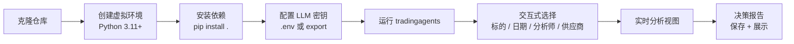
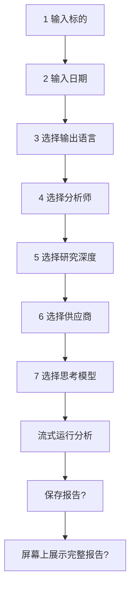

本页的目标是帮助你在最短时间内完成一次可运行的端到端分析：从克隆仓库、安装依赖、配置大模型密钥，直到看到第一份由多智能体团队产出的交易决策报告。本页只覆盖"最快跑通"所需的最小步骤；安装方式的深入细节、容器化部署、CLI 的完整选项以及编程接口的进阶用法，都会在末尾指引到对应的专门页面。

为了便于把握全貌，先把"快速开始"的最短路径画成一张流程图：



这份流程只依赖一个前提：你有一个可用的大模型 API 密钥。TradingAgents 默认使用 OpenAI 的 GPT-6 系列模型，也支持 Google、Anthropic 等十余家供应商。

Sources: [README.md](README.md#L113-L152), [tradingagents/default_config.py](tradingagents/default_config.py#L100-L115)

## 前置条件：安装与环境

TradingAgents 要求 **Python 3.11 或更高版本**，这是 `pyproject.toml` 中声明的运行时约束。官方 Docker 镜像则固定运行 Python 3.13。

```bash
git clone https://github.com/TauricResearch/TradingAgents.git
cd TradingAgents
```

推荐用虚拟环境隔离依赖，`conda`、`venv` 或 `uv` 任选其一：

```bash
conda create -n tradingagents python=3.13
conda activate tradingagents
```

```bash
uv venv --python 3.13
source .venv/bin/activate
```

随后在仓库根目录安装包及其依赖。安装会把项目注册为一个可执行命令，同时声明 `tradingagents` 这个命令行入口（`cli.main:app`）：

```bash
pip install .          # 使用 uv 时：uv pip install .
```

安装完成后，`tradingagents` 命令即可全局调用，无需再停留在仓库目录。若你需要 Amazon Bedrock 支持，可额外安装可选依赖 `pip install ".[bedrock]"`。安装方式（含 Docker 部署与数据持久化）的更详尽说明见 [本地安装与依赖](3-ben-di-an-zhuang-yu-yi-lai) 与 [Docker 部署与数据持久化](4-docker-bu-shu-yu-shu-ju-chi-jiu-hua)。

Sources: [pyproject.toml](pyproject.toml#L12-L50), [README.md](README.md#L115-L139), [Dockerfile](Dockerfile#L1-L2)

## 配置 LLM 供应商密钥

运行分析必须提供一个 LLM 供应商的 API 密钥。最省事的方式是让 CLI 在你首次运行时提示你粘贴——它会自动写入项目根目录的 `.env` 文件，并把文件权限收敛为仅属主可读写（`0600`）。

你也可以手动准备：复制示例文件 `cp .env.example .env`，在其中填入对应供应商的密钥；或直接在 shell 中 `export`。仓库的 `tradingagents/__init__.py` 会在包被导入时自动加载工作目录下的 `.env`，因此无论从哪个入口启动进程，密钥都能被读取。

不同供应商使用不同的环境变量名，下表列出常用项（完整映射以 `tradingagents/llm_clients/api_key_env.py` 为准）：

| 供应商 | 环境变量 | 备注 |
|---|---|---|
| OpenAI（默认） | `OPENAI_API_KEY` | 默认模型 `gpt-6-sol` / `gpt-6-luna` |
| Google (Gemini) | `GOOGLE_API_KEY` | |
| Anthropic (Claude) | `ANTHROPIC_API_KEY` | |
| xAI (Grok) | `XAI_API_KEY` | |
| DeepSeek | `DEEPSEEK_API_KEY` | |
| Qwen（国际/中国） | `DASHSCOPE_API_KEY` / `DASHSCOPE_CN_API_KEY` | 两地账号不通用 |
| GLM（Z.AI/BigModel） | `ZHIPU_API_KEY` / `ZHIPU_CN_API_KEY` | 两地账号不通用 |
| MiniMax（全球/中国） | `MINIMAX_API_KEY` / `MINIMAX_CN_API_KEY` | 两地账号不通用 |
| OpenRouter | `OPENROUTER_API_KEY` | |
| Mistral | `MISTRAL_API_KEY` | |
| Kimi (Moonshot) | `MOONSHOT_API_KEY` | |
| Groq | `GROQ_API_KEY` | |
| NVIDIA NIM | `NVIDIA_API_KEY` | |
| Ollama（本地） | 无需密钥 | 默认端点为 `http://localhost:11434/v1` |
| OpenAI 兼容端点 | `OPENAI_COMPATIBLE_API_KEY`（可选） | vLLM / LM Studio 等本地服务无需密钥 |

对于不需要密钥的本地运行时（如 Ollama），CLI 会跳过密钥检查。对于"密钥可选"的通用 OpenAI 兼容端点，CLI 也不会强制提示输入密钥，从而保证无密钥的本地服务依然可用。若使用 Azure OpenAI，则把 `.env.enterprise.example` 复制为 `.env.enterprise` 并填入凭据。

Sources: [cli/prompts.py](cli/prompts.py#L627-L682), [tradingagents/llm_clients/api_key_env.py](tradingagents/llm_clients/api_key_env.py#L16-L53), [.env.example](.env.example#L1-L17), [.env.enterprise.example](.env.enterprise.example#L1-L6), [tradingagents/__init__.py](tradingagents/__init__.py#L1-L12)

## 第 3 步：交互式首次运行

在终端直接运行安装好的命令即可启动交互式 CLI：

```bash
tradingagents          # 已安装的命令
python -m cli.main     # 备选：直接从源码运行
```

CLI 会依次询问七到八个问题（供应商不同时，最后一个"思考模式"步骤会相应变化）。关键设计是：**上一次运行的回答会作为本次的默认值回填**，因此连续运行同一套配置时，你只需一路按回车即可。下表概括了每一步的内容与默认值：

| 步骤 | 询问内容 | 默认/示例 |
|---|---|---|
| 1. Ticker Symbol | 标的代码，必要时带交易所后缀 | `SPY`；如 `0700.HK`、`BTC-USD` |
| 2. Analysis Date | 分析日期（`YYYY-MM-DD`） | 今天 |
| 3. Output Language | 报告与决策的输出语言 | `English` |
| 4. Analysts Team | 选择分析师子集 | 全部可选分析师 |
| 5. Research Depth | 研究深度（映射辩论/风险轮数） | 1 |
| 6. LLM Provider | 选择供应商 | 上次所选 |
| 7. Thinking Agents | 选择"深度思考"与"快速思考"模型 | 上次所选 |
| 8. Thinking Mode | 供应商专属的推理强度/思考模式 | 各供应商默认 |

选择过程中，CLI 内部按固定的工作流顺序组织分析：**I. 分析师团队 → II. 研究员团队 → III. 交易员 → IV. 风险管理 → V. 投资组合管理**。所有被选中的分析师会**同时启动**，各自使用自己的工具，待全部分析师报告就绪后再开始研究员辩论。

当你按回车确认后，终端会切换到全屏的实时视图（"备选屏幕"），逐条流式展示消息、工具调用与各智能体的进度与耗时。运行结束后，CLI 会在普通屏幕上打印最终决策。若决策文本无法解析出明确评级，运行会被标记为 **REVIEW** 并明确提示，而不是伪装成一次正常结果。



Sources: [cli/main.py](cli/main.py#L25-L81), [cli/selections.py](cli/selections.py#L55-L120), [cli/selections.py](cli/selections.py#L208-L283), [cli/run.py](cli/run.py#L170-L215), [cli/run.py](cli/run.py#L370-L414), [cli/prefs.py](cli/prefs.py#L1-L24)

## 无提示运行：用标志与环境变量跳过提问

如果你希望把一次分析放进脚本或定时任务，可以完全跳过交互。规则很简单：**命令行标志回答"每次都可能不同"的问题（标的、日期、分析师、是否保存/展示），而 `TRADINGAGENTS_*` 环境变量回答其余问题**。每个标志只跳过它自己对应的那一步。

```bash
export TRADINGAGENTS_LLM_PROVIDER=openai TRADINGAGENTS_QUICK_THINK_LLM=gpt-6-luna TRADINGAGENTS_DEEP_THINK_LLM=gpt-6-sol
export TRADINGAGENTS_OUTPUT_LANGUAGE=English TRADINGAGENTS_MAX_DEBATE_ROUNDS=1 TRADINGAGENTS_MAX_RISK_ROUNDS=1
tradingagents --ticker NVDA --date 2026-09-23 --analysts market,news,fundamentals --save --no-show
```

下表整理了快速开始阶段最常用的开关：

| 维度 | 交互问题 | 跳过方式 |
|---|---|---|
| 标的 | Step 1 | `--ticker NVDA`（无环境变量） |
| 日期 | Step 2 | `--date 2026-09-23`（无环境变量） |
| 分析师 | Step 4 | `--analysts market,news`（无环境变量；`sentiment` 是 `social` 的别名） |
| 输出语言 | Step 3 | `TRADINGAGENTS_OUTPUT_LANGUAGE` |
| 研究深度 | Step 5 | `TRADINGAGENTS_MAX_DEBATE_ROUNDS` **与** `TRADINGAGENTS_MAX_RISK_ROUNDS` 同时设置 |
| 供应商 | Step 6 | `TRADINGAGENTS_LLM_PROVIDER` |
| 思考模型 | Step 7 | `TRADINGAGENTS_QUICK_THINK_LLM` 或 `TRADINGAGENTS_DEEP_THINK_LLM` |
| 推理强度 | Step 8 | `TRADINGAGENTS_OPENAI_REASONING_EFFORT` / `TRADINGAGENTS_GOOGLE_THINKING_LEVEL` / `TRADINGAGENTS_ANTHROPIC_EFFORT` |
| 是否保存/展示 | 运行后两个提问 | `--save/--no-save`、`--show/--no-show` |

有两个易被忽略的细节。其一，研究深度只有在辩论轮数与风险轮数**两个变量都设置**时才会跳过提问，二者取其一都仍会询问。其二，**分析师集合没有对应的环境变量**，只能在 `--analysts` 标志中给出。当运行在无终端环境下启动时，CLI 会在调用任何模型之前，一次性列出所有仍然缺失的答案（标志名或变量名），让你知道该补什么，而不是停在第一个问题处失败。

Sources: [cli/main.py](cli/main.py#L35-L62), [cli/selections.py](cli/selections.py#L40-L52), [cli/prompts.py](cli/prompts.py#L84-L100), [README.md](README.md#L205-L213)

## 编程接口快速上手

除了 CLI，你也可以在自己的代码中直接调用。核心入口是 `TradingAgentsGraph`，其 `.propagate(ticker, date)` 会返回 `(state, decision)`：`state` 是包含全部分析报告字段的最终状态，`decision` 是 5 档评级之一（Buy / Overweight / Hold / Underweight / Sell）。

最简版本只需三行：

```python
from tradingagents.graph.trading_graph import TradingAgentsGraph
from tradingagents.default_config import DEFAULT_CONFIG

ta = TradingAgentsGraph(debug=True, config=DEFAULT_CONFIG.copy())

# 前向传播
state, decision = ta.propagate("NVDA", "2026-09-01")
print(decision)

# 与 CLI 相同的报告树，写入 results_dir/reports
ta.save_reports(state, "NVDA")
```

要在代码中切换供应商、模型或辩论轮数，只需在 `DEFAULT_CONFIG` 的副本上覆盖对应键。注意 `DEFAULT_CONFIG` 本身已经内置了 `TRADINGAGENTS_*` 环境变量的覆盖逻辑——因此你可以纯粹通过 `.env` 切换模型或端点，而无需改动脚本；只有在需要"硬编码且忽略环境"的值时才在脚本里覆盖：

```python
from tradingagents.graph.trading_graph import TradingAgentsGraph
from tradingagents.default_config import DEFAULT_CONFIG

config = DEFAULT_CONFIG.copy()
config["llm_provider"] = "openai"        # openai / google / anthropic / deepseek / groq / ollama ...
config["deep_think_llm"] = "gpt-6-sol"   # 复杂推理使用的模型
config["quick_think_llm"] = "gpt-6-luna" # 快速任务使用的模型
config["max_debate_rounds"] = 2

ta = TradingAgentsGraph(debug=True, config=config)
_, decision = ta.propagate("NVDA", "2026-09-01")
print(decision)
```

仓库根目录的 `main.py` 就是上述最简用法的可运行范例，直接 `python main.py` 即可体验。编程接口与全部配置键的完整清单见 [Python API 与配置调整](9-python-api-yu-pei-zhi-diao-zheng) 与 [配置系统与环境变量覆盖](29-pei-zhi-xi-tong-yu-huan-jing-bian-liang-fu-gai)。

Sources: [main.py](main.py#L1-L17), [README.md](README.md#L245-L281), [tradingagents/graph/trading_graph.py](tradingagents/graph/trading_graph.py#L182-L197), [tradingagents/graph/trading_graph.py](tradingagents/graph/trading_graph.py#L290-L303), [tradingagents/default_config.py](tradingagents/default_config.py#L86-L91)

## 运行产物与后续阅读

一次成功的运行会在 `results_dir`（默认 `~/.tradingagents/logs`）下留下痕迹：本次运行的目录为 `results_dir/<标的>/<日期>/`，其中 `message_tool.log` 记录逐条消息与工具调用，`reports/` 子目录保存各分节 Markdown。当你在末尾选择"保存报告"时，CLI 会额外把完整的报告树写入 `results_dir/reports/<标的>_<时间戳>/`。若把 `tradingagents` 作为共享的 Python 接口使用，`save_reports()` 做的是同一件事。

此外，**记忆日志默认始终开启**：每次完成的运行都会把决策追加到 `~/.tradingagents/memory/trading_memory.md`，供后续反思与结算使用。

至此，你已经完成了一次完整的"快速开始"。建议的阅读推进顺序如下：

1. 想理解这套多智能体系统为何这样设计，从 [概览](1-gai-lan) 与 [总体架构与多智能体协作](11-zong-ti-jia-gou-yu-duo-zhi-neng-ti-xie-zuo) 读起。
2. 想掌握更细的安装与部署方式，阅读 [本地安装与依赖](3-ben-di-an-zhuang-yu-yi-lai) 与 [Docker 部署与数据持久化](4-docker-bu-shu-yu-shu-ju-chi-jiu-hua)。
3. 想深入 CLI 的每一步交互与实时视图，阅读 [交互式 CLI 与运行流程](5-jiao-hu-shi-cli-yu-yun-xing-liu-cheng)；想彻底脚本化运行，阅读 [无提示批处理运行（标志与环境变量）](6-wu-ti-shi-pi-chu-li-yun-xing-biao-zhi-yu-huan-jing-bian-liang)。
4. 想分析美股以外的市场并结合正确的交易后缀，阅读 [多市场行情与标的符号](7-duo-shi-chang-xing-qing-yu-biao-de-fu-hao)。
5. 想把分析嵌入自己的程序或调整模型配置，阅读 [Python API 与配置调整](9-python-api-yu-pei-zhi-diao-zheng)。
6. 想跨运行保留与恢复状态，阅读 [状态持久化与断点恢复](10-zhuang-tai-chi-jiu-hua-yu-duan-dian-hui-fu)。