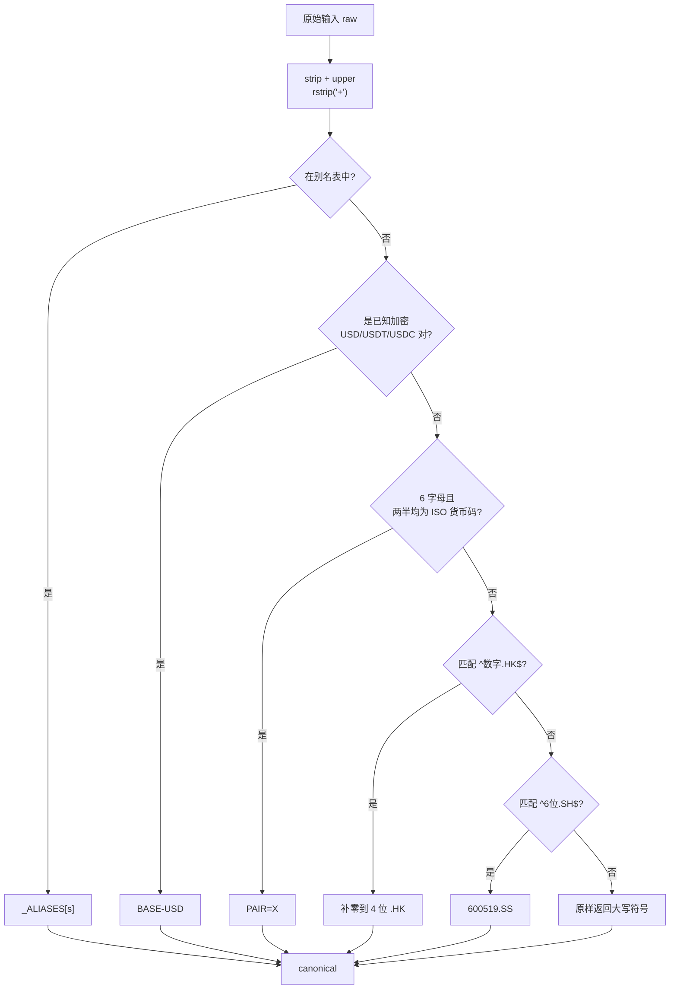
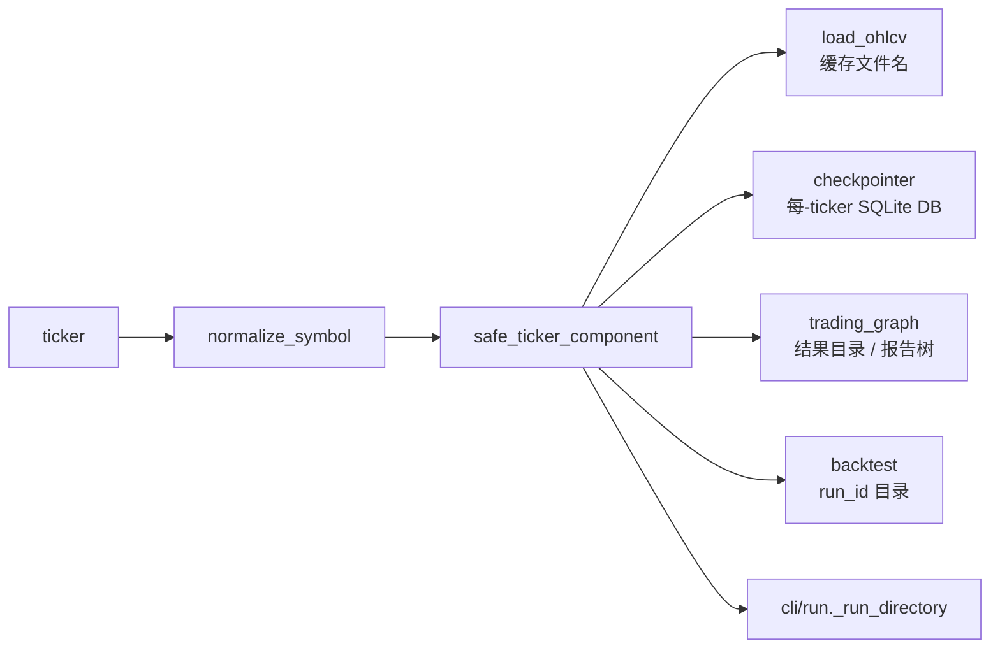
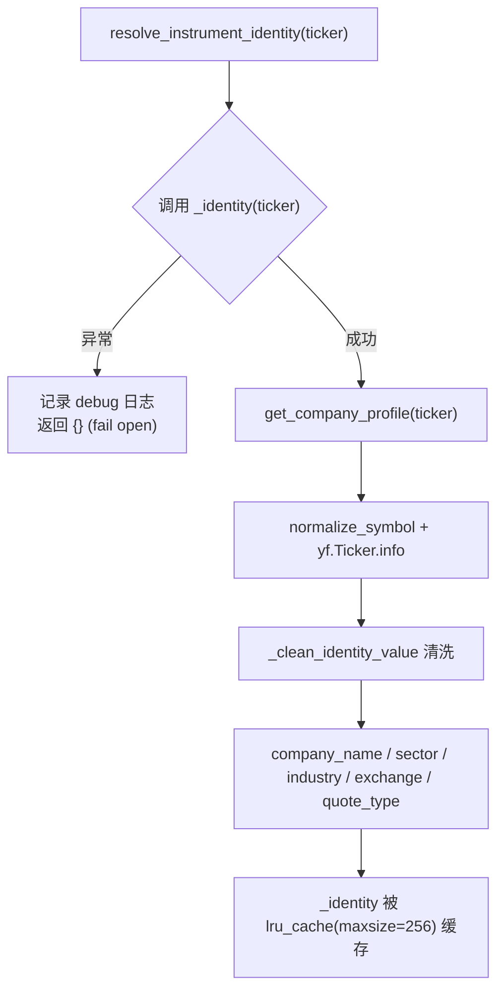
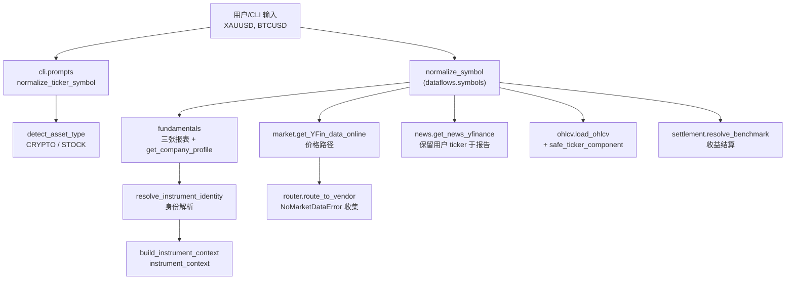

在 TradingAgents 中，"用户输入的标的符号"与"数据供应商实际承认的符号"往往不是同一个字符串。用户在终端敲入 `XAUUSD+`，而 Yahoo Finance 只认 `GC=F`；模型在工具调用里写 `BTCUSDT`，而 Yahoo 只列出 `BTC-USD` 交易对。若不在这两者之间做确定性翻译，供应商会返回一个空结果，而智能体曾把空字符串当作自由文本、围绕它"幻觉"出一个价格（见 issue #781）。本页聚焦两个正交的关注点：**符号归一化**（把券商/用户符号翻译成供应商规范符号，纯语法、无网络调用）与**公司身份解析**（用一次真实的供应商查询锁定"当前分析标的究竟是谁"，以阻止智能体把价格走势模式匹配到一家错误的公司，见 issue #814）。

Sources: [symbols.py](tradingagents/dataflows/symbols.py#L1-L21), [context.py](tradingagents/agents/context.py#L61-L77)

## 两个正交的关注点

尽管两者都围绕"标的符号"这一概念，它们解决的是不同的工程问题，并且在代码中被组织成不同的模块：

| 关注点 | 核心函数 | 所在模块 | 是否触网 | 失败后果 |
|--------|----------|----------|----------|----------|
| 符号归一化 | `normalize_symbol` | `dataflows/symbols.py` | 否（纯语法） | 供应商空结果 → `NoMarketDataError` |
| 路径安全校验 | `safe_ticker_component` | `dataflows/symbols.py` | 否 | `ValueError` 阻断目录穿越 |
| 公司身份解析 | `resolve_instrument_identity` | `agents/context.py` | 是（一次 yfinance 查询） | 失败则开放降级为仅符号上下文 |

`normalize_symbol` 与 `safe_ticker_component` 同处 `symbols.py`，因为二者都是**在符号被用于任何"下游消费"（供应商查询或文件路径插值）之前施加的单一规则**；而身份解析位于 `agents/context.py`，因为它服务于提示词构建，而非数据获取。理解这一拆分是阅读本页其余内容的前提。

Sources: [symbols.py](tradingagents/dataflows/symbols.py#L103-L180), [context.py](tradingagents/agents/context.py#L61-L104)

## 符号归一化：从券商符号到 Yahoo 约定

`normalize_symbol` 是一条**纯语法**的翻译函数——它不做任何网络调用，因此可以安全地施加在每一次请求上。它将用户/券商符号映射到 Yahoo Finance 的规范符号，其内部解析遵循严格的"首个匹配获胜"顺序。



这张表暴露了函数的核心设计哲学：**绝大多数映射都是"规则"而非"查表"**，只有那些无法用规则表达的例外（贵金属、能源、指数 CFD）才落在显式别名表里。这带来了可扩展性上的好处——新增一个比特币类加密货币只需往 `_CRYPTO_BASES` 加一个基币，而不必触碰任何调用点。

Sources: [symbols.py](tradingagents/dataflows/symbols.py#L103-L144)

### 别名表：为数不多的例外

别名表 `_ALIASES` 专门托管那些**券商符号无法通过任何通用规则映射到 Yahoo 符号**的品种。三类最典型：

- **贵金属/能源**解析为它们的前月期货：`XAUUSD`/`GOLD` → `GC=F`（COMEX 黄金），`USOIL`/`WTI` → `CL=F`（NYMEX 原油）。原因在模块文档里说得很清楚：Yahoo 上没有贵金属的外汇对，它是以 COMEX 期货报价的。
- **指数 CFD 名称**解析为标的 Yahoo 指数符号：`SPX500`/`US500` → `^GSPC`，`NAS100` → `^NDX`，`US30` → `^DJI`。
- 每个条目都附带**同一品种的多个券商别名**（如 `XAUUSD`、`XAU`、`GOLD` 全部指向 `GC=F`），因为不同经纪商对同一品种的命名并不统一。

这一设计的回报是文档中反复强调的：新工具通过**追加一行表数据**即可支持，而不需要编辑任何调用点。

Sources: [symbols.py](tradingagents/dataflows/symbols.py#L47-L68)

| 输入（用户/券商） | Yahoo 规范符号 | 规则类别 |
|-------------------|----------------|----------|
| `XAUUSD`, `XAUUSD+`, `GOLD` | `GC=F` | 别名表（贵金属→期货） |
| `XAGUSD`, `XAG`, `SILVER` | `SI=F` | 别名表 |
| `WTICOUSD`, `USOIL`, `WTI` | `CL=F` | 别名表（能源→期货） |
| `SPX500`, `US500`, `SPX` | `^GSPC` | 别名表（指数 CFD） |
| `NAS100`, `US100`, `USTEC` | `^NDX` | 别名表（指数 CFD） |
| `EURUSD` | `EURUSD=X` | 外汇规则 |
| `BTCUSD`, `BTC-USDT`, `BTC-USDC` | `BTC-USD` | 加密规则 |
| `09992.HK`, `700.HK` | `9992.HK`, `0700.HK` | 港股补零规则 |
| `600519.SH` | `600519.SS` | 上证后缀规则 |
| `AAPL`, `BRK.B`, `^GSPC`, `GC=F` | 原样（大写） | 透传 |

Sources: [symbols.py](tradingagents/dataflows/symbols.py#L6-L14), [test_symbols.py](tests/test_symbols.py#L21-L70)

### 外汇与港股/上证的规则化映射

三条"规则"分支展示了如何用最少的代码覆盖大量符号：

- **外汇规则**：一个 6 字母符号，若其**前三个字母与后三个字母都在 `_FOREX_CURRENCIES`（ISO-4217 集合）中**，则视为即期外汇对，加上 `=X`。这个"两半都必须是货币码"的约束至关重要：`ABCDEF` 这样的普通 6 字母股票代码不会被误判成虚构的外汇对（测试 `test_six_letter_non_currency_left_alone` 明确保护了这一点）。
- **港股规则**：正则 `^(\d{1,5})\.HK$` 捕获数字部分，再 `int(...)` 后格式化为**4 位零填充**。这是因为 HKEX 允许最多 5 位代码，而 Yahoo 只接受 4 位（issue #957）。`09992.HK` → `9992.HK`，`700.HK` → `0700.HK`。
- **上证规则**：`^(\d{6})\.SH$` 直接改写后缀，因为 Yahoo 把上海拼作 `.SS`（`600519.SH` → `600519.SS`）。

尾部的 `+`（券商 CFD 标记，如 `XAUUSD+`）在匹配前被 `rstrip("+")` 剥离，因此 `xauusd+` 与 `XAUUSD` 走同一条路径。

Sources: [symbols.py](tradingagents/dataflows/symbols.py#L31-L45), [symbols.py](tradingagents/dataflows/symbols.py#L70-L72), [symbols.py](tradingagents/dataflows/symbols.py#L126-L140), [test_symbols.py](tests/test_symbols.py#L43-L46)

### 当归一化发生改变时：日志与错误中的溯源

当归一化结果与原始输入不同时，函数会记录一条 `INFO` 日志。但**对用户的可见溯源**并不止于日志——它在下游的错误对象与报告头中被显式保留：

- `NoMarketDataError` 同时携带 `symbol`（用户请求的）与 `canonical`（实际查询的），其错误消息会补充 `(queried as 'GC=F')`（`errors.py`）。
- 市场数据获取函数在报告头中给出 `GC=F (from XAUUSD+)` 形式的标签（`market.py`），使读者能看到究竟为哪个品种定价。
- 新闻路径保留用户的 ticker 于标题中，并附注 `(resolved to GC=F)` 的 provenance（`news.py`）。

这体现了本仓库的一条一致的工程准则：**归一化对机器是透明的，但对人必须是可审计的**。

Sources: [errors.py](tradingagents/dataflows/errors.py#L25-L43), [market.py](tradingagents/dataflows/vendors/yahoo/market.py#L59-L65), [news.py](tradingagents/dataflows/vendors/yahoo/news.py#L77-L110)

## crypto_base：跨供应商复用的共享原语

`crypto_base` 是隐藏在所有加密符号处理背后的**单一下层原语**。它纯粹语法地识别一个符号是否为已知基币对 USD 报价的加密对——接受 `BTC-USD`、`BTCUSD`、`btc-usdt`、`BTCUSDC+` 等各种形态——并返回基币（如 `BTC`），否则返回 `None`。

它的实现刻意区分于 `normalize_symbol`：内部先 `strip().upper().rstrip("+").replace("-", "")` 压缩成紧凑形式，然后从最长到最短地尝试 `_CRYPTO_QUOTES = ("USDT", "USDC", "USD")`——顺序很重要，否则 `BTCUSDT` 会先匹配到 `USD` 子串而得出错误的 base。返回值只有在该 base 属于 `_CRYPTO_BASES` 集合时才有效，因此 `XYZ-USD` 这类未知基币会正确地返回 `None`。

`normalize_symbol` 内部的 `_normalize_crypto` 正是建立在 `crypto_base` 之上，产出 `BASE-USD`。但 `crypto_base` 的**独立价值在于它是跨供应商共享的**：

- **CLI 资产类型分类**（`detect_asset_type`）通过归一化符号后缀判断是否为加密，从而让 `BTCUSD` 与 `BTC-USDT` 都读作 crypto（issue #981/#982）。
- **StockTwits** 用 `crypto_base` 把加密对映射到它自己的 `<BASE>.X` 约定（Yahoo 的 `BTC-USD` 形式在 StockTwits 上会 404）。
- **Reddit** 用 `crypto_base` 把 `BTC-USD` 还原成 `BTC` 去做子版内容检索，否则几乎搜不到任何讨论。

一个原语、三种供应商约定——这是把"识别"与"翻译"分离的直接收益。

Sources: [symbols.py](tradingagents/dataflows/symbols.py#L42-L100), [stocktwits.py](tradingagents/dataflows/vendors/stocktwits.py#L63-L71), [reddit.py](tradingagents/dataflows/vendors/reddit.py#L260-L262), [prompts.py](cli/prompts.py#L118-L124), [test_symbols.py](tests/test_symbols.py#L87-L104)

## 路径安全：safe_ticker_component

`normalize_symbol` 解决"查询哪个符号"，`safe_ticker_component` 解决"这个符号能否安全地插值进文件系统路径"。二者同属一组关注点，因为 ticker 值有两个来源都可能被攻击者影响：**用户 CLI 输入**，以及**受外部内容影响的 LLM 工具调用**（例如抓取的新闻里嵌入了提示注入）。

没有校验时，`"../../../etc/foo"` 这样的值会流经 `os.path.join` / `Path /`，逃逸出配置的缓存、检查点或结果目录。`safe_ticker_component` 通过以下检查阻断：

| 检查 | 规则 | 拒绝示例 |
|------|------|----------|
| 非空字符串 | 必须是非空 `str` | `""`, `None`, `123`, `b"AAPL"` |
| 长度上限 | 默认 `max_len = 32` | `"A" * 33` |
| 字符集 | 全匹配 `^[A-Za-z0-9._\-\^=+]+$` | `"AAP L"`, `"AAPL\x00"`, `"/abs"` |
| 非点集 | `set(value) != {"."}` | `"."`, `".."`, `"..."` |

字符集白名单是精心挑选的：字母数字、点（`BRK.A`）、连字符（`BRK-B`）、下划线、插入符（`^GSPC` 指数）、等号（`GC=F` 期货）、加号（`XAUUSD+` CFD）。**这些字符没有一个是目录分隔符**，因此该值永远不会逃逸其所在目录。最后的"仅点"检查是必要的补丁——`.`, `..` 能通过正则，但作为路径组件会向上穿越父目录。

这一校验被一致地施加在**所有**将 ticker 插值进路径的位置：



Sources: [symbols.py](tradingagents/dataflows/symbols.py#L147-L180), [ohlcv.py](tradingagents/dataflows/vendors/yahoo/ohlcv.py#L172-L194), [checkpointer.py](tradingagents/graph/checkpointer.py#L19-L25), [trading_graph.py](tradingagents/graph/trading_graph.py#L300-L303), [test_safe_ticker_component.py](tests/test_safe_ticker_component.py#L11-L53)

## 公司身份解析：resolve_instrument_identity

如果说符号归一化解决的是"查询哪个符号"，那么身份解析解决的是"这个符号代表的究竟是哪家公司"。它存在的直接动机是 issue #814：当图表形态暗示了某个行业、而公司与该行业不符时，市场分析师会**把价格走势模式匹配到一个虚构的身份上**，这个虚构身份随后逐级级联传播到每一个下游智能体。提供一个来自供应商的**地面真值名称**即可斩断这条幻觉链。

其解析流程体现了本仓库一贯的"对失败开放"（fail-open）哲学：



关键设计细节包括：

- **缓存与重试的不对称**：`_identity` 用 `functools.lru_cache(maxsize=256)` 缓存成功的答案；但**失败的查询不被缓存**——`resolve_instrument_identity` 是包裹 `_identity` 的薄层，捕获所有异常并返回 `{}`，而异常发生在缓存装饰器内部，因此缓存不会记住这个空结果。这保证了长时间进程（如一次回测）不会因为一次网络失败而在后续每个单元格都永久失去身份。
- **占位值清洗**：`_clean_identity_value` 会把 `"None"`、`"n/a"`、`"nan"`、`"null"` 以及纯空白剔除，避免把一个占位字符串当作公司名注入提示。
- **名称回退**：`company_name` 优先取 `longName`，缺失时回退到 `shortName`。
- **身份与价格同源**：身份解析走 `get_company_profile`，后者内部调用 `normalize_symbol`，因此 `XAUUSD` 的身份查询与价格查询一样都打到 `GC=F`（issue #983）。

Sources: [context.py](tradingagents/agents/context.py#L51-L104), [fundamentals.py](tradingagents/dataflows/vendors/yahoo/fundamentals.py#L152-L155), [test_instrument_identity.py](tests/test_instrument_identity.py#L22-L73), [test_symbol_normalization_paths.py](tests/test_symbol_normalization_paths.py#L16-L33)

## 提示上下文构建：build_instrument_context 与时点一致性

身份数据由 `build_instrument_context` 编织成一段注入每个智能体的提示文本。这段文本分三种情形呈现，其中**历史运行的处理是本页与"时点一致性"主题的交汇点**：

| 运行类型 | 名称 | 行业分类/交易所 | 理由 |
|----------|------|-----------------|------|
| 当前日期 | `Company: TOTO LTD.` | 注入 sector/industry/exchange | 今天的画像即有效真值 |
| 历史日期（`is_historical`） | `Company: TOTO LTD. (its current name, given only to identify it...)` | **不注入** | 供应商画像无历史版本，行业/交易所可能已变 |
| 加密资产 | `Name: Bitcoin USD` | 附加"视作加密资产而非公司"提示 | 避免套用公司基本面 |

这一区分的逻辑在源码注释中说得很明确：`Ticker.info` 是一个**没有历史版本信息的当下快照**。在历史运行时，只有公司名被给出——而且被明确标注为"仅用于识别"——因为名称是"用来把这家公司与其他公司区分开"，而不是"它当时叫什么"；而 sector/industry/exchange 则被**完全省略**，因为它们可能在该分析日期并不成立。这保证了向提示注入情报时不引入未来信息。

函数末尾还有一段关键的**抗反悔指令**：一旦注入了身份，提示会附加 "Do not substitute a different company or ticker unless a tool result explicitly disproves this resolved identity."——这是把 #814 的教训固化为提示层面的护栏。

Sources: [context.py](tradingagents/agents/context.py#L107-L169), [date_window.py](tradingagents/dataflows/date_window.py#L39-L41), [test_instrument_identity.py](tests/test_instrument_identity.py#L76-L104)

### 状态读取与网络自由回退

身份上下文在运行开始时**只计算一次**并存入状态。`get_instrument_context_from_state` 优先返回这个预计算的字符串；当状态里没有时（例如裸的程序化状态或测试），它回退到 `build_instrument_context(...)` 的**仅符号、无网络**版本。这一点是被测试显式保护的：回退路径必须不触发任何 yfinance 调用（`mock.assert_not_called()`），以保证消费者永远不会被迫在图执行中途发起网络请求。

`trading_graph.resolve_instrument_context` 是这一预计算的发生地：它先 `resolve_instrument_identity(ticker)`，再把身份与 `asset_type`、`trade_date` 一起交给 `build_instrument_context`，最终结果由 `create_run_state` 存入 `instrument_context` 字段。`propagate()` 路径与 CLI 路径都经过这里，因此**无论入口点为何，解析后的身份都能抵达整张图**。

Sources: [context.py](tradingagents/agents/context.py#L172-L187), [trading_graph.py](tradingagents/graph/trading_graph.py#L134-L145), [trading_graph.py](tradingagents/graph/trading_graph.py#L305-L323), [test_instrument_identity.py](tests/test_instrument_identity.py#L108-L126)

## 归一化在管线中的传播

符号归一化的价值只有在其**被一致地施加于每一条 yfinance 路径**时才能兑现。若只有价格路径归一化，而身份、收益结算或新闻路径没有，那么这些路径就会命中错误的品种或直接失败。测试文件 `test_symbol_normalization_paths.py` 专门守护这一一致性（回归 #983/#984）。下图勾勒出归一化点在图中的分布：



各路径的具体归一化调用点：

- **价格**：`get_YFin_data_online` 在请求前 `canonical = normalize_symbol(symbol)`，随后用 canonical 调用 `yf.Ticker`。
- **基本面**：`get_fundamentals`、`_statement`、`get_insider_transactions`、`get_company_profile` 各自归一化，保证报表、内幕交易与身份都打到同一规范符号。
- **新闻**：`get_news_yfinance` 用 canonical 查询，但把用户的 ticker 保留在报告头，并附注 provenance。
- **OHLCV 缓存**：`load_ohlcv` 先归一化再 `safe_ticker_component`，使缓存文件名既正确又安全。
- **收益结算**：`resolve_benchmark` 对显式 benchmark 与目标 ticker 都归一化，使结算价格与当初分析所定价的品种一致（#984）。

Sources: [market.py](tradingagents/dataflows/vendors/yahoo/market.py#L18-L49), [fundamentals.py](tradingagents/dataflows/vendors/yahoo/fundamentals.py#L20-L154), [news.py](tradingagents/dataflows/vendors/yahoo/news.py#L76-L110), [ohlcv.py](tradingagents/dataflows/vendors/yahoo/ohlcv.py#L161-L200), [settlement.py](tradingagents/memory/settlement.py#L13-L34), [test_symbol_normalization_paths.py](tests/test_symbol_normalization_paths.py#L36-L78)

## 供应商专属约定的适配

除了默认的 Yahoo 路径，其他供应商也各自有符号约定，而这些适配**共享同一个 `crypto_base` 原语**——这正说明了把"识别是不是加密、base 是什么"与"翻译成某供应商的写法"分离的架构价值：

| 供应商 | 约定 | 变换 | 代码位置 |
|--------|------|------|----------|
| Yahoo | `<BASE>-USD` | 加密对规范为破折号 USD 形式 | `symbols._normalize_crypto` |
| StockTwits | `<BASE>.X` | 加密对去引号货币、加 `.X` | `stocktwits._stocktwits_symbol` |
| Reddit | `<BASE>` | 加密对还原为裸基币用于检索 | `reddit.fetch_*` |

值得注意的是，StockTwits 的 `_stocktwits_symbol` 明确解释了为何不复用 Yahoo 形式：StockTwits 把加密列为 `BTC.X`，Yahoo 的 `BTC-USD` 形式在那里会 404。Reddit 则把 `BTC-USD` 还原成 `BTC` 以便查询真正匹配到讨论。这意味着**归一化到 Yahoo 规范只是第一步**，跨供应商路由时还需要各自的适配层——但底层"识别出 base 是 BTC"只做一次。

Sources: [stocktwits.py](tradingagents/dataflows/vendors/stocktwits.py#L63-L71), [reddit.py](tradingagents/dataflows/vendors/reddit.py#L260-L265), [symbols.py](tradingagents/dataflows/symbols.py#L97-L100)

## 无数据错误与归一化溯源

当归一化后的符号在供应商处也查不到数据时，`NoMarketDataError` 是把"用户符号"与"规范符号"绑在一起上报的载体。它的自定义构造函数保留 `symbol`、`canonical`（默认等于 `symbol`）、以及自由文本 `detail`，使错误消息能表达完整因果：

```
No market data for 'XAUUSD+' (queried as 'GC=F'): rows between 2025-01-01 and 2025-01-10
```

这个错误类型的层次结构在 `errors.py` 中被设计为**按行为而非按供应商分类**：`NoMarketDataError` 表示"无可用行（空结果或过期数据）"，`VendorUnavailableError` 表示"供应商被限流或失败"，`VendorNotConfiguredError` 表示"缺少 API key/配置"。路由器 `route_to_vendor` 捕获这些基类型，依据**行为**决定是跳过到下一个供应商还是上报整个链路无数据。当每个应答的供应商都报告"无数据"时，`no_data_available` 会构造一条明确、含溯源与原因的哨兵文本：

> `NO_DATA_AVAILABLE: No usable market data for 'XAUUSD+' (resolved to 'GC=F') from any configured vendor (rows between ...). The symbol may be invalid, delisted, not covered, or the vendor returned stale data. Do not estimate or fabricate values...`

这里 "(resolved to 'GC=F')" 的溯源至关重要：它让智能体（和人）看到究竟是哪个符号被查询过，从而区分"符号本身无效"与"归一化映射到了错误的品种"。关于这一错误分层如何驱动回退链的完整细节，参见 [数据供应商路由与回退链](18-shu-ju-gong-ying-shang-lu-you-yu-hui-tui-lian)。

Sources: [errors.py](tradingagents/dataflows/errors.py#L1-L59), [router.py](tradingagents/dataflows/router.py#L185-L197), [router.py](tradingagents/dataflows/router.py#L227-L275), [market.py](tradingagents/dataflows/vendors/yahoo/market.py#L36-L49)

## 小结与相关主题

标的符号归一化与公司身份解析共同构成管线入口处的**确定性防线**。符号归一化（`normalize_symbol` / `crypto_base`）以纯语法、可扩展的方式把任意券商符号翻译成各供应商的规范写法，并把这一规则一致地施加于价格、基本面、新闻、缓存与结算每一条路径；`safe_ticker_component` 则在同一模块内守卫 ticker 值作为文件路径组件的安全边界。公司身份解析（`resolve_instrument_identity` / `build_instrument_context`）用一次真实的供应商查询锁定"这家公司是谁"，并对历史运行施加时点一致性约束、对失败采取开放降级。

要进一步理解这些机制如何与其他子系统协作，建议继续阅读：

- [数据供应商路由与回退链](18-shu-ju-gong-ying-shang-lu-you-yu-hui-tui-lian)——理解 `NoMarketDataError` 如何驱动多供应商的按序回退；
- [时点一致性与防未来函数](19-shi-dian-zhi-xing-yu-fang-wei-lai-han-shu)——理解 `build_instrument_context` 与 `is_historical` 如何避免注入未来画像；
- [确定性市场快照与数值校验](21-que-ding-xing-shi-chang-kuai-zhao-yu-shu-zhi-xiao-yan)——理解归一化后的符号如何进入快照与 OHLCV 校验；
- [多市场行情与标的符号](7-duo-shi-chang-xing-qing-yu-biao-de-fu-hao)——从使用者视角了解如何输入港股、期货、加密等多市场符号。