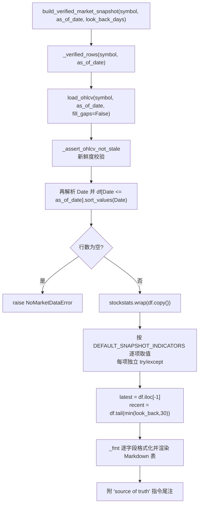
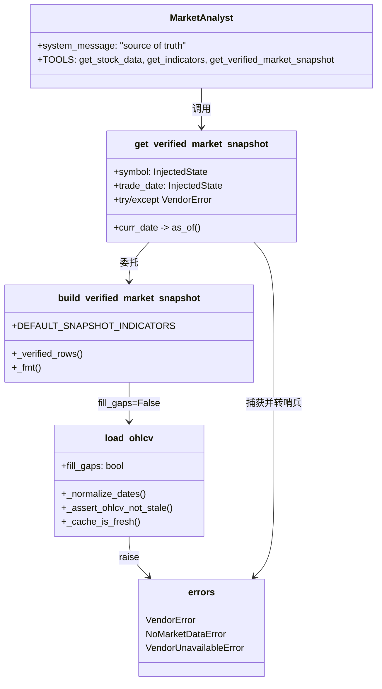

本页聚焦 TradingAgents 中一条**横切于"防止 LLM 伪造精确数字"**的机制：**确定性市场快照（verified market snapshot）与数值校验**。市场分析师是一个 LLM，天然会"言之凿凿"地引用一个并不存在的布林带下轨、一个"历史验证过的支撑位反弹"，或一个凭空的百分比涨跌（#830）。本页说明系统如何用一条**不涉及任何 LLM 的确定性计算路径**，生成一份作为"事实来源（source of truth）"的行情快照，并在数据进入快照之前施加一组数值与新鲜度校验。

本页只讨论"确定性快照与数值校验"本身。运行日期的钳制、`withhold_*` 防未来函数属于 [时点一致性与防未来函数](19-shi-dian-zhi-xing-yu-fang-wei-lai-han-shu)；供应商的选路与回退链属于 [数据供应商路由与回退链](18-shu-ju-gong-ying-shang-lu-you-yu-hui-tui-lian)；`Ticker.info` 解析出的公司身份属于 [标的符号归一化与公司身份解析](20-biao-de-fu-hao-gui-hua-yu-gong-si-shen-fen-jie-xi)。

## 威胁模型：为什么需要一份"确定性快照"

系统面对的数值风险并非"数据缺失"，而是**数据在场、却被 LLM 改写或编造**。快照模块的文档字符串把威胁直接写在一行：市场分析师是一个 LLM，"会捏造精确数字——引用一个底层数据并不支持的布林带或一个'历史验证过的反弹'"（#830）。因此该模块的定位是"计算一份 ground-truth 快照……告诉分析师把任何精确数值声明都当作事实来源；**确定性，不涉及 LLM**"。

这条设计与另一项"确定性 ticker→公司解析"（#814）是同一族修复：没有 ground truth 的名称，市场分析师就会把价格走势套进一个叙事，并**发明一个随后级联到所有下游 agent 的身份**。二者的共同不变式是——**任何可能被下游当作事实重复引用的量，都必须由一段可复现、无模型介入的代码产出**。

Sources: [snapshot.py](tradingagents/dataflows/vendors/yahoo/snapshot.py#L1-L9), [context.py](tradingagents/agents/context.py#L63-L83), [CHANGELOG.md](CHANGELOG.md#L300-L311)

## 快照的构造流水线

快照入口是 `build_verified_market_snapshot(symbol, as_of_date, look_back_days, indicators)`。它的确定性来自三点：**固定的默认指标集**、**对输入数据的防御性重过滤**、以及**逐指标的错误隔离**。整条流水线可概括如下。

流水线的两个"确定性旋钮"值得单独标注。其一，`DEFAULT_SNAPSHOT_INDICATORS` 是一个**固定的常量元组**，注释直言其目的是"让快照每次运行都是同一形状（same shape every run）"，从而消除"这次多算了几个指标、那次少算了几个"带来的可比性漂移。其二，指标计算不由模型选择，而是**在代码中枚举并逐项触发**。

Sources: [snapshot.py](tradingagents/dataflows/vendors/yahoo/snapshot.py#L22-L27), [snapshot.py](tradingagents/dataflows/vendors/yahoo/snapshot.py#L66-L91)

固定指标集覆盖四类技术信号，与分析师提示词中给出的指标菜单一一对应。

| 类别 | 快照包含的指标 | 语义 |
|---|---|---|
| 移动平均 | `close_10_ema`, `close_50_sma`, `close_200_sma` | 短/中/长期趋势基准 |
| 布林带 | `boll`, `boll_ub`, `boll_lb` | 中轨与上下轨（价位声明的高频对象） |
| MACD 族 | `macd`, `macds`, `macdh` | 动量线与信号线、柱状差 |
| 动量/波动 | `rsi`, `atr` | 超买超卖、真实波动均值 |

Sources: [snapshot.py](tradingagents/dataflows/vendors/yahoo/snapshot.py#L23-L27), [market_analyst.py](tradingagents/agents/analysts/market_analyst.py#L24-L46)

## 防御性重过滤：快照不信任自己的输入

`_verified_rows` 是本页最富"考古意味"的一段。它调用 `load_ohlcv` 拿到 OHLCV 后，**并不认为数据已就绪**，而是重新执行一次日期解析与截止过滤。代码注释明确说明动机：`load_ohlcv` 已经规范化了 Date 列并过滤掉未来行，但"我们**防御性地重新施加截止**——这是一条校验路径（verification path），因此它不能信任自己的输入已被预过滤"。

具体地，它用 `pd.to_datetime(..., errors="coerce")` 重新解析 Date、`dropna(subset=["Date"])` 丢弃无法解析的行，再以 `df["Date"] <= pd.to_datetime(as_of_date)` 做上界过滤并按日期排序。若过滤后为空，抛 `NoMarketDataError` 并携带精确的 detail（`no price rows` 或 `no price rows on or before {as_of_date}`）。这条"双保险"的工程哲学是：**凡是承担"最终事实"角色的路径，绝不依赖上游是否恪守契约**。

Sources: [snapshot.py](tradingagents/dataflows/vendors/yahoo/snapshot.py#L30-L49), [errors.py](tradingagents/dataflows/errors.py#L24-L45)

## 数值来源校验一：`fill_gaps=False` 与"按报告原样"

快照刻意与指标路径**使用不同的数据视图**。`build_verified_market_snapshot` 调用 `load_ohlcv(symbol, as_of_date, fill_gaps=False)`。这不是随手传入的参数，而是一条被测试明确守护的语义边界。

`load_ohlcv` 的 `fill_gaps=True`（默认）会对价格列做前向/后向填充，使指标在连续序列上计算；而 `fill_gaps=False` 时，数据"按供应商报告的原始值呈现，一个从未被报告的单元格保持为空"。为什么快照必须用后者？`_verified_rows` 内的注释给出了理由："这份快照被 agent 当作精确价格引用，因此一个被填充的单元格会把这个日期下的数字替换成上一个交易日的数字"。

这一区分由 `test_ohlcv_latest_bar.py::test_the_snapshot_does_not_present_a_filled_price_as_reported` 直接验证：构造一个最新 bar 尚未结算（Open/High/Low/Volume 为空、Close 已报告）的数据帧后，断言快照输出中**不出现上一交易日的 104.50 / 105.50**，而只出现供应商确实报告的 Close `106.00`。测试的 docstring 一语道破封装的用意——"指标计算依赖填充，但校验快照是唯一一个数字必须等于供应商所报告值的地方，否则这个为阻止虚构价格而建的模块，自己就会提供虚构价格"。

Sources: [snapshot.py](tradingagents/dataflows/vendors/yahoo/snapshot.py#L37-L39), [ohlcv.py](tradingagents/dataflows/vendors/yahoo/ohlcv.py#L82-L89), [ohlcv.py](tradingagents/dataflows/vendors/yahoo/ohlcv.py#L161-L171), [test_ohlcv_latest_bar.py](tests/test_ohlcv_latest_bar.py#L182-L206)

## 数值来源校验二：新鲜度与"最新可结算 bar"

进入快照的数据还必须通过两道数值合理性守卫，二者都在 `load_ohlcv` 内部完成，因而对所有消费者（含快照）生效。

**新鲜度守卫**由 `_assert_ohlcv_not_stale` 实现。它将 `as_of_date` 归一化到午夜，取数据的最新日期，若 `(requested - latest).days > max_stale_days` 则抛 `NoMarketDataError`，detail 为"latest row is …, N days before the requested … (stale) — refusing to use it"。阈值 `MAX_OHLCV_STALE_DAYS = 10` 的选取被注释解释为：**足够宽以跨越长周末，又足够紧以捕获 yfinance 偶尔返回的整年旧帧**（#1021）。校验在 `load_ohlcv` 末尾统一施加，因此"回退到上一个可结算 bar"并不会绕过它——`test_serving_the_last_settled_bar_does_not_bypass_the_staleness_check` 正是守护这一点。

**最新可结算 bar 守卫**处理"价格在场但未结算"的边界。yfinance 可能返回最新一根 Close 为 NaN 的 bar（未结算或数据故障）。旧路径在应用 `curr_date` 截止前就丢弃了所有 NaN-close 行，导致**最新一天静默消失、前一交易日看起来像最新**（#1201）。现行逻辑改为：先归一化日期到午夜（`_normalize_dates` 逐元素剥离时区，避免 DST 与非美市场偏移导致误判），再在 `load_ohlcv` 中显式检测 `data["Close"].iloc[-1]` 是否为 NaN——若是，则回退到最后一个"有收盘价"的 bar 并记 warning；只有当**整个区间没有任何一根 bar 有收盘价**时才抛 `NoMarketDataError("no bar in range has a closing price")`（#1289）。这里的设计张力在于：最初"拒绝整帧"的尝试会把一个可交易标的报告为无效或退市，因此最终只把"全无收盘价"视为无数据。

Sources: [ohlcv.py](tradingagents/dataflows/vendors/yahoo/ohlcv.py#L15-L18), [ohlcv.py](tradingagents/dataflows/vendors/yahoo/ohlcv.py#L109-L143), [ohlcv.py](tradingagents/dataflows/vendors/yahoo/ohlcv.py#L227-L255), [test_yfinance_stale_ohlcv_guard.py](tests/test_yfinance_stale_ohlcv_guard.py#L36-L56), [test_ohlcv_latest_bar.py](tests/test_ohlcv_latest_bar.py#L155-L186)

## 数值来源校验三：缓存新鲜度与"当日的部分 K 线"

与"数值可能陈旧"并列的另一类风险是"数值看似新鲜、实则未定"。`_cache_is_fresh` 用一个仅 `900` 秒（15 分钟）的 `OHLCV_CACHE_TTL_SECONDS` 约束当日缓存：文件只在写入当天有效，且**当日请求在文件超过 TTL 后强制重取**。原因被写在注释里：Yahoo 在盘中会发布一根**部分形成的日 K 线**，它的 `Close` 不是收盘价，而"逐行检查无法把它与最终的 bar 区分开来"（#1150）。因此系统宁可多一次下载，也不把盘中未定的 Close 当成收盘价固化进缓存并喂给快照。

Sources: [ohlcv.py](tradingagents/dataflows/vendors/yahoo/ohlcv.py#L20-L24), [ohlcv.py](tradingagents/dataflows/vendors/yahoo/ohlcv.py#L146-L158), [ohlcv.py](tradingagents/dataflows/vendors/yahoo/ohlcv.py#L199-L207)

## 数值格式化：`_fmt` 的确定化输出

快照中的每个数值都经 `_fmt` 渲染，其分支穷举了所有可能的类型，从而让**同一输入永远产出同一字符串**。空值（`None` 或 `pd.isna`）统一渲染为 `N/A`；`pd.Timestamp` 渲染为 `YYYY-MM-DD`；`bool` 原样转字符串（避免被当作 1/0）；整数（如 Volume）原样转字符串；浮点数固定两位小数 `f"{value:.2f}"`。

两条相关的一致性约定值得一提。其一，快照内部**原始价格取自大写列的 `df`，指标取自 `wrap()` 后小写列的 `stock_df`**，因为 `stockstats.wrap()` 会小写化列名并追加指标列——这一"读两处"的写法被注释显式记录，以免后人误用被改名后的列。其二，`get_YFin_data_online` 这条另一条价格路径，会对 `Open/High/Low/Close/Adj Close` 统一 `round(2)`"以便更清爽地显示"。这些格式约定保证跨工具、跨运行的数值可比。

Sources: [snapshot.py](tradingagents/dataflows/vendors/yahoo/snapshot.py#L52-L63), [snapshot.py](tradingagents/dataflows/vendors/yahoo/snapshot.py#L73-L87), [market.py](tradingagents/dataflows/vendors/yahoo/market.py#L51-L57)

## 指标计算的错误隔离：一个坏指标不拖垮快照

指标计算阶段最关键的鲁棒性设计是**逐指标隔离**。循环遍历指标名时，`stock_df[name]` 触发 stockstats 的惰性计算；一旦某指标抛异常，`except` 捕获并把该项标记为 `N/A ({类型名})`，而**不让整个快照失败**。代码注释点明理由："一个坏指标不应沉没整份快照"。当指标值本身为 `NaN` 时，`_fmt` 也会把它降级为 `N/A`。

同样的"让缺失可读"哲学也出现在普通指标窗口路径 `get_stock_stats_indicators_window`：非交易日返回 `N/A: Not a trading day (weekend or holiday)`，而 `_get_stock_stats_bulk` 对 NaN 指标值返回 `N/A`。这与快照的 `N/A` 语义一致——**"没有值"必须被显式表达，而不能渲染成空字符串**，否则在表格里会被读成"当天确实没有读数"而非"读取失败"。

Sources: [snapshot.py](tradingagents/dataflows/vendors/yahoo/snapshot.py#L79-L86), [market.py](tradingagents/dataflows/vendors/yahoo/market.py#L167-L176), [market.py](tradingagents/dataflows/vendors/yahoo/market.py#L226-L234)

## 快照的输出结构与"look-back 上限"

渲染出的快照是一份稳定形状的 Markdown 文档，其结构本身就是提示词工程的一部分。标题行 `## Verified market data snapshot for {SYMBOL}`，随后用三行元信息锚定语境：`Requested analysis date`（请求日期）、`Latest trading row used`（实际使用的最新行），以及一句显式的排除声明——`Rows after the requested analysis date are excluded before verification.`。这份声明把"防未来函数"的事实直接摆在分析师眼前。

其后的三张表依次是**最新一根 OHLCV 行的五字段**（Open/High/Low/Close/Volume）、**最新一根的各类技术指标**、以及**最近 N 根的收盘价**。第三张表的行数受 `window = max(1, min(int(look_back_days), 30))` 约束，即**用户可要求更少，但上限恒为 30**——`test_look_back_window_capped_at_30` 用 `look_back_days=999` 验证输出中日期行不超过 30。这个上限把"最近一段"的语义固定下来，防止模型索要一个任意长的、可能触发臆测"历史对比"的窗口。

Sources: [snapshot.py](tradingagents/dataflows/vendors/yahoo/snapshot.py#L88-L116), [test_yahoo_snapshot.py](tests/test_yahoo_snapshot.py#L58-L63)

## 提示词层的"事实来源"约束

快照的尾注把工具从"提供数据"升级为"裁定事实"。尾注要求分析师：**把这份快照当作精确 OHLCV、价位与指标值声明的唯一事实来源；若其他工具输出与它冲突，应标记差异（flag the discrepancy）而非编造一个调和后的数字；在没有带具体日期与价位的工具输出支撑时，不得声称历史验证、支撑/阻力位反弹或精确百分比涨跌。**

这条约束在市场分析师的系统提示词中被再次强调，且被赋能为一对耦合关系：`get_verified_market_snapshot` 被列入该分析师的三件工具之一（与 `get_stock_data`、`get_indicators` 并列），提示词正文要求"在撰写最终报告前，调用 `get_verified_market_snapshot`……并把它当作事实来源……若其他工具输出与之冲突，标记差异而非编造一个调和后的数字"。换言之，**确定性快照是"证据"，而提示词是"裁判规则"**，二者必须成对出现才有意义。

Sources: [snapshot.py](tradingagents/dataflows/vendors/yahoo/snapshot.py#L118-L126), [market_analyst.py](tradingagents/agents/analysts/market_analyst.py#L5-L12), [market_analyst.py](tradingagents/agents/analysts/market_analyst.py#L46-L50)

## 工具封装与优雅降级

快照以 `@tool get_verified_market_snapshot` 的形式暴露给模型。该工具做三件事：从注入的图状态取 `symbol`（`company_of_interest`）与 `trade_date`，把模型给的 `curr_date` 经 `as_of(curr_date, trade_date)` 钳制到运行日期，再委托给 `build_verified_market_snapshot`。`symbol`/`trade_date` 均通过 `InjectedState` 注入而**不出现在模型可见的 schema 中**，因此模型既不能替换标的，也不能放宽日期。

封装中最关键的是**异常绝不逸出工具**。`get_verified_market_snapshot` 捕获 `VendorUnavailableError` 与 `NoMarketDataError`，分别转成 `vendor_unavailable(...)` 与 `no_data_available(...)` 两种哨兵文本，理由写在注释里——"从工具抛出的异常会终止整次运行"。这与测试 `test_a_snapshot_with_no_rows_is_reported_not_raised` 的断言一致：一个无行的快照应返回以 `NO_DATA_AVAILABLE` 开头的答案，而**不是抛出异常**；`no_data_available` 进一步把错误里的 typed detail（如 `stale` 原因）也一并surface给 agent。

Sources: [tools.py](tradingagents/agents/tools.py#L69-L90), [router.py](tradingagents/dataflows/router.py#L176-L197), [test_yahoo_rate_limit.py](tests/test_yahoo_rate_limit.py#L186-L203)

## 数值语义校验：单位而非数值本身

快照之外，另一条"数值校验"体现在**单位语义**上。Yahoo 的 `Ticker.info` 对某些字段给的是**百分比**（`dividendYield` 的 0.41 表示 0.41%、`debtToEquity` 的 78.4 表示 78.4%，即比率 0.78），而对利润率和回报率给的是**小数**（0.27 表示 27%）。若两者并排打印而不带单位，**一个量纲会被读成另一个**（#1414）。

修复方式是在 `get_fundamentals` 中让每个字段**携带自己的单位**：`Dividend Yield` 渲染为 `{value}%`，`Debt to Equity` 渲染为 `{value}% ({value/100:.2f}x)`——同时给出百分比与倍数两种读法；而利润率、ROE 等分数值**保持原样不动**。由 `test_fundamentals_units.py` 校验：`Dividend Yield: 0.32%`、`Debt to Equity: 78.445% (0.78x)` 出现，而 `Profit Margin: 0.27619` 保持原值。此外，当一份 `info` 里**没有任何可用字段**（yfinance 对未知符号返回的 stub，如 `{"trailingPegRatio": None}`）时，函数抛 `NoMarketDataError` 而**不是**发出一个只有表头的空文档，以免 agent 围绕空白编造内容。

Sources: [fundamentals.py](tradingagents/dataflows/vendors/yahoo/fundamentals.py#L44-L86), [test_fundamentals_units.py](tests/test_fundamentals_units.py#L1-L35)

## 守卫总览

下表把本页涉及的数值校验集中对照，可见各守卫分别拦截的失效模式、阈值与对应的错误行为。

| 守卫 | 拦截的失效模式 | 阈值/规则 | 失效时行为 |
|---|---|---|---|
| 防御性重过滤 `_verified_rows` | 上游未过滤的未来行/无法解析的日期 | `Date <= as_of_date`，`dropna(Date)` | 抛 `NoMarketDataError` |
| `fill_gaps=False` | 被填充值冒充当日价格 | 按报告原样，不填充 | 空单元格保持为空 |
| 新鲜度守卫 `_assert_ohlcv_not_stale` | 整年旧帧被当最新 | `MAX_OHLCV_STALE_DAYS = 10` | 抛 `NoMarketDataError("... stale")` |
| 最新可结算 bar | 盘中/故障的 NaN-close 最新 bar | 回退到最后有 Close 的行 | 全无收盘价才抛 `NoMarketDataError` |
| 缓存新鲜度 `_cache_is_fresh` | 盘中部分 K 线被固化 | `OHLCV_CACHE_TTL_SECONDS = 900` | 强制重取 |
| 指标错误隔离 | 单个指标计算失败 | 逐项 `try/except` | 该项渲染为 `N/A (类型)` |
| 单位语义 | 百分比与分数被混读 | 字段携带 `%`/`x` 单位 | 无量纲歧义 |
| 工具异常归一 | 异常逸出终止运行 | `VendorError` 层级 | 转为 `NO_DATA_AVAILABLE` / `DATA_UNAVAILABLE` 哨兵 |

Sources: [snapshot.py](tradingagents/dataflows/vendors/yahoo/snapshot.py#L30-L86), [ohlcv.py](tradingagents/dataflows/vendors/yahoo/ohlcv.py#L109-L158), [errors.py](tradingagents/dataflows/errors.py#L1-L45), [router.py](tradingagents/dataflows/router.py#L176-L197)

## 模块交互关系

把上述构件放回调用上下文，可以看到"确定性快照"位于**分析师提示词**与**供应商数据层**的交汇点：向上它对 LLM 施加"事实来源"约束，向下它复用 `load_ohlcv` 的取数与守卫，并经受 `VendorError` 分层把失败转成可读哨兵。

Sources: [market_analyst.py](tradingagents/agents/analysts/market_analyst.py#L5-L12), [tools.py](tradingagents/agents/tools.py#L15-L90), [snapshot.py](tradingagents/dataflows/vendors/yahoo/snapshot.py#L66-L91), [ohlcv.py](tradingagents/dataflows/vendors/yahoo/ohlcv.py#L161-L255), [errors.py](tradingagents/dataflows/errors.py#L24-L45)

## 测试锚点与验收

本页所述机制的回归保障分布在若干测试文件中，它们共同构成"数值不可被臆造"的验收面。

| 测试文件 | 守护的不变式 |
|---|---|
| `tests/test_yahoo_snapshot.py` | 排除未来行、周末回退到上一交易日、无行即抛错、look-back 上限 30、工具委托 |
| `tests/test_ohlcv_latest_bar.py` | 时区归一化、最新可结算 bar、快照不呈现填充价 |
| `tests/test_yfinance_stale_ohlcv_guard.py` | 陈旧帧被拒并路由为 `NO_DATA_AVAILABLE` |
| `tests/test_fundamentals_units.py` | 百分比字段带单位、分数保持原样 |
| `tests/test_yahoo_rate_limit.py` | 无行快照被报告而非抛出 |

Sources: [test_yahoo_snapshot.py](tests/test_yahoo_snapshot.py#L1-L76), [test_ohlcv_latest_bar.py](tests/test_ohlcv_latest_bar.py#L1-L57), [test_yfinance_stale_ohlcv_guard.py](tests/test_yfinance_stale_ohlcv_guard.py#L1-L17), [test_fundamentals_units.py](tests/test_fundamentals_units.py#L1-L12), [test_yahoo_rate_limit.py](tests/test_yahoo_rate_limit.py#L8-L19)

## 小结与延伸阅读

**确定性市场快照**用一个不涉及 LLM 的计算路径，为市场分析师提供了一份"事实来源"：固定指标集保证形状一致，防御性重过滤不信任上游，`fill_gaps=False` 确保数字等于供应商所报告值，逐指标错误隔离保证一个坏指标不拖垮整份快照；而**数值校验**则在数据进入快照之前拦截陈旧帧、未结算 bar、盘中部分 K 线与单位歧义。二者结合提示词层的"事实来源"约束，共同把"防止 LLM 伪造精确数字"从一个愿望变成了可测试的工程不变式。

要理解这些数值"从哪来、可否信任"，建议先阅读上游的 [数据供应商路由与回退链](18-shu-ju-gong-ying-shang-lu-you-yu-hui-tui-lian) 与 [时点一致性与防未来函数](19-shi-dian-zhi-xing-yu-fang-wei-lai-han-shu)；要理解这些数字如何进入分析师与下游 agent 的上下文，可继续阅读 [分析师团队：基本面、市场、新闻与情绪](15-fen-xi-shi-tuan-dui-ji-ben-mian-shi-chang-xin-wen-yu-qing-xu) 与 [智能体状态模型与数据流转](14-zhi-neng-ti-zhuang-tai-mo-xing-yu-shu-ju-liu-zhuan)。