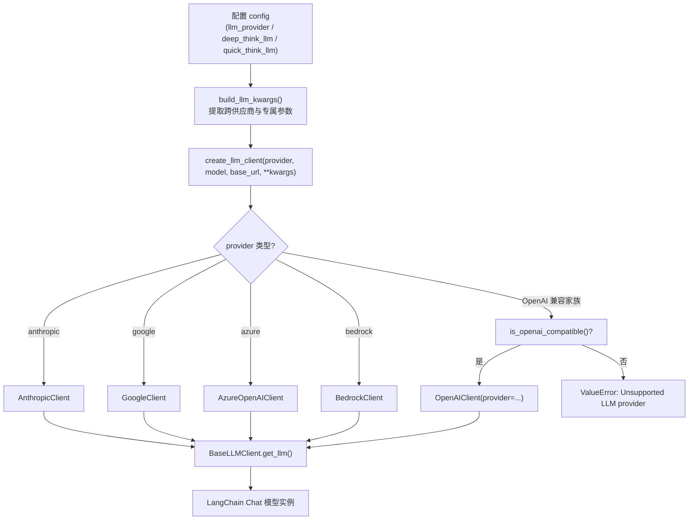

`tradingagents/llm_clients/` 是 TradingAgents 与各类大语言模型（LLM）供应商之间的**唯一适配层**。它把上层智能体对"一个可调用、可结构化输出的 LLM 实例"的诉求，与底层各供应商在 API 协议、认证方式、参数命名和线上格式（wire format）上的差异彻底解耦。本页聚焦该层的**结构设计**：抽象基类如何定义契约、工厂函数如何路由请求、OpenAI 兼容注册表如何以声明式方式收敛供应商差异，以及原生客户端如何承载真正不同的 API 协议。

需要说明的是，模型能力表（哪个模型支持哪种结构化输出）与交互式模型目录选择是相邻但独立的主题，分别见 [模型能力表与结构化输出适配](23-mo-neng-neng-li-biao-yu-jie-gou-hua-shu-chu-gua-pei) 与 [模型目录与交互选择](24-mo-xing-mu-lu-yu-jiao-hu-xuan-ze)；本页仅在工厂分派与怪癖联动处对其做必要引用。

## 设计目标与整体结构

该层要同时满足四个约束：**新增供应商成本低**（以数据行而非分支代码表达）、**导入副作用小**（在不装重型 SDK、不配置密钥时也能被导入）、**认证与端点的单一事实来源**（API Key 环境变量、默认端点集中管理）、以及**上线怪癖可隔离**（供应商特有的收发逻辑收敛到子类或能力表）。据此，代码被切分为三层：抽象基类定义契约，工厂函数负责路由，具体客户端承载实现。

下图刻画了从配置到可用 LLM 实例的完整装配路径，以及工厂内部的分派决策：

配置进入工厂前先经 `build_llm_kwargs` 归一，工厂再按供应商名分派；原生协议（Anthropic、Google、Azure、Bedrock）走独立分支，其余全部落到 OpenAI 兼容家族并由注册表统一处理。这一"先原生、后兼容"的判定顺序是刻意的——原生分支的字符串检查无需导入 OpenAI 客户端。

Sources: [factory.py](tradingagents/llm_clients/factory.py#L7-L56), [factory.py](tradingagents/llm_clients/factory.py#L90-L131), [__init__.py](tradingagents/llm_clients/__init__.py#L1-L5)

## 抽象基类 BaseLLMClient 与内容归一化

`BaseLLMClient` 是一个 ABC，只约定两件事：`get_llm()` 返回配置好的 LangChain 聊天实例，`validate_model()` 判断模型名是否在该供应商的已知清单内。基类在 `__init__` 中保存 `model`、`base_url` 和剩余 `kwargs`，并提供 `get_provider_name()`（默认取类名去掉 `Client` 后缀并小写）与 `warn_if_unknown_model()`——后者在模型校验失败时发出 `RuntimeWarning` 而非中断，体现"宽松放行、显式告警"的策略。

Sources: [base_client.py](tradingagents/llm_clients/base_client.py#L25-L63)

一个横切所有供应商的痛点是**响应内容形态不一致**：OpenAI Responses API 与 Gemini 3 会把 `response.content` 返回为带类型的块列表（如 `[{'type':'reasoning',...}, {'type':'text','text':'...'}]`），而下游智能体一律按字符串消费。`normalize_content()` 负责把文本块抽取并拼接为纯字符串，同时丢弃 reasoning/元数据块。各原生客户端都以一个 `Normalized*` 子类覆写 `invoke` 来统一调用该函数，从而把形态差异挡在智能体之外。

Sources: [base_client.py](tradingagents/llm_clients/base_client.py#L6-L22), [anthropic_client.py](tradingagents/llm_clients/anthropic_client.py#L47-L53), [google_client.py](tradingagents/llm_clients/google_client.py#L23-L31)

## 工厂函数 create_llm_client：惰性导入与路由

`create_llm_client` 是整层的入口，签名接受 `provider`、`model`、可选的 `base_url` 与 `**kwargs`。它首先把供应商名小写化，再依次匹配四个原生分支——`anthropic`、`google`、`azure`、`bedrock`——每个分支**在函数体内惰性导入**对应客户端类，这正是"导入工厂不等于导入重型 SDK"这一目标的实现方式：测试收集阶段或未配置密钥时导入本模块不会拉起这些 SDK。若四个原生分支都不命中，则导入 `is_openai_compatible` 做注册表判定，命中则构造 `OpenAIClient` 并显式传入 `provider` 名；否则抛出 `ValueError("Unsupported LLM provider: ...")`。

Sources: [factory.py](tradingagents/llm_clients/factory.py#L7-L56)

惰性导入的顺序也有讲究：原生（非 OpenAI）分支被放在前面，使它们的字符串比较不会触发 OpenAI 客户端的导入；而 OpenAI 兼容家族的判定完全委托给注册表 `OPENAI_COMPATIBLE_PROVIDERS`，避免在工厂里维护第二份供应商清单。工厂只在 `__init__.py` 中导出 `create_llm_client` 与 `build_llm_kwargs` 两个符号，作为该层的公共 API 面。

Sources: [factory.py](tradingagents/llm_clients/factory.py#L7-L56), [__init__.py](tradingagents/llm_clients/__init__.py#L1-L5)

## build_llm_kwargs：配置到参数的映射

`build_llm_kwargs(config)` 把扁平配置字典翻译成传给 `create_llm_client` 的关键字参数，并区分**专属参数**与**跨供应商参数**两类。专属参数按供应商逐一转发：`google` 读 `google_thinking_level`、`openai` 读 `openai_reasoning_effort`、`anthropic` 读 `anthropic_effort`。跨供应商参数则在任一方设置时都转发，包括采样温度 `temperature`、SDK 重试预算 `llm_max_retries` 与输出上限 `max_tokens`。

Sources: [factory.py](tradingagents/llm_clients/factory.py#L90-L131)

`: ` 该函数对边界值做了强校验，使配置错误在启动时即报错而非静默降级。`_coerce_max_retries` 接受非负整数（含环境变量来的数字字符串），显式拒绝布尔值与负数；`_coerce_max_tokens` 接受正整数，同样拒绝布尔值与非正数。此外存在两处供应商适配：重试预算仅在显式设置时转发，以保留各供应商 SDK 自身的默认值（通常为 2）；输出上限在 `google` 下改用 `max_output_tokens` 键名，其余供应商沿用 `max_tokens`。温度则统一用 `float()` 转换，使来自 `TRADINGAGENTS_TEMPERATURE` 的字符串与程序化浮点值行为一致。

Sources: [factory.py](tradingagents/llm_clients/factory.py#L59-L87), [factory.py](tradingagents/llm_clients/factory.py#L90-L131), [test_llm_max_tokens.py](tests/test_llm_max_tokens.py#L1-L40), [test_temperature_config.py](tests/test_temperature_config.py#L1-L50)

## OpenAI 兼容供应商注册表

OpenAI 兼容家族（OpenAI、xAI、DeepSeek、Qwen、GLM、MiniMax、OpenRouter、Ollama、自定义端点等）都讲同一套 Chat Completions 协议，差异仅落在**基址、密钥可选性、线上怪癖**三点上。代码用冻结数据类 `ProviderSpec` 把这些差异表达为声明式字段：`chat_class`（承载怪癖的子类）、`base_url`（默认端点）、`base_url_env`（可覆盖基址的环境变量）、`key_optional` 与 `placeholder_key`（本地免密服务）、`require_base_url`（通用端点必须显式提供）、`use_responses_api`（原生 OpenAI 的 Responses API）。单一事实来源字典 `OPENAI_COMPATIBLE_PROVIDERS` 则为每个供应商填一行。

Sources: [openai_client.py](tradingagents/llm_clients/openai_client.py#L183-L235)

下表汇总注册表中的关键行，展示声明式设计如何把差异收敛为数据：

| provider | base_url | chat_class | 密钥可选 | Responses API |
|---|---|---|---|---|
| `openai` | SDK 默认 | `NormalizedChatOpenAI` | 否 | 是 |
| `deepseek` | `https://api.deepseek.com` | `DeepSeekChatOpenAI` | 否 | 否 |
| `minimax` / `minimax-cn` | `https://api.minimax.io/v1` / `.../minimaxi.com/v1` | `MinimaxChatOpenAI` | 否 | 否 |
| `qwen` / `qwen-cn` | `dashscope-intl...` / `dashscope...` | `NormalizedChatOpenAI` | 否 | 否 |
| `ollama` | `http://localhost:11434/v1`（可用 `OLLAMA_BASE_URL` 覆盖） | `LocalCompatibleChatOpenAI` | 是 | 否 |
| `openai_compatible` | 用户提供（必经 `require_base_url`） | `LocalCompatibleChatOpenAI` | 是 | 否 |

双区域供应商（qwen/glm/minimax）刻意保留国际与国内两组端点，因为两区账号的凭据不可互换。

Sources: [openai_client.py](tradingagents/llm_clients/openai_client.py#L212-L235), [test_provider_registry.py](tests/test_provider_registry.py#L31-L61)

`OpenAIClient.get_llm()` 是注册表的消费者。它先按供应商名取出 `ProviderSpec`，再以明确的优先级解析基址：**显式传入的 `base_url`（承载配置/环境值） > 供应商环境变量覆盖（如 `OLLAMA_BASE_URL`）> 注册表默认端点**；`require_base_url` 为真且仍未解析到地址时抛错并给出 vLLM/LM Studio 的示例。密钥解析委托 `get_api_key_env`：有值则注入，`key_optional` 为真时回退到占位符（本地免密服务），否则在应设而缺失时报错。Responses API 只在原生 OpenAI 基址上开启——即基址为空或主机属于 `api.openai.com`，这样把 `openai` 供应商指向代理/网关/本地服务时会自动回落到 Chat Completions。

Sources: [openai_client.py](tradingagents/llm_clients/openai_client.py#L258-L339), [openai_client.py](tradingagents/llm_clients/openai_client.py#L242-L256)

## 供应商怪癖子类与能力表联动

OpenAI 兼容家族内的"怪癖"被隔离到 `NormalizedChatOpenAI` 的子类中，使基类保持精简。基类 `NormalizedChatOpenAI` 覆写 `invoke` 做内容归一，并在 `with_structured_output` 中查能力表决定结构化方法、以及在模型拒绝 `tool_choice` 时抑制该参数。`DeepSeekChatOpenAI` 处理 thinking 模式的往返怪癖：`_create_chat_result` 接收时捕获 `reasoning_content`，`_get_request_payload` 发送时把它重新挂回上一轮的 assistant 消息，否则 API 报 400。`MinimaxChatOpenAI` 则对 M2.x 推理模型通过 `extra_body` 注入 `reasoning_split=True`，把 `<think>` 块重定向到 `reasoning_details`，避免污染 `content`。

Sources: [openai_client.py](tradingagents/llm_clients/openai_client.py#L16-L52), [openai_client.py](tradingagents/llm_clients/openai_client.py#L88-L130), [openai_client.py](tradingagents/llm_clients/openai_client.py#L132-L163)

至于本地通用端点（vLLM、LM Studio、llama.cpp）与 Ollama，则使用 `LocalCompatibleChatOpenAI`：它们的工具调用支持参差，且常拒绝 LangChain 在 function-calling 下发送的对象形式 `tool_choice`，因此该子类在 `function_calling` 方法下把 `tool_choice` 置空但仍把 schema 绑定为工具，保证结构化输出跨本地服务器可用。

Sources: [openai_client.py](tradingagents/llm_clients/openai_client.py#L54-L69), [test_openai_compatible_provider.py](tests/test_openai_compatible_provider.py#L78-L99)

能力表 `capabilities.py` 是这些怪癖判定的**单一事实来源**：`ModelCapabilities` 声明每个模型是否支持 `tool_choice` / json_mode / json_schema、首选结构化方法，以及是否需要 `reasoning_content` 往返或 `reasoning_split`。`get_capabilities()` 依次按**精确 ID → 正则模式 → 默认**解析，并对 OpenRouter 的 `deepseek/<id>` 命名空间做前缀剥离以复用同一套怪癖。这样新增模型只需编辑表格，而非在客户端里堆叠模型名 `if` 阶梯。

Sources: [capabilities.py](tradingagents/llm_clients/capabilities.py#L1-L141)

## 原生客户端：Anthropic、Google、Azure、Bedrock

四个原生客户端承载真正不同的协议。`AnthropicClient` 用 `NormalizedChatAnthropic`，并在转发 `effort` 参数前以 `_supports_effort` 门控：`claude-haiku-*` 与 Sonnet 4.5 及更早版本会 400，只有 Opus 4.5+ 与 Sonnet 4.6+ 接受。`GoogleClient` 用 `NormalizedChatGoogleGenerativeAI`，把统一的 `api_key`（或旧名 `google_api_key`）映射为 `google_api_key`，并把字符串型的 `thinking_level` 转发——其中 `"minimal"` 对 Pro、3.8+ Flash 及 `-latest` 别名会 400，故回退为 `"low"`。`AzureOpenAIClient` 用 `NormalizedAzureChatOpenAI`，从环境变量读取部署名，且其 `validate_model()` 恒为真（任何部署名都接受）。

Sources: [anthropic_client.py](tradingagents/llm_clients/anthropic_client.py#L11-L79), [google_client.py](tradingagents/llm_clients/google_client.py#L9-L73), [azure_client.py](tradingagents/llm_clients/azure_client.py#L1-L52)

`BedrockClient` 通过 Converse API（`langchain-aws`）接入，其依赖是可选 extra，因此 `_bedrock_class()` 惰性导入并在缺失时抛出带安装提示（`pip install "tradingagents[bedrock]"`）的 `ImportError`，导入后缓存。区域解析遵循 `AWS_REGION` / `AWS_DEFAULT_REGION` / 默认 `us-west-2` 的优先级；若存在 `AWS_BEARER_TOKEN_BEDROCK` 则作为 `api_key` 传入以启用 bearer 认证，从而避免环境中的 `AWS_PROFILE` 或 SigV4 凭据覆盖它。

Sources: [bedrock_client.py](tradingagents/llm_clients/bedrock_client.py#L8-L77), [test_bedrock_provider.py](tests/test_bedrock_provider.py#L28-L62)

## API Key 环境变量映射与模型校验

`api_key_env.py` 是"供应商 → 密钥环境变量"的单一事实来源，同时被客户端与 CLI 的交互式密钥提示共用。表中既有常规供应商，也标明了两类特殊情形：`bedrock` 与 `ollama` 映射为 `None`（分别走 AWS 凭据链、无需认证），`openai_compatible` 映射到 `OPENAI_COMPATIBLE_API_KEY`（专为带密钥的中继而读，但注册表标记为可选，CLI 不强制提示）。`get_api_key_env` 做大小写不敏感查找，未知供应商返回 `None`。

Sources: [api_key_env.py](tradingagents/llm_clients/api_key_env.py#L1-L54), [test_api_key_env.py](tests/test_api_key_env.py#L1-L60)

模型校验由 `validators.validate_model()` 承担：对用户自定义或频繁变动模型的供应商（`ollama`、`openrouter`、`openai_compatible`、`mistral`、`kimi`、`groq`、`nvidia`、`bedrock`）一律放行而不告警；其余供应商的已知清单由 `model_catalog.get_known_models()` 构造（CLI 目录并集上退役但仍有效的 `LEGACY_MODELS`），命中即合法。校验失败只会触发基类的 `RuntimeWarning`，不影响实际调用。

Sources: [validators.py](tradingagents/llm_clients/validators.py#L1-L34), [model_catalog.py](tradingagents/llm_clients/model_catalog.py#L235-L256), [test_model_validation.py](tests/test_model_validation.py#L1-L60)

## 端到端接线：从 TradingAgentsGraph 到可用 LLM

实际装配发生在 `TradingAgentsGraph.__init__`：先对配置调用 `build_llm_kwargs`，若有回调则并入 `callbacks`，然后以**同一组 kwargs** 分别构造 deep 与 quick 两个客户端——二者的 `provider` 相同，只是 `model` 取 `deep_think_llm` 与 `quick_think_llm`，`base_url` 取配置的 `backend_url`。两个客户端再通过 `get_llm()` 产出 `deep_thinking_llm` 与 `quick_thinking_llm` 实例，供后续智能体与图编排消费。

Sources: [trading_graph.py](tradingagents/graph/trading_graph.py#L78-L97), [trading_graph.py](tradingagents/graph/trading_graph.py#L17-L17)

CLI 侧与之协作的入口包括 `select_llm_provider`（供应商下拉，共享 `_llm_provider_table` 的默认端点）、`resolve_backend_url`（优先级为**环境覆盖 > 菜单/区域 URL > 供应商默认**，与客户端的基址解析保持一致）以及 `ensure_api_key`（按上述映射表提示缺失密钥）。区域敏感供应商（qwen/glm/minimax）的国际与中国区由后续的区域提示来选定对应的 `-cn` 键与端点。

Sources: [prompts.py](cli/prompts.py#L352-L404), [prompts.py](cli/prompts.py#L422-L468), [test_openai_compatible_provider.py](tests/test_openai_compatible_provider.py#L68-L76)

## 扩展现有层的操作路径

新增一个 OpenAI 兼容供应商时，改动点是数据而非控制流：在 `api_key_env.PROVIDER_API_KEY_ENV` 注册密钥环境变量、在 `OPENAI_COMPATIBLE_PROVIDERS` 增加一行 `ProviderSpec`、按需在 `model_catalog` 补充可选项。仅当出现新的线上怪癖时才需要新增 `NormalizedChatOpenAI` 子类，并在能力表中登记触发条件。

Sources: [api_key_env.py](tradingagents/llm_clients/api_key_env.py#L1-L26), [openai_client.py](tradingagents/llm_clients/openai_client.py#L212-L235), [capabilities.py](tradingagents/llm_clients/capabilities.py#L108-L141)

若供应商使用**非 OpenAI 协议**，则应新增独立的 `BaseLLMClient` 实现并在 `create_llm_client` 中增加一个惰性导入分支——正如 Anthropic、Google、Azure、Bedrock 所做的那样，同时保持注册表只服务于 OpenAI 兼容家族这一清晰边界。

Sources: [factory.py](tradingagents/llm_clients/factory.py#L7-L56), [openai_client.py](tradingagents/llm_clients/openai_client.py#L192-L203)

## 延伸阅读

本页确立了供应商适配层的结构骨架。要进一步理解模型层面的适配细节，可继续阅读 [模型能力表与结构化输出适配](23-mo-neng-neng-li-biao-yu-jie-gou-hua-shu-chu-gua-pei)；若关注交互式选择与模型目录，则见 [模型目录与交互选择](24-mo-xing-mu-lu-yu-jiao-hu-xuan-ze)。供应商参数如何经环境变量进入配置，可参见 [配置系统与环境变量覆盖](29-pei-zhi-xi-tong-yu-huan-jing-bian-liang-fu-gai)。