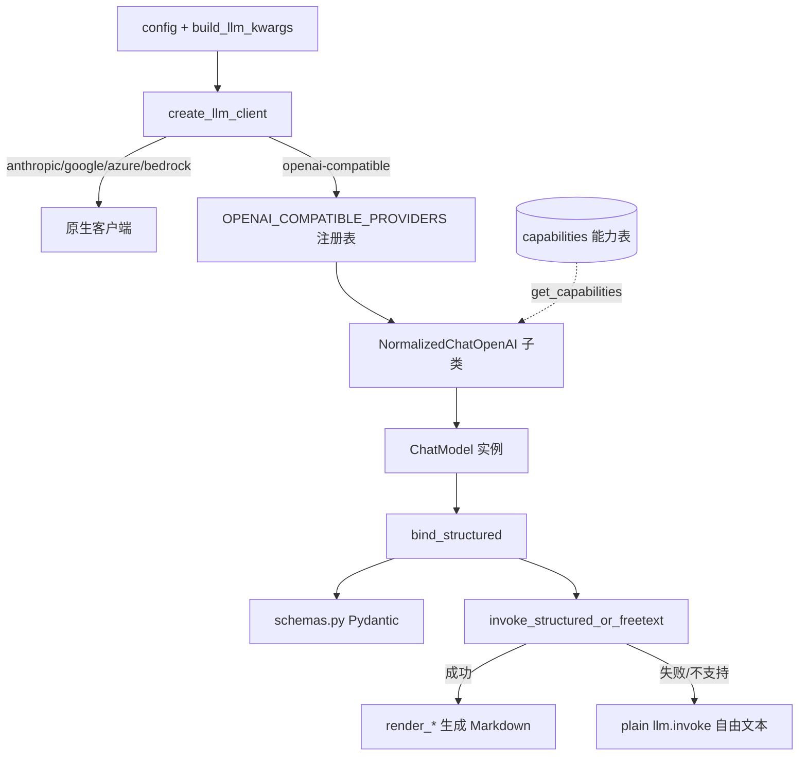
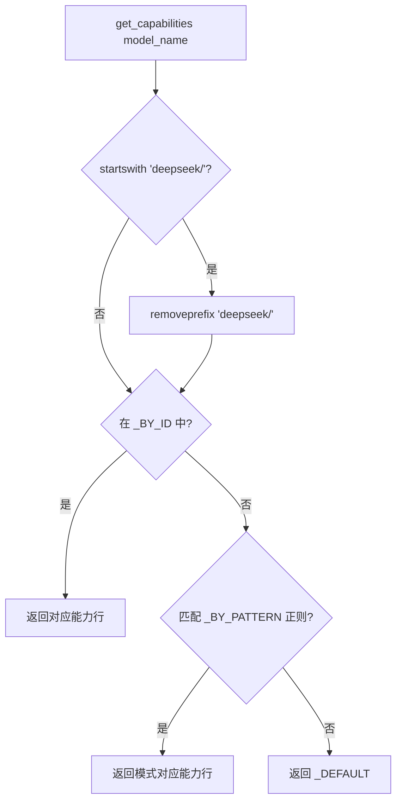
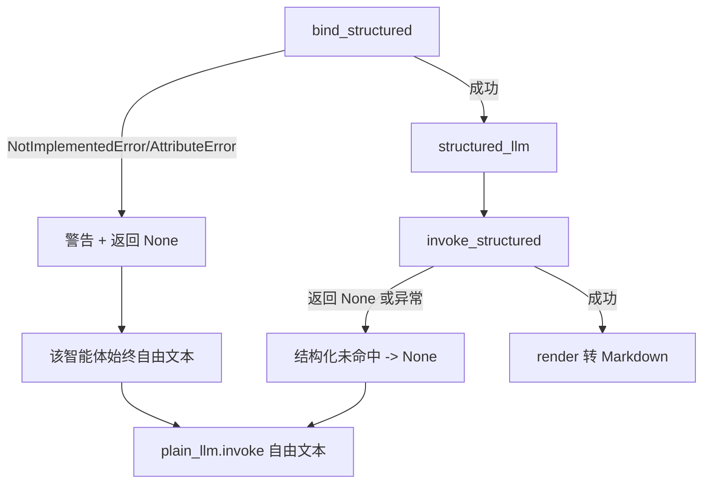

本页聚焦 TradingAgents 中两个紧密耦合却又各司其职的机制：一是**声明式的逐模型能力表**（`tradingagents/llm_clients/capabilities.py`），它集中记录每一种 OpenAI 兼容模型在 API 层面接受哪些参数、需要哪种结构化输出方法；二是**结构化输出适配层**（`tradingagents/agents/structured.py` 与 `tradingagents/agents/schemas.py`），它把供应商原生的结构化输出能力转换为带类型的 Pydantic 实例，并在失败时优雅降级为自由文本生成。本页面向高级开发者，解释这两层如何协作来隔离"模型怪癖"，让新增模型只需编辑数据表而非客户端代码。

Sources: [capabilities.py](tradingagents/llm_clients/capabilities.py#L1-L13), [structured.py](tradingagents/agents/structured.py#L1-L17)

## 架构定位：能力表作为单一事实来源

整个系统对"模型怪癖"的认知被收敛到一个**单一事实来源**：能力表。客户端的子类不再用 `if model_name == ...` 的阶梯判断，而是统一查询 `get_capabilities(model_name)`——这意味着新增一个模型（或新增一个供应商怪癖）只需编辑这张表，而不必触碰客户端代码。

数据流自上而下贯穿三层：配置经 `build_llm_kwargs` 归一为关键字参数，`create_llm_client` 按供应商选出客户端类，`get_llm()` 实例化一个能力感知的 chat 对象；随后各智能体工厂在创建时通过 `bind_structured` 将 schema 绑定为结构化输出。能力表只在"客户端层"被消费，而结构化适配逻辑只在"智能体层"被消费，两者通过 `with_structured_output` 这一个接口衔接。

Sources: [trading_graph.py](tradingagents/graph/trading_graph.py#L78-L97), [factory.py](tradingagents/llm_clients/factory.py#L7-L56), [openai_client.py](tradingagents/llm_clients/openai_client.py#L212-L234), [structured.py](tradingagents/agents/structured.py#L42-L95)

## 能力表的数据模型

`ModelCapabilities` 是一个 `@dataclass(frozen=True)`，即**不可变**的能力行。不可变性并非装饰性的——它使这些行可以被安全共享（每个模型 ID 都指向同一份实例），测试还专门断言了写入会抛出 `FrozenInstanceError`。其字段既覆盖结构化输出的方法选择，也覆盖两个与"思考模式"相关的线路格式怪癖。

| 字段 | 类型 | 语义 |
|------|------|------|
| `supports_tool_choice` | `bool` | 模型是否接受 `tool_choice` 参数；为 `False` 时客户端在 function-calling 路径上抑制该参数 |
| `supports_json_mode` | `bool` | 是否支持 `response_format={"type":"json_object"}` |
| `supports_json_schema` | `bool` | 是否支持 `response_format={"type":"json_schema",...}` |
| `preferred_structured_method` | `StructuredMethod` | 首选结构化方法，取值 `function_calling` / `json_mode` / `json_schema` / `none` |
| `requires_reasoning_content_roundtrip` | `bool` | DeepSeek 思考模式要求把上一轮的 `reasoning_content` 回传，否则 HTTP 400 |
| `requires_reasoning_split` | `bool` | MiniMax M2.x 需要 `reasoning_split=True`，把 `<think>` 块从 `content` 分流到 `reasoning_details` |

`StructuredMethod` 是一个 `Literal` 类型，其四取值的语义在注释中明确：`function_calling` 使用 tools 并尊重 `supports_tool_choice`；`json_mode` 使用 `json_object`；`json_schema` 使用完整 schema；`none` 表示无结构化输出可用，调用方回退到自由文本。

Sources: [capabilities.py](tradingagents/llm_clients/capabilities.py#L21-L45), [test_capabilities.py](tests/test_capabilities.py#L168-L174)

## 预设能力行与差异对比

当前表中有四类预设行。`_DEFAULT` 是宽松的"全支持"基线，供所有未知模型使用；另外三行则是针对具体供应商怪癖的收窄配置。理解这张对比表，就理解了系统为何要存在能力表。

| 能力行 | `supports_tool_choice` | `supports_json_mode` | `supports_json_schema` | `preferred` | 特殊标记 |
|--------|:---:|:---:|:---:|:---:|---|
| `_DEFAULT` | ✅ | ✅ | ✅ | function_calling | 无 |
| `_DEEPSEEK_CHAT`（`deepseek-chat`） | ✅ | ✅ | ❌ | function_calling | 无 |
| `_DEEPSEEK_THINKING`（reasoner / v4-flash / v4-pro） | ❌ | ✅ | ❌ | function_calling | `requires_reasoning_content_roundtrip` |
| `_MINIMAX_THINKING`（M2.x 全系） | ❌ | ❌ | ❌ | function_calling | `requires_reasoning_split` |

关键洞察在于：所有预设的 `preferred_structured_method` 都是 `function_calling`，差异集中在 `supports_tool_choice`——即"用不用 `tool_choice` 参数"。DeepSeek 思考模式接受 `tools` 数组却拒绝 `tool_choice`（官方工具调用示例也只传 `tools` 而不传 `tool_choice`），因此表中把它标为 `False`，让客户端抑制该 kwarg 但仍然把 schema 绑定为工具。MiniMax M2.x 同理：其 `tool_choice` 仅接受枚举 `{"none","auto"}`，而 LangChain 的 function-calling 路径会发送函数规格字典，导致 400。MiniMax 的 `supports_json_mode=False` 则记录了 `json_object` 只对 `MiniMax-Text-01` 有效，而非 M2.x。

Sources: [capabilities.py](tradingagents/llm_clients/capabilities.py#L47-L90)

## 解析算法：精确 ID → 模式 → 默认

`get_capabilities` 的解析按优先级三段落：首先**剥离 OpenRouter 的官方命名空间前缀**，其次精确 ID 匹配，再次正则模式匹配，最后回落到 `_DEFAULT`。其中命名空间剥离是一个容易被忽略但至关重要的细节：OpenRouter 把官方 DeepSeek 模型命名为 `deepseek/<id>`，若不剥离前缀，`deepseek/deepseek-v4-flash` 会落到 `_DEFAULT`（`tool_choice` 开启），从而在每次结构化调用时 400 并浪费一次重试。剥离逻辑刻意只作用于官方 `deepseek/` 前缀——第三方微调（如 `tngtech/deepseek-...`）保留 `_DEFAULT`，因为它们的怪癖未知。

模式匹配提供**前向兼容**：`^deepseek-v\d`、`^deepseek-reasoner`、`^deepseek-flash`、`^MiniMax-M\d` 让未来的 `deepseek-v9-*` 或 `MiniMax-M4-highspeed` 自动继承思考模式怪癖，无需改表。精确 ID 优先于模式这一点被专门测试：`deepseek-chat` 必须**不**匹配 `^deepseek-v\d` 正则，从而保留 `supports_tool_choice=True`。

Sources: [capabilities.py](tradingagents/llm_clients/capabilities.py#L93-L140), [test_capabilities.py](tests/test_capabilities.py#L124-L165)

## 客户端如何消费能力表

能力表唯一的消费点是 `NormalizedChatOpenAI.with_structured_output`。它先解析出 `method`（优先传入值，否则用 `preferred_structured_method`）；若为 `none`，则抛出 `NotImplementedError`，把降级决策上交给智能体工厂。若为 `function_calling` 且 `supports_tool_choice=False`，则通过 `kwargs.setdefault("tool_choice", None)` 抑制 LangChain 硬编码的 `tool_choice`，但**仍然**把 schema 作为工具绑定——这正是 DeepSeek 官方示例的做法。

`LocalCompatibleChatOpenAI`（供 LM Studio、vLLM、llama.cpp 等本地服务器使用）重写了同一方法，采取更激进但更安全的策略：只要解析出的方法是 `function_calling`，无条件抑制 `tool_choice`，因为本地服务器的工具调用支持各异，很多会拒绝对象形式的 `tool_choice`。这样结构化输出能在不依赖模型 ID 能力的前提下跨本地服务器工作。

Sources: [openai_client.py](tradingagents/llm_clients/openai_client.py#L16-L68), [test_deepseek_reasoning.py](tests/test_deepseek_reasoning.py#L144-L179), [test_minimax.py](tests/test_minimax.py#L48-L69)

## 供应商子类：以能力表为门控的线路怪癖

除了结构化输出，能力表还门控两类"思考模式"线路格式怪癖，它们分别由供应商子类实现，且都以 `get_capabilities` 的字段为开关。

`DeepSeekChatOpenAI` 处理 `reasoning_content` 往返：接收时在 `_create_chat_result` 把响应里的 `reasoning_content` 存入 `AIMessage.additional_kwargs`，发送时在 `_get_request_payload` 把它重新附加到对应的助手消息上。若缺失该字段，DeepSeek 思考模式会返回 HTTP 400。这一行为被刻意放在子类而非基类，测试断言通用 `NormalizedChatOpenAI` **不**带 DeepSeek 特有行为。

`MinimaxChatOpenAI` 处理 `reasoning_split`：仅当 `requires_reasoning_split` 为真时才注入，且通过 `extra_body`（而非顶层 kwarg）传递，因为 openai SDK（≥1.56）会校验顶层参数并拒绝未知项。非推理的 MiniMax 端点（Coding Plan、MiniMax-Text-01）永远收不到该标志。

Sources: [openai_client.py](tradingagents/llm_clients/openai_client.py#L88-L162), [test_deepseek_reasoning.py](tests/test_deepseek_reasoning.py#L231-L239)

## 结构化输出适配层：智能体侧的共享模式

能力表解决的是"模型接受什么"，而智能体侧的 `structured.py` 解决的是"当结构化输出可用/不可用时怎么办"。Portfolio Manager、Trader、Research Manager 与 Sentiment Analyst 遵循同一套规范模式，被集中到三个辅助函数中，使各智能体工厂保持精简。

`bind_structured(llm, schema, agent_name)` 在**智能体创建时**尝试 `llm.with_structured_output(schema)`；若抛出 `NotImplementedError` 或 `AttributeError`（供应商不支持，多见于旧版 Ollama 模型），则记录警告并返回 `None`，此后该智能体每次调用都走自由文本。`invoke_structured` 在**调用时**执行结构化调用，若结果为 `None`（思考模型可能以纯文本作答而非调用工具，导致解析器无物可返回）或抛异常，则视为结构化未命中并返回 `None`。`invoke_structured_or_freetext` 把两者与渲染函数串起来：成功则调用 `render(result)` 转为 Markdown，失败则以同一个 `prompt` 走 `plain_llm.invoke(...).content`。这形成**两级降级**：绑定级（供应商根本不支持）与调用级（单次调用失败），两级都不会阻断流水线。

Sources: [structured.py](tradingagents/agents/structured.py#L42-L95), [test_structured_agents.py](tests/test_structured_agents.py#L196-L211)

## 结构化调用路径的提示词约束：NO_EXTERNAL_TOOLS

`with_structured_output` 只绑定**一个**工具——即 schema 本身。若提示词引导模型去检索网络，模型会发出未知的 `web_search` 工具调用，从而使整个结构化尝试作废并触发一次自由文本重试，既多花一次 LLM 往返，又丢失了带类型的输出。为此，`structured.py` 导出了常量 `NO_EXTERNAL_TOOLS`，其文本明确要求"仅使用提示词内提供的证据，不调用外部工具、不搜索网络"。

四个结构化智能体（Trader、Research Manager、Portfolio Manager、Sentiment Analyst）都在提示词中内嵌该常量，且测试断言约束**确实抵达了最终发送的提示词**，而非仅仅在模块中被引用。值得注意的是，真正调用工具的智能体（market、news）仍保留其"工具调用日期范围"措辞——该修复仅作用于无工具的智能体。该常量不含花括号，以便安全嵌入 `ChatPromptTemplate` 字符串而不被解析为输入变量。

Sources: [structured.py](tradingagents/agents/structured.py#L31-L39), [test_structured_agent_prompts.py](tests/test_structured_agent_prompts.py#L1-L10), [test_structured_agent_prompts.py](tests/test_structured_agent_prompts.py#L133-L148)

## Pydantic 模式与渲染回写

`schemas.py` 定义了四个结构化智能体各自输出的类型化模型：`ResearchPlan`（Research Manager 的投资计划）、`TraderProposal`（Trader 的交易提案）、`PortfolioDecision`（Portfolio Manager 的最终决策）以及 `SentimentReport`（Sentiment Analyst 的情绪报告）。每个模型都遵循同一设计哲学：**字段描述即模型的输出指令**，从而让提示词正文只需承载上下文与评级刻度指引。评级用 `StrEnum`（`PortfolioRating` 五档、`TraderAction` 三档、`SentimentBand` 六档）约束，使每个供应商都能从 JSON 输出中稳定映射。

每个 schema 都配有一个 `render_*` 函数，把解析后的实例回写成系统其余部分早已消费的 Markdown 形态——这样显示、记忆日志与保存的报告都无需改动。此设计的核心价值在于：原始产物仍是散文，结构化只是**叠加**在三个决策型智能体上的确定性外壳。

| Schema | 产出智能体 | 渲染函数 | 关键字段 |
|--------|-----------|---------|---------|
| `ResearchPlan` | Research Manager | `render_research_plan` | `recommendation`, `rationale`, `strategic_actions` |
| `TraderProposal` | Trader | `render_trader_proposal` | `action`, `reasoning`, `entry_price`, `stop_loss`, `position_sizing` |
| `PortfolioDecision` | Portfolio Manager | `render_pm_decision` | `rating`, `executive_summary`, `investment_thesis`, `price_target`, `time_horizon` |
| `SentimentReport` | Sentiment Analyst | `render_sentiment_report` | `overall_band`, `overall_score`, `confidence`, `narrative` |

一个值得注意的健壮性设计是**可选浮点字段的归一化**。弱模型常把占位符字符串（`"None"`、`"N/A"`）写进可选数值字段，或对价格字段回答百分比（`"15%"`）、或写人类格式的金额（`"$1,234.50"`）。`_coerce_optional_float` 通过 `field_validator(mode="before")` 在验证前清洗：占位符与百分号结尾一律置 `None`，带千分位/货币符号的数字降为其数值。百分比刻意**不能**被抢救为绝对值——把 `15%` 读成 15 会把止损设在 $600 股票上的 $15 处——因此它被像占位符一样丢弃，只让单个字段置空，而非让整个决策因一个坏字段而失败、连带丢失模型答对的所有其它字段。

Sources: [schemas.py](tradingagents/agents/schemas.py#L1-L17), [schemas.py](tradingagents/agents/schemas.py#L26-L58), [test_structured_agents.py](tests/test_structured_agents.py#L74-L138)

## 智能体接线：一致模式的不同形态

四个智能体在接线时共享 `bind_structured`，但在调用处略有差异。`Portfolio Manager` 使用 `invoke_structured`，因为其类型化评级**就是**决策本身——它明确避免从渲染后的文本回读评级，以防正文引用中的评级被误当为决策，仅在降级时才用 `parse_rating` 从文本解析。`Trader` 与 `Research Manager` 使用 `invoke_structured_or_freetext`，`Trader` 还会在系统提示中要求把入场价与止损写成绝对价格（而非百分比），从源头减少 `_coerce_optional_float` 需要清洗的情况。

`Sentiment Analyst` 的接线形态不同：它先把新闻、StockTwits、Reddit 三源数据预取进提示词（三个 fetcher 均优雅降级、始终返回字符串），再把 `ChatPromptTemplate` 格式化为具体消息列表，使结构化与自由文本两条路径收到相同输入。由于数据已在提示词中，它不绑定任何工具。

Sources: [portfolio_manager.py](tradingagents/agents/managers/portfolio_manager.py#L23-L86), [trader.py](tradingagents/agents/trader/trader.py#L20-L91), [research_manager.py](tradingagents/agents/managers/research_manager.py#L14-L59), [sentiment_analyst.py](tradingagents/agents/analysts/sentiment_analyst.py#L42-L111)

## 原生供应商：不经过能力表的结构化输出

能力表**仅**覆盖 OpenAI 兼容家族。原生 Anthropic 与 Google 使用各自真正不同的 API，因此走独立的客户端类，其结构化输出依赖 LangChain 内建实现（Anthropic 用工具使用、Gemini 用 `response_schema`、OpenAI/xAI 用 `json_schema`）。这些客户端只重写 `invoke` 做内容归一化——把块状内容（reasoning、text 等）拼接为纯字符串，因为下游智能体期望 `response.content` 是字符串。

原生客户端另有一类**与结构化输出无关但同构**的能力门控：Anthropic 的 `effort` 参数仅被 Opus 4.5+、Sonnet 4.6+、Fable 5 接受，`_supports_effort` 用最小版本元组实现前向兼容判断；Google 的 `thinking_level="minimal"` 仅被 3.8 之前的编号 Flash 模型接受，`_accepts_minimal_thinking` 做同样的事。这与能力表遵循相同的"声明式门控、避免硬编码"哲学，只是它们就地实现而非集中到表。Azure 与 Bedrock 客户端则既不使用能力表，也不重写结构化输出。

Sources: [anthropic_client.py](tradingagents/llm_clients/anthropic_client.py#L14-L74), [google_client.py](tradingagents/llm_clients/google_client.py#L12-L68), [base_client.py](tradingagents/llm_clients/base_client.py#L6-L22), [schemas.py](tradingagents/agents/schemas.py#L9-L13)

## 模型校验与能力表的边界

能力表与模型校验是两件独立的事，容易混淆。`validators.validate_model` 只回答"这个模型 ID 对某供应商是否**已知**"，未知模型仅触发 `RuntimeWarning` 而不会阻断运行；而能力表回答的是"这个模型在 API 层面**接受什么**"。对 Ollama、OpenRouter、`openai_compatible` 等用户自定义模型的供应商，校验一律放行（任意模型字符串都接受），此时能力表尤其关键——因为无法靠名字列表预判怪癖，前向兼容的正则模式成为唯一的兜底。

Sources: [validators.py](tradingagents/llm_clients/validators.py#L1-L34), [base_client.py](tradingagents/llm_clients/base_client.py#L40-L52)

## 测试与验证策略

这张能力表与适配层有密集的单元测试护航。`test_capabilities.py` 覆盖精确 ID、前向兼容模式、MiniMax 精确匹配、默认回落、OpenRouter 命名空间剥离与 dataclass 不可变性；`test_deepseek_reasoning.py` 覆盖 `reasoning_content` 往返与 `tool_choice` 抑制，并含一个可选的真实 API 集成测试（验证无 `tool_choice` 路径不触发 #678 的 400）；`test_minimax.py` 覆盖 `reasoning_split` 经 `extra_body` 传递及非推理模型不注入；`test_structured_agents.py` 覆盖渲染函数、空值强转与各智能体的结构化/降级双路径；`test_structured_agent_prompts.py` 断言 `NO_EXTERNAL_TOOLS` 抵达渲染后的提示词。

Sources: [test_capabilities.py](tests/test_capabilities.py#L1-L174), [test_structured_agents.py](tests/test_structured_agents.py#L1-L31), [test_structured_agent_prompts.py](tests/test_structured_agent_prompts.py#L46-L106)

## 小结与延伸阅读

能力表把"每个模型接受哪些 API 参数"从散落在客户端代码中的条件分支，提炼为一张不可变的声明式数据表；结构化输出适配层则把"供应商原生的结构化能力"统一收敛为"带类型实例 + 优雅降级到自由文本"的共享模式。二者通过 `with_structured_output` 单一接口衔接，共同实现了新增模型/供应商只需编辑数据而非改动逻辑的设计目标。

若想继续深入，可阅读 [多供应商客户端与工厂模式](22-duo-gong-ying-shang-ke-hu-duan-yu-gong-han-mo-shi) 了解能力表所处的客户端体系全貌，以及 [模型目录与交互选择](24-mo-xing-mu-lu-yu-jiao-hu-xuan-ze) 了解 `model_catalog.py` 与 `validators.py` 如何在 CLI 层选择与校验模型；若要理解这些结构化决策如何被记录与复用，可阅读 [研究员辩论与结构化输出](16-yan-jiu-yuan-bian-lun-yu-jie-gou-hua-shu-chu) 与 [记忆日志与决策记录](25-ji-yi-ri-zhi-yu-jue-ce-ji-lu)。