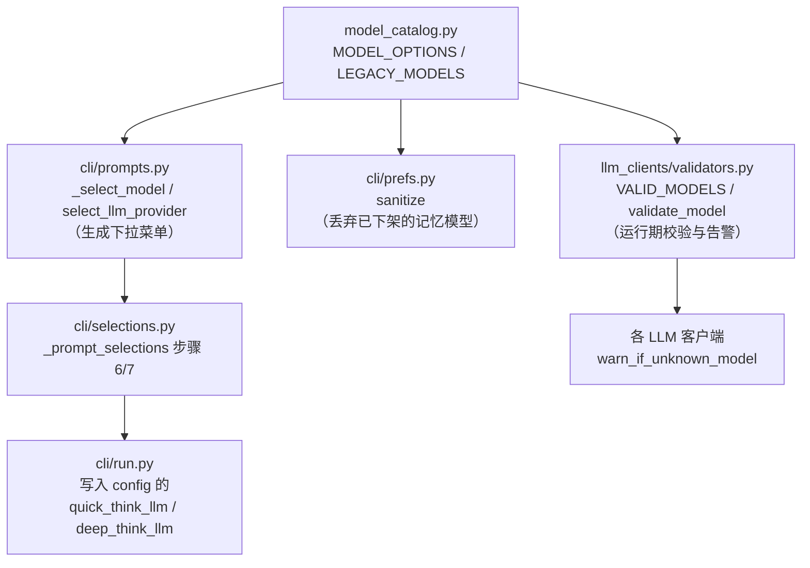
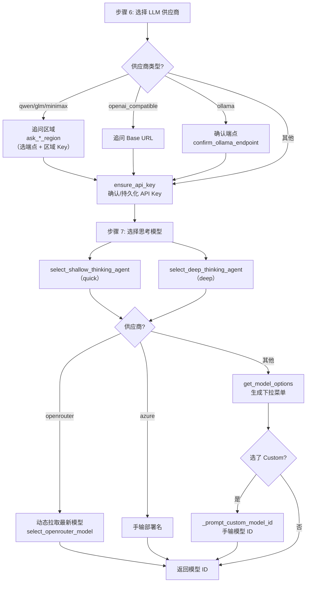
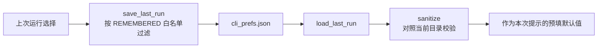

本页聚焦 TradingAgents 中"**模型目录**"这一单一数据源，以及命令行界面（CLI）如何把它转化为用户看到的**交互式下拉选择**。理解这条链路后，你就能回答三个初学者常见问题：为什么同一个供应商会提供两套模型列表（"快速思考"与"深度思考"）、当目录里没有你要的模型时该怎么办、以及这个选择结果最终是如何变成一次真实 API 调用的。

本页只覆盖"目录数据 + 选择交互"这一段。模型选好之后如何按能力表适配结构化输出，属于 [模型能力表与结构化输出适配](23-mo-xing-neng-li-biao-yu-jie-gou-hua-shu-chu-gua-pei)；客户端工厂如何据此构建实例，属于 [多供应商客户端与工厂模式](22-duo-gong-ying-shang-ke-hu-duan-yu-gong-han-mo-shi)。

## 一、整体定位：一条"目录 → 交互 → 配置"的单向链路

模型目录的设计核心是**单一数据源（single source of truth）**：所有供应商的可选模型集中定义在 `tradingagents/llm_clients/model_catalog.py`，CLI 的交互提示、偏好记忆的过滤、以及运行时真伪校验都从同一份定义派生，从而避免"菜单里列了、校验里不认"这类漂移。

下图展示目录数据如何被三类消费者复用：

可以看到，目录文件是**叶子依赖**：它不导入 CLI，也不导入任何客户端，只被单向读取。这一分层由测试 `tests/test_layering.py` 守护，保证数据定义与交互逻辑解耦。

Sources: [model_catalog.py](tradingagents/llm_clients/model_catalog.py#L1-L6), [prompts.py](cli/prompts.py#L13), [prefs.py](cli/prefs.py#L26), [validators.py](tradingagents/llm_clients/validators.py#L3)

## 二、目录的数据结构：`(显示名, 模型 ID)` 二元组

目录的最小单位是一个**二元组**，而非单纯的字符串。这允许"显示给用户看的友好标签"与"真正发给 API 的模型 ID"相互独立：

- `ModelOption = tuple[str, str]`，第一个元素是下拉菜单里的人类可读标签（例如 `"GPT-6 Luna - Fast, high-volume and cost-efficient"`），第二个元素是实际模型 ID（例如 `"gpt-6-luna"`）。
- `ProviderModeOptions = dict[str, dict[str, list[ModelOption]]]`，即 `供应商 → 模式 → 选项列表` 的三层嵌套。

这种"标签与 ID 分离"的设计意味着：每当供应商发布更强的模型，你只需替换 ID 并更新标签文案，CLI 提示与校验会自动同步，**无需改动任何交互代码**。

Sources: [model_catalog.py](tradingagents/llm_clients/model_catalog.py#L5-L6)

### 两种模式：`quick` 与 `deep`

目录最外层字典的第二个键就是**思考档位**。TradingAgents 的多智能体流程会把模型分成两类角色：承担高频、批量任务的"快速思考"模型，以及承担复杂推理的"深度思考"模型。目录对每个供应商都同时维护 `quick` 与 `deep` 两份列表，让用户在成本与能力之间做取舍。

以下表格对比了两个档位的典型差异（以 OpenAI、Google 为例）：

| 维度 | `quick`（快速思考） | `deep`（深度思考） |
| --- | --- | --- |
| 定位 | 高吞吐、低成本、速度快 | 复杂推理、多步分析 |
| OpenAI 示例 | `gpt-6-luna`、`gpt-5.6-terra` | `gpt-6-sol`、`gpt-6-astra` |
| Google 示例 | `gemini-3.8-flash`、`gemini-3.5-flash-lite` | `gemini-3.1-pro-preview` |
| 列表长度 | 通常 2–3 个精选 + 自定义 | 通常 3–4 个精选 + 自定义 |

Sources: [model_catalog.py](tradingagents/llm_clients/model_catalog.py#L96-L151)

### 供应商键的复用与区域变体

目录中并非每个键都对应一个独立列表。区域化供应商（同一家公司在国际站与中国站提供相同模型 ID）会**共享同一份列表对象**，只是键名不同：

- `_QWEN_MODELS` 同时挂在 `qwen` 与 `qwen-cn` 上；
- `_GLM_MODELS` 同时挂在 `glm` 与 `glm-cn` 上；
- `_MINIMAX_MODELS` 同时挂在 `minimax` 与 `minimax-cn` 上。

这样做的好处是**同一模型的列表只维护一次**。区域差异（端点 URL、API Key 变量）在有交互流程中通过单独的"区域选择"步骤处理。

Sources: [model_catalog.py](tradingagents/llm_clients/model_catalog.py#L169-L179), [prompts.py](cli/prompts.py#L517-L594)

## 三、每类供应商的覆盖策略

目录并非对所有供应商都维护庞大的列表。设计者根据"模型是否频繁变化"选择了三种策略：**精选列表**、**仅自定义**、**动态拉取**。理解这张表，就能预判某个供应商会看到什么样的下拉菜单。

下表汇总了目录中各供应商的覆盖策略：

| 策略 | 供应商 | 表现 |
| --- | --- | --- |
| 精选列表 | `openai`、`anthropic`、`google`、`xai`、`deepseek`、`mistral`、`kimi`、`ollama`、`qwen`/`qwen-cn`、`glm`/`glm-cn`、`minimax`/`minimax-cn` | 展示若干推荐模型 + "Custom model ID" |
| 仅自定义（`_CUSTOM_ONLY`） | `openai_compatible`、`groq`、`nvidia`、`bedrock` | 只显示 "Custom model ID"，要求用户手输 |
| 动态拉取（目录不含） | `openrouter`、`azure` | 由 CLI 单独处理（见下） |

`_CUSTOM_ONLY` 这个常量用于表达"服务端模型过多或变化太快，列举反而会过时"的判断；对这类供应商，直接把输入权交给用户是最稳妥的。

Sources: [model_catalog.py](tradingagents/llm_clients/model_catalog.py#L8-L13), [model_catalog.py](tradingagents/llm_clients/model_catalog.py#L202-L224)

## 四、"自定义模型 ID"逃生舱：让目录永不成为枷锁

每位初学者都会担心：**如果目录里没有我想要的模型怎么办？** 答案是每个精选列表末尾都固定带有一个 `("Custom model ID", "custom")` 选项。选中后，交互层会提示用户手动输入任意模型 ID。

这条"逃生舱"由测试强制保证——`test_every_provider_lets_you_name_your_own_model` 会遍历 `openai`、`anthropic`、`google`、`xai` 的两种模式，断言 `"custom"` 始终存在于选项中。因此文档里"你可以指定任意模型"的承诺，在菜单层是有保障的。

Sources: [model_catalog.py](tradingagents/llm_clients/model_catalog.py#L102), [test_model_validation.py](tests/test_model_validation.py#L78-L86)

### `LEGACY_MODELS` 与"下架但可用"的模型

与"新增"相反的方向是"退役"。目录用 `LEGACY_MODELS` 记录那些**已从菜单下架、但供应商仍在提供服务、且校验仍然认可**的模型 ID。它的作用是兼容旧配置：用户以前写下的模型名，运行时不应当被误报为"未知模型"。

`get_known_models()` 把**当前目录中的 ID**与 **`LEGACY_MODELS` 中的 ID** 合并，形成校验用的白名单。这解释了一个关键区别：**"可选"与"已知"是两个不同的集合**——一个模型可以不出现在菜单里，却依然是合法的。

Sources: [model_catalog.py](tradingagents/llm_clients/model_catalog.py#L235-L257), [test_model_validation.py](tests/test_model_validation.py#L58-L66)

## 五、交互选择：从供应商到两个模型

交互选择发生在 `cli/selections.py` 的流程中，分为三个连续步骤：**步骤 6 选供应商**、**步骤 7 选两个思考模型**、**步骤 8 配置供应商专属推理参数**。本页只详述前两步中与"模型"直接相关的部分。

Sources: [selections.py](cli/selections.py#L214-L289), [prompts.py](cli/prompts.py#L304-L349)

### 供应商菜单与端点绑定

`select_llm_provider()` 遍历 `_llm_provider_table()`，把每个供应商的 `(显示名, 供应商键, 默认端点 URL)` 三元组转成菜单项。这里的关键设计是：**菜单值本身就是一个 `(provider_key, url)` 元组**，因此选中供应商的同时也确定了默认端点。

如果上次运行的记忆值以 `-cn` 结尾（如 `qwen-cn`），菜单会先剥离后缀 `-cn` 再匹配基础供应商进行预选，因为区域菜单是**后续的独立步骤**，主菜单只列基础供应商。这避免了 `qwen` 与 `qwen-cn` 在主菜单里重复出现。

Sources: [prompts.py](cli/prompts.py#L352-L382), [prompts.py](cli/prompts.py#L422-L454)

### `_select_model`：一个函数支撑两个角色

`select_shallow_thinking_agent` 与 `select_deep_thinking_agent` 都是极薄的一层，分别以 `"quick"` 和 `"deep"` 调用同一个内部函数 `_select_model(provider, mode, default)`。该函数按供应商分派：

- `openrouter` → 走动态拉取（`select_openrouter_model`）；
- `azure` → 提示手输部署名（Azure 的"模型"实为部署名，无法预先列枚举）；
- 其余 → 调用 `get_model_options(provider, mode)` 生成下拉菜单。

当用户从菜单中选择 `"custom"` 时，函数转而调用 `_prompt_custom_model_id()` 索取自由文本。所有下拉菜单用同一个 `_matching_choice()` 计算默认高亮项——它只在下拉列表中**确实存在**该值时返回它，否则返回 `None`（保持菜单原样），这样即使记忆的模型已下架也不会报错。

Sources: [prompts.py](cli/prompts.py#L139-L141), [prompts.py](cli/prompts.py#L304-L349)

### OpenRouter 的动态拉取与"主流优先"过滤

OpenRouter 聚合了海量模型，因此目录不硬编码它，而是由 `_fetch_openrouter_models()` 在**运行时**请求 `https://openrouter.ai/api/v1/models`，并按 `created` 字段**由新到旧排序**。为让短名单不被冷门/实验性发布挤占，它再用 `_OPENROUTER_MAINSTREAM` 集合过滤出主流命名空间的模型（`openai`、`anthropic`、`google`、`deepseek` 等），取前 5 个展示；若过滤后为空则回退到全量。无论哪条路径，末尾始终附加 `"Custom model ID"`。

网络失败是**非致命**的：抓取异常只会打印一条黄色提示并返回空列表，流程继续（用户随后手输 ID）。

Sources: [prompts.py](cli/prompts.py#L211-L238), [prompts.py](cli/prompts.py#L258-L296)

## 六、选择记忆：为什么回头还能看到上次的答案

每次运行都会问同样的选择题，因此 CLI 把上次的选择记为**偏好（prefs）**，存于 `~/.tradingagents/cli_prefs.json`。记忆的字段由 `REMEMBERED` 白名单限定——只保留跨运行稳定的项（供应商、两个模型、后端 URL、分析师、输出语言、研究深度），而 ticker 与日期**故意不记忆**，因为它们每次都变。

记忆机制最精妙之处在 `sanitize()`：模型与供应商会随版本增删，所以每个记忆值在**重新提供前都要对照当前目录校验**。对于两个模型字段，它会调用 `get_model_options(base, mode)` 得到当前菜单集合，只有当记忆值**仍在其中**时才保留。`test_a_model_that_no_longer_exists_is_dropped` 验证了旧 ID（如 `gpt-5.4`）会被静默丢弃，而不是展示给用户。

Sources: [prefs.py](cli/prefs.py#L28-L91), [test_cli_prefs.py](tests/test_cli_prefs.py#L59-L68)

## 七、运行期校验：目录如何变成一条告警

选择完成后，模型 ID 写进运行配置（`cli/run.py` 的 `config["quick_think_llm"] / ["deep_think_llm"]`），并最终交给各 LLM 客户端。客户端在构建时调用 `warn_if_unknown_model()`，其判断委托给 `validators.py`。

校验逻辑分三层：

1. **`_ANY_MODEL_PROVIDERS` 白名单**——`ollama`、`openrouter`、`openai_compatible`、`mistral`、`kimi`、`groq`、`nvidia`、`bedrock` 的模型名由用户/服务端定义，**任何字符串都直接放行**，不产生告警。
2. **严格供应商**——从 `get_known_models()`（目录 + 遗留 ID）构建 `VALID_MODELS` 白名单；
3. **未知模型**——若不在白名单，客户端发出 `RuntimeWarning`，但**仍然继续运行**（"Continuing anyway"）。

这体现了一个贯穿始终的哲学：**校验是提示性的，不是阻断性的**。目录帮助用户在常见情况下选对，但从不阻止他们使用目录之外的新模型。

Sources: [validators.py](tradingagents/llm_clients/validators.py#L8-L33), [base_client.py](tradingagents/llm_clients/base_client.py#L40-L52)

下表把"选择模型"时可能遇到的几类行为与其代码依据并置，便于快速排查：

| 现象 | 触发的判定 | 结果 |
| --- | --- | --- |
| 下拉菜单里有"Custom model ID" | 每个精选列表末尾的 `("Custom model ID","custom")` | 选中后手输任意 ID |
| 输入旧模型却不告警 | `LEGACY_MODELS` 并入 `get_known_models()` | 视为已知，照常运行 |
| 输入不存在的 OpenAI 模型 | `validate_model` 返回 False | 发出 `RuntimeWarning`，继续运行 |
| 所有自定义供应商 | `_ANY_MODEL_PROVIDERS` 白名单 | 永不告警 |

Sources: [model_catalog.py](tradingagents/llm_clients/model_catalog.py#L235-L257), [validators.py](tradingagents/llm_clients/validators.py#L20-L33), [test_model_validation.py](tests/test_model_validation.py#L35-L55)

## 小结与延伸阅读

模型目录体系由三块拼成：**`model_catalog.py`（数据）**、**`cli/prompts.py` + `cli/selections.py`（交互）**、**`validators.py`（校验）**。三者共享"供应商 → 模式 → 选项"这一数据结构，让新增或退役模型只需改动一处。

如果你已经理解本页，建议按以下顺序继续：

- 想看选定的模型如何被工厂实例化：阅读 [多供应商客户端与工厂模式](22-duo-gong-ying-shang-ke-hu-duan-yu-gong-han-mo-shi)；
- 想了解不同模型接受的 API 参数差异：阅读 [模型能力表与结构化输出适配](23-mo-xing-neng-li-biao-yu-jie-gou-hua-shu-chu-gua-pei)；
- 想了解完整交互步骤（ticker、日期、分析师、研究深度）：阅读 [交互式 CLI 与运行流程](5-jiao-hu-shi-cli-yu-yun-xing-liu-cheng)；
- 想了解环境变量如何跳过这些选择：阅读 [无提示批处理运行（标志与环境变量）](6-wu-ti-shi-pi-chu-li-yun-xing-biao-zhi-yu-huan-jing-bian-liang) 与 [配置系统与环境变量覆盖](29-pei-zhi-xi-tong-yu-huan-jing-bian-liang-fu-gai)。