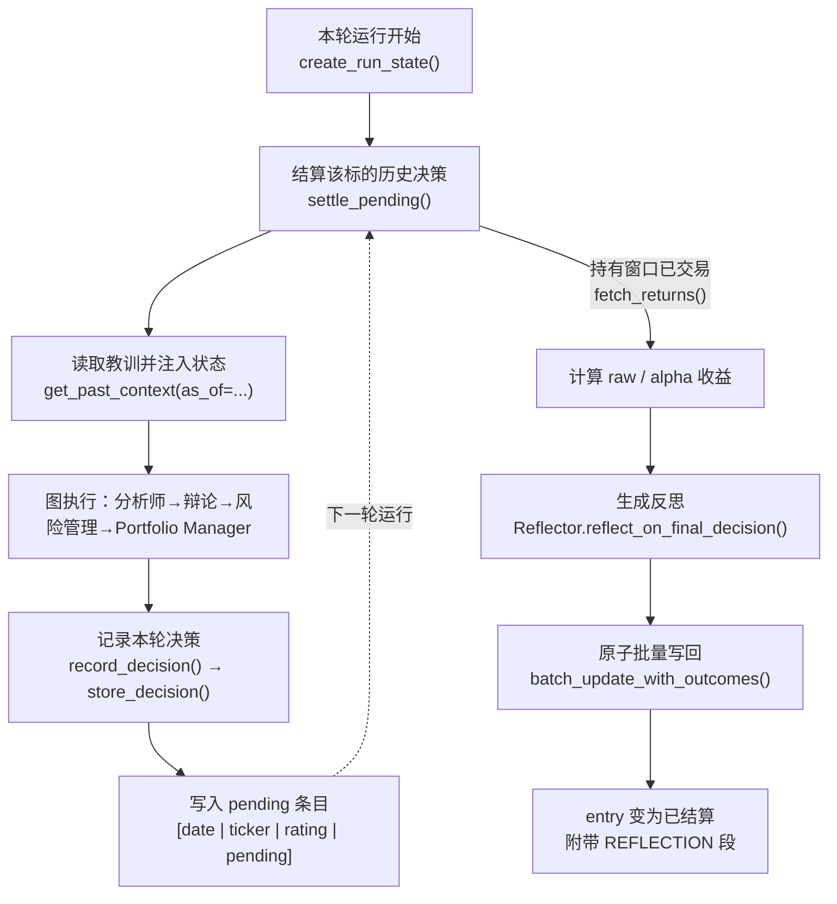
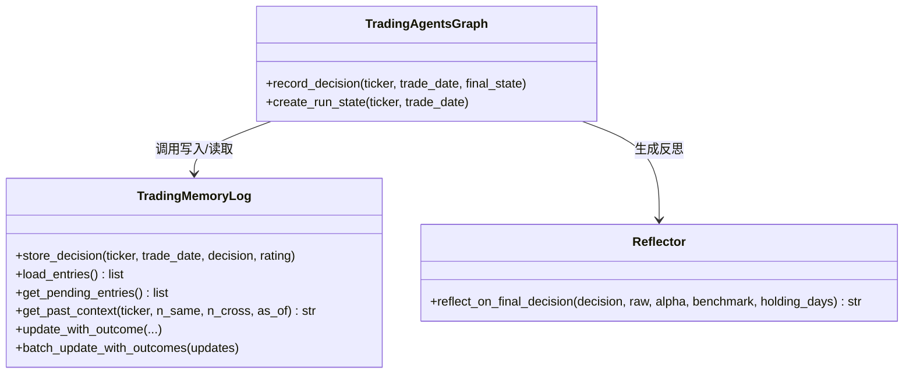

TradingAgents 的每一次分析都会产出一个明确的交易决策，而**记忆日志（memory log）** 就是把"做过的决定"和"决定后来是否奏效"沉淀下来的地方。它是一份**仅追加（append-only）的 Markdown 记录**：每次运行结束时写入一条待结算的决策，下一次分析同一个标的时先结算旧决策、再把学到的经验注入到新一轮的 Portfolio Manager 提示中。本页聚焦于这份日志本身——它的存储格式、决策记录的写入、过去上下文的读取与注入、以及内容寻址的时点安全约束。关于结算时如何归因 Alpha，请参见 [反思与结算：Alpha 归因](26-fan-si-yu-jie-suan-alpha-gui-yin)；关于如何用日志评估决策质量，请参见 [回溯测试与决策评估框架](27-hui-su-ce-shi-yu-jue-ce-ping-gu-kuang-jia)。

记忆层由三个模块构成，各司其职，边界清晰：`log` 负责存储与解析条目，`settlement` 负责一旦持有窗口已交易就用市场数据给决策打分，`reflection` 负责把结果转写成一句话教训。`__init__` 只导出对外唯一入口 `TradingMemoryLog`。

Sources: [__init__.py](tradingagents/memory/__init__.py#L1-L11), [log.py](tradingagents/memory/log.py#L1-L27), [settlement.py](tradingagents/memory/settlement.py#L1-L155), [reflection.py](tradingagents/memory/reflection.py#L1-L64)

## 三阶段生命周期

记忆日志的价值不在于"记录"本身，而在于它构成一个**闭环**：一个决策在本次运行被写入，在下一次运行被结算，被结算后产生的教训又被喂回给未来运行。整个过程围绕同一条条目（entry）展开，其状态从 `pending`（待结算）迁移为已结算，并附带一段反思。

这段循环的关键设计是**结算发生在"进入新一轮"时**（`create_run_state` 中调用 `settle_pending`），而不是在运行结束时。因此某个标的最近一次决策会保持 `pending` 直到该标的被再次分析；如果调用方已经分析完一个标的（例如回测扫描或定时任务），可以直接调用 `settle_pending` 主动结算。

Sources: [trading_graph.py](tradingagents/graph/trading_graph.py#L305-L334), [settlement.py](tradingagents/memory/settlement.py#L107-L155), [log.py](tradingagents/memory/log.py#L31-L61)

## 条目格式：标签行 + DECISION/REFLECTION

日志文件是一串用 `\n\n<!-- ENTRY_END -->\n\n` 分隔的条目块。选择 HTML 注释作为分隔符是有意为之：它是**LLM 正文中不可能出现的硬边界**，因此可以用它安全地切分条目，而不会与模型输出的 Markdown 冲突。每个块由第一行的**标签行（tag line）** 加上随后的正文段组成。

标签行是一个方括号包裹、以 `|` 分隔的字段列表。`pending` 条目只有 4 个字段，已结算条目则追加收益与持有期字段，还可带一个 `resolved:` 时点字段：

| 字段 | pending 示例 | 已结算示例 | 含义 |
|------|-------------|-----------|------|
| `[0]` date | `2026-01-10` | `2026-01-10` | 决策所基于的交易日期 |
| `[1]` ticker | `NVDA` | `NVDA` | 标的符号 |
| `[2]` rating | `Buy` | `Buy` | 5 档评级 |
| `[3]` | `pending` | `+5.0%` | 未结算时为字面量 `pending`，否则为原始收益 |
| `[4]` alpha | — | `+2.0%` | 相对基准的超额收益 |
| `[5]` holding | — | `5d` | 持有交易天数 |
| `[6+]` | — | `resolved:2026-01-17` | 结果"已知"的日期（时点截断用） |

正文段落以 `DECISION:` 开头存放完整决策文本，结算后再附加 `REFLECTION:` 段。解析时用预编译正则 `_DECISION_RE` 与 `_REFLECTION_RE` 分别抽取两段内容；正则被提升为类属性，避免每次 `load_entries()` 重复编译。

Sources: [log.py](tradingagents/memory/log.py#L10-L17), [log.py](tradingagents/memory/log.py#L293-L343)

## 写入：一次运行的决策记录

决策的写入发生在运行**结束**时，由 `record_decision()` 驱动：它先写运行状态 JSON，取得 `final_trade_decision`，再交给 `memory_log.store_decision()`。若本轮没有最终决策，会记录一条警告并跳过写入——一个没有决策的运行不该在日志中留下条目。

`store_decision` 有几个值得注意的稳健性设计。第一，**幂等守卫**：在写入前用一次原始文本扫描（而非完整解析）检查是否已存在 `[trade_date | ticker |` 前缀的行。任何匹配的条目都会阻止重复写入——**无论它是 pending 还是已结算**，因为若在结果落地后重跑，否则同一条决策会被"过去上下文"和所有聚合统计重复计数。第二，**评级来源**：优先使用调用方传入的 `rating`（`run_rating(final_state)` 得到的 Portfolio Manager 自评），否则回退到从决策文本中解析的 `parse_rating`。无法读出评级的决策被打上 `REVIEW` 哨兵值，而不是伪装成 `Hold`——一个读不出方向的决策若被记成 `Hold`，会被后续运行当作"一次从未做出的看多/看平判断"引用。

Sources: [trading_graph.py](tradingagents/graph/trading_graph.py#L336-L348), [log.py](tradingagents/memory/log.py#L31-L61), [rating.py](tradingagents/agents/rating.py#L1-L107)

## 读取：过去上下文与被注入的位置

读取路径的核心是 `get_past_context()`，它把历史条目格式化成一段可直接拼进提示的文本。它做两件事：**筛选**与**格式化**。筛选时先排除所有 pending 条目，然后从最新到最旧遍历，分别收集最多 `n_same=5` 条**同标的**条目和最多 `n_cross=3` 条**跨标的**条目。同标的条目用 `_format_full` 输出（标签行 + `DECISION` + `REFLECTION`），跨标的条目用 `_format_reflection_only` 输出（标签行 + 反思；若反思缺失则截取决策前 300 字符），从而在上下文预算内保留最相关的经验。

这段文本通过状态的 `past_context` 字段流转，最终被 Portfolio Manager 读取。Portfolio Manager 节点把它渲染成提示中的一行 `- Lessons from prior decisions and outcomes:`，只有非空时才加入。这是一条"阅读路径与写入路径对称"的设计：`create_run_state()` 是唯一构建初始状态的入口，同时完成结算与注入；任何自行拼装状态的入口都会绕过记忆日志。

Sources: [log.py](tradingagents/memory/log.py#L80-L119), [log.py](tradingagents/memory/log.py#L326-L343), [portfolio_manager.py](tradingagents/agents/managers/portfolio_manager.py#L26-L42), [state.py](tradingagents/agents/state.py#L69-L73), [trading_graph.py](tradingagents/graph/trading_graph.py#L305-L323)

## 时点一致性：resolved 与 as_of

记忆日志最大的陷阱是**未来函数**：一次历史日期（回测）运行若读到了尚未发生的结算结果，就等于从未来偷看了答案。为堵住这个漏洞，已结算条目会记录结果"已知"的日期。

结算时 `fetch_returns()` 返回的 `resolution_date` 是**用于计算收益的最后一根 K 线的日期**——在此之前，窗口内的每一根收盘价都还未发生。`_resolved_tag()` 把它写入标签行的 `resolved:YYYY-MM-DD` 字段。读取时，`get_past_context(as_of=...)` 只在给定日期时启用过滤：仅保留同时满足"存在 `resolved` 字段"且"`resolved <= as_of`"的条目。这带来一个**保守的迁移策略**：没有 `resolved` 字段的历史遗留条目在时点查询中会被排除（无法证明它们在当日本来已知），但在 `as_of=None` 的实时运行中照常显示。

该过滤的开关由 `_memory_as_of()` 决定：只有当交易日期早于今天（`is_historical`）时才返回该日期作为截断点，实时或未来日期运行返回 `None`，从而不影响实盘行为。同标的与跨标的教训都受此闸门约束。

| 运行类型 | `_memory_as_of` | 效果 |
|---------|----------------|------|
| 历史/回测（date < 今天） | 返回该交易日期 | 仅注入当日已结算的教训 |
| 实时（date = 今天） | `None` | 不过滤，包含遗留条目 |
| 未来日期 | `None` | 不过滤 |

Sources: [log.py](tradingagents/memory/log.py#L80-L119), [log.py](tradingagents/memory/log.py#L242-L254), [log.py](tradingagents/memory/log.py#L305-L318), [settlement.py](tradingagents/memory/settlement.py#L51-L105), [trading_graph.py](tradingagents/graph/trading_graph.py#L147-L155), [test_memory_pointintime.py](tests/test_memory_pointintime.py#L1-L96)

## 并发与原子性

记忆日志是"读取—修改—写回"的文件，天然有并发风险：两个写者各自读到同一份文本，后写者会丢掉先写者的改动。为此，所有写操作都包在 `locked()` 上下文管理器中——它在一个相邻的 `.lock` 文件上取跨线程、跨进程的排他锁（POSIX 用 `fcntl.flock`，Windows 用 `msvcrt.locking`）。

结算时的写回采用 `batch_update_with_outcomes()`：一次读取、一次改写、一次写入，避免为多条待结算条目反复做 I/O。它先按 `(trade_date, ticker)` 建立更新映射，遍历所有块，用更新数据把匹配的 pending 标记替换为已结算标记并追加 `REFLECTION` 段；任何未被匹配的块原样保留（例如数据仍未就绪的条目）。最后通过 **临时文件 + `os.replace()`** 落地——这是原子替换，即使写入中途崩溃也不会留下半截文件；读取者要么看到旧文件，要么看到新文件。

Sources: [files.py](tradingagents/dataflows/files.py#L39-L80), [log.py](tradingagents/memory/log.py#L121-L237)

## 条目轮转

长期运行会让日志无限增长。可选的 `memory_log_max_entries` 提供了一个**有上限的轮转**：当已结算条目数超过上限时，`_apply_rotation()` 会从最旧的已结算条目开始丢弃，直到回到上限内。关键约束是 **pending 条目永不轮转**——它们代表尚未处理的工作，丢弃它们会永久丢失一次待结算的决策。当该配置为 `None` 或非正数时，轮转完全关闭。

Sources: [log.py](tradingagents/memory/log.py#L256-L291), [default_config.py](tradingagents/default_config.py#L82-L86)

## 配置项速查

记忆日志的行为由配置字典驱动，默认值在 `build_default_config()` 中给出，并支持环境变量覆盖。

| 配置键 | 默认值 | 作用 |
|-------|-------|------|
| `memory_log_path` | `~/.tradingagents/memory/trading_memory.md` | 日志文件路径；同时可用 `TRADINGAGENTS_MEMORY_LOG_PATH` 覆盖 |
| `memory_log_max_entries` | `None` | 已结算条目上限；`None` 关闭轮转 |
| `holding_period_days` | `5` | 结算时衡量的持有交易天数 |
| `benchmark_ticker` | `None` | 显式指定所有标的的 Alpha 基准 |
| `benchmark_map` | 后缀映射（如 `.T → ^N225`） | 依据交易所后缀自动选基准，US 默认 SPY |

`memory_log_path` 与 `memory_log_max_entries` 在 `TradingMemoryLog.__init__` 中读取：前者会展开 `~` 并预建父目录，为空时不启用日志（所有方法直接返回）。回测运行会用自己的日志路径覆盖它，从而**绝不污染实盘日志**。关于这些配置键如何被环境变量覆盖的完整机制，请参见 [配置系统与环境变量覆盖](29-pei-zhi-xi-tong-yu-huan-jing-bian-liang-fu-gai)。

Sources: [default_config.py](tradingagents/default_config.py#L73-L86), [default_config.py](tradingagents/default_config.py#L161-L175), [log.py](tradingagents/memory/log.py#L19-L27), [backtest.py](tradingagents/backtest.py#L140-L156)

## 入口一致性：CLI 与 propagate 共享记忆行为

记忆日志必须在**所有入口**都生效，否则交互式 CLI 会成为一个"只分析、不记忆"的旁路。由于 CLI 自行流式执行图而非调用 `propagate()`，历史上曾出现过记忆步骤只在 `propagate()` 里运行的问题。现在的修法是让两条路径共享同一对图方法：`create_run_state()`（结算 + 注入过去上下文 + 解析标的身份）与 `record_decision()`（写状态日志 + 写记忆条目）。`propagate()` 内部调用它们，CLI 的运行流程也显式调用它们，从而保证：待结算决策被处理、Portfolio Manager 获得过去上下文、完成的决策被记录。

Sources: [cli/run.py](cli/run.py#L214-L218), [trading_graph.py](tradingagents/graph/trading_graph.py#L350-L382), [test_cli_memory_log.py](tests/test_cli_memory_log.py#L1-L110)

## 小结与延伸阅读

记忆日志以极简的存储形式（仅追加 Markdown + 硬分隔符 + 标签行）承载了一个完整的"记录—结算—反思—注入"闭环。它的工程亮点集中在三点：**硬边界分隔符**让解析与 LLM 输出解耦，**`resolved:` 时点字段**让历史运行无法偷看未来，**锁 + 原子替换**让并发写者互不破坏。日志本身只负责"存"与"读"，真正的价值在于它把过去的教训喂给未来。

接下来建议按顺序阅读：先看 [反思与结算：Alpha 归因](26-fan-si-yu-jie-suan-alpha-gui-yin)，理解条目里的 raw/alpha 收益如何计算、反思如何生成与归因；再看 [回溯测试与决策评估框架](27-hui-su-ce-shi-yu-jue-ce-ping-gu-kuang-jia)，了解如何用按评级分组的日志聚合来评估决策质量。若关心注入内容如何在节点间流转，可参考 [智能体状态模型与数据流转](14-zhi-neng-ti-zhuang-tai-mo-xing-yu-shu-ju-liu-zhuan) 与 [投资组合上下文感知](30-tou-zi-zu-he-shang-xia-wen-gan-zhi)。