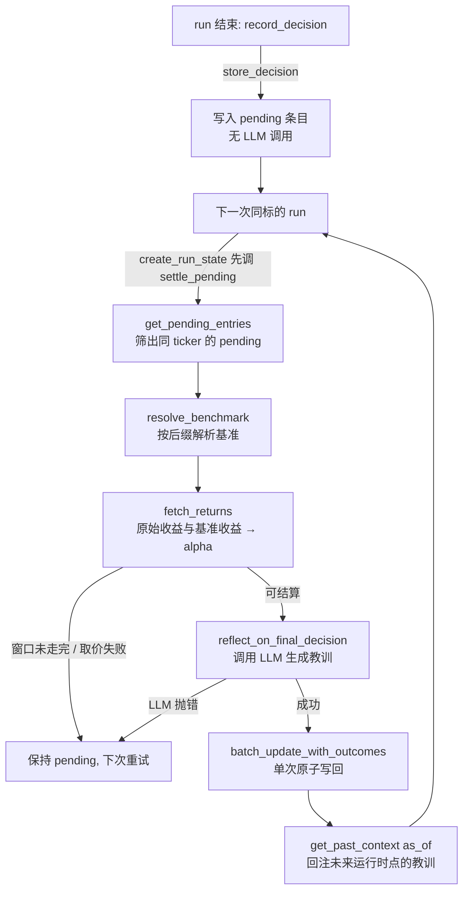

本页聚焦 TradingAgents 记忆中「决策闭环」的后半段：一条已经记录的决策，在其持有窗口走完之后如何被**结算（settlement）**、如何被归因成相对基准的 **Alpha**、以及如何被压缩成一条可供未来运行读取的**反思（reflection）**。它回答三个问题：收益如何度量、基准如何选择、教训如何在时点一致的前提下回注到未来运行中。记忆日志本身的存储格式与决策记录机制属于 [记忆日志与决策记录](25-ji-yi-ri-zhi-yu-jue-ce-ji-lu) 的范畴，而回测的评分与聚合则属于 [回溯测试与决策评估框架](27-hui-su-ce-shi-yu-jue-ce-ping-gu-kuang-jia)，本页只在与结算路径发生接线的位置引用它们。

## 模块定位：决策闭环的“后视镜”

`tradingagents/memory` 包把「决策—度量—反思」三段职责拆成三个文件，`__init__.py` 用一句话点明它们的关系：`log` 保存条目，`settlement` 在持有窗口走完后度量收益，`reflection` 把结果转成下一次运行的教训。三者共享同一份 markdown 日志，但通过不同的模块边界隔离关注点——`settlement` 负责取价与算术，`reflection` 负责调用 LLM 组织语言，`log` 负责持久化与解析。

Sources: [log.py](tradingagents/memory/log.py#L1-L1), [settlement.py](tradingagents/memory/settlement.py#L1-L2), [reflection.py](tradingagents/memory/reflection.py#L1-L1), [__init__.py](tradingagents/memory/__init__.py#L1-L11)

| 模块 | 对外主入口 | 职责 |
| --- | --- | --- |
| `settlement.py` | `settle_pending` / `fetch_returns` / `resolve_benchmark` | 判定可结算性、取价、计算原始收益与 Alpha、驱动反思 |
| `reflection.py` | `Reflector.reflect_on_final_decision` | 用 `quick_thinking_llm` 把结果改写成 2–4 句教训 |
| `log.py` | `TradingMemoryLog` | 追加/解析 markdown 条目、批量原子写回 outcome、按 `as_of` 过滤注入上下文 |

`TradingMemoryLog` 的构造只关心两件事：日志路径（`memory_log_path`，缺省则不写盘，所有操作静默 no-op）与解析条目数量上限（`memory_log_max_entries`，`None` 表示禁用轮转）。路径存在时会预建父目录，因此结算与记录不需要额外的目录准备步骤。

Sources: [log.py](tradingagents/memory/log.py#L19-L27), [default_config.py](tradingagents/default_config.py#L82-L86)

## 结算-反思流水线

整条闭环的关键特征是**结算发生在“下一次运行”的入口，而不是决策产生的那次运行**。一次运行结束时只写入一条 `pending` 条目；下一次针对同一标的运行时，才在构建初始状态之前把已走完窗口的旧决策结算掉。这个时序保证了结算所需的行情（持有窗口的最后收盘价）在所注入教训的使用时点之前已经存在。

Sources: [trading_graph.py](tradingagents/graph/trading_graph.py#L305-L334), [settlement.py](tradingagents/memory/settlement.py#L107-L119)

图中每个节点都对应一个可验证的函数边界。`store_decision` 只追加不调用 LLM；`settle_pending` 会先筛出与当前标的一致的所有 pending 条目，若为空直接返回，避免不必要的取价与反思开销；只有能算出收益的条目才会进入 `updates`，最后统一由 `batch_update_with_outcomes` 一次性落盘，把多次反思的 I/O 合并为一次。值得注意的是，`settle_pending` 采用一个明确的取舍：**每次运行只结算同标的历史条目**，其他标的的 pending 条目会一直累积到那个标的下次被运行时才处理。

Sources: [settlement.py](tradingagents/memory/settlement.py#L107-L155), [log.py](tradingagents/memory/log.py#L186-L237), [trading_graph.py](tradingagents/graph/trading_graph.py#L336-L348)

## Alpha 归因的数学定义

Alpha 被定义为**原始收益减去基准收益**：`alpha = raw - bench_ret`。原始收益取标的自身两个交易日收盘价的相对变化，`raw = (stock.iloc[holding_days] - stock.iloc[0]) / stock.iloc[0]`；基准收益用同样的方式在基准序列上计算，但要保证估值的两个端点与标的窗口对齐——基准的入场价与出场价通过在标的的入场日、出场日上做 `asof` 取值得到。这样即使标的与基准的交易日历不同（例如加密货币周末也交易，而指数不交易），两者的收益率仍然跨越相同的日期区间。

Sources: [settlement.py](tradingagents/memory/settlement.py#L91-L94), [settlement.py](tradingagents/memory/settlement.py#L84-L89)

持有窗口以**交易日**为单位，由配置项 `holding_period_days` 控制（默认 5）。由于是交易日口径，取数时需要把它换算成日历跨度：代码用 `round(holding_days * 7 / 5) + 7` 估算「5 个交易日约 7 天，再加一周缓冲防止假期」，仅用于确定取价上界，不会改变 `holding_days` 这个真实的窗口长度。窗口的入场点被定义为标的序列在取数区间内的第一根 K 线（即 trade_date 之后的首个交易日），出场点是其后第 `holding_days` 根 K 线。

Sources: [settlement.py](tradingagents/memory/settlement.py#L66-L70), [settlement.py](tradingagents/memory/settlement.py#L81-L83)

一个必须明确的语义边界：**收益率是按各自货币的百分比进行比较的**，代码并不做汇率调整。因此对非美标的，「Alpha vs 区域指数」度量的是以本币计价百分点的相对强弱，而不是美元口径的超额收益。这一点在 `resolve_benchmark` 的文档字符串中被显式声明。

Sources: [settlement.py](tradingagents/memory/settlement.py#L20-L21)

## 基准选择：resolve_benchmark

`resolve_benchmark` 按优先级决定用哪个指数作为 Alpha 基线。第一优先级是配置项 `benchmark_ticker`，一旦设置就对所有标的生效；此时它会被 `normalize_symbol` 归一化，与标的符号走同一套别名映射（例如把用户写的 `SPX500` 映射到 Yahoo 的 `^GSPC`），否则取价会落空、决策将永远停留在 pending。若未设置，则落入 `benchmark_map` 的后缀匹配：把标的符号归一化并转大写后，逐个后缀做大小写不敏感的后缀匹配，命中即返回对应指数；US 上市的无点号标的、以及像 `BRK.B` 这类无法识别的后缀，最终都回落到空后缀项（默认 `SPY`）。

Sources: [settlement.py](tradingagents/memory/settlement.py#L13-L34), [tests/test_memory_log.py](tests/test_memory_log.py#L581-L680)

默认 `benchmark_map` 覆盖了主要交易所的区域指数，其设计意图是让美股标的继续显示「Alpha vs SPY」，而海外标的自动换用本地区域指数：

| 后缀 | 基准指数 | 市场 |
| --- | --- | --- |
| `""`（无后缀） | `SPY` | 美股默认 |
| `.NS` / `.BO` | `^NSEI` / `^BSESN` | 印度 NSE / BSE |
| `.T` | `^N225` | 东京（日经 225） |
| `.TW` / `.TWO` | `^TWII` | 台湾 |
| `.KS` / `.KQ` | `^KS11` / `^KQ11` | 韩国 |
| `.HK` | `^HSI` | 香港 |
| `.SI` | `^STI` | 新加坡 |
| `.L` / `.DE` / `.PA` | `^FTSE` / `^GDAXI` / `^FCHI` | 伦敦 / 德国 / 巴黎 |
| `.AS` / `.SW` / `.MI` | `^AEX` / `^SSMI` / `FTSEMIB.MI` | 荷兰 / 瑞士 / 米兰 |
| `.TO` / `.AX` | `^GSPTSE` / `^AXJO` | 多伦多 / 澳洲 |
| `.SS` / `.SZ` | `000001.SS` / `399001.SZ` | 上海 / 深圳 |
| `.SA` | `^BVSP` | 巴西 B3 |

Sources: [default_config.py](tradingagents/default_config.py#L161-L193), [tests/test_memory_log.py](tests/test_memory_log.py#L611-L627)

后缀匹配的一个细节：`.SH` 并非 Yahoo 使用的后缀，但测试用例确认 `600519.SH` 仍会路由到 `000001.SS`，因为归一化步骤（`normalize_symbol`）会先把 `.SH` 改写为 `.SS` 再进入后缀匹配。这使得交易所原生后缀与 Yahoo 后缀并存时依旧能解析到正确的基准。

Sources: [tests/test_memory_log.py](tests/test_memory_log.py#L611-L620), [symbols.py](tradingagents/dataflows/symbols.py#L103-L140)

## 结算窗口与可结算性判定

`fetch_returns` 是「现在能不能结算」的唯一判据。它返回一个四元组 `(raw_return, alpha_return, holding_days, resolution_date)`；当且仅当能确定收益时第四项才有值，否则返回全 `None`，让条目留在 pending 状态下次重试。它通过两道闸门拒绝过早结算：其一，取到的收盘价数量必须**严格大于** `holding_days`，即整个持有窗口（连同出场的那一根 K 线）都已经交易过，否则宁可等待也不结算半个窗口的残缺收益；其二，基准序列必须覆盖窗口两端——基准的第一根 K 线不晚于入场日、最后一根 K 线不早于出场日，否则出场价还可能变动。任何取价异常（标的退市、符号不可达、上游超时）都会被兜底捕获并转为 `None`，绝不中断正在进行的分析。

Sources: [settlement.py](tradingagents/memory/settlement.py#L51-L104), [tests/test_memory_log.py](tests/test_memory_log.py#L530-L577)

`resolution_date` 是本页与「时点一致性」之间最关键的桥梁：它被定义为**出场那根 K 线的日期**，也就是这个结果对外可知的最晚取价时点。这个字段随后被 `resolved:<date>` 编码进日志标签，作为未来过滤器的时间戳使用。

Sources: [settlement.py](tradingagents/memory/settlement.py#L95-L98), [log.py](tradingagents/memory/log.py#L241-L254)

取价前的清洗由 `_by_day` 完成，它做两件事：丢弃小于等于零的收盘价（缺失或非正的价不是可结算的 K 线），以及剥离时区信息。剥离时区的原因被明确记录——Yahoo 会把日线打在其所处市场的午夜上（加密货币是 UTC，SPY 是纽约时间），只有抹掉时刻、按日历日对齐，两条序列才能在同一批日期上相遇。

Sources: [settlement.py](tradingagents/memory/settlement.py#L37-L48), [market.py](tradingagents/dataflows/vendors/yahoo/market.py#L268-L274)

## 反思提示词：把结果压缩成教训

`Reflector` 持有一个 `quick_thinking_llm`，唯一公开方法是 `reflect_on_final_decision`。它构造两条消息：一条系统提示约束输出格式与内容结构，一条人类消息携带具体数字与被复盘的原决策文本。人类消息把原始收益与 Alpha 都以 `+.1%` 的带符号百分比格式嵌入，并附上基准名字与 `holding_days` 标签，使提示中的口径与结算算术完全一致。

Sources: [reflection.py](tradingagents/memory/reflection.py#L6-L63), [tests/test_memory_log.py](tests/test_memory_log.py#L488-L510)

系统提示的设计有三个刻意的约束：**输出恰好 2–4 句纯文本**（禁止项目符号、标题、markdown），以便原样存储并能被未来运行重新注入而不撑爆上下文窗口；**按固定顺序覆盖三点**——该窗口的 Alpha 对方向性判断说明了什么（须引用数字）、这个窗口支持或削弱了投资论点的哪一部分、以及下一次类似分析可以应用的一条具体教训；以及**必须显式承认窗口长度可能短于决策原本的时间跨度**。最后一点来自一个具体的设计理由：为几个月写的论点，不会被一周的数据证伪，而忽略这一区别的教训会被后续运行误读为「已确立的失败」。窗口天数因此被写进提示词本身，而不是当作隐含常量。

Sources: [reflection.py](tradingagents/memory/reflection.py#L13-L34)

反思调用发生在 `settle_pending` 内部、`fetch_returns` 成功之后；若 LLM 抛错，异常被捕获并记 warning，该条目保持 pending、留待下次运行，而不会阻断用户真正请求的那次分析——因为结算正发生在新一次运行的入口路径上。

Sources: [settlement.py](tradingagents/memory/settlement.py#L130-L143)

## 时点一致性：教训不得来自未来

这是「反思」层最容易被忽视、却最致命的正确性约束。历史/回测运行如果读到「未来才知道的结果」，就会产生前视偏差。系统用三处协同解决：其一，结算标签里写入 `resolved:YYYY-MM-DD`，记录结果何时可知；其二，`get_past_context` 接受 `as_of` 参数，只保留 `resolved` 值不晚于该日期的条目；其三，图编排层用 `_memory_as_of` 决定是否传 `as_of`——当 trade_date 早于今天（历史/回测）时传入该日期做过滤，当前日期或未来日期的实时运行则传 `None`，从而完全禁用过滤、保持实时行为与迁移前旧条目不受影响。

Sources: [log.py](tradingagents/memory/log.py#L80-L94), [trading_graph.py](tradingagents/graph/trading_graph.py#L147-L155), [date_window.py](tradingagents/dataflows/date_window.py#L39-L41)

这种过滤是保守迁移的：**没有存过 `resolution_date` 的旧条目在点查询下会被排除**，因为无法证明它的结果在当时已经可知；但在实时（无 `as_of`）运行中它仍可被读出。过滤同时作用于同标的与跨标的（cross-ticker）教训——查询其他标的的 as-of 时间点时，尚未结算的跨标的教训同样不会泄漏进来。

Sources: [tests/test_memory_pointintime.py](tests/test_memory_pointintime.py#L36-L96), [log.py](tradingagents/memory/log.py#L98-L106)

`as_of` 过滤发生在选择逻辑之前：先剔除 pending 条目，再在上面叠加 `resolved <= as_of` 的约束，之后才按「同标的最近 N 条 + 跨标的最近 M 条」的配额挑选。由于两个配额条件是「任一未满即继续」，`get_past_context` 在到达 `n_same` 与 `n_cross` 上限后立即停止扫描，避免遍历整份日志。

Sources: [log.py](tradingagents/memory/log.py#L92-L106)

## 写入与并发：幂等、原子与轮转

写入路径有两处并发与一致性设计。**幂等保护**在 `store_decision`：写入前对日志原文做一次快速逐行扫描，任何一条以 `[trade_date | ticker |` 开头且以 `]` 结尾的行都会阻止再次写入同一 (标的, 日期) 的条目——无论是 pending 还是已结算状态都一视同仁。这条规则存在的原因是：如果结算后重跑，同一决策会在历史上下文中被计两次，并污染日志上的每一个聚合指标。

Sources: [log.py](tradingagents/memory/log.py#L45-L59)

**原子批写**在 `update_with_outcome` 与 `batch_update_with_outcomes`：两者都先把整份日志按分隔符拆成块，只把匹配的 pending 标签替换为结算标签（并追加 `REFLECTION:` 段），其余块原样保留，最后写入同目录的 `.tmp` 文件再 `replace` 覆盖目标文件——即使中途崩溃，日志也不会被写坏。批量版本额外用 `update_map` 以 `(trade_date, ticker)` 为键、匹配成功即从 map 删除，保证一次读、一次写完成多条结算。整个读—改—写过程由 `locked(path)` 包裹，借助目标文件旁的 `.lock` 文件在跨线程与跨进程范围内串行化写入。

Sources: [log.py](tradingagents/memory/log.py#L121-L184), [log.py](tradingagents/memory/log.py#L186-L237), [files.py](tradingagents/dataflows/files.py#L37-L47)

**轮转**由 `_apply_rotation` 在写回前执行：当已结算块数量超过 `memory_log_max_entries` 时，从最早开始丢弃多余的已结算块；pending 块永远保留，因为它们代表尚未处理的工作。轮转在每次结算写回时被调用，因此它自然跟随结算节奏发生，而不会在被禁用的默认配置下产生任何变动。

Sources: [log.py](tradingagents/memory/log.py#L256-L291), [default_config.py](tradingagents/default_config.py#L83-L86)

解析侧由 `_parse_entry` 完成，它要求标签行以 `[` 开头、`]` 结尾且至少包含 4 个字段，然后从第 7 个字段起扫描 `resolved:` 前缀以还原解析日期。正文用两个预编译正则分别抽取 `DECISION:` 与 `REFLECTION:` 段，避免每次 `load_entries()` 都重新编译。分隔符被固定为一个 HTML 注释 `<!-- ENTRY_END -->`，其设计理由是它不可能出现在 LLM 的散文中，因而可作为硬边界安全使用。

Sources: [log.py](tradingagents/memory/log.py#L13-L17), [log.py](tradingagents/memory/log.py#L293-L324)

## 编排接线：结算发生在运行的两端

在 `TradingAgentsGraph` 中，闭环被接到运行生命周期的两端。**入口端** `create_run_state` 在构建初始状态的第一步就调用 `settle_pending`，随后才用 `get_past_context(..., as_of=self._memory_as_of(trade_date))` 注入教训——文档字符串明确指出：任何自行拼装状态的入口都会跳过记忆日志，因此结算与注入必须集中在这里。`settle_pending` 用 `run_config(self.config)` 包裹真实结算，使取价读取到本次运行的配置覆盖。**出口端** `record_decision` 记录已完成的运行：先写状态日志，再把 `final_trade_decision` 存入记忆日志；若没有最终决策，则记 warning 且不写入。

Sources: [trading_graph.py](tradingagents/graph/trading_graph.py#L305-L348)

回测框架对这一时序做了补充。因为结算通常发生在「下一次运行」的入口，而扫描式回测对每个标的只跑若干日期，所以标的的最后一格会永远停留在 pending；`BacktestRunner` 因此在所有格跑完后，对每个标的显式再调一次 `graph.settle_pending(ticker)`，并单独收集 `settlement_failures`——因为反思会调用 LLM，单个结算失败不应终结整个扫描。回测如何据此评分与聚合，详见 [回溯测试与决策评估框架](27-hui-su-ce-shi-yu-jue-ce-ping-gu-kuang-jia)。

Sources: [backtest.py](tradingagents/backtest.py#L173-L181)

## 配置参考

| 配置键 | 环境变量 | 默认值 | 作用 |
| --- | --- | --- | --- |
| `memory_log_path` | `TRADINGAGENTS_MEMORY_LOG_PATH` | `<home>/memory/trading_memory.md` | 日志文件路径，缺失则所有操作 no-op |
| `memory_log_max_entries` | — | `None` | 已结算条目上限，超出则丢弃最旧；pending 不轮转 |
| `holding_period_days` | — | `5` | 度量结果的持有窗口（交易日） |
| `benchmark_ticker` | `TRADINGAGENTS_BENCHMARK_TICKER` | `None` | 显式基准，设置后覆盖后缀映射 |
| `benchmark_map` | — | 区域指数表 | 按标的后缀自动选基准 |

Sources: [default_config.py](tradingagents/default_config.py#L20-L20), [default_config.py](tradingagents/default_config.py#L82-L86), [default_config.py](tradingagents/default_config.py#L161-L193)

## 边界与失败处理

| 情形 | 行为 | 依据 |
| --- | --- | --- |
| 持有窗口尚未走完 | `fetch_returns` 返回全 `None`，条目保持 pending | [settlement.py](tradingagents/memory/settlement.py#L80-L82) |
| 基准序列未覆盖窗口两端 | 返回全 `None`，等待下次 | [settlement.py](tradingagents/memory/settlement.py#L88-L89) |
| 标的退市 / 符号不可达 | 异常兜底捕获，返回全 `None` | [settlement.py](tradingagents/memory/settlement.py#L99-L104) |
| 反思 LLM 抛错 | 记 warning，条目留 pending | [settlement.py](tradingagents/memory/settlement.py#L138-L143) |
| 无 `memory_log_path` | 读写均为静默 no-op | [log.py](tradingagents/memory/log.py#L43-L44), [log.py](tradingagents/memory/log.py#L138-L139) |
| 重复写入同一 (标的, 日期) | 幂等拦截，不产生第二条 | [log.py](tradingagents/memory/log.py#L50-L54) |
| 旧条目无 `resolved:` | 实时可见，as-of 查询下保守排除 | [tests/test_memory_pointintime.py](tests/test_memory_pointintime.py#L57-L69) |

## 延伸阅读

结算与反思建立在记忆日志的存储格式与注入配额之上，其数据结构与 `get_past_context` 的完整选择策略请见 [记忆日志与决策记录](25-ji-yi-ri-zhi-yu-jue-ce-ji-lu)；反思结果在回测中如何按 rating 聚合成命中率与平均 Alpha，请见 [回溯测试与决策评估框架](27-hui-su-ce-shi-yu-jue-ce-ping-gu-kuang-jia)；标的符号归一化（`normalize_symbol`）如何影响基准解析，请见 [标的符号归一化与公司身份解析](20-biao-de-fu-hao-gui-hua-yu-gong-si-shen-fen-jie-xi)；`resolution_date` 所依赖的时点一致性纪律，与 [时点一致性与防未来函数](19-shi-dian-zhi-xing-yu-fang-wei-lai-han-shu) 中的防未来函数原则同源。