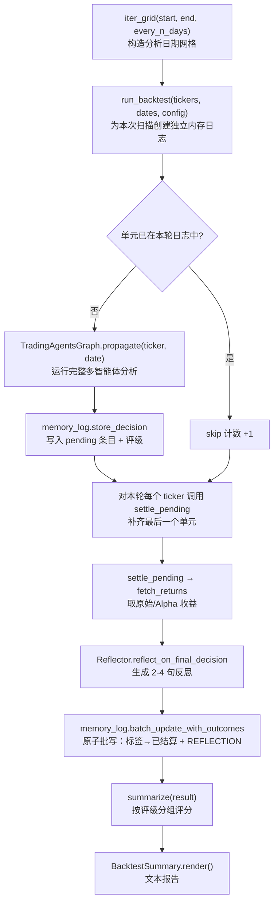

本页聚焦 TradingAgents 中"回溯测试与决策评估"这一子系统：它把单次分析流程批量运行在一个"标的 × 日期"网格上，再依据内存日志（memory log）中已结算的结果，按评级分组统计决策质量。需要先明确其**架构边界**——它是决策质量的评估工具，而**不是投资组合模拟器**。一次运行只产生一个决策，无法回答"系统是否善于决策"；回溯测试复用同一套分析机制跨越多个网格单元，读取聚合结果，但刻意不引入数量、成交价与现金账本，因为一旦发明这些要素，就等于在一个评估工具背后藏入一个执行模型。因此各网格单元彼此独立，传入的投资组合也只是每个单元共享的同一本"存量账"，而非跨单元结转的持仓。

Sources: [backtest.py](tradingagents/backtest.py#L1-L15)

其设计哲学是"内存日志即结果表"：每次运行本就记录其评级，随后用相对区域基准的实际收益与 Alpha 收益加以结算，因此回溯测试无需另建一套结果存储。这种"复用既有记录"的取向，贯穿整个框架的模块划分。

Sources: [backtest.py](tradingagents/backtest.py#L1-L15), [backtest.py](tradingagents/backtest.py#L3-L7)

## 评估循环总览

回溯测试把既有的运行时机制（图运行 → 记录决策 → 下一轮同一标的时结算 → 反思）串成一个批量循环。下图给出从网格生成到评分聚合的完整数据流，括号中标注对应的模块与函数。



核心可观察点是：评分并不直接来自运行返回值，而是来自已结算的日志条目。这意味着**图运行、结算与评分三者解耦**，各自可独立测试与演进。

Sources: [backtest.py](tradingagents/backtest.py#L129-L181), [settlement.py](tradingagents/memory/settlement.py#L107-L156), [log.py](tradingagents/memory/log.py#L186-L237)

## 网格构造：`iter_grid` 与其时间约束

评估的第一道关口是**分析日期网格**的构造。`iter_grid` 从 `start_date` 起，以 `every_n_days` 为步长生成日期列表，但网格**永不超过今天**：未来日期没有可结算的结果，图本身也会拒绝，因此网格在当下截止，而非产生无法评分的单元。该函数同时进行两项前置校验——步长必须不小于 1，且 `end` 不得早于 `start`。

Sources: [backtest.py](tradingagents/backtest.py#L34-L51)

日期格式的严格性由 `_canonical` 保证：它按 `%Y-%m-%d` 解析，并回写比对字符串，任何非规范写法（例如 `2026-1-5`）都会抛出 `ValueError`。这与图运行入口 `_validate_trade_date` 对日期的要求保持一致，避免网格接受了一个运行阶段终将拒绝的日期。

Sources: [backtest.py](tradingagents/backtest.py#L54-L62)

被测对象是"当日决策在持有窗口内的表现"，因此时间语义有两点关键约定：
- **网格截止于今天**：`iter_grid` 与 `get_current_date()` 比较取 `min`，保证不会越界到无结果可结算的未来。
- **历史标记驱动时点过滤**：当分析日期早于今天（`is_historical` 为真）时，运行会启用点时序过滤（详见后文），确保历史回溯不会"学到"当时尚未发生的经验。

Sources: [backtest.py](tradingagents/backtest.py#L46-L50), [date_window.py](tradingagents/dataflows/date_window.py#L39-L41), [trading_graph.py](tradingagents/graph/trading_graph.py#L147-L155)

## 一次扫描的执行：`run_backtest`

`run_backtest` 是扫描的编排者，其签名暴露了全部评估自由度：

| 参数 | 作用 |
| --- | --- |
| `tickers` | 标的列表（逗号分隔解析后） |
| `dates` | `iter_grid` 产出的分析日期列表 |
| `config` | 完整配置字典（含 `results_dir`、`memory_log_path`、基准、持有窗口等） |
| `asset_type` | `stock` 或 `crypto` |
| `portfolio` | 可选的投资组合上下文，在整张网格上保持不变 |
| `selected_analysts` | 参与运行的智能体集合（默认四分析师） |
| `run_id` | 断点续跑标识，也是结果目录的路径段 |
| `progress` | 每个单元运行前的进度回调 `(done, total, ticker, date)` |

Sources: [backtest.py](tradingagents/backtest.py#L129-L138)

其执行有若干刻意的架构决策：

**(1) 独立日志，隔离实时记录。** 运行会在 `results_dir/backtest/<run_id>/` 下新建目录，并把该轮配置的 `results_dir` 与 `memory_log_path` 覆盖指向此目录。这保证实时内存日志不被污染——否则一次大扫描会灌满真实运行读回的上下文。所选分析师集合也被显式传入图构造，避免"两分析师设置被静默扩为四分析师"。

Sources: [backtest.py](tradingagents/backtest.py#L148-L155), [test_backtest.py](tests/test_backtest.py#L149-L153)

**(2) `run_id` 被当作路径段校验。** 由于 `run_id` 会成为路径的一部分，它经 `safe_ticker_component` 校验，绝对路径或含 `..` 的值会抛出异常。这与标的符号的路径穿越防护同源（参见 [标的符号归一化与公司身份解析](20-biao-de-fu-hao-gui-hua-yu-gong-si-shen-fen-jie-xi)）。缺省 `run_id` 由时间戳生成。

Sources: [backtest.py](tradingagents/backtest.py#L146-L155), [test_backtest.py](tests/test_backtest.py#L156-L162)

**(3) 可续跑：以日志内容判断已完成单元。** 运行先加载本轮日志的条目，构成 `done` 集合；`tickers` 与 `dates` 先去重，再展开为笛卡尔积 `cells`，其中已存在于日志中的单元被跳过并计入 `skipped`。因此一次被中断的扫描只需以同一 `run_id` 重跑即可从断点继续，且**重复给定的标的或日期只运行并结算一次**。

Sources: [backtest.py](tradingagents/backtest.py#L156-L162), [test_backtest.py](tests/test_backtest.py#L87-L95), [test_backtest.py](tests/test_backtest.py#L301-L306)

**(4) 失败隔离。** 单个单元运行若抛异常（例如某个供应商不可达），只会被记录进 `result.failures` 并警告日志，不会终止整张扫描——"一个不可达的供应商不该结束整场扫描"。运行成功后 `cells_run` 递增。

Sources: [backtest.py](tradingagents/backtest.py#L163-L171), [test_backtest.py](tests/test_backtest.py#L106-L112)

**(5) 收尾结算每个标的的最后一个单元。** 由于结算发生在"同一标的的下一次运行开始时"，每个标的的最后一个网格单元将永远停留在 pending。为补齐这一点，扫描结束后会对每个标的显式调用一次 `graph.settle_pending(ticker)`。反思调用会唤醒 LLM，故其失败同样被吞掉并记入 `settlement_failures`，不影响其余标的的结算。

Sources: [backtest.py](tradingagents/backtest.py#L173-L181), [test_backtest.py](tests/test_backtest.py#L98-L103), [test_backtest.py](tests/test_backtest.py#L165-L181)

## 结果表：内存日志作为评分依据

评分之所以能不另建存储，是因为内存日志的条目本身就是结构化的结果记录。其条目标签采用固定字段格式，为聚合提供可解析的原始数据：

```
[<trade_date> | <ticker> | <rating> | pending]                          # 未结算
[<trade_date> | <ticker> | <rating> | <raw%> | <alpha%> | <Nd> | resolved:<date>]   # 已结算
```

`store_decision` 写入 pending 标签（内含评级）与 `DECISION:` 正文；`update_with_outcome`/`batch_update_with_outcomes` 则以原子写（临时文件 + `os.replace`）把标签改为已结算形式，并追加 `REFLECTION:` 段。标签中的 `raw`、`alpha`、`holding` 与 `resolved` 字段，正是 `summarize` 唯一依赖的输入。

Sources: [log.py](tradingagents/memory/log.py#L31-L59), [log.py](tradingagents/memory/log.py#L241-L254), [log.py](tradingagents/memory/log.py#L121-L184)

其中 `resolved:<date>` 是后文"点时序一致性"的关键——它记录了结果的**已知日期**（即所用最后一根价格 K 线的日期），供后续按分析日期过滤经验。

Sources: [log.py](tradingagents/memory/log.py#L241-L254), [log.py](tradingagents/memory/log.py#L303-L318)

值得单独指出的是 `store_decision` 的**幂等守卫**：写入前对原始文本做快速扫描，若同一 `(trade_date, ticker)` 已有条目（无论 pending 还是已结算）则直接返回。否则，在一次结果落地后的重跑会把同一决策重复计入历史上下文与所有聚合统计。

Sources: [log.py](tradingagents/memory/log.py#L45-L57), [test_backtest.py](tests/test_backtest.py#L138-L153)

## 评分逻辑：`summarize` 的按评级聚合

`summarize` 接受 `BacktestResult`、文件路径或字符串。若传入结果对象，它直接用 `result.log_path`；若路径存在则读取；否则抛 `FileNotFoundError`（而不是返回空摘要）。随后加载条目并按以下规则筛选可评分集合：

- 排除仍在 `pending` 的条目；
- 排除评级为 `REVIEW` 的条目（决策文本无可读评级，不构成方向）；
- 排除无法解析 Alpha 数值的条目。

Sources: [backtest.py](tradingagents/backtest.py#L184-L197)

Alpha 数值从日志标签的字符串字段解析而来。由于日志以**百分比、保留一位小数**存储，聚合精度只到 0.1 个百分点，而非原始报价精度——这一点在 `_alpha` 的文档中明确说明。

Sources: [backtest.py](tradingagents/backtest.py#L65-L75)

评分的核心在于**方向感知的命中率**。每个评级被映射到其声称的方向：`Buy`/`Overweight` 为 `+1`，`Underweight`/`Sell` 为 `-1`，`Hold` 为 `0`。某条已结算条目"命中"当且仅当其 Alpha 与方向的乘积为正。`Hold` 不声称方向，因此不计算命中率（`hit_rate` 为 `None`），但仍有平均 Alpha。这修正了一个曾经的错误：对看跌评级而言，低于基准的 Alpha 正是它预测的结果，若将其记为"未命中"，就会在系统正确时报告其错误。

Sources: [backtest.py](tradingagents/backtest.py#L88-L90), [backtest.py](tradingagents/backtest.py#L198-L206), [test_backtest.py](tests/test_backtest.py#L198-L213)

聚合产物由两个数据类承载，其字段语义如下：

| 数据类 | 字段 | 含义 |
| --- | --- | --- |
| `RatingScore` | `count` | 该评级下已结算条目数 |
| | `hit_rate` | 方向命中比例；`Hold` 为 `None` |
| | `mean_alpha` | 该评级平均 Alpha（相对基准） |
| `BacktestSummary` | `resolved` | 已结算且可评分条目数 |
| | `pending` | 尚未结算条目数 |
| | `unscored` | 评级为 `REVIEW` 的条目数 |
| | `by_rating` | 评级 → `RatingScore` 映射 |
| | `holding` | 实际测量的持有窗口描述 |

Sources: [backtest.py](tradingagents/backtest.py#L93-L106), [backtest.py](tradingagents/backtest.py#L211-L214)

`BacktestSummary.render()` 把上述数据渲染为报告文本，其中两点体现框架的诚实性取向：其一，**未结算的单元不会进入评分**，并显式提示"重跑以结算它们"；其二，结尾声明测量窗口，并明确警示"每个单元仅一次模型采样，且文本信息流未被归档，故这些数字是指示性的而非可复现的"。报告所声明的窗口取自日志中条目实际记录的持有期（如 `5d`），保证不宣称与结果不符的窗口。

Sources: [backtest.py](tradingagents/backtest.py#L108-L126), [backtest.py](tradingagents/backtest.py#L207-L214), [test_backtest.py](tests/test_backtest.py#L240-L248)

## Alpha 基准与持有窗口：结算的计算基础

评分所依赖的 `raw` 与 `alpha` 字段由结算子系统计算，其计算规则直接决定评估口径。`fetch_returns` 是关键函数，返回 `(raw_return, alpha_return, holding_days, resolution_date)`，或在结果尚不可结算时返回全 `None`：

- **持有窗口按交易日计**。`holding_days` 表示交易日数，函数据此申请大约 `holding_days * 7/5 + 7` 的日历跨度（覆盖周末与假期）。
- **要求完整窗口已交易**。若可用收盘价不足 `holding_days + 1` 根，则返回 `None`，条目保持 pending 待下轮重试——避免以"早熟的局部收益"结算。
- **基准对齐同日历区间**。基准从入场前一周起取数，并以 `asof` 对齐标的的入场与出场日，使两者收益跨越同一组日期，即便两者交易日历不同（加密货币周末交易，指数不交易）。
- **点时截断**。返回的 `resolution_date` 为最后一根所用 K 线的日期，即结果"成为已知"的时刻。

Sources: [settlement.py](tradingagents/memory/settlement.py#L51-L104)

基准标的的选取由 `resolve_benchmark` 完成：`config["benchmark_ticker"]` 显式设置时覆盖一切；否则按交易所后缀映射到区域指数（如 `.T` → `^N225`，`.HK` → `^HSI`）。美国无后缀标的落入空后缀条目，默认 SPY；未识别的后缀（包括 `BRK.B` 这类含点的美股）同样落入空后缀条目。显式基准会像普通标的一样经过 `normalize_symbol` 别名映射，否则查不到价格，决策将永久 pending。

Sources: [settlement.py](tradingagents/memory/settlement.py#L13-L34)

默认后缀映射覆盖主要市场，要点摘录如下（完整表见配置）：

| 后缀 | 基准指数 | 市场 |
| --- | --- | --- |
| `.NS` / `.BO` | `^NSEI` / `^BSESN` | 印度 NSE / BSE |
| `.T` / `.TW` | `^N225` / `^TWII` | 东京 / 台湾 |
| `.KS` / `.HK` | `^KS11` / `^HSI` | 韩国 / 香港 |
| `.L` / `.DE` / `.PA` | `^FTSE` / `^GDAXI` / `^FCHI` | 伦敦 / 德国 / 巴黎 |
| `.SS` / `.SZ` | `000001.SS` / `399001.SZ` | 上海 / 深圳 |
| `""`（默认） | `SPY` | 美国无后缀标的 |

Sources: [default_config.py](tradingagents/default_config.py#L168-L193)

持有窗口由配置项 `holding_period_days`（默认 5）控制，它同时决定反思与回溯测试图中所用的窗口长度——两者读取同一个值，避免评估口径与反思口径漂移。

Sources: [default_config.py](tradingagents/default_config.py#L167-L169), [settlement.py](tradingagents/memory/settlement.py#L107-L127)

### 收盘价序列的规范化

`_by_day` 处理一个微妙但重要的问题：Yahoo 把日线 bar 盖在其市场所在时区的午夜（加密货币为 UTC，SPY 为纽约），因此两条序列应在**日期**上相遇而非在瞬时上。该函数丢弃非正收盘价（无价格可言，不是可评分的一根 bar），并剥离时区，使不同市场的序列按日对齐。

Sources: [settlement.py](tradingagents/memory/settlement.py#L37-L48)

## 结算与反思：填充结果表的动作

结算子系统的入口 `settle_pending` 遵循一个明确的**权衡**：每次运行只结算同一标的的 pending 条目，其他标的的条目会累积到它们各自下次运行时才被结算。对每个同标的 pending 条目，它调用 `fetch_returns`；若价格尚不可得则跳过（下轮重试）；否则生成反思。所有更新最后经 `batch_update_with_outcomes` 做**单次原子批写**，避免冗余 I/O。

Sources: [settlement.py](tradingagents/memory/settlement.py#L107-L156), [log.py](tradingagents/memory/log.py#L186-L199)

反思由 `Reflector.reflect_on_final_decision` 生成，输入为最终决策与结果上下文（原始收益、Alpha、基准名、持有窗口）。其系统提示要求产出 **2-4 句纯散文**，并显式点明窗口长度——因为"为数月而写的论点不会被一周证伪"，忽略这一差异的教训会被后续运行读作"既定失败"。输出被逐字存入日志，并被未来分析师重新读取。

Sources: [reflection.py](tradingagents/memory/reflection.py#L13-L63)

### 点时序一致性：历史回溯不得"偷看未来"

这是回溯测试正确性的关键约束（`#1251`）。历史/回溯运行会在其交易日期之前过滤经验，只保留那些**已在该日期之前结算**的教训。实现上有两条链路：

- **结算侧**：`update_with_outcome` 在已结算标签中写入 `resolved:<date>`（结果已知日）。
- **读取侧**：`get_past_context(as_of=...)` 仅保留 `resolved <= as_of` 的条目；`as_of=None`（实时运行）则不过滤。

`TradingAgentsGraph._memory_as_of` 决定是否传入该 `as_of`：交易日期早于今天（`is_historical`）时传入日期以启用过滤，当日运行则返回 `None`，保持实时行为与迁移前条目（无 `resolved` 字段）不受影响。因此回溯网格中的较早单元不会读到较晚才发生的结局。

Sources: [log.py](tradingagents/memory/log.py#L80-L117), [log.py](tradingagents/memory/log.py#L241-L254), [trading_graph.py](tradingagents/graph/trading_graph.py#L147-L155), [test_memory_pointintime.py](tests/test_memory_pointintime.py#L28-L39)

这与整个评估哲学一致：网格中每个单元应看到"该分析日期当时可见"的信息。时点过滤的完整机制与 Alpha 归因细节参见 [反思与结算：Alpha 归因](26-fan-si-yu-jie-suan-alpha-gui-yin) 与 [时点一致性与防未来函数](19-shi-dian-zhi-xing-yu-fang-wei-lai-han-shu)。

Sources: [trading_graph.py](tradingagents/graph/trading_graph.py#L305-L323)

## 命令行入口

CLI 的 `backtest` 命令是 `run_backtest` 与 `summarize` 的薄封装，其选项与参数在入口处即被校验，以便在扫描开始前就报错：

| 选项/参数 | 默认 | 说明 |
| --- | --- | --- |
| `TICKERS`（参数） | — | 逗号分隔的标的，如 `NVDA,AAPL` |
| `--start` | 必填 | 首个分析日期 `YYYY-MM-DD` |
| `--end` | 必填 | 末个分析日期 `YYYY-MM-DD` |
| `--every` | `7` | 分析日期之间的天数 |
| `--analysts` | 省略=全部 | 逗号分隔的分析师子集 |
| `--asset-type` | `stock` | `stock` 或 `crypto` |
| `--portfolio` | 无 | 含持仓与现金的 JSON，整张网格保持恒定 |
| `--run-id` | 无 | 续跑既有扫描：跳过已运行单元并复用其日志 |

命令流程为：`iter_grid` 构造日期 → 可选加载投资组合 JSON → 解析分析师集合 → 调用 `run_backtest`（带进度回调，逐单元打印 `[done/total] ticker date`）→ 打印 `summarize(result).render()`，并附上运行/跳过计数、日志路径与续跑提示，最后逐条打印失败与未结算项。任何前置 `ValueError` 或运行期异常都被转成一行红色提示与退出码 1，而非堆栈回溯。

Sources: [main.py](cli/main.py#L99-L152)

## 配置项汇总

以下配置项直接影响回溯测试与评分口径：

| 配置键 | 默认值 | 对评估的作用 |
| --- | --- | --- |
| `holding_period_days` | `5` | 结果测量的交易窗口，决定 `raw`/`alpha` 的计算跨度 |
| `benchmark_ticker` | `None` | 显式覆盖基准；设置后对所有标的生效 |
| `benchmark_map` | 见上表 | 按交易所后缀自动选择区域基准 |
| `results_dir` | `~/.tradingagents/logs` | 扫描结果与独立日志的根目录 |
| `memory_log_path` | `~/.tradingagents/memory/trading_memory.md` | 实时日志（扫描中会被覆盖为独立路径） |
| `memory_log_max_entries` | `None` | 已结算条目的上限；超出时轮转掉最旧者（pending 永不丢弃） |

Sources: [default_config.py](tradingagents/default_config.py#L80-L86), [default_config.py](tradingagents/default_config.py#L167-L193), [log.py](tradingagents/memory/log.py#L256-L291)

## 验证与测试要点

回溯测试子系统有专门的测试文件，其内容本身即是对设计意图的编码。关键断言包括：

- **实时日志永不被写**：以假图验证 `run_backtest` 只写自有日志。
- **网格时间约束**：`iter_grid` 停在今天、拒绝非规范日期。
- **续跑与去重**：已存在单元被跳过；重复标的/日期只运行并结算一次。
- **失败隔离**：单元失败不中止扫描；结算失败不丢失其余标的。
- **方向感知评分**：看跌且下跌记为命中，看涨且下跌记为未命中，`Hold` 无命中率。
- **报告诚实性**：声明实际窗口、标注 pending 与"不可复现"警示。

Sources: [test_backtest.py](tests/test_backtest.py#L19-L188), [test_backtest.py](tests/test_backtest.py#L198-L307)

## 关键设计取舍速览

| 决策 | 取舍说明 |
| --- | --- |
| 不做组合模拟 | 无数量、成交价、现金账本；单元独立，组合为恒定存量账 |
| 复用内存日志 | 无需第二套结果存储，但评分精度受限于日志的 0.1% 舍入 |
| 每次运行只结算同标的 | 换取实现简单；其他标的条目留待其下次运行结算 |
| 独立日志 + 时间戳 `run_id` | 隔离实时上下文，且 `run_id` 成为可续跑的路径段 |
| 结果不可复现的显式声明 | 单次采样、文本流未归档；定位为研究脚手架而非可复现策略 |

Sources: [backtest.py](tradingagents/backtest.py#L9-L14), [settlement.py](tradingagents/memory/settlement.py#L113-L116), [backtest.py](tradingagents/backtest.py#L65-L75), [README.md](README.md#L365-L385)

## 后续阅读

本页描述了评估框架如何批量运行与评分。其依赖的三个下游机制各有专页深入：结算与 Alpha 归因的计算细节见 [反思与结算：Alpha 归因](26-fan-si-yu-jie-suan-alpha-gui-yin)；内存日志的完整结构、轮转与上下文注入见 [记忆日志与决策记录](25-ji-yi-ri-zhi-yu-jue-ce-ji-lu)；网格单元所运行的多智能体图本身见 [总体架构与多智能体协作](11-zong-ti-jia-gou-yu-duo-zhi-neng-ti-xie-zuo) 与 [LangGraph 图构建与并行分析师执行](12-langgraph-tu-gou-jian-yu-bing-xing-fen-xi-shi-zhi-xing)。若关注历史运行的信息边界约束，见 [时点一致性与防未来函数](19-shi-dian-zhi-xing-yu-fang-wei-lai-han-shu)。