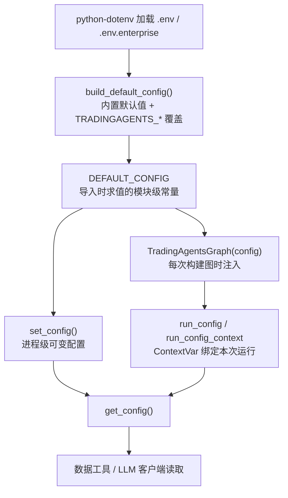
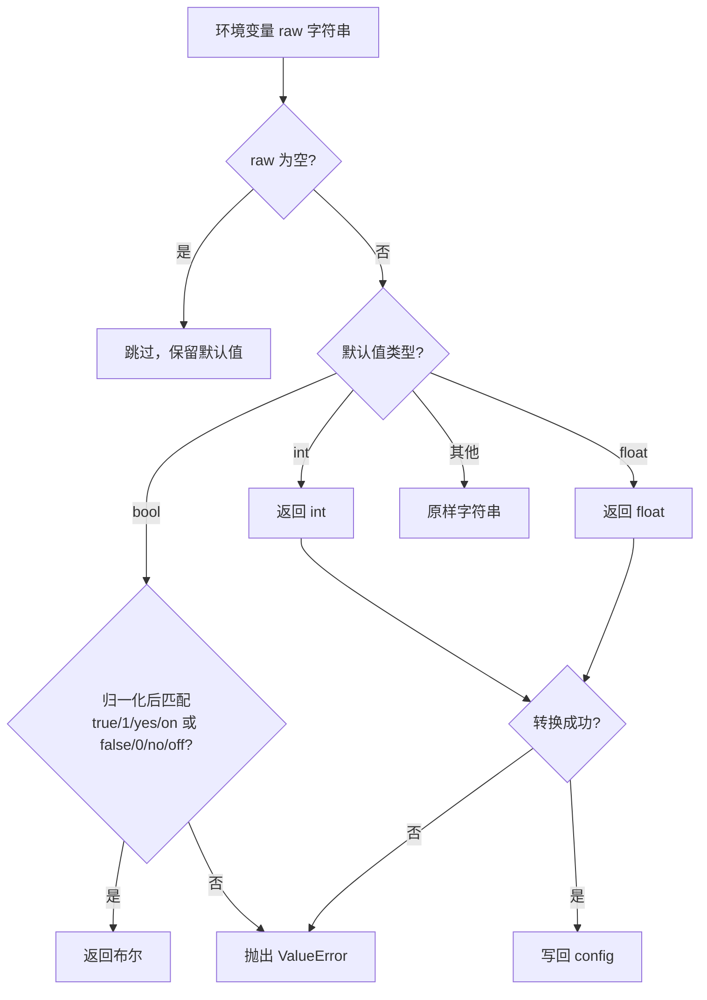
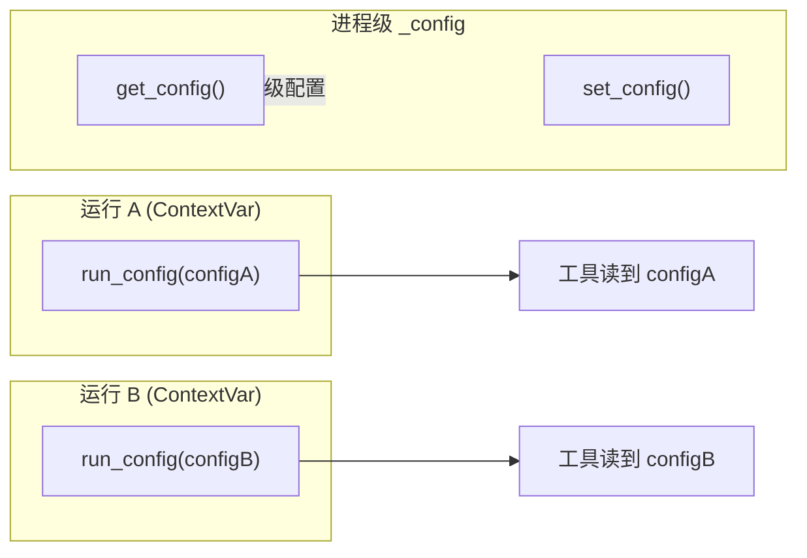

TradingAgents 的配置系统解决一个核心矛盾：**同一份代码既要支持交互式命令行、编程接口、Docker 与定时批处理等多种入口，又要保证数据工具、LLM 客户端与运行流程读到的是一致且可预测的配置**。本页聚焦于两件事：内置默认配置 `DEFAULT_CONFIG` 如何与 `TRADINGAGENTS_*` 环境变量合并，以及运行时配置如何在进程内、乃至多个并发图之间隔离。你不会在这里看到数据供应商的路由算法或 LLM 客户端的具体实现，那些属于[数据供应商路由与回退链](18-shu-ju-gong-ying-shang-lu-you-yu-hui-tui-lian)与[多供应商客户端与工厂模式](22-duo-gong-ying-shang-ke-hu-duan-yu-gong-han-mo-shi)。

## 配置系统的分层结构

配置从"静态默认值"到"某一次运行实际读取的值"要经过若干层。理解这些层的顺序，是理解后续所有覆盖规则的前提。整个系统由三个文件承载：`tradingagents/default_config.py` 负责构建内置默认值并折叠环境变量，`tradingagents/dataflows/config.py` 提供进程级与运行级的配置容器，`cli/` 目录下的代码则决定交互选择与环境变量谁优先。

`.env` 文件在包导入时即被加载，这是所有环境变量的入口。包在 `tradingagents/__init__.py` 中调用 `load_dotenv(find_dotenv(usecwd=True))`，`usecwd=True` 让查找从当前工作目录出发，使得通过 `pip` 安装的控制台脚本也能找到项目的 `.env` 而非 `site-packages` 旁边；已由调用者导出的变量不会被覆盖。随后再尝试加载 `.env.enterprise` 并在其存在时以 `override=False` 补充企业级配置（如 Azure OpenAI 凭据）。

Sources: [tradingagents/__init__.py](tradingagents/__init__.py#L5-L13), [default_config.py](tradingagents/default_config.py#L73-L195)

环境的加载时机决定了 `DEFAULT_CONFIG` 的求值时机。`DEFAULT_CONFIG` 是在模块导入时通过 `build_default_config()` 求值的模块级常量，**这意味着环境覆盖在进程启动的那一刻被"快照"进默认值**；之后若想看到当前环境的真实状态，应重新调用 `build_default_config()`。这一点在测试中被显式依赖——测试通过 monkeypatch 设置环境后重新构建 config，而非修改已有的 `DEFAULT_CONFIG`。

Sources: [default_config.py](tradingagents/default_config.py#L73-L79), [default_config.py](tradingagents/default_config.py#L198), [tests/test_env_overrides.py](tests/test_env_overrides.py#L12-L18)

## 内置默认值与单一真源

`build_default_config()` 是整个默认值的定义处，它先从三组路径环境变量派生基础目录，再填入 LLM、辩论轮次、数据供应商等键，最后把结果交给 `_apply_env_overrides()` 折叠环境变量。基础目录统一以 `~/.tradingagents` 为根：`results_dir`、`data_cache_dir`、`memory_log_path` 分别对应日志、缓存与记忆日志，且都允许通过 `TRADINGAGENTS_RESULTS_DIR`、`TRADINGAGENTS_CACHE_DIR`、`TRADINGAGENTS_MEMORY_LOG_PATH` 覆盖。注意这里用的是 `os.getenv(...) or ...` 的写法，**空字符串会退回到默认路径**，从而避免 `.env.example` 中留空的变量被取消注释后产出空路径、导致创建目录失败。

Sources: [default_config.py](tradingagents/default_config.py#L3), [default_config.py](tradingagents/default_config.py#L80-L86), [tests/test_env_overrides.py](tests/test_env_overrides.py#L103-L115)

内置默认值本身的设计遵循"留待各供应商自行决定"的哲学：`backend_url`、`temperature`、`llm_max_retries`、`max_tokens` 以及三个推理/思考旋钮（`google_thinking_level`、`openai_reasoning_effort`、`anthropic_effort`）默认均为 `None`。`None` 语义是"不干预"，让每个供应商客户端回落到它自己的默认端点或 SDK 默认值。一个值得注意的历史教训写在注释里：`backend_url` 若设成某供应商专属的 URL，会被错误转发给别的供应商（例如 OpenAI 的 `/v1` 曾泄漏给 Gemini），因此这里刻意保持 `None`，由 CLI 在选定供应商时再决定 URL。

Sources: [default_config.py](tradingagents/default_config.py#L88-L114)

数据供应商的配置采用两级字典：`data_vendors`（类别级）与 `tool_vendors`（工具级），后者优先于前者。缺省值给出了注释化的可选项，例如 `core_stock_apis` 为 `yfinance`、`fundamental_data` 为 `sec_edgar,yfinance`。这些字符串是**精确的供应商链**而非模糊意图——请求不会被静默路由到未选择的供应商。

Sources: [default_config.py](tradingagents/default_config.py#L142-L160), [router.py](tradingagents/dataflows/router.py#L160-L173)

## 环境变量覆盖表：单一真源

环境变量到配置键的映射集中在 `_ENV_OVERRIDES` 这一张字典里，文件头注释明确将其定义为"环境变量 → 配置键覆盖的单一真源（single source of truth）"：要暴露一个新的配置键供环境覆盖，只需在此加一行，无需改动任何入口脚本。这张表也解释了为什么 CLI 无需硬编码就能让 `TRADINGAGENTS_*` 变量生效。

Sources: [default_config.py](tradingagents/default_config.py#L5-L30)

| 环境变量 | 配置键 | 默认值 | 说明 |
|---|---|---|---|
| `TRADINGAGENTS_LLM_PROVIDER` | `llm_provider` | `openai` | 选定 LLM 供应商，同时跳过 CLI 的选择步骤 |
| `TRADINGAGENTS_DEEP_THINK_LLM` | `deep_think_llm` | `gpt-6-sol` | 深度思考模型 |
| `TRADINGAGENTS_QUICK_THINK_LLM` | `quick_think_llm` | `gpt-6-luna` | 快速思考模型 |
| `TRADINGAGENTS_LLM_BACKEND_URL` | `backend_url` | `None` | 接口端点；优先级见后文 |
| `TRADINGAGENTS_OUTPUT_LANGUAGE` | `output_language` | `English` | 报告输出语言，同时跳过 CLI 提问 |
| `TRADINGAGENTS_MAX_DEBATE_ROUNDS` | `max_debate_rounds` | `1` | 研究员辩论轮次 |
| `TRADINGAGENTS_MAX_RISK_ROUNDS` | `max_risk_discuss_rounds` | `1` | 风险讨论轮次 |
| `TRADINGAGENTS_MAX_TOOL_ROUNDS` | `max_tool_rounds` | `20` | 分析师的工具调用轮次上限 |
| `TRADINGAGENTS_CHECKPOINT_ENABLED` | `checkpoint_enabled` | `False` | 断点续跑开关 |
| `TRADINGAGENTS_BENCHMARK_TICKER` | `benchmark_ticker` | `None` | Alpha 基准标的 |
| `TRADINGAGENTS_TEMPERATURE` | `temperature` | `None` | 采样温度 |
| `TRADINGAGENTS_LLM_MAX_RETRIES` | `llm_max_retries` | `None` | SDK 重试预算 |
| `TRADINGAGENTS_MAX_TOKENS` | `max_tokens` | `None` | 输出 token 上限 |
| `TRADINGAGENTS_GOOGLE_THINKING_LEVEL` | `google_thinking_level` | `None` | Gemini 思考等级 |
| `TRADINGAGENTS_OPENAI_REASONING_EFFORT` | `openai_reasoning_effort` | `None` | OpenAI 推理强度 |
| `TRADINGAGENTS_ANTHROPIC_EFFORT` | `anthropic_effort` | `None` | Claude 思考强度 |

除了表中列出的键，`TRADINGAGENTS_RESULTS_DIR`、`TRADINGAGENTS_CACHE_DIR`、`TRADINGAGENTS_MEMORY_LOG_PATH` 三组路径变量在 `build_default_config()` 中直接读取（而非经 `_ENV_OVERRIDES`），`TRADINGAGENTS_DATA_DIR` 则供 Docker 挂载卷使用。任何不在 `_ENV_OVERRIDES` 中的 `TRADINGAGENTS_*` 变量都被忽略，不会渗入配置字典——这一点由 `test_unknown_env_var_is_ignored` 显式验证。

Sources: [default_config.py](tradingagents/default_config.py#L10-L30), [default_config.py](tradingagents/default_config.py#L80-L82), [tests/test_env_overrides.py](tests/test_env_overrides.py#L133-L139), [.env.example](.env.example#L40-L73)

## 类型强制转换与"失败即报错"

用户在 `.env` 里写的永远是字符串，但 `max_debate_rounds` 期望整数、`checkpoint_enabled` 期望布尔。`_coerce()` 的做法是**参照现存默认值的类型**来决定转换方式：以默认值类型为模板，而非依赖一张手写的类型表。这样做的好处是新增键时无需额外声明类型，转换逻辑自然跟随 `build_default_config()` 里的初始值。

Sources: [default_config.py](tradingagents/default_config.py#L37-L57), [tests/test_env_overrides.py](tests/test_env_overrides.py#L47-L69)

布尔转换刻意接受一组宽松的真/假写法：`true/1/yes/on` 与 `false/0/no/off`。任何无法识别的值——如拼错的 `treu`、`flase`，或看似数字的 `"2"`——都会抛出 `ValueError` 而非静默当作 `False`。设计意图写在文档字符串里：**一个拼错的布尔或非数字整数应当在启动时大声失败，而不是悄悄配置错一次无人值守的运行**。

Sources: [default_config.py](default_config.py#L33-L34), [default_config.py](tradingagents/default_config.py#L37-L57), [tests/test_env_overrides.py](tests/test_env_overrides.py#L125-L130)

`_apply_env_overrides()` 遍历映射表，对每个变量取值、跳过空值、调用 `_coerce()` 写回，并在转换失败时用 `Invalid value for <VAR>: <原因>` 的上下文重新抛出，使报错能直接指向出错的变量名。这条"空值即透传"的规则对字符串键同样生效——`TRADINGAGENTS_LLM_PROVIDER=` 不会清空默认的 `openai`。

Sources: [default_config.py](tradingagents/default_config.py#L60-L70), [tests/test_env_overrides.py](tests/test_env_overrides.py#L92-L100)

推理与思考旋钮有一个额外的语义约束：它们的默认值是 `None`。`_coerce()` 在 `None` 分支下原样返回字符串，因此这些键被设置后即为字符串、未设置时保持 `None`，让每个供应商沿用自身默认。这保证了环境变量覆盖不会意外地把"未指定"变成一个具体值。

Sources: [default_config.py](tradingagents/default_config.py#L98-L100), [tests/test_env_overrides.py](tests/test_env_overrides.py#L84-L89)

## 运行时配置容器

`tradingagents/dataflows/config.py` 提供两种粒度的配置：**进程级**（`_config`）与**运行级**（`_run_config`，一个 `ContextVar`）。进程级配置是一个可变的全局字典，`set_config()` 更新它、`get_config()` 深拷贝地读取它；运行级配置则让"正在进行的那次运行"拥有独立的视图，即便同一进程里构建了多张图。

Sources: [dataflows/config.py](tradingagents/dataflows/config.py#L8-L13)

`get_config()` 的读取顺序体现了两者的关系：**若存在运行级配置则优先返回它，否则回落到进程级配置**，且两者都以 `deepcopy` 返回，调用者拿到的永远是不与内部状态共享引用的副本。**合并语义**由 `_merge()` 定义：字典值类的键只做一层深合并，标量键整体替换。因此一次不完整的更新 `{"data_vendors": {"core_stock_apis": "alpha_vantage"}}` 会保留 `data_vendors` 下其它键的默认值，而不会把整个字典打掉。

Sources: [dataflows/config.py](tradingagents/dataflows/config.py#L23-L41), [dataflows/config.py](tradingagents/dataflows/config.py#L65-L72), [tests/test_dataflows_config.py](tests/test_dataflows_config.py#L40-L61)

并发隔离是这套设计的重点。`run_config()` 上下文管理器把合并后的配置写入 `ContextVar`，在块结束时重置；`run_config_context()` 则返回一个 `copy_context()` 得到的上下文，用于会在步骤间让出控制权的运行。两者都基于 `deepcopy(DEFAULT_CONFIG)` 再叠加传入配置，保证运行看到的基线与进程级配置的改动解耦。

Sources: [dataflows/config.py](tradingagents/dataflows/config.py#L44-L62), [tests/test_dataflows_config.py](tests/test_dataflows_config.py#L113-L139)

`TradingAgentsGraph` 是这些机制的使用者：构造时 `set_config(self.config)` 设置进程级配置并据此构建 LLM 客户端；真正运行（`propagate`、结算）时用 `with run_config(self.config)` 把**这张图自己的配置**绑定到当前上下文，从而让它在数据工具调用中读到自己的供应商链——即便进程级配置已被后来构建的另一张图覆盖。LangGraph 会把调用者的上下文带入工具调用，这正是隔离得以成立的基础。

Sources: [trading_graph.py](tradingagents/graph/trading_graph.py#L70-L78), [trading_graph.py](tradingagents/graph/trading_graph.py#L200), [tests/test_dataflows_config.py](tests/test_dataflows_config.py#L89-L110), [tests/test_dataflows_config.py](tests/test_dataflows_config.py#L161-L192)

## CLI 层：环境变量与交互选择的优先级

当 CLI 交互式运行时，环境变量与用户选择可能同时存在。`_build_run_config()` 定义了明确规则：**显式环境变量或命令行标志优先于交互选择**。以辩论轮次为例，`research_depth` 通常同时设定 `max_debate_rounds` 与 `max_risk_discuss_rounds`，但若对应的环境变量已设置，则该轮次保留环境值而忽略 `research_depth`——其注释直接指向了此行为的设计编号（#977）。

Sources: [cli/run.py](cli/run.py#L58-L80)

这一优先级在交互流程中进一步"短路"了提问：当 `TRADINGAGENTS_MAX_DEBATE_ROUNDS` 与 `TRADINGAGENTS_MAX_RISK_ROUNDS` 同时设置时，`depth_from_env()` 返回真，研究深度提问被整个跳过。而如果只有一个被设置，深度提问仍会出现，但其中一半的答案会被环境覆盖——此时 CLI 会打印一行说明哪个值来自环境、用户的选择对它不适用，避免"答案被默默丢弃"。

Sources: [cli/selections.py](cli/selections.py#L49-L52), [cli/selections.py](cli/selections.py#L195-L212), [tests/test_cli_config_precedence.py](tests/test_cli_config_precedence.py#L89-L107)

同一"环境变量跳过提问"的规则贯穿其余步骤：供应商（`TRADINGAGENTS_LLM_PROVIDER`）、输出语言、思考模型，以及 Step 8 的推理/思考旋钮都遵循此模式。以推理旋钮为例，`thinking_value_or_prompt()` 在检测到对应环境变量时，径直取用 `DEFAULT_CONFIG` 中已被折叠的环境值并打印确认，否则才进入提问。**即使供应商来自环境变量，CLI 仍会调用 `ensure_api_key()` 确认密钥存在**，以免运行在首次 API 调用时才失败。

Sources: [cli/selections.py](cli/selections.py#L115-L127), [cli/selections.py](cli/selections.py#L165-L178), [cli/selections.py](cli/selections.py#L214-L227), [cli/selections.py](cli/selections.py#L269-L322), [tests/test_cli_env_skip.py](tests/test_cli_env_skip.py#L36-L84)

检查点开关是"三态"的范例：命令行 `--checkpoint/--no-checkpoint`（`checkpoint` 为 `True/False/None`）中，**只有显式给出时才覆盖配置**；省略该标志（值为 `None`）则保留 `TRADINGAGENTS_CHECKPOINT_ENABLED` 或默认值，绝不会把环境启用的值打回 `False`。

Sources: [cli/run.py](cli/run.py#L90-L93), [tests/test_cli_config_precedence.py](tests/test_cli_config_precedence.py#L58-L70), [cli/main.py](cli/main.py#L35-L40)

后端 URL 的解析用一个三元式定义了层级：`env_url or menu_url or provider_default_url(provider)`。也就是说 `TRADINGAGENTS_LLM_BACKEND_URL` 折叠进 `DEFAULT_CONFIG["backend_url"]` 后**无论供应商是交互选择还是环境指定都会被采用**，其次是菜单/区域 URL，最后才是供应商默认端点。这修复了"环境 URL 被菜单默认值覆盖"的问题（设计编号 #978）。

Sources: [cli/prompts.py](cli/prompts.py#L394-L404), [cli/selections.py](cli/selections.py#L246-L250)

## API 密钥与供应商专属环境变量

除了折叠进配置字典的 `TRADINGAGENTS_*` 变量，还有一批**只被 LLM 客户端直接读取、不进配置字典**的供应商专属变量。`api_key_env.py` 维护了"供应商 → 密钥环境变量"的规范映射，作为单一真源，供 CLI 的交互式密钥提示与任何需要判断"某供应商是否需要密钥"的代码使用。新增供应商时只需在此登记其环境变量，CLI 流程便会自动提示。

Sources: [api_key_env.py](tradingagents/llm_clients/api_key_env.py#L1-L53)

| 类别 | 环境变量 | 说明 |
|---|---|---|
| 主流供应商密钥 | `OPENAI_API_KEY`、`ANTHROPIC_API_KEY`、`GOOGLE_API_KEY`、`XAI_API_KEY`、`DEEPSEEK_API_KEY` | 直接映射到供应商 |
| 双区域供应商 | `DASHSCOPE_API_KEY` / `DASHSCOPE_CN_API_KEY`、`ZHIPU_API_KEY` / `ZHIPU_CN_API_KEY`、`MINIMAX_API_KEY` / `MINIMAX_CN_API_KEY` | 国际版与中国大陆版账号密钥不可互换 |
| 其它托管供应商 | `OPENROUTER_API_KEY`、`MISTRAL_API_KEY`、`MOONSHOT_API_KEY`、`GROQ_API_KEY`、`NVIDIA_API_KEY` | OpenAI 兼容端点 |
| 无密钥运行时 | `ollama`、`bedrock` 在映射中为 `None` | Ollama 无需密钥；Bedrock 走 AWS 凭据链 |
| 可选端点 | `OLLAMA_BASE_URL` | 远程 Ollama 端点，覆盖默认 `http://localhost:11434/v1` |
| 数据供应商密钥 | `FRED_API_KEY`、`SEC_EDGAR_USER_AGENT`、`TYPESAFE_API_KEY` | 由对应数据工具读取 |
| 企业配置 | `AZURE_OPENAI_API_KEY`、`AZURE_OPENAI_ENDPOINT`、`AZURE_OPENAI_DEPLOYMENT_NAME` | 见 `.env.enterprise.example` |

供应商的 endpoint 与密钥在客户端中依序解析：`base_url` 采用"显式客户端值（携带配置/`TRADINGAGENTS_LLM_BACKEND_URL`）> 供应商环境变量覆盖（如 `OLLAMA_BASE_URL`）> 供应商默认"；密钥则从映射给出的环境变量读取，必需但缺失时抛出含变量名的错误，`key_optional` 的本地运行时则回落到占位密钥。

Sources: [openai_client.py](tradingagents/llm_clients/openai_client.py#L284-L315), [tests/test_cli_env_skip.py](tests/test_cli_env_skip.py#L29-L32)

当交互式流程发现密钥缺失时，`ensure_api_key()` 会提示粘贴并将值写入 `.env`、同时导出到 `os.environ`。写入前会将 `.env` 收紧为 `0600`（owner-only），因为文件承载的是真实凭据；已存在文件中的其它键会被保留。对于 `key_optional` 供应商（如通用 OpenAI 兼容端点、本地服务），则只读取环境变量而不强制提问。

Sources: [prompts.py](cli/prompts.py#L627-L682), [tests/test_api_key_env.py](tests/test_api_key_env.py#L98-L112), [tests/test_api_key_env.py](tests/test_api_key_env.py#L159-L190)

## 跨供应商旋钮的消费

配置字典中的几个跨供应商键在构建 LLM 客户端时由 `build_llm_kwargs()` 统一消费，它们的共同约定是"仅在非空时转发，否则留给供应商默认"。`temperature`、`llm_max_retries`、`max_tokens` 都遵循此模式，其中 `temperature` 与 `llm_max_retries` 会做数值转换，`max_tokens` 在 Google 供应商下改名为 `max_output_tokens`。由于环境变量给出的是字符串（如 `TRADINGAGENTS_TEMPERATURE=0.2`），工厂函数用 `float()` 归一，使环境值与编程设定的浮点值行为一致。

Sources: [factory.py](tradingagents/llm_clients/factory.py#L90-L130), [tests/test_temperature_config.py](tests/test_temperature_config.py#L42-L77)

这套"环境字符串归一"的模式与 `default_config._coerce()` 是互补的：`_coerce()` 在配置构建期完成类型转换，工厂函数则在消费期做一层防御性再转换（例如允许 `temperature` 直接以字符串存在于配置中）。两者共同保证无论值来自 `.env`、命令行还是 Python 代码，最终到达 SDK 的类型都是正确的。

Sources: [default_config.py](tradingagents/default_config.py#L37-L57), [tests/test_temperature_config.py](tests/test_temperature_config.py#L44-L55)

## 关键约定速览

| 约定 | 规则 | 依据 |
|---|---|---|
| 覆盖真源 | 新增环境覆盖只需在 `_ENV_OVERRIDES` 加一行 | [default_config.py](tradingagents/default_config.py#L5-L30) |
| 类型转换 | 以现存默认值的类型为模板 | [default_config.py](tradingagents/default_config.py#L37-L57) |
| 空值语义 | 空字符串透传，保留默认值 | [default_config.py](tradingagents/default_config.py#L63-L65) |
| 非法值 | 抛 `ValueError`，启动即失败 | [default_config.py](tradingagents/default_config.py#L66-L69) |
| 字典合并 | 一层深合并，标量替换 | [dataflows/config.py](tradingagents/dataflows/config.py#L23-L30) |
| 读取隔离 | `get_config()` 始终返回深拷贝 | [dataflows/config.py](tradingagents/dataflows/config.py#L65-L72) |
| 并发隔离 | 每次运行经 `ContextVar` 绑定自身配置 | [dataflows/config.py](tradingagents/dataflows/config.py#L44-L62) |
| CLI 优先级 | 显式环境变量/标志胜过交互选择 | [cli/run.py](cli/run.py#L58-L80) |
| 检查点三态 | 省略标志保留环境/默认值 | [cli/run.py](cli/run.py#L90-L93) |
| 端点优先级 | 环境 URL > 菜单 URL > 供应商默认 | [cli/prompts.py](cli/prompts.py#L394-L404) |
| 密钥映射 | 供应商 → 密钥变量的单一真源 | [api_key_env.py](tradingagents/llm_clients/api_key_env.py#L47-L53) |

## 后续阅读

掌握了配置的折叠与隔离规则后，建议按以下顺序深入：想了解如何在 Python 代码中调整配置并传入 `TradingAgentsGraph`，见[Python API 与配置调整](9-python-api-yu-pei-zhi-diao-zheng)；想了解如何用纯标志与环境变量实现无人值守运行，见[无提示批处理运行（标志与环境变量）](6-wu-ti-shi-pi-chu-li-yun-xing-biao-zhi-yu-huan-jing-bian-liang)；配置中的 `data_vendors` / `tool_vendors` 如何真正路由到具体供应商，见[数据供应商路由与回退链](18-shu-ju-gong-ying-shang-lu-you-yu-hui-tui-lian)；而 `llm_provider`、`backend_url` 与各供应商旋钮如何落到具体客户端，见[多供应商客户端与工厂模式](22-duo-gong-ying-shang-ke-hu-duan-yu-gong-han-mo-shi)。