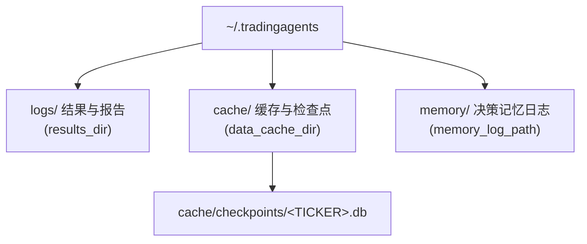

本页指导你在本地开发机上从零搭建 TradingAgents 的可运行环境：确认 Python 版本前提、创建虚拟环境、安装包与其依赖、配置 LLM 供应商的 API 密钥，并验证安装是否成功。本页聚焦“安装”本身，配置项的逐项细节请参见[配置系统与环境变量覆盖](29-pei-zhi-xi-tong-yu-huan-jing-bian-liang-fu-gai)，容器化部署请参见 [Docker 部署与数据持久化](4-docker-bu-shu-yu-shu-ju-chi-jiu-hua)，命令行运行流程请参见[交互式 CLI 与运行流程](5-jiao-hu-shi-cli-yu-yun-xing-liu-cheng)。

## 安装前提

TradingAgents 是一个 Python 包，声明的最低运行版本为 **Python 3.11**。项目的构建元数据明确要求 `requires-python = ">=3.11"`，因此任何 3.11 及以上版本（3.11、3.12、3.13、3.14）都可运行。项目在持续集成中对这四个版本逐一执行测试套件，并在其中一个任务里额外切换到非 UTC 时区（America/New_York），以验证与时区相关的行为在不同环境下仍然正确，这意味着跨平台与跨时区运行都是受支持的一等场景。

Sources: [pyproject.toml](pyproject.toml#L10), [.github/workflows/ci.yml](.github/workflows/ci.yml#L18-L25)

仓库官方示例以 Python 3.13 创建虚拟环境，但这只是推荐用法而非硬性约束——你可以使用任何满足 `>=3.11` 的解释器。项目对 Windows 也有专门处理：CLI 主入口在 Windows 平台下才导入 `prompt_toolkit` 的 win32 输出模块，其余平台保持为空元组，从而在无法访问控制台缓冲区时优雅降级而不是崩溃。

Sources: [README.md](README.md#L123-L133), [cli/main.py](cli/main.py#L13-L23)

## 安装流程总览

下面的流程图概括了从获取源码到验证安装的完整路径，每一步在后续小节中展开。

```mermaid
flowchart TD
    A[确认 Python >= 3.11] --> B[git clone 获取源码]
    B --> C[创建并激活虚拟环境]
    C --> D[pip install . 安装包与依赖]
    D --> E{是否需要可选能力?}
    E -->|开发/测试| F1[pip install .`[dev]`]
    E -->|AWS Bedrock| F2[pip install .`[bedrock]`]
    E -->|仅核心| G[跳过]
    F1 --> H[配置 .env 中的 API 密钥]
    F2 --> H
    G --> H
    H --> I[运行 tradingagents 验证]
```

## 第一步：获取源码

从 GitHub 克隆仓库并进入项目目录。安装命令在项目根目录执行，因为 `pyproject.toml` 中定义的构建配置与包发现规则都以根目录为基准。

Sources: [README.md](README.md#L117-L121), [pyproject.toml](pyproject.toml#L1-L3)

## 第二步：创建虚拟环境

强烈建议在虚拟环境中安装，以避免与系统 Python 的依赖冲突。项目同时提供了 conda 与 [uv](https://docs.astral.sh/uv/) 两种示例，二者等价，可按你的工具链偏好任选其一。

| 工具 | 创建命令 | 激活命令 |
| --- | --- | --- |
| conda | `conda create -n tradingagents python=3.13` | `conda activate tradingagents` |
| uv | `uv venv --python 3.13` | `source .venv/bin/activate` |

Sources: [README.md](README.md#L123-L133)

## 第三步：安装包与依赖

在激活的虚拟环境中，从项目根目录安装包本身。使用 pip 时执行 `pip install .`，使用 uv 时执行 `uv pip install .`。注意 `requirements.txt` 内容仅为一行为 `.`（即“安装当前目录的包”），因此它只是对 `pip install .` 的一层薄封装，真正的依赖清单以 `pyproject.toml` 为准。

Sources: [README.md](README.md#L135-L138), [requirements.txt](requirements.txt#L1-L2), [pyproject.toml](pyproject.toml#L11-L28)

安装命令会依据 `pyproject.toml` 的 `[project.scripts]` 定义注册一个名为 `tradingagents` 的控制台脚本，其入口指向 `cli.main:app`。同时 `[tool.setuptools.packages.find]` 会收集 `tradingagents*` 与 `cli*` 两个顶层包，`cli` 包还会额外打包 `static/*` 目录下的资源（例如欢迎界面文本）。

Sources: [pyproject.toml](pyproject.toml#L42-L43), [pyproject.toml](pyproject.toml#L48-L52)

### 核心运行时依赖

下列依赖随基础安装一并装入，覆盖 LangChain/LangGraph 编排、LLM 供应商集成、行情数据、CLI 交互与数据处理。

| 依赖 | 版本约束 | 用途 |
| --- | --- | --- |
| `langchain-core` | `>=1.6.5` | LangChain 核心抽象（消息、工具、Runnable） |
| `langchain-anthropic` | `>=1.7.4` | Anthropic（Claude）供应商集成 |
| `langchain-google-genai` | `>=4.4.0` | Google（Gemini）供应商集成 |
| `langchain-openai` | `>=1.6.6` | OpenAI 及 OpenAI 兼容端点集成 |
| `langgraph` | `>=1.2.12` | 多智能体图编排引擎 |
| `langgraph-checkpoint-sqlite` | `>=3.1.1` | 基于 SQLite 的检查点（断点恢复） |
| `pandas` | `>=3.0.6` | 表格数据处理 |
| `python-dotenv` | `>=1.0.0` | `.env` 文件的加载与写入 |
| `pytz` | `>=2025.2` | 时区处理 |
| `questionary` | `>=2.1.0` | 交互式命令行提示 |
| `requests` | `>=2.32.4` | HTTP 请求 |
| `rich` | `>=14.0.0` | 终端富文本渲染 |
| `typer` | `>=0.21.0` | CLI 框架 |
| `stockstats` | `>=0.6.5` | 技术指标计算 |
| `typing-extensions` | `>=4.14.0` | 类型标注兼容性 |
| `yfinance` | `>=1.7.0` | 默认行情数据供应商 |

Sources: [pyproject.toml](pyproject.toml#L11-L28), [tradingagents/default_config.py](tradingagents/default_config.py#L147-L156)

### 可选依赖（extras）

核心安装刻意保持精简，将开发工具与特定供应商的支持拆分到可选依赖组，按需加装即可。

| 依赖组 | 安装命令 | 包含内容 | 适用场景 |
| --- | --- | --- | --- |
| `dev` | `pip install ".[dev]"` | `ruff>=0.16`、`pytest>=8.0`、`pytest-subtests>=0.13` | 本地开发、运行测试与静态检查 |
| `bedrock` | `pip install ".[bedrock]"` | `langchain-aws>=1.7.9` | 使用 AWS Bedrock 作为 LLM 供应商 |

Sources: [pyproject.toml](pyproject.toml#L30-L40)

开发依赖的典型用法可参考 CI 流程：先升级 pip，再执行 `pip install -e ".[dev]"` 以可编辑模式安装并运行测试；另有一个“干净安装”任务仅执行 `pip install .`（不带 extras），随后导入 `tradingagents` 与 `cli.main`，用于捕获未声明的运行时依赖。这提示：若你的代码只使用核心功能，`pip install .` 就足够；只有需要测试或 Bedrock 时才加装 extras。

Sources: [.github/workflows/ci.yml](.github/workflows/ci.yml#L31-L36), [.github/workflows/ci.yml](.github/workflows/ci.yml#L46-L52)

## 第四步：配置 API 密钥

TradingAgents 支持多家 LLM 供应商，你只需为实际使用的那一家设置密钥。推荐做法是把 `.env.example` 复制为 `.env` 并填入密钥：`cp .env.example .env`。包在被导入时会自动从当前工作目录向上查找并加载 `.env`；对于企业场景，还会额外加载 `.env.enterprise`（且不覆盖已存在的变量）。

Sources: [README.md](README.md#L193-L196), [tradingagents/__init__.py](tradingagents/__init__.py#L5-L13)

`tradingagents.llm_clients.api_key_env` 是“供应商 → 密钥环境变量”的单一事实来源。下表列出各供应商对应的环境变量名。

| 供应商 | 密钥环境变量 | 说明 |
| --- | --- | --- |
| openai | `OPENAI_API_KEY` | OpenAI（GPT） |
| anthropic | `ANTHROPIC_API_KEY` | Anthropic（Claude） |
| google | `GOOGLE_API_KEY` | Google（Gemini） |
| azure | `AZURE_OPENAI_API_KEY` | Azure OpenAI |
| bedrock | —— | 通过 AWS 凭证链认证，无单一密钥变量 |
| xai | `XAI_API_KEY` | xAI（Grok） |
| deepseek | `DEEPSEEK_API_KEY` | DeepSeek |
| qwen | `DASHSCOPE_API_KEY` | 通义千问（国际端点） |
| qwen-cn | `DASHSCOPE_CN_API_KEY` | 通义千问（中国端点） |
| glm | `ZHIPU_API_KEY` | GLM（Z.AI 国际） |
| glm-cn | `ZHIPU_CN_API_KEY` | GLM（BigModel 中国） |
| minimax | `MINIMAX_API_KEY` | MiniMax（全球） |
| minimax-cn | `MINIMAX_CN_API_KEY` | MiniMax（中国） |
| openrouter | `OPENROUTER_API_KEY` | OpenRouter |
| mistral | `MISTRAL_API_KEY` | Mistral |
| kimi | `MOONSHOT_API_KEY` | Kimi（Moonshot） |
| groq | `GROQ_API_KEY` | Groq |
| nvidia | `NVIDIA_API_KEY` | NVIDIA NIM |
| ollama | —— | 本地运行时，无需认证 |
| openai_compatible | `OPENAI_COMPATIBLE_API_KEY` | 通用 OpenAI 兼容端点，密钥可选 |

Sources: [tradingagents/llm_clients/api_key_env.py](tradingagents/llm_clients/api_key_env.py#L14-L44), [.env.example](.env.example#L1-L17)

几个易错点值得注意。首先，双区域供应商（qwen/glm/minimax 的中国端点）各自对应独立账号，两套密钥不可互换。其次，`bedrock` 依赖 AWS 凭证链而非单一环境变量，需要设置区域（如 `AWS_DEFAULT_REGION`）。第三，`ollama` 与通用的 `openai_compatible` 属于“密钥可选”类别：本地服务无需密钥，客户端仅在密钥存在时才读取，CLI 不会强制弹出输入提示。此外，`.env.example` 中还包括一些可选的数据源密钥与联系信息，例如 `FRED_API_KEY`（宏观数据）、`SEC_EDGAR_USER_AGENT`（SEC 要求的联系地址）以及 `TYPESAFE_API_KEY`（社交媒体筛选）。

Sources: [tradingagents/llm_clients/api_key_env.py](tradingagents/llm_clients/api_key_env.py#L22-L44), [cli/prompts.py](cli/prompts.py#L642-L647), [.env.example](.env.example#L19-L38)

如果你不想手动编辑，交互式 CLI 内置了 `ensure_api_key`：当所选供应商的密钥既不在环境变量中也未在 `.env` 中时，它会弹出密码输入框，将值写入项目 `.env` 并同步到 `os.environ`。写入前会把该文件权限收紧为仅属主可读写（0600），因为它保存的是凭据；若没有可用的终端（非交互场景），它会报错退出而非静默继续。对于 Azure，可将 `.env.enterprise.example` 复制为 `.env.enterprise` 并填好 `AZURE_OPENAI_API_KEY`、`AZURE_OPENAI_ENDPOINT` 与 `AZURE_OPENAI_DEPLOYMENT_NAME`。

Sources: [cli/prompts.py](cli/prompts.py#L627-L682), [.env.enterprise.example](.env.enterprise.example#L1-L6)

除供应商密钥外，`.env` 还可承载 `TRADINGAGENTS_*` 变量，用于覆盖内置默认配置，例如供应商、模型、输出语言、辩论轮数等。这些变量的完整清单与映射逻辑属于[配置系统与环境变量覆盖](29-pei-zhi-xi-tong-yu-huan-jing-bian-liang-fu-gai)的范畴，此处不再展开；安装阶段你只需知道它们同样从 `.env` 读取即可。

Sources: [tradingagents/default_config.py](tradingagents/default_config.py#L10-L30), [.env.example](.env.example#L40-L49)

## 第五步：验证安装

安装并配置密钥后，启动交互式 CLI 进行验证。已安装的包提供 `tradingagents` 命令；若从源码直接运行，也可使用 `python -m cli.main`。启动后你会看到可选择标的、日期、模型供应商、研究深度等参数的界面，上一次运行的答案会作为默认值回填。

Sources: [README.md](README.md#L200-L205), [cli/main.py](cli/main.py#L25-L29)

CLI 基于 Typer 构建，根回调 `analyze` 定义了 `--ticker`、`--date`、`--analysts`、`--save/--no-save`、`--show/--no-show`、`--checkpoint`、`--portfolio` 等选项；只有在未指定子命令时才会执行这次分析。若你希望用最简方式验证，也可以在项目根目录直接运行 `main.py`，它会加载 `DEFAULT_CONFIG`、初始化 `TradingAgentsGraph` 并对示例标的执行一次传播。

Sources: [cli/main.py](cli/main.py#L32-L70), [main.py](main.py#L1-L17)

包版本来自单一事实来源 `tradingagents.__version__`，构建时由 setuptools 动态读取（`pyproject.toml` 中 `version = {attr = "tradingagents.__version__"}`），当前值为 `0.5.2`。安装后可用它确认装载的确实是预期版本。

Sources: [tradingagents/__init__.py](tradingagents/__init__.py#L3), [pyproject.toml](pyproject.toml#L45-L46), [tests/test_version.py](tests/test_version.py#L10-L18)

## 运行时目录与产物

首次运行后，TradingAgents 会在用户主目录下创建 `~/.tradingagents` 作为数据根目录，其子目录分别承载结果日志、缓存与记忆日志。了解这一布局有助于排查“数据写到了哪里”一类问题。



这些路径均可通过环境变量覆盖：`TRADINGAGENTS_RESULTS_DIR`、`TRADINGAGENTS_CACHE_DIR`、`TRADINGAGENTS_MEMORY_LOG_PATH`。若不设置，则回退到上图中的默认位置。检查点使用 SQLite 存储（对应 `langgraph-checkpoint-sqlite` 依赖），每个标的一份数据库文件。

Sources: [tradingagents/default_config.py](tradingagents/default_config.py#L80-L82), [tradingagents/default_config.py](tradingagents/default_config.py#L115-L117)

## 常见问题排查

下表汇总了安装阶段最典型的症状、成因与处理方式。

| 症状 | 可能原因 | 处理方式 |
| --- | --- | --- |
| `requires-python` 报错或安装失败 | Python 版本低于 3.11 | 升级解释器至 3.11 及以上，重建虚拟环境 |
| 运行时报缺少依赖模块 | 只用 `pip install .` 却依赖了额外能力 | 按需加装 extras，例如 `pip install ".[bedrock]"` 或 `".[dev]"` |
| API 调用报密钥未设置 | 所选供应商的密钥环境变量为空 | 在 `.env` 中填入对应密钥，或让 CLI 交互式提示写入 |
| 无终端环境下启动即退出并提示密钥缺失 | 非交互场景无法弹出密钥输入 | 预先在环境中导出密钥或写入 `.env`，避免依赖交互式提示 |
| 想用本地模型却提示需要密钥 | 误将本地服务当作需密钥供应商 | 使用 `ollama` 或 `openai_compatible`，两者密钥可选，本地无需密钥 |

Sources: [pyproject.toml](pyproject.toml#L10), [pyproject.toml](pyproject.toml#L30-L40), [cli/prompts.py](cli/prompts.py#L649-L655), [tradingagents/llm_clients/api_key_env.py](tradingagents/llm_clients/api_key_env.py#L38-L44)

## 下一步

本地环境就绪后，建议按以下顺序继续阅读：

- 若偏向容器化或需要数据持久化，请阅读 [Docker 部署与数据持久化](4-docker-bu-shu-yu-shu-ju-chi-jiu-hua)；
- 想了解交互式界面的完整运行流程，请阅读[交互式 CLI 与运行流程](5-jiao-hu-shi-cli-yu-yun-xing-liu-cheng)；
- 需要为自动化脚本或无提示运行准备参数，请阅读[无提示批处理运行（标志与环境变量）](6-wu-ti-shi-pi-chu-li-yun-xing-biao-zhi-yu-huan-jing-bian-liang)；
- 想以编程方式调用并调整配置，请阅读 [Python API 与配置调整](9-python-api-yu-pei-zhi-diao-zheng) 与[配置系统与环境变量覆盖](29-pei-zhi-xi-tong-yu-huan-jing-bian-liang-fu-gai)。