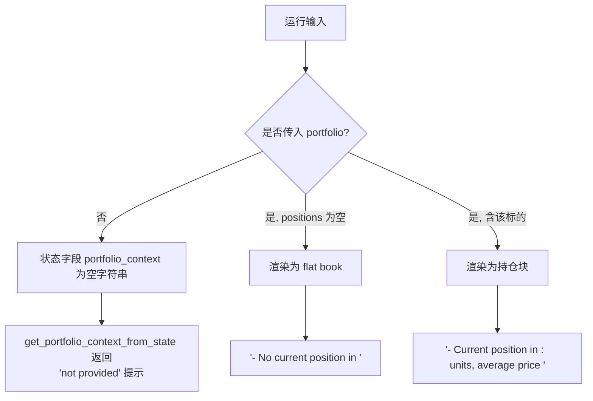
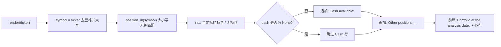
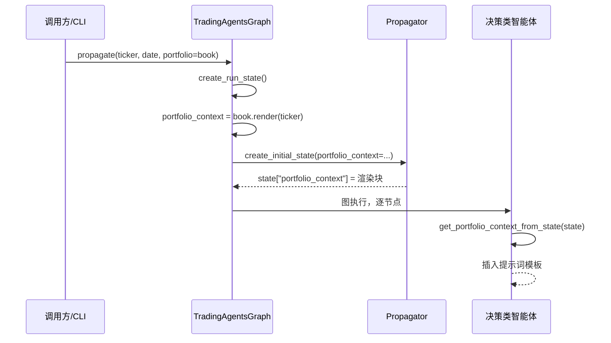
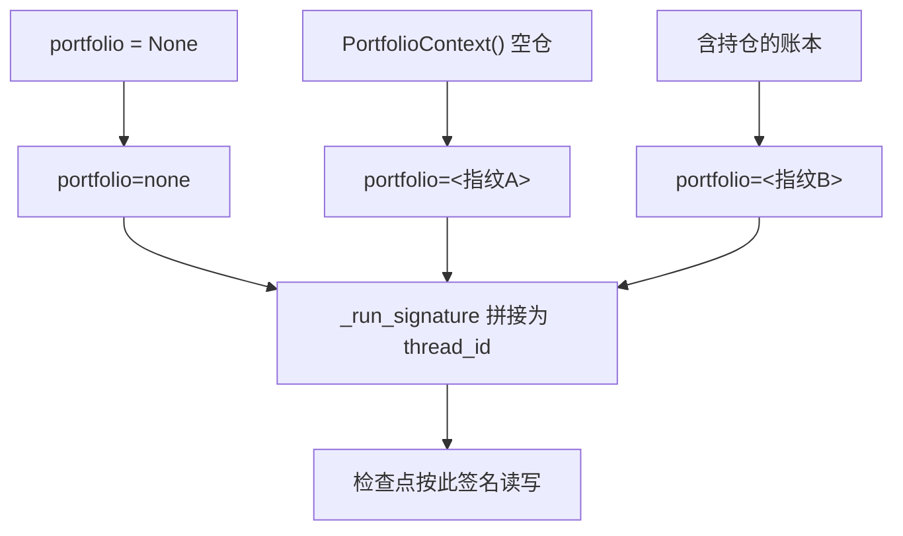

**投资组合上下文（Portfolio Context）** 是 TradingAgents 的一个可选运行输入，它把调用方实际持有的仓位、持仓成本与可用现金注入到决策类智能体的提示词中。缺少这一上下文时，智能体无法区分"在已满仓的标的上加仓"与"开立新仓"，两者的建议会读起来一模一样。本页聚焦于该能力的**数据模型、三态语义、渲染与传播路径、消费边界，以及与检查点/CLI/回测的集成方式**，属于"输出与配置"主题下的一个横切关注点。

Sources: [portfolio.py](tradingagents/portfolio.py#L1-L12)

## 为什么需要：加仓与开仓的语义落差

整条分析流水线的默认行为是"不知道自己持有什么"，因此智能体给出的方向与仓位建议是写给**一个会把它套用到自身仓位的读者**的。这在实践中留下一个盲点：同一条"Buy"建议，对空仓者意味着建仓，对重仓者却意味着追加风险敞口，而模型无从分辨。把持仓作为运行输入传入后，交易员、风险分析师与投资组合经理便能**对着真实账本调整建议**——这不是一个模拟器，而是给决策注入的一个已知事实。

Sources: [README.md](README.md#L298-L315), [CHANGELOG.md](CHANGELOG.md#L118)

## 数据模型：`Position` 与 `PortfolioContext`

上下文的全部结构定义在单一模块 `tradingagents/portfolio.py` 中，由两个 Pydantic 模型构成。模块被刻意设计为**经纪商中立**：数量是通用"单位"，货币只是调用方传入的标签，因此该结构不隐含任何交易所或执行路径。

| 模型 | 字段 | 类型 | 默认 | 语义 |
|------|------|------|------|------|
| `Position` | `ticker` | `str` | 必填 | 标的符号，如 `AAPL` |
| `Position` | `quantity` | `float` | 必填 | **带符号**单位数；负值表示做空 |
| `Position` | `average_price` | `float \| None` | `None` | 每单位平均入场价 |
| `PortfolioContext` | `cash` | `float \| None` | `None` | 可用现金 |
| `PortfolioContext` | `currency` | `str \| None` | `None` | 现金与价格的货币标签 |
| `PortfolioContext` | `positions` | `list[Position]` | `[]` | 持仓列表 |

关键在于**哪些字段可为 `None`**：`cash`、`currency`、`average_price` 全部可选，因此"未提供"与"为零"是两个不同的输入。测试 `test_partial_portfolio_states_only_what_it_was_given` 明确要求：现金被省略时，渲染结果中不出现 Cash 行，而不是凭空补一个零。

Sources: [portfolio.py](tradingagents/portfolio.py#L23-L32), [test_portfolio_context.py](tests/test_portfolio_context.py#L226-L231)

## 三态语义纪律：持仓、空仓与未提供

这是本能力最核心的设计约束。系统必须始终区分三种互斥状态，任何把第三种读成第二种的实现都是在**伪造一条关于账户的事实**。



*图示前提：`get_portfolio_context_from_state` 是唯一的状态读取入口；`render()` 只在传入 `portfolio` 对象时被调用，见下文传播路径。*

| 状态 | 输入 | 渲染结果 | 智能体读到的含义 |
|------|------|----------|------------------|
| **持仓** | `positions=[{ticker:"AAPL", quantity:120, ...}]` | `- Current position in AAPL: 120 units, average price 150.00` | 已持有，可加仓/减仓 |
| **空仓** | `positions=[]` | `- No current position in AAPL` | 明确不持有 |
| **未提供** | 不传 `portfolio` | `Portfolio context: not provided. ... do not assume a flat book ...` | 一无所知 |

未提供状态下的提示词刻意包含"do not assume a flat book"，并指示模型改为给出**调用方可以套用到自身仓位的方向与仓位指引**。`test_absent_context_is_reported_as_not_provided` 断言 `'no position'` 不得出现在该提示中——缺失绝不能被读成空仓。

Sources: [context.py](tradingagents/agents/context.py#L204-L218), [test_portfolio_context.py](tests/test_portfolio_context.py#L55-L59)

## `render()`：以被分析标的领衔的提示词块

`render(ticker)` 负责把结构化对象转成注入提示词的纯文本。它的设计要点是**以被分析的标的领衔**：第一行总是该标的的持仓（或"无持仓"），随后是现金，最后才是其他持仓。这样模型拿到的第一眼信息就与当前分析对象直接相关。



渲染格式的具体规则如下：

- **匹配大小写无关**：`position_in` 对存储的 `p.ticker.upper()` 与查询的 `ticker.strip().upper()` 比较，因此文件中写作 `aapl` 也能匹配查询的 `AAPL`。
- **数量格式**：使用 `{quantity:,.4g}`，既支持负值（做空）也支持大数缩写。
- **平均价**：仅当 `average_price is not None` 时才追加 `, average price {:.2f}`。
- **其他持仓**：仅列出非当前标的的持仓，格式为 `TICKER 数量`。
- **前缀固定**为 `Portfolio at the analysis date:`。

一个包含持仓与现金的完整渲染示例（`AAPL` 120 股 @150、其余持仓 `MSFT` 10、现金 25000 USD）会产出：

```
Portfolio at the analysis date:
- Current position in AAPL: 120 units, average price 150.00
- Cash available: 25,000.00 USD
- Other positions: MSFT 10
```

Sources: [portfolio.py](tradingagents/portfolio.py#L34-L51), [test_portfolio_context.py](tests/test_portfolio_context.py#L28-L45)

## 传播路径：从运行输入到智能体提示词

上下文的注入点在 `TradingAgentsGraph.create_run_state`，它与记忆日志、标的身世解析并列，在运行开始**一次性**渲染。空字符串 `""` 明确表示"未提供"，与渲染后的非空文本形成可判定的区别。



状态字段 `portfolio_context` 在 `AgentState` 中被标注为"运行开始时渲染的调用方持仓与现金，未提供时为空"。入口 `Propagate.create_initial_state` 接收同名参数并以默认空字符串写入初始状态，使程序化构造的裸状态（测试、手动装配）自然落入"未提供"分支。

Sources: [trading_graph.py](tradingagents/graph/trading_graph.py#L305-L322), [propagation.py](tradingagents/graph/propagation.py#L15-L37), [state.py](tradingagents/agents/state.py#L72)

## 消费方边界：谁看得见，谁必须保持盲目

并非所有智能体都接收投资组合上下文——这是一条**有意的边界**。风险辩论与最终决策需要知道自己面对的真实敞口，而研究员辩论必须保持盲目，否则多头与空头论证会被调用方既有仓位锚定，失去独立性。

| 智能体 | 接收上下文 | 证据 |
|--------|-----------|------|
| **Trader** | ✅ 是 | 提示词 `{portfolio_context}` 插入 |
| **Portfolio Manager** | ✅ 是 | 提示词 `{portfolio_context}` 插入 |
| **Aggressive / Conservative / Neutral Debator** | ✅ 是 | 风险辩论三方均插入 |
| **Bull / Bear Researcher** | ❌ 否 | 源码中不含 `portfolio_context` |
| **分析师团队（市场/新闻/情绪/基本面）** | ❌ 否 | 源码中不含 `portfolio_context` |

这一边界被两条测试固化：一条断言五个决策类智能体的提示词都携带 `PORTFOLIO_BLOCK_MARKER`；另一条通过反射检查 `bull_researcher` 与 `bear_researcher` 的源码中**不出现** `portfolio_context` 字样。二者共同保证边界不会被无意间改写。

由于研究团队看不到持仓，`ResearchPlan.strategic_actions` 的字段描述被刻意要求"相对**标准配置**给出仓位指引"，并注明"研究团队看不到调用方的持仓；由交易员与投资组合经理套用实际仓位"。

Sources: [trader.py](tradingagents/agents/trader/trader.py#L33-L70), [portfolio_manager.py](tradingagents/agents/managers/portfolio_manager.py#L28-L46), [aggressive_debator.py](tradingagents/agents/risk_mgmt/aggressive_debator.py#L28-L39), [schemas.py](tradingagents/agents/schemas.py#L120-L126), [test_portfolio_context.py](tests/test_portfolio_context.py#L98-L155)

## 检查点指纹：投资组合同样参与运行签名

启用检查点恢复时，运行的线程 ID 由 `_run_signature` 决定。投资组合通过 `fingerprint()` 参与签名——它是 `model_dump_json()` 的 SHA-256 摘要截断为 12 位十六进制，因此**"未提供"、空仓、已变更的账本", 三者产生截然不同的签名**。



这样设计的目的是防止**在换了账本的情况下静默复用旧运行**：若恢复时用的签名与实际运行时不同，就不会命中旧检查点，而是重新开始；反之，运行签名也是 `clear_checkpoint_on_success` 用来定位待删除检查点的键。测试 `test_completed_run_clears_the_checkpoint_it_wrote` 专门验证"写入与清理使用同一份投资组合签名"，否则清理将删不掉任何东西，下一次相同调用会恢复已完成的线程并直接返回旧决策。

Sources: [portfolio.py](tradingagents/portfolio.py#L53-L55), [trading_graph.py](tradingagents/graph/trading_graph.py#L157-L175), [trading_graph.py](tradingagents/graph/trading_graph.py#L262-L267), [test_portfolio_context.py](tests/test_portfolio_context.py#L89-L96)

## CLI 与回测集成

命令行提供两条入口，均复用同一套加载与传播逻辑。

| 入口 | 选项 | 行为 |
|------|------|------|
| `tradingagents`（分析） | `--portfolio <JSON 文件>` | 启动即加载；文件不可用时**运行前**以退出码 1 失败 |
| `tradingagents backtest` | `--portfolio <JSON 文件>` | 在整个标的×日期网格上**恒定使用同一账本** |

`load_portfolio` 负责文件读取，它把 `OSError`、`JSONDecodeError` 与 Pydantic 的 `ValidationError` 统一转换为带文件路径的 `ValueError`，从而**在运行之前而非图中途失败**。CLI 捕获该异常后打印并 `raise typer.Exit(code=1)`，`test_cli_rejects_an_unusable_portfolio_file_before_running` 断言此时 `run_analysis` 从未被调用。回测路径则明确把账本视为"每个单元格相同的静态账本"，它是决策质量评估器而非组合模拟器。

Sources: [cli/main.py](cli/main.py#L46-L85), [cli/main.py](cli/main.py#L109-L138), [portfolio.py](tradingagents/portfolio.py#L58-L64), [backtest.py](tradingagents/backtest.py#L9-L13), [test_portfolio_context.py](tests/test_portfolio_context.py#L234-L252)

## 设计权衡小结

| 决策 | 收益 | 代价 / 约束 |
|------|------|-------------|
| 可选输入，缺省为"未提供"而非空仓 | 不伪造账户事实 | 每个消费方都须处理"未提供"提示分支 |
| 数量带符号 | 原生支持做空 | 调用方须保证符号约定正确 |
| 研究团队保持盲目 | 多空论证不被现有仓位锚定 | 研究计划只能相对"标准配置"给出仓位 |
| 指纹纳入检查点签名 | 换账本不会误恢复旧运行 | 账本任何变动都会使旧检查点失效、重新运行 |
| 经纪商中立的数据模型 | 与交易所/执行路径解耦 | 系统不执行任何交易，仅提供决策 |

## 下一步阅读

理解投资组合上下文后，建议沿以下路径继续：

- 若关心它在状态中的位置与整体数据流，参见 [智能体状态模型与数据流转](14-zhi-neng-ti-zhuang-tai-mo-xing-yu-shu-ju-liu-zhuan)。
- 若关心消费它的三个决策角色，参见 [交易员与风险管理决策团队](17-jiao-yi-yuan-yu-feng-xian-guan-li-jue-ce-tuan-dui)。
- 若关心刻意保持盲目的研究员侧，参见 [研究员辩论与结构化输出](16-yan-jiu-yuan-bian-lun-yu-jie-gou-hua-shu-chu)。
- 若关心指纹如何参与断点恢复，参见 [状态持久化与断点恢复](10-zhuang-tai-chi-jiu-hua-yu-duan-dian-hui-fu)。
- 若关心如何以编程方式传入，参见 [Python API 与配置调整](9-python-api-yu-pei-zhi-diao-zheng)。
- 若关心回测中恒定账本的语义，参见 [回测命令行与结果解读](8-hui-ce-ming-ling-xing-yu-jie-guo-jie-du)。