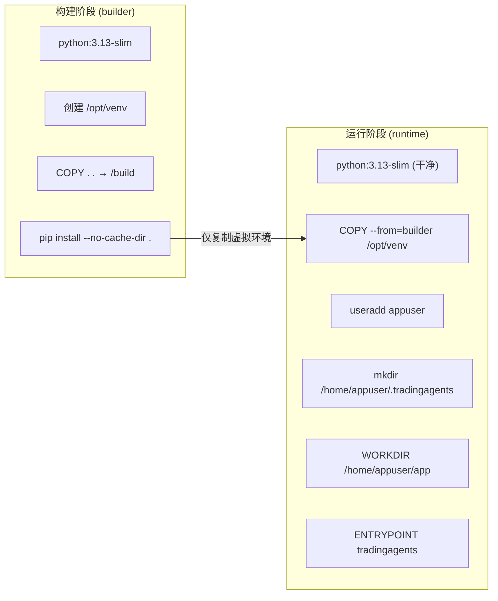
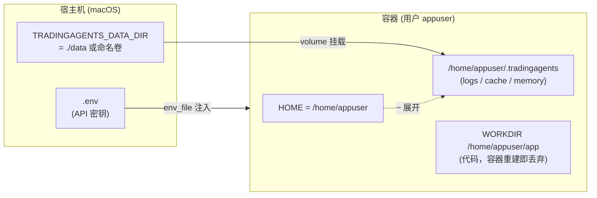
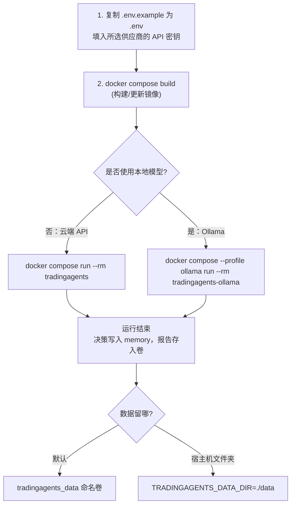

本页聚焦于一件事：如何用容器（Docker）运行 TradingAgents，以及程序产生的分析结果、缓存与记忆日志在「容器一次次重建」之间如何**不丢失**。如果你只是想在本地直接跑起来，请先阅读 [本地安装与依赖](3-ben-di-an-zhuang-yu-yi-lai)；本页假设你已经了解 TradingAgents 会产出报告、缓存和一份记忆日志，但还不清楚它们在容器里究竟落在磁盘的哪个位置。

Docker 在这里解决的问题是**环境一致性**：把 Python 版本、依赖和入口脚本全部固化进镜像，避免「我机器上能跑、换台机器就报错」。而数据持久化解决的是**无状态容器**的固有缺陷——容器一旦被删除，写在容器内部的文件会一并消失，因此必须把关键目录挂载到容器之外。理解这两者的配合，是本页的核心目标。

Sources: [Dockerfile](Dockerfile#L1-L29), [README.md](README.md#L140-L155)

## 为什么用 Docker：有状态数据 vs 无状态容器

一个常见的初学者误区是认为「容器里的文件就在本地」。事实并非如此：容器是一个隔离的文件系统，删除容器（例如 `docker compose down` 或重建镜像）时，容器内部写入的所有文件都会随之消失。TradingAgents 却是一个**有状态**的程序，它会在多次运行之间保留缓存、断点记忆日志与结果报告，因此必须主动把这些数据「搬出」容器。

下表对比了两种运行方式的关键差异，帮助你判断该选哪条路径。

| 维度 | 本地直接安装 | Docker 容器运行 |
| --- | --- | --- |
| 环境一致性 | 依赖本机 Python 与系统库 | 镜像内固定 Python 3.13，跨机器一致 |
| 数据落点 | `~/.tradingagents`（本机用户目录） | 容器内 `/home/appuser/.tradingagents`，需挂载卷 |
| 清理隔离 | 删除目录即清理 | 删除容器不影响已挂载的卷 |
| Ollama 本地模型 | 需自行安装 Ollama | Compose 内置 `ollama` 服务 |

本页后续将逐层拆解：镜像如何构建、编排如何挂载卷、数据究竟分为哪几类，以及遇到「数据不见了」时如何排查。

Sources: [README.md](README.md#L140-L155), [docker-compose.yml](docker-compose.yml#L1-L37)

## Dockerfile：两阶段镜像构建

TradingAgents 的镜像采用**多阶段构建（multi-stage build）**，这是行业里控制镜像体积与安全性的标准做法。它的思路是：先在一个「构建阶段」里把依赖装好，再把装好的成品复制进一个干净的「运行阶段」，从而让最终镜像不携带编译工具链。

构建阶段基于 `python:3.13-slim`，先创建一个虚拟环境到 `/opt/venv`，然后把整个源码目录复制进 `/build`，执行 `pip install --no-cache-dir .`（即根据 `pyproject.toml` 安装 TradingAgents 及其全部依赖）。`--no-cache-dir` 避免把 pip 的下载缓存留在镜像里，`PYTHONDONTWRITEBYTECODE=1` 则禁止生成 `.pyc` 文件。

Sources: [Dockerfile](Dockerfile#L1-L11), [pyproject.toml](pyproject.toml#L5-L28)

运行阶段重新以一份干净的 `python:3.13-slim` 起步，只把构建阶段的虚拟环境 `/opt/venv` 复制过来（`COPY --from=builder`），因此最终镜像里没有编译残留。随后脚本创建了一个**非 root 用户** `appuser`，并预先创建了数据目录 `/home/appuser/.tradingagents`（权限 `0755`、归属 `appuser`）。这一步很关键：它为持久化卷提供了一个固定的挂载锚点，同时遵循「容器以非特权用户运行」的安全实践。

Sources: [Dockerfile](Dockerfile#L13-L27)

最后，容器把工作目录设为 `/home/appuser/app`，把源码复制进去，并声明入口点 `ENTRYPOINT ["tradingagents"]`。这意味着**容器启动时默认执行 `tradingagents` 命令**（即 CLI 的默认分析子命令），而无需你手动输入命令。

Sources: [Dockerfile](Dockerfile#L24-L28), [pyproject.toml](pyproject.toml#L42-L43)

为了在构建时避免把无用或敏感的内容塞进镜像，仓库根目录有一份 `.dockerignore`，它排除了 `.git`、`.venv`、`.env`（含密钥）、`.idea`/`.vscode`、`__pycache__`、`build`/`dist`、`results`/`eval_results`，甚至把 `Dockerfile` 和 `docker-compose.yml` 自身也排除在外。一个容易忽略的细节是：`.env` 被排除，意味着密钥**不会**被烘焙进镜像，而是在运行时通过环境注入。

Sources: [.dockerignore](.dockerignore#L1-L16)

上图的要点是：**只有虚拟环境这一件成品被跨阶段传递**，源码与构建工具不会留在最终镜像的运行层里。

Sources: [Dockerfile](Dockerfile#L1-L28)

## docker-compose：服务编排与卷挂载

`docker compose` 是这套部署方式的入口。它把「构建镜像、注入环境变量、挂载数据卷、分配交互式终端」这些步骤固化成声明式配置，你只需一条命令即可运行。仓库的编排文件定义了三个服务，其中两个默认启用依赖于 `profiles`。

主服务 `tradingagents` 通过 `build: .` 从当前目录构建镜像，用 `env_file: - .env` 把所有环境变量（含 API 密钥）注入容器；最关键的是 `volumes` 把宿主机上的卷挂载到容器里的 `/home/appuser/.tradingagents`——路径与 Dockerfile 预先创建的数据目录**完全对齐**。`tty: true` 与 `stdin_open: true` 则让容器保留一个交互式的标准输入输出终端，因为 TradingAgents 的 CLI 默认会提出配置问题（除非你用环境变量或命令行参数跳过它们）。

Sources: [docker-compose.yml](docker-compose.yml#L1-L9)

另外两个服务被归入名为 `ollama` 的 profile，除非显式激活（`--profile ollama`）否则不会启动。第一个是官方的 `ollama/ollama:latest` 镜像，用命名卷 `ollama_data` 持久化模型；第二个 `tradingagents-ollama` 是同一套镜像，但额外设置 `TRADINGAGENTS_LLM_PROVIDER=ollama` 与 `OLLAMA_BASE_URL=http://ollama:11434/v1`，并通过 `depends_on` 等待 Ollama 就绪。这样你就得到了一套**完全本地、无需外部 API 密钥**的推理环境。

Sources: [docker-compose.yml](docker-compose.yml#L11-L32), [README.md](README.md#L152-L155)

文件底部通过顶层 `volumes:` 块声明了两个命名卷 `tradingagents_data` 与 `ollama_data`。命名卷由 Docker 管理，其真实物理位置在宿主机的 Docker 存储目录中，即使你删除并重建了容器，卷中的数据依然保留——这正是「持久化」的技术基础。

Sources: [docker-compose.yml](docker-compose.yml#L34-L37)

| 服务名 | 镜像来源 | 数据卷 | Profile | 用途 |
| --- | --- | --- | --- | --- |
| `tradingagents` | `build: .` | `tradingagents_data` → `/home/appuser/.tradingagents` | 默认 | 交互式分析 |
| `tradingagents-ollama` | `build: .` | `tradingagents_data` → 同上 | `ollama` | 用本地 Ollama 模型分析 |
| `ollama` | `ollama/ollama:latest` | `ollama_data` → `/root/.ollama` | `ollama` | 本地模型推理服务 |

Sources: [docker-compose.yml](docker-compose.yml#L1-L37)

## 数据究竟存在哪里：三处落点

要理解持久化，先要知道程序把哪些东西写到了磁盘。`default_config.py` 里所有默认路径都锚定在 `~/.tradingagents`（即用户主目录下的隐藏目录），在容器里它展开为 `/home/appuser/.tradingagents`——也就是那个被挂载的卷。这个「基准目录」是整个持久化体系的地基。

Sources: [tradingagents/default_config.py](tradingagents/default_config.py#L3), [tradingagents/default_config.py](tradingagents/default_config.py#L80-L82)

在这块基准目录下，程序区分了三类数据，各自有独立的默认位置与可覆盖的环境变量。下表是速查表，建议收藏。

| 数据类型 | 默认路径（相对 `~/.tradingagents`） | 覆盖用环境变量 | 说明 |
| --- | --- | --- | --- |
| 结果与报告 | `logs/` | `TRADINGAGENTS_RESULTS_DIR` | 每次运行的报告树与消息日志 |
| 数据缓存 | `cache/` | `TRADINGAGENTS_CACHE_DIR` | 行情缓存、SEC 文件，断点 SQLite 位于其下 |
| 记忆日志 | `memory/trading_memory.md` | `TRADINGAGENTS_MEMORY_LOG_PATH` | 追加式决策与反思记录 |

Sources: [tradingagents/default_config.py](tradingagents/default_config.py#L80-L82)

值得注意的是，这三条环境变量是**各自独立**的。也就是说，你可以只把缓存放到别处，而结果仍留在默认目录。但对 Docker 用户而言通常不必这样做——只要挂载好 `/home/appuser/.tradingagents` 这一个卷，三类数据就都被一并持久化了。

Sources: [.env.example](.env.example#L54-L58)

需要特别澄清一个容易混淆的点：`.env` 里的 `TRADINGAGENTS_DATA_DIR` **不是** Python 程序读取的配置项，而是 **docker-compose 的变量插值**，它只决定卷的「来源端」（是命名卷还是一个宿主机文件夹）。真正的程序内路径仍由 `results_dir`、`data_cache_dir`、`memory_log_path` 三个配置键控制。

Sources: [docker-compose.yml](docker-compose.yml#L7), [.env.example](.env.example#L51-L52)

## 容器内路径与宿主机映射

挂载之所以能生效，全靠路径的精确对齐。Dockerfile 在容器里以 `appuser` 身份创建了 `/home/appuser/.tradingagents`；由于 `appuser` 是通过 `useradd --create-home` 创建的，其 `HOME` 环境变量即为 `/home/appuser`，因此程序里 `os.path.expanduser("~")` 会解析到 `/home/appuser`，最终数据目录恰好落在被挂载的点上。

Sources: [Dockerfile](Dockerfile#L21-L23), [tradingagents/default_config.py](tradingagents/default_config.py#L3)

下面的图展示了「宿主机 ⇄ 容器」的数据流向。无论卷的源头是命名卷 `tradingagents_data` 还是宿主机的 `./data` 文件夹，都会挂载到容器内同一个路径，因此程序代码无需做任何修改。

Sources: [docker-compose.yml](docker-compose.yml#L4-L7), [Dockerfile](Dockerfile#L21-L26)

如果你希望数据直接躺在宿主机的某个文件夹里（例如便于用编辑器查看报告），可以在 `.env` 或 shell 里把 `TRADINGAGENTS_DATA_DIR` 指向一个已存在的目录。README 给出的示例是 `mkdir -p data && TRADINGAGENTS_DATA_DIR=./data docker compose run --rm tradingagents`，这样报告与缓存就会出现在项目下的 `./data` 里。

Sources: [README.md](README.md#L150), [.env.example](.env.example#L51-L52)

## 持久化机制详解

理解了「存在哪」之后，我们来看「存什么」。第一类是**记忆日志**：每次运行完成，程序都会把决策追加写入 `memory/trading_memory.md`；下次分析同一标的时，它会取回已实现的收益（原始收益以及相对基准的 alpha），生成一段反思。这门机制默认始终开启，是跨运行学习的基础。写入时通过文件锁保证并发安全。

Sources: [README.md](README.md#L321-L325), [tradingagents/memory/log.py](tradingagents/memory/log.py#L19-L27)

第二类是**断点恢复（checkpoint resume）**，它是**显式开启**的（默认关闭）。开启后，LangGraph 会在每个节点之后保存状态，使得崩溃或中断的运行可以从上一个成功步骤继续，而不必从头再来。SQLite 断点数据库按标的拆分存放于 `cache/checkpoints/<TICKER>.db` 下，避免不同标的互相争用。

Sources: [README.md](README.md#L327-L336), [tradingagents/graph/checkpointer.py](tradingagents/graph/checkpointer.py#L19-L25)

断点数据库的路径由 `data_cache_dir` 派生而来，因此它天然位于被挂载的卷之内，容器重建后仍可续跑。当一次运行**成功完成**时，程序会主动清除该次运行的断点，确保下一次运行从干净状态开始；只有中途失败才会保留断点以供恢复。

Sources: [tradingagents/graph/checkpointer.py](tradingagents/graph/checkpointer.py#L41-L52), [tradingagents/graph/trading_graph.py](tradingagents/graph/trading_graph.py#L262-L268)

第三类是**报告树**。一次运行会产出一份结构化的报告树（各分析师、研究、交易、风险、组合各一份 Markdown，外加一份 `complete_report.md`）。保存路径默认位于 `results_dir` 之下，且代码注释明确解释了这一设计：容器内的工作目录会随容器一起丢弃，因此报告必须写到 `results_dir` 这个已挂载的卷里，而不是当前工作目录。

Sources: [cli/run.py](cli/run.py#L389-L408), [tradingagents/reporting.py](tradingagents/reporting.py#L32-L39)

| 持久化机制 | 是否默认开启 | 存储位置 | 触发方式 |
| --- | --- | --- | --- |
| 记忆日志 | 是 | `memory/trading_memory.md` | 每次运行自动追加 |
| 断点恢复 | 否 | `cache/checkpoints/<TICKER>.db` | `--checkpoint` 或 `TRADINGAGENTS_CHECKPOINT_ENABLED=true` |
| 报告树 | 交互确认 | `logs/.../reports/` | 运行结束时选择保存 |

Sources: [README.md](README.md#L317-L343)

## 从零开始的 Docker 工作流

下面把上述所有环节串成一条可执行的操作路径。核心只有三步：准备 `.env`、构建镜像、运行；数据是否持久化则完全取决于卷的挂载（Compose 已默认处理）。

Sources: [README.md](README.md#L140-L155), [docker-compose.yml](docker-compose.yml#L1-L32)

第一步是复制并填写环境文件：`cp .env.example .env`，然后在其中填入你所用供应商的 API 密钥（例如 `OPENAI_API_KEY`）。由于 `.dockerignore` 排除了 `.env`，这些密钥只在运行时由 Compose 注入容器，不会进入镜像层。

Sources: [README.md](README.md#L143-L146), [.env.example](.env.example#L1-L17)

第二步是构建镜像。当你更新了仓库代码后，需要重新构建才能让镜像包含最新代码，命令是 `docker compose build`。首次运行 `docker compose run` 时也会自动触发构建。

Sources: [README.md](README.md#L148)

第三步是运行。`docker compose run --rm tradingagents` 会启动主服务并执行默认的 `tradingagents` 命令；`--rm` 表示容器退出后自动删除（这不影响挂载卷中的数据）。若要使用本地 Ollama，则改为 `docker compose --profile ollama run --rm tradingagents-ollama`。

Sources: [README.md](README.md#L145), [README.md](README.md#L154), [pyproject.toml](pyproject.toml#L42-L43)

## 环境变量速查（Docker 相关）

下表汇总了部署与持久化相关的环境变量。前一组由 docker-compose 用于卷路径，后一组由 Python 程序读取以决定各类数据的落点。

| 环境变量 | 读取方 | 作用 |
| --- | --- | --- |
| `TRADINGAGENTS_DATA_DIR` | docker-compose | 卷来源：命名卷或宿主机文件夹（默认 `tradingagents_data`） |
| `TRADINGAGENTS_RESULTS_DIR` | Python 程序 | 覆盖报告与结果目录（默认 `logs/`） |
| `TRADINGAGENTS_CACHE_DIR` | Python 程序 | 覆盖数据缓存目录，断点库位于其 `checkpoints/` 下 |
| `TRADINGAGENTS_MEMORY_LOG_PATH` | Python 程序 | 覆盖记忆日志文件路径 |
| `TRADINGAGENTS_CHECKPOINT_ENABLED` | Python 程序 | 是否启用断点保存（默认 `false`） |
| `TRADINGAGENTS_LLM_PROVIDER` | Python 程序 | 选择 LLM 供应商（Ollama profile 设为 `ollama`） |
| `OLLAMA_BASE_URL` | Python 程序 | Ollama 服务地址（Compose 内为 `http://ollama:11434/v1`） |

Sources: [docker-compose.yml](docker-compose.yml#L7-L24), [tradingagents/default_config.py](tradingagents/default_config.py#L10-L30), [.env.example](.env.example#L51-L58)

程序对这些变量的处理有一个稳健的设计：数值会被**强制转换为与默认值相同的类型**，若填写了非法值（例如把布尔写成 `treu`）会在启动时**直接报错**，而不是悄悄退回默认值。对于无人值守的批处理运行，这种「失败要响」的策略能避免静默的错误配置。

Sources: [tradingagents/default_config.py](tradingagents/default_config.py#L37-L70)

## 常见问题排查

容器化最常见的困扰都围绕「数据消失」与「写入失败」两类。下表列出症状、根因与对策。

| 症状 | 可能原因 | 对策 |
| --- | --- | --- |
| 重建容器后报告/记忆全没了 | 未挂载卷，数据写在容器内部 | 确认 `volumes` 指向 `/home/appuser/.tradingagents` |
| 报告存到了「奇怪」的位置 | 保存时手动改了 `save_path` 到容器工作目录 | 使用默认路径（位于已挂载的 `results_dir`） |
| 宿主机文件夹里空空如也 | `TRADINGAGENTS_DATA_DIR` 拼写错误或目录不存在 | 先 `mkdir -p data`，再 `TRADINGAGENTS_DATA_DIR=./data` |
| 权限被拒绝（Permission denied） | 宿主机目录属主与 `appuser` 不匹配 | 确保挂载目录可被容器内 `appuser`（UID 1000 类）写入 |
| 每次运行都从头开始，无法续跑 | 未开启断点或断点已被成功完成清除 | 用 `--checkpoint` 或设置 `TRADINGAGENTS_CHECKPOINT_ENABLED=true` |
| 容器起来后立即退出、无提示 | 缺少交互式 TTY 或未填 API 密钥 | 保留 `tty`/`stdin_open`；检查 `.env` 密钥 |

Sources: [docker-compose.yml](docker-compose.yml#L6-L9), [cli/run.py](cli/run.py#L394-L398), [tradingagents/graph/checkpointer.py](tradingagents/graph/checkpointer.py#L68-L82)

如果你需要**批量清理**断点（例如强制一次全新运行），CLI 提供了 `--clear-checkpoints`，它会在运行前删除所有 SQLite 断点数据库。注意清理时会连 `-wal`、`-shm` 旁路文件一并删除，否则「已清除」的断点里可能仍残留数据。

Sources: [cli/main.py](cli/main.py#L71-L74), [tradingagents/graph/checkpointer.py](tradingagents/graph/checkpointer.py#L68-L82)

## 下一步

你已经掌握了如何用容器运行 TradingAgents 并让数据跨运行存活。接下来，建议进入命令行章节了解交互式流程本身——尤其是当环境变量已排除了所有提示时，程序会如何自动跳过提问：[交互式 CLI 与运行流程](5-jiao-hu-shi-cli-yu-yun-xing-liu-cheng) 与 [无提示批处理运行（标志与环境变量）](6-wu-ti-shi-pi-chu-li-yun-xing-biao-zhi-yu-huan-jing-bian-liang)。

如果想深入学习本页提到的断点恢复与记忆日志的完整语义（例如断点如何按「图签名」隔离、记忆日志如何做幂等与轮转），请阅读 [状态持久化与断点恢复](10-zhuang-tai-chi-jiu-hua-yu-duan-dian-hui-fu) 与 [记忆日志与决策记录](25-ji-yi-ri-zhi-yu-jue-ce-ji-lu)。而配置系统如何把这些环境变量映射到配置键的细节，则在 [配置系统与环境变量覆盖](29-pei-zhi-xi-tong-yu-huan-jing-bian-liang-fu-gai) 中展开。