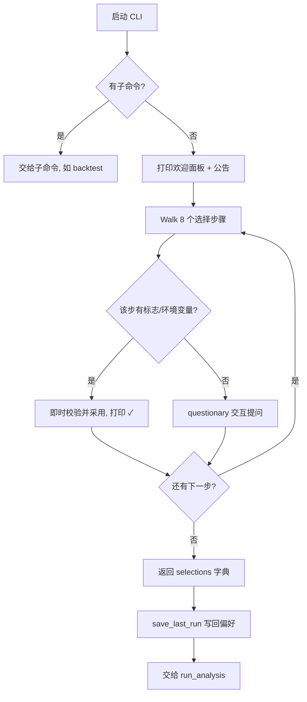
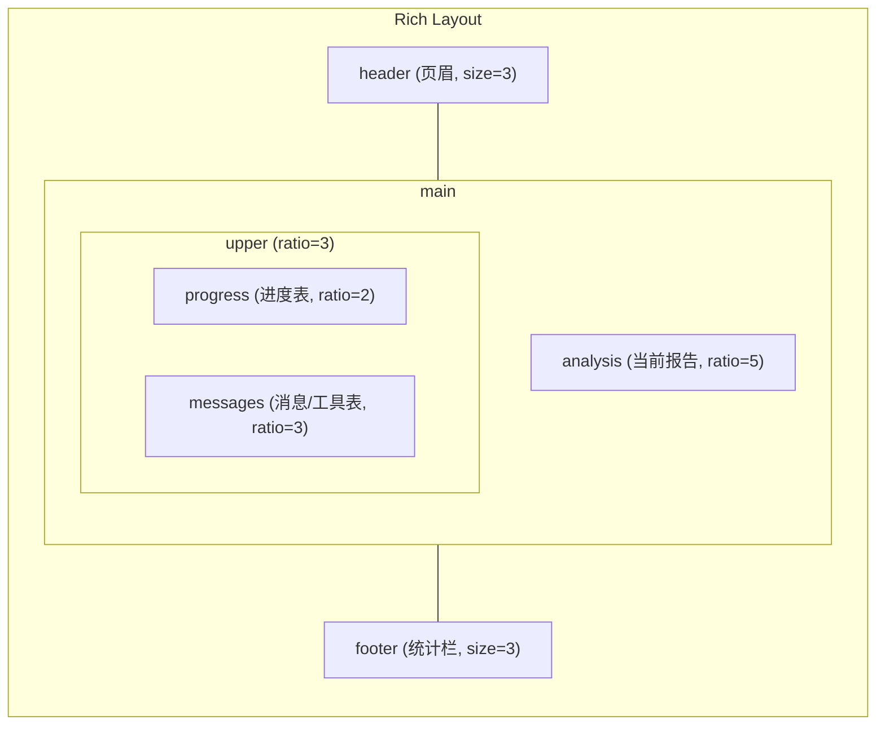
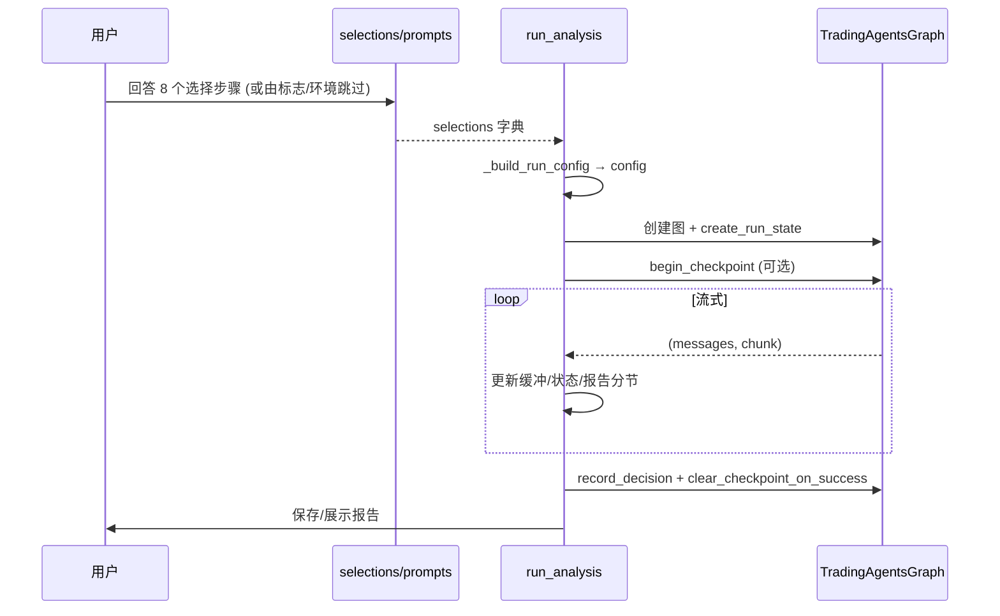

TradingAgents 的交互式命令行界面（CLI）是大多数使用者第一次接触框架的入口。它把一次完整的分析运行拆解成"提问 → 组态 → 流式执行 → 报告输出"四个环节：用户在终端里回答几个问题，CLI 据此构建一张运行图，把分析过程实时渲染到屏幕上，最后把报告写入磁盘。

本页聚焦于**交互式路径本身**——命令如何被解析、欢迎界面与逐步提问如何进行、实时视图如何组织、以及 `run_analysis` 如何把用户选择一路推进到报告落盘。至于"用标志和环境变量完全免交互"的细节，见 [无提示批处理运行（标志与环境变量）](6-wu-ti-shi-pi-chu-li-yun-xing-biao-zhi-yu-huan-jing-bian-liang)；`backtest` 子命令见 [回测命令行与结果解读](8-hui-ce-ming-ling-xing-yu-jie-guo-jie-du)；断点保存/恢复的内部机制见 [状态持久化与断点恢复](10-zhuang-tai-chi-jiu-hua-yu-duan-dian-hui-fu)。

## 启动入口与命令结构

CLI 有两个等价的启动方式：安装后可直接调用 `tradingagents` 命令，也可以从源码以模块方式运行 `python -m cli.main`。前者由打包元数据中的脚本入口定义，把命令名映射到 `cli.main` 模块里的 Typer 应用对象。

Sources: [pyproject.toml](pyproject.toml#L42-L43), [README.md](README.md#L200-L203)

整个 CLI 是一个基于 **Typer** 的应用，它巧妙地把"默认动作"和"子命令"共存在同一个入口里。根级别的 `@app.callback(invoke_without_command=True)` 装饰的 `analyze` 函数承担了默认行为：当用户**没有**指定子命令时，Typer 依然会调用它；函数体第一行用 `ctx.invoked_subcommand` 判断，如果存在子命令就立即返回，从而避免"运行分析"与"运行子命令"两件事同时发生。

Sources: [cli/main.py](cli/main.py#L25-L32), [cli/main.py](cli/main.py#L72-L73)

这种设计使用户写下 `tradingagents --checkpoint` 这样的裸调用时，默认执行分析而非报错；同时 `backtest` 作为正式子命令与它并列，二者互不干扰。命令结构的对应关系如下：

| 命令 | 触发条件 | 作用 | 主要参数 |
|------|----------|------|----------|
| `tradingagents` | 无子命令 | 运行一次分析（默认动作） | `--ticker`、`--date`、`--analysts`、`--save/--no-save`、`--show/--no-show` |
| `tradingagents --checkpoint` | 无子命令 + 选项 | 运行分析并启用断点续跑 | `--checkpoint/--no-checkpoint`、`--clear-checkpoints`、`--portfolio` |
| `tradingagents backtest ...` | `backtest` 子命令 | 在日期网格上回测历史决策 | `--start`、`--end`、`--every`、`--asset-type` |

Sources: [cli/main.py](cli/main.py#L33-L98), [cli/main.py](cli/main.py#L100-L157)

`analyze` 回调在把控制权交给运行逻辑之前，还会处理两类前置工作：`--clear-checkpoints` 会先清空所有已保存断点，`--portfolio` 会尝试加载持仓 JSON 文件——加载失败会以红色提示并退出，避免带着无效组态进入运行。随后它把 `ticker/date/analysts/save/show` 打包成一个 `flags` 字典，连同 `checkpoint` 与 `portfolio_context` 一起传给 `run_analysis`。

Sources: [cli/main.py](cli/main.py#L74-L85)

## 欢迎界面与交互选择流程

分析运行的第一步，是通过 `get_user_selections` 收集用户选择。它内部调用 `_prompt_selections`，后者才是真正走完所有提问步骤的地方。`get_user_selections` 的职责很轻：先读取上一次运行存下的偏好作为预填值，再在结束前把本次选择存回——"读记忆、提问、写记忆"。

Sources: [cli/selections.py](cli/selections.py#L42-L46)

`_prompt_selections` 会先打印一个由 ASCII 艺术字与说明文字组成的欢迎面板。ASCII 字来自静态文件 `cli/static/welcome.txt`，面板则补充了工作流步骤（I. 分析师团队 → II. 研究团队 → III. 交易员 → IV. 风险管理 → V. 组合管理）与项目署名。

Sources: [cli/selections.py](cli/selections.py#L80-L118), [cli/static/welcome.txt](cli/static/welcome.txt#L1-L8)

欢迎面板之后，CLI 会尝试拉取并展示**公告（announcements）**。这一步是"尽力而为"的：`fetch_announcements` 用很短的超时请求远端接口，任何异常都会退回到一条本地兜底公告，绝不会因为网络问题阻塞用户。

Sources: [cli/selections.py](cli/selections.py#L119-L122), [cli/announcements.py](cli/announcements.py#L11-L36)

接下来是核心的 8 个提问步骤。每一步都会先用一个统一的蓝色问号面板（`create_question_box`）说明"这是第几步、问什么、默认值是什么"，再调用对应的 questionary 交互函数。步骤顺序、跳过条件与产出字段如下表所示：

| 步骤 | 提问内容 | 主要产出字段 | 跳过条件 |
|------|----------|--------------|----------|
| Step 1 | 标的符号（ticker） | `ticker`、`asset_type` | `--ticker` 提供 |
| Step 2 | 分析日期 | `analysis_date` | `--date` 提供 |
| Step 3 | 输出语言 | `output_language` | `TRADINGAGENTS_OUTPUT_LANGUAGE` 已设 |
| Step 4 | 分析师团队（多选） | `analysts` | `--analysts` 提供 |
| Step 5 | 研究深度 | `research_depth` | 两个轮次环境变量均已设 |
| Step 6 | LLM 供应商与端点 | `llm_provider`、`backend_url` | `TRADINGAGENTS_LLM_PROVIDER` 已设 |
| Step 7 | 快速/深度思考模型 | `quick_think_llm`、`deep_think_llm` | 任一模型环境变量已设 |
| Step 8 | 供应商特有的推理/思考开关 | `google_thinking_level` 等 | 对应 `TRADINGAGENTS_*` 已设 |

Sources: [cli/selections.py](cli/selections.py#L129-L333)

这个流程的走向可以用下面的流程图概括：

Sources: [cli/selections.py](cli/selections.py#L80-L333), [cli/selections.py](cli/selections.py#L42-L46)

交互函数集中定义在 `cli/prompts.py`，它们承担了大量"防误输入"的职责。例如 `get_ticker` 特意使用 `questionary.text` 而非 `typer.prompt`，因为某些 shell 下后者会剥掉 `000404.SH` 这样的尾部后缀；同时它对符号字符集做了校验，允许 `=`（期货/外汇如 `GC=F`）与 `^`（指数）。校验通过后，符号会被交给数据层的 `normalize_symbol` 归一化，保证 CLI 传递的符号与数据路径实际取价所用的符号完全一致。

Sources: [cli/prompts.py](cli/prompts.py#L44-L78), [cli/prompts.py](cli/prompts.py#L101-L113)

分析师选择同时受**资产类型**约束：`detect_asset_type` 会先归一化符号，再判断是否属于加密后缀（`-USD`、`-USDT` 等）；若是加密资产，`filter_analysts_for_asset_type` 会把基本面分析师从可选项中剔除。

Sources: [cli/prompts.py](cli/prompts.py#L115-L135), [cli/selections.py](cli/selections.py#L145-L148)

## 交互选项的预填与记忆

为了减少重复输入，CLI 会把"稳定不变"的选择记住：它们被写入用户主目录下的 `~/.tradingagents/cli_prefs.json`，下一次运行时作为各提问的默认值预填——用户直接按回车即可接受。需要强调的是，记住的答案**只预填、绝不跳过**任何步骤，因此每次运行用户都能看到自己即将采用的选项。

Sources: [cli/prefs.py](cli/prefs.py#L1-L33), [cli/prefs.py](cli/prefs.py#L36-L41)

并非所有选择都会被记住。模块刻意只保留跨运行稳定的字段（输出语言、分析师、研究深度、供应商、快速/深度模型、后端 URL），而**不记住** ticker 与分析日期——它们每次都变，记住一个旧日期反而会悄悄给出过时的默认值。

Sources: [cli/prefs.py](cli/prefs.py#L25-L29)

被记住的值在回填前还要经过 `sanitize` 检查：由于模型与供应商会随版本新增或下线，一个已不再提供的旧模型会被静默丢弃，而不是显示在菜单里。研究深度被限定在 `(1, 3, 5)` 三个合法值内，分析师则按当前资产类型再次过滤。

Sources: [cli/prefs.py](cli/prefs.py#L64-L92)

## 标志跳过与无终端保护

每个命令行标志只跳过"它自己对应的那一个问题"，其余步骤照常走交互。这与环境变量"整步跳过"的语义一致：两者共同构成"渐进式免交互"——用户可以只固定自己关心的部分。

Sources: [cli/selections.py](cli/selections.py#L129-L333)

当检测到**没有可用终端**（标准输入不是 TTY）时，`run_analysis` 不会逐个撞上提问才发现问题，而是先调用 `unattended_gaps` 一次性列出所有仍然缺失的答案，然后直接退出。这个函数会检查 `--ticker/--date/--analysts` 标志、`--save/--no-save` 与 `--show/--no-show` 两对选项，以及输出语言、轮次、供应商、模型等关键环境变量是否齐备。

Sources: [cli/run.py](cli/run.py#L97-L104), [cli/selections.py](cli/selections.py#L55-L71)

无终端保护对具体供应商还有更细的一层：`ensure_api_key` 在缺少 API Key 时，若没有终端可交互，会打印错误并退出，而不会让后续的 API 调用以一个更含糊的方式失败。该函数还会把用户粘贴的 Key 以**仅属主可读**（`0600`）的权限写入 `.env` 并导出到当前进程环境。免交互运行的完整标志与环境变量清单，见 [无提示批处理运行（标志与环境变量）](6-wu-ti-shi-pi-chu-li-yun-xing-biao-zhi-yu-huan-jing-bian-liang)。

Sources: [cli/prompts.py](cli/prompts.py#L627-L683)

## 实时运行视图

`run_analysis` 在执行分析时会进入一个 **Rich `Live`** 上下文，以每秒 4 次的频率刷新屏幕，并启用 `screen=True` 的备用屏幕——这样当布局高于窗口时不会因滚动而反复重绘；最终报告则在这个上下文之外、回到普通屏幕后打印，避免与实时视图争抢屏幕。

Sources: [cli/run.py](cli/run.py#L185-L187), [cli/run.py](cli/run.py#L370-L372)

实时视图的骨架由 `create_layout` 定义，它把屏幕划分为五个区域：顶部页眉、中间的进度面板与消息面板、下方的当前报告面板，以及底部状态栏。其结构如下：

Sources: [cli/display.py](cli/display.py#L160-L171)

各区域的内容由一个全局的 `MessageBuffer` 对象驱动，它充当"屏幕的单一真相源"。这个类维护消息队列、工具调用队列、每个智能体的运行状态（`agent_status`）、各报告分节的内容（`report_sections`），以及一个去重用的 `_processed_message_ids` 集合。`init_for_analysis` 会依据用户选中的分析师初始化状态与分节，同时登记那些**固定不选**的团队（研究团队、交易团队、风险管理、组合管理）。

Sources: [cli/display.py](cli/display.py#L28-L120)

几个关键的显示函数分工如下：

| 函数 | 位置 | 职责 |
|------|------|------|
| `update_display` | `cli/display.py` | 渲染页眉、进度表、消息表、当前报告与底部统计栏 |
| `update_analyst_statuses` | `cli/display.py` | 依据已归档的报告更新分析师状态；全部归档后启动研究辩论 |
| `update_research_team_status` | `cli/display.py` | 批量更新研究团队成员（牛/熊/研究经理）的状态 |
| `classify_message_type` | `cli/display.py` | 把 LangChain 消息归类为 User/Agent/Data/Control/System |
| `display_complete_report` | `cli/display.py` | 在实时视图结束后顺序打印完整报告 |

Sources: [cli/display.py](cli/display.py#L183-L260), [cli/display.py](cli/display.py#L379-L438), [cli/display.py](cli/display.py#L465-L538), [cli/display.py](cli/display.py#L540-L572)

底部状态栏聚合了多项实时指标：已完成的智能体数、LLM 调用次数、工具调用次数、输入/输出 token 数（不足一千时降级为 `--`）、报告完成数以及已用时（`MM:SS`）。这些 LLM 与 token 统计来自一个独立的回调处理器 `StatsCallbackHandler`——它用线程锁保护计数器，在 `on_llm_start`/`on_chat_model_start` 累加调用数，在 `on_llm_end` 从 `usage_metadata` 中提取 token 用量。

Sources: [cli/display.py](cli/display.py#L344-L378), [cli/stats_handler.py](cli/stats_handler.py#L9-L77)

此外还有一个专门用于衡量分析师**墙钟耗时**的 `AnalystWallTimeTracker`：由于分析师是并行开始的，它在运行开始时统一 `mark_started`，在某个分析师的报告落地时 `mark_completed`，最终 `format_summary` 输出形如 `Market 3.21s | News 4.05s` 的汇总。

Sources: [cli/display.py](cli/display.py#L574-L623)

## 运行流水线与报告输出

流式执行之前，`run_analysis` 先完成一系列准备：把交互选择组装成运行配置、按固定顺序规范化分析师列表、构建分析师执行计划、创建图对象，并初始化 `MessageBuffer`。

Sources: [cli/run.py](cli/run.py#L106-L131)

从选择到配置的转换由 `_build_run_config` 完成，它遵循一条"显式者胜出"的优先级规则：研究深度同时设置辩论轮数与风险讨论轮数，但如果某个轮数已由环境变量（`TRADINGAGENTS_MAX_DEBATE_ROUNDS` / `TRADINGAGENTS_MAX_RISK_ROUNDS`）显式指定，则保留环境值、并打印提示说明交互选择对那一半不适用。断点开关同理——只有显式传入 `--checkpoint/--no-checkpoint` 才会覆盖，否则沿用环境变量或默认值。

Sources: [cli/run.py](cli/run.py#L58-L95)

运行前，CLI 会在 `results_dir/<ticker>/<date>/` 下创建目录结构，其中 `reports/` 存放各分节报告，`message_tool.log` 记录消息与工具调用。特别地，ticker 在拼入路径前会经过 `safe_ticker_component` 校验——这一步是为了防止形如 `..` 的值把运行输出写到结果目录之外。

Sources: [cli/run.py](cli/run.py#L35-L41), [cli/run.py](cli/run.py#L140-L147)

之后，CLI 用几个**装饰器**给 `MessageBuffer` 的三个方法（`add_message`、`add_tool_call`、`update_report_section`）套上"写盘副作用"：每条消息、每次工具调用、每个报告分节在被加入内存缓冲的同时，也被追加/写入对应的文件，从而实现"屏幕显示什么，磁盘就记录什么"。

Sources: [cli/run.py](cli/run.py#L149-L183)

真正的执行以 `graph.stream_run(...)` 为核心，逐个产出 `(messages, chunk)`。对每一批消息，CLI 用消息 id 去重后分类并加入缓冲；对每一个 chunk（即某个节点的状态增量），它调用 `update_analyst_statuses` 更新分析师状态，并依次识别研究辩论、交易团队与风险管理三段的产出，把对应文本写入报告分节并推进智能体状态。由于 chunk 是"每个节点的增量"而非完整状态，代码在循环结束后把所有 chunk 合并成 `final_state`，以保证每个报告字段都完整。

Sources: [cli/run.py](cli/run.py#L236-L351)

这一流水线的整体时序如下：

Sources: [cli/run.py](cli/run.py#L187-L388)

在图执行生命周期的两端还各有一层与断点相关的处理：`begin_checkpoint` 会（在启用时）重新编译带检查点的图并返回 `thread_id`，`checkpoint_input` 决定是传入完整初始状态还是 `None`（续跑时传 `None`，让 LangGraph 从断点继续而非重复追加初始状态），而 `finally` 块中的 `end_checkpoint` 保证无论成功失败都还原为不带检查点的图。这些机制的内部细节属于 [状态持久化与断点恢复](10-zhuang-tai-chi-jiu-hua-yu-duan-dian-hui-fu)。

Sources: [cli/run.py](cli/run.py#L216-L235), [cli/run.py](cli/run.py#L237-L238), [cli/run.py](cli/run.py#L354-L356)

分析完成后，实时视图退出，CLI 打印 `Analysis Complete!` 与分析师墙钟汇总。它会通过 `run_rating` 读取最终决策的评级，若无法读出评级，则会明确提示"本次运行被记录为待复盘而非一个持仓"，避免用户把空结果误当成正常结论。

Sources: [cli/run.py](cli/run.py#L370-L386), [cli/run.py](cli/run.py#L388-L389)

最后的 `_offer_reports` 负责两件收尾工作——保存与展示，且都支持由标志预先回答。保存路径默认落在 `graph.default_report_path(ticker)`，即 `results_dir` 之下（而非当前工作目录），这样在 Docker 中报告会随挂载卷持久化；展示则调用 `display_complete_report` 顺序打印完整报告。报告树的生成与保存细节见 [报告树生成与保存](28-bao-gao-shu-sheng-cheng-yu-bao-cun)。

Sources: [cli/run.py](cli/run.py#L389-L414)

## 小结与后续阅读

交互式 CLI 把"配置收集"（`cli/selections.py` + `cli/prompts.py`）、"运行编排"（`cli/run.py`）、"实时渲染"（`cli/display.py` + `cli/stats_handler.py`）和"偏好记忆"（`cli/prefs.py`）四块职责清晰分离，通过 `MessageBuffer` 这个共享对象把运行状态与显示状态解耦。理解这条主线后，建议按以下顺序深入：

- 想让运行完全免交互（定时任务/脚本）：[无提示批处理运行（标志与环境变量）](6-wu-ti-shi-pi-chu-li-yun-xing-biao-zhi-yu-huan-jing-bian-liang)
- 关心标的符号如何被识别与归一化：[多市场行情与标的符号](7-duo-shi-chang-xing-qing-yu-biao-de-fu-hao)
- 想批量评估历史决策：[回测命令行与结果解读](8-hui-ce-ming-ling-xing-yu-jie-guo-jie-du)
- 想用代码而非 CLI 驱动：[Python API 与配置调整](9-python-api-yu-pei-zhi-diao-zheng)
- 关心崩溃后如何续跑：[状态持久化与断点恢复](10-zhuang-tai-chi-jiu-hua-yu-duan-dian-hui-fu)