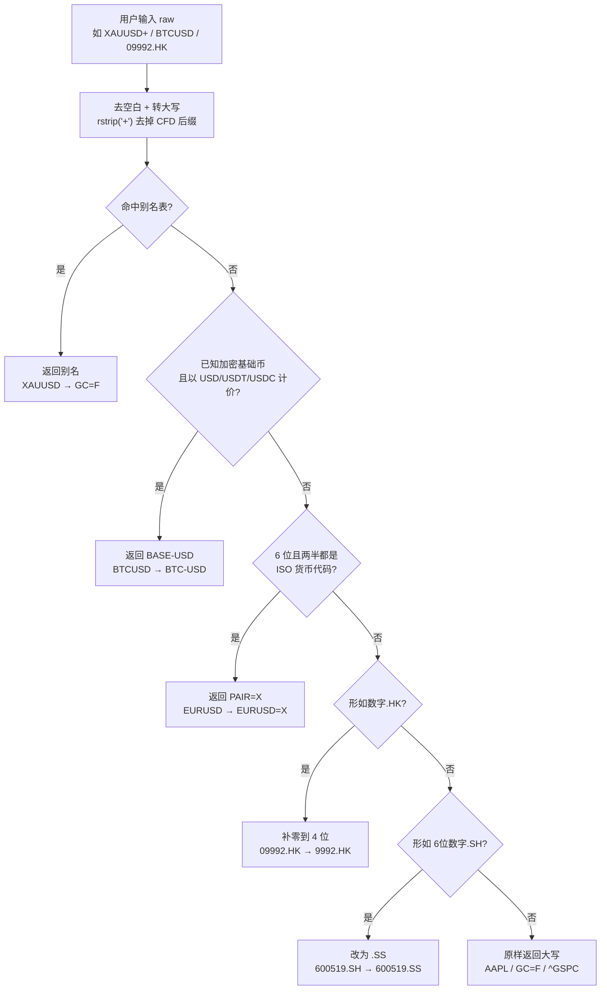
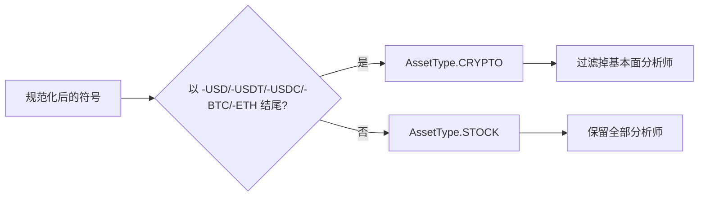
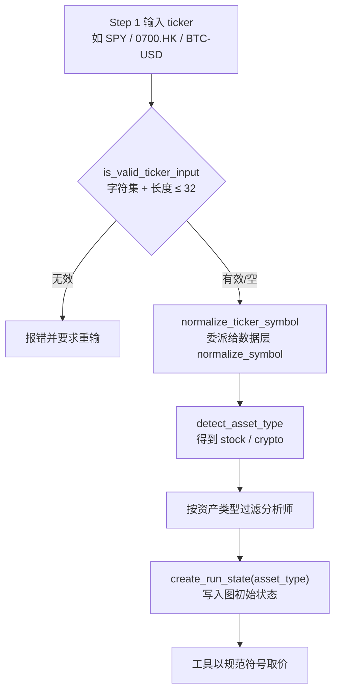

本页面向初学者，解释 TradingAgents 如何用「标的符号」定位你要分析的资产，以及它如何在美股、港股、A 股、外汇、加密货币、大宗商品等多个市场之间通用。核心问题是：**你输入的交易品种符号，如何变成系统真正去取价的符号**，以及系统如何据此判断资产类型（股票还是加密资产）、挑选合适的分析师、并自动匹配各市场的基准指数。

范围上，本页聚焦「命令行使用」层面用户能感知到的行为——能输入哪些市场、符号如何被校验与规范化、资产类型如何影响运行流程。符号归一化的底层算法细节与公司身份解析的深入机制，属于数据层主题，请参阅 [标的符号归一化与公司身份解析](20-biao-de-fu-hao-gui-hua-yu-gong-si-shen-fen-jie-xi)。

## 支持的市场与资产类别

TradingAgents 通过 Yahoo Finance（默认供应商）覆盖全球市场，只要你使用带**交易所后缀**的代码即可。系统设计上不限定单一市场：公司身份与 alpha 基准都会按标的所在市场自动解析。

| 市场 | 示例代码 | 说明 |
| --- | --- | --- |
| 美国 | `AAPL`、`SPY` | 无点号后缀，直接使用 |
| 香港 | `0700.HK` | 需 4 位数字补零 |
| 东京 | `7203.T` | `.T` 后缀 |
| 伦敦 | `AZN.L` | `.L` 后缀 |
| 印度 | `RELIANCE.NS`、`.BO` | 分别对应 NSE / BSE |
| 加拿大 / 澳大利亚 | `.TO` / `.AX` | 多伦多 / 澳洲 |
| 中国 A 股 | `600519.SS`（上海）、`.SZ`（深圳） | 例：贵州茅台 `600519.SS` |
| 加密货币 | `BTC-USD`、`ETH-USD` | 也接受 `BTCUSD`、`BTC-USDT` 等写法 |
| 交易品种（外汇/贵金属/指数 CFD） | `EURUSD`、`XAUUSD`、`US500` | 会被映射到 Yahoo 的对应符号 |

Sources: [README.md](README.md#L215-L223)

## 为什么需要符号归一化

用户（尤其是外汇、CFD 交易者）习惯用经纪商风格的符号，但 Yahoo Finance 的代码约定与之不同。直接把经纪商符号丢给 Yahoo 会返回**空结果**，而智能体过去会把空结果当成自由文本、进而「编造」一个价格（历史问题 #781）。为杜绝这种虚构，系统在**每个 yfinance 入口**统一把符号解析为 Yahoo 的规范形式，因此新增品种只需在表格里加一行，而不必修改任何调用点。

下面这张流程图展示了从用户输入到规范符号的解析顺序（**先匹配先胜出**）：

Sources: [tradingagents/dataflows/symbols.py](tradingagents/dataflows/symbols.py#L1-L21), [tradingagents/dataflows/symbols.py](tradingagents/dataflows/symbols.py#L103-L144)

规范化函数 `normalize_symbol` 严格按上图的优先级解析，且**完全是语法层面**的操作——不发起任何网络请求，因此可以安全地在每次请求上调用。只有当解析结果与原始输入不同时，它才会记录一条日志，便于排查。

Sources: [tradingagents/dataflows/symbols.py](tradingagents/dataflows/symbols.py#L103-L144)

## 符号归一化规则对照表

下表把「你输入的」与「Yahoo 需要的」并列，帮助初学者快速判断该用什么符号。别名表覆盖贵金属、能源与指数 CFD；外汇、加密、港股与上海代码则由规则自动推导。

| 你输入（经纪商风格） | 系统取价的符号 | 原因 |
| --- | --- | --- |
| `XAUUSD`、`XAUUSD+`、`GOLD` | `GC=F` | 黄金在 Yahoo 无外汇对，以 COMEX 期货报价 |
| `XAGUSD`、`SILVER` | `SI=F` | 白银对应 NYMEX 期货 |
| `USOIL`、`WTI` | `CL=F` | WTI 原油期货 |
| `BCOUSD`、`BRENT` | `BZ=F` | 布伦特原油期货 |
| `SPX500`、`US500` | `^GSPC` | 指数 CFD 映射到标普 500 指数 |
| `NAS100`、`US100` | `^NDX` | 纳斯达克 100 |
| `US30`、`DJI30` | `^DJI` | 道琼斯工业指数 |
| `EURUSD` | `EURUSD=X` | 即期外汇对加 `=X` 后缀 |
| `BTCUSD`、`BTC-USDT` | `BTC-USD` | 加密对用 `-` 分隔并以 USD 报价 |
| `09992.HK`、`700.HK` | `9992.HK`、`0700.HK` | 港股代码补零到 4 位 |
| `600519.SH` | `600519.SS` | Yahoo 上海写作 `.SS` |
| `AAPL`、`GC=F`、`^GSPC` | 原样不变 | 已是 Yahoo 原生符号 |

Sources: [tradingagents/dataflows/symbols.py](tradingagents/dataflows/symbols.py#L47-L72), [tradingagents/dataflows/symbols.py](tradingagents/dataflows/symbols.py#L34-L45), [tests/test_symbols.py](tests/test_symbols.py#L11-L70)

值得注意的是，`_FOREX_CURRENCIES` 只包含常见零售外汇的 ISO-4217 货币代码，而加密规则只用一份「已知基础币」集合（`BTC`、`ETH`、`SOL` 等）。因此像 `ABCDEF` 这种恰好 6 位、但两半都不是货币代码的普通代码**不会**被误改成伪外汇对；像 `GOLD` 这种真实存在、但已被别名指向黄金期货的代码，也**不会**被误判为加密资产。

Sources: [tradingagents/dataflows/symbols.py](tradingagents/dataflows/symbols.py#L31-L45), [tests/test_symbols.py](tests/test_symbols.py#L43-L46), [tests/test_symbols.py](tests/test_symbols.py#L95-L99)

## 资产类型识别：股票还是加密资产

规范化之后，系统会依据**规范符号**判断资产类型（`AssetType`），取值只有 `stock` 与 `crypto` 两种。判断逻辑是：把输入先归一化，再看结果是否以加密后缀结尾。这一步之所以基于规范符号而非原始输入，是为了让 `BTCUSD`、`BTC-USDT` 等各类写法都能被正确识别为加密资产，与数据层实际取价的品种保持一致。

Sources: [cli/models.py](cli/models.py#L13-L15), [cli/prompts.py](cli/prompts.py#L118-L124), [cli/prompts.py](cli/prompts.py#L24)

资产类型会直接影响**可用分析师集合**：加密资产不提供基本面分析师（因为没有公司财报可分析），所以会被过滤掉；股票则保留全部四类分析师。这一过滤在命令行层、回测层与偏好记忆层都会应用，确保任何入口拿到的分析师集合都与资产类型相容。

Sources: [cli/prompts.py](cli/prompts.py#L127-L136), [tests/test_crypto_asset_mode.py](tests/test_crypto_asset_mode.py#L9-L45)

## CLI 端到端：从输入到图状态

在交互式命令行（CLI）中，符号的流转是一条清晰的流水线。理解这条流水线，就能明白「为什么我输入的 `BTCUSDT` 会被当作加密资产，且不会运行基本面分析师」。

Sources: [cli/selections.py](cli/selections.py#L129-L148), [cli/prompts.py](cli/prompts.py#L27-L35), [cli/prompts.py](cli/prompts.py#L102-L115)

**输入校验**允许 Yahoo 符号会用到的字符，包括期货/外汇的 `=`（如 `GC=F`、`EURUSD=X`）与指数的 `^`；空输入是合法的，会默认使用 `SPY`。交互提示用 `questionary.text` 而非 `typer.prompt`，因为后者在某些 shell 下会剥掉 `.SH` 这类尾部点号后缀，导致 `000404.SH` 被截断。

Sources: [cli/prompts.py](cli/prompts.py#L27-L63)

当使用命令行标志时，`--ticker` 会跳过第 1 步提示，但走**同一套校验与归一化**：`parse_ticker` 会先检查字符合法性，再调用 `normalize_ticker_symbol`。CLI 的 `normalize_ticker_symbol` 刻意**委派**给数据层的 `normalize_symbol`，作为「单一事实来源」，这样 CLI 传给流水线的符号，与数据路径真正去取价的符号完全一致。

Sources: [cli/main.py](cli/main.py#L52), [cli/prompts.py](cli/prompts.py#L66-L70), [cli/prompts.py](cli/prompts.py#L102-L115), [tests/test_cli_symbol_handling.py](tests/test_cli_symbol_handling.py#L60-L63)

**资产类型进入图状态**后，会顺着整条链路影响智能体的措辞与工具行为。初始状态会携带 `asset_type` 字段；仪器上下文里对加密资产使用「asset」而非「instrument」的措辞，并明确提示「不要假定公司基本面数据可用」。研究员与新闻分析师的提示词同样会依据资产类型切换「stock」/「asset」的措辞。

Sources: [tradingagents/graph/propagation.py](tradingagents/graph/propagation.py#L13-L35), [tradingagents/agents/context.py](tradingagents/agents/context.py#L126-L168), [cli/run.py](cli/run.py#L216-L218)

## 符号在数据路径上的一致性

鉴于历史问题 #981–#984，系统要求**每一条 yfinance 路径**都先归一化符号，而不只是行情取价路径。这样，公司身份查询、已实现收益结算、新闻查询都会命中**同一只**被定价的品种，而不会因为用了原始经纪商符号而失配或失败。

| 数据路径 | 是否归一化 | 效果 |
| --- | --- | --- |
| OHLCV 加载 | 是 | `XAUUSD+` → `GC=F` |
| 市场行情 | 是 | 以 `GC=F` 查询历史 |
| 新闻查询 | 是 | 报告头保留用户输入，标注 `(resolved to GC=F)` |
| 身份解析 | 是 | `XAUUSD` → `GC=F` 的身份信息 |
| 收益结算 | 是 | 结算命中 `GC=F` |

Sources: [tests/test_symbol_normalization_paths.py](tests/test_symbol_normalization_paths.py#L1-L78), [tradingagents/dataflows/vendors/yahoo/ohlcv.py](tradingagents/dataflows/vendors/yahoo/ohlcv.py#L172-L194), [tradingagents/dataflows/vendors/yahoo/news.py](tradingagents/dataflows/vendors/yahoo/news.py#L76-L82)

除 Yahoo 外，社交数据源也共享同一套加密识别原语 `crypto_base`：StockTwits 把加密对映射为 `BTC.X`（因为 Yahoo 的 `BTC-USD` 形式在其上会 404），Reddit 则按基础币 `BTC` 搜索，让查询真正匹配到讨论。这正是「一个共享原语、多处复用」的设计——`crypto_base` 在语法层面统一判定加密品种。

Sources: [tradingagents/dataflows/symbols.py](tradingagents/dataflows/symbols.py#L82-L94), [tradingagents/dataflows/vendors/stocktwits.py](tradingagents/dataflows/vendors/stocktwits.py#L63-L71), [tradingagents/dataflows/vendors/reddit.py](tradingagents/dataflows/vendors/reddit.py#L255-L262)

**符号与安全边界**：当符号要拼进文件系统路径（缓存文件名、结果目录）时，系统用 `safe_ticker_component` 校验，只允许字母、数字、点、横线、下划线、`^`、`=`、`+`，并拒绝纯点值（如 `..`），避免目录穿越。取 OHLCV 时，`load_ohlcv` 会先归一化再校验，二者串联使用。

Sources: [tradingagents/dataflows/symbols.py](tradingagents/dataflows/symbols.py#L147-L180), [tradingagents/dataflows/vendors/yahoo/ohlcv.py](tradingagents/dataflows/vendors/yahoo/ohlcv.py#L172-L194), [cli/run.py](cli/run.py#L35-L41), [tests/test_cli_symbol_handling.py](tests/test_cli_symbol_handling.py#L66-L75)

当某个符号在各供应商都无法取到数据时，系统抛出类型化的 `NoMarketDataError`，它同时携带**用户请求的符号**与**实际查询的规范符号**，从而给出「无可用数据」的明确信号，避免智能体虚构价格。这是多市场通用性的重要保障：无效或已退市的符号会被清晰报告，而非静默返回空串。

Sources: [tradingagents/dataflows/errors.py](tradingagents/dataflows/errors.py#L25-L43), [tests/test_symbols.py](tests/test_symbols.py#L73-L85)

## 按市场自动解析的身份与基准

多市场支持的另一半是「按市场自动解析」。分析开始前，系统会用一次确定性查询解析标的的**身份信息**（公司名、板块、行业、交易所、报价类型），并注入仪器上下文，防止智能体依据走势图「幻觉」出一家错误的公司。身份解析对同一条价格路径上的品种生效（例如 `XAUUSD` → `GC=F`），且是「失败开放」的：查询失败只回退为仅含代码的上下文，绝不阻断运行。

Sources: [tradingagents/agents/context.py](tradingagents/agents/context.py#L61-L104), [tradingagents/graph/trading_graph.py](tradingagents/graph/trading_graph.py#L134-L145)

与之配套的是 alpha 基准的**按市场自动匹配**。系统维护一张「交易所后缀 → 区域指数」的映射表：东京 `.T` → 日经 225，香港 `.HK` → 恒生，伦敦 `.L` → 富时 100，上海 `.SS` → 上证综指，深圳 `.SZ` → 深证成指，如此等等；没有点号后缀的美股默认回落到 `SPY`。这样，不同市场的标的会用各自区域的基准来衡量超额收益，同时美股的反思标签仍保持「Alpha vs SPY」的惯例。基准解析与结算细节属于反馈/评估主题，详见 [反思与结算：Alpha 归因](26-fan-si-yu-jie-suan-alpha-gui-yin)。

Sources: [tradingagents/default_config.py](tradingagents/default_config.py#L161-L190), [tradingagents/memory/settlement.py](tradingagents/memory/settlement.py#L13-L34)

## 下一步

读到这里，你已经掌握了「输入哪个市场的符号、系统如何规范它、以及资产类型如何改变运行流程」。建议接下来按以下顺序深入：

- 想了解批量为多个符号跑历史评估，请阅读 [回测命令行与结果解读](8-hui-ce-ming-ling-xing-yu-jie-guo-jie-du)。
- 想了解符号最终如何选择供应商与回退链，请阅读 [数据供应商路由与回退链](18-shu-ju-gong-ying-shang-lu-you-yu-hui-tui-lian)。
- 想了解归一化算法与公司身份解析的完整机制，请阅读 [标的符号归一化与公司身份解析](20-biao-de-fu-hao-gui-hua-yu-gong-si-shen-fen-jie-xi)。
- 想了解各市场下分析师团队如何组织，请阅读 [分析师团队：基本面、市场、新闻与情绪](15-fen-xi-shi-tuan-dui-ji-ben-mian-shi-chang-xin-wen-yu-qing-xu)。