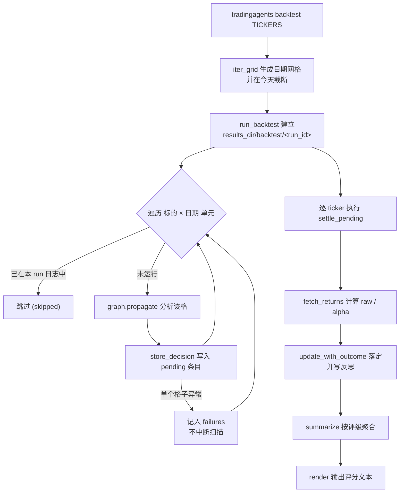

一次分析只产出一个决策，因此单次运行本身无法回答"系统决策得准不准"。回测把同一套流水线铺开到一个「标的 × 日期」的网格上，并在持有窗口已经交易完毕后，用相对基准的 alpha 收益对每个决策打分。本页聚焦 `tradingagents backtest` 命令的调用方式、参数语义，以及如何解读它输出的评分结果。它的定位是**评估决策质量**，而非组合模拟器——没有成交量、成交价和资金台账，因此本页不涉及任何执行模型或净值曲线。

Sources: [backtest.py](tradingagents/backtest.py#L1-L15)

## 命令与参数

回测以一个独立子命令的形式挂在 CLI 上，用法为 `tradingagents backtest TICKERS --start ... --end ...`。它所依赖的网格日期、分析师集合与资产类型都会在进入扫描前完成校验，任何一项非法都会以非零退出码结束并打印错误，而不会开始跑格子。

Sources: [main.py](cli/main.py#L99-L120)

下表列出全部命令行参数及其语义。

| 参数 | 形态 | 默认值 | 语义 |
|---|---|---|---|
| `TICKERS` | 位置参数（必填） | — | 逗号分隔的标的，如 `NVDA,AAPL`；去空后为空则报错 |
| `--start` | 选项（必填） | — | 网格的首个分析日期，`YYYY-MM-DD` |
| `--end` | 选项（必填） | — | 网格的末个分析日期，`YYYY-MM-DD` |
| `--every` | 选项 | `7` | 相邻分析日期之间相隔的天数 |
| `--analysts` | 选项 | `None` | 逗号分隔的分析师；省略时运行资产类型允许的全部分析师 |
| `--asset-type` | 选项 | `stock` | `stock` 或 `crypto` |
| `--portfolio` | 选项 | `None` | 持仓与现金的 JSON 文件，在网格中**恒定不变**地传给每个格子 |
| `--run-id` | 选项 | `None` | 继续先前的扫描：跳过其中已运行的格子并复用其日志 |

Sources: [main.py](cli/main.py#L100-L114), [main.py](cli/main.py#L130-L133)

分析师名称会被归一化与校验：用户可见的 `sentiment` 会映射到内部键 `social`，未知名称或对当前资产类型不可用的分析师（例如 crypto 下的 `fundamentals`）都会抛错；未显式指定时，则取资产类型允许的全部分析师。资产类型本身也从字符串强制转换为 `AssetType` 枚举，非法值同样触发错误退出。

Sources: [prompts.py](cli/prompts.py#L84-L99), [prompts.py](cli/prompts.py#L127-L136), [models.py](cli/models.py#L4-L16), [main.py](cli/main.py#L121-L128)

## 日期网格如何生成

`--start`、`--end`、`--every` 三个参数交给 `iter_grid` 生成分析日期序列。网格有两个关键约束：其一，日期必须严格是 `YYYY-MM-DD` 规范格式，像 `2026-1-5` 这类能被解析但非规范写法的输入会被拒绝；其二，网格**永远不会越过今天**——未来的日期没有可结算的结果，图本身也会拒绝，所以网格在当下截断，而不是制造无法计分的单元。

Sources: [backtest.py](tradingagents/backtest.py#L34-L51), [backtest.py](tradingagents/backtest.py#L54-L62)

`every_n_days` 必须至少为 1，且 `end` 不得早于 `start`，否则同样抛 `ValueError`。这保证了网格是单向前进、非空的确定序列。以 `--start 2026-01-05 --end 2026-01-20 --every 7` 为例，结果是 `2026-01-05, 2026-01-12, 2026-01-19`。

Sources: [backtest.py](tradingagents/backtest.py#L41-L51), [test_backtest.py](tests/test_backtest.py#L19-L36)

## 执行流程

每个格子独立地被分析一次：`run_backtest` 会为本次扫描在 `results_dir/backtest/<run_id>` 下建立**专属目录**，并把该目录同时作为 `results_dir` 和 `memory_log_path` 传入，因此线上记忆日志绝不会被写入。`run_id` 会成为路径片段，所以它按标的同款规则进行校验，绝对路径或含点的值会被拒绝，防止把运行目录写到结果目录之外。

Sources: [backtest.py](tradingagents/backtest.py#L129-L155), [test_backtest.py](tests/test_backtest.py#L78-L96)

网格中的每个格子都是**独立**的：一个标的或日期若被重复给出，会被去重为单一格子，只运行并结算一次。已在本次运行日志中的格子会被跳过，因此被中断的扫描只需用相同的 `--run-id` 再跑一次即可从断点处继续——跳过数量记入 `skipped`。

Sources: [backtest.py](tradingagents/backtest.py#L156-L171), [test_backtest.py](tests/test_backtest.py#L88-L95), [test_backtest.py](tests/test_backtest.py#L291-L306)

鲁棒性是这一层设计的重点。单个格子失败（例如某个数据供应商不可达）只会被记入 `failures` 并继续扫描，不会终止整轮；而结算阶段会逐标的显式执行 `settle_pending`——因为结算通常发生在对某标的的**下一次**运行开始时，若不显式补跑，每个标的的最后一个格子会永远停留在 pending。结算本身会调用 LLM 生成反思，因此它的失败同样被隔离，记入 `settlement_failures` 而不影响其余标的。

Sources: [backtest.py](tradingagents/backtest.py#L166-L181), [test_backtest.py](tests/test_backtest.py#L106-L113), [test_backtest.py](tests/test_backtest.py#L165-L181)

## 结果即记忆日志

回测没有任何独立的"结果表"：它的结果就是本次运行自己的记忆日志。每次运行都已在日志中记录其评级（rating），并在随后用相对基准的已实现收益与 alpha 收益完成结算，因此聚合只是对这份日志的读取。

Sources: [backtest.py](tradingagents/backtest.py#L1-L7)

日志是追加式的 Markdown 记录，条目以 `[日期 | 标的 | 评级 | 收益 | alpha | 持有天数 | resolved:日期]` 的标签行开头，随后的 `DECISION:` 与 `REFLECTION:` 段落承载决策文本与结算后的反思。未结算的条目其标签为 `[... | pending]`。写入时带有幂等保护：任一已存在的「标的 + 日期」条目都会阻止重复写入，避免同一决策被重复计入历史上下文与所有聚合。

Sources: [log.py](tradingagents/memory/log.py#L10-L17), [log.py](tradingagents/memory/log.py#L31-L59), [log.py](tradingagents/memory/log.py#L293-L324)

## 结算：alpha 从何而来

结算由 `settle_pending` 驱动：它取出该标的的全部 pending 条目，逐条获取收益并生成反思，最后以单次原子批量写落定。仅同标的的条目会在每次运行中被结算，其他标的的条目会累积，直到那个标的再次运行。

Sources: [settlement.py](tradingagents/memory/settlement.py#L107-L156), [trading_graph.py](tradingagents/graph/trading_graph.py#L325-L334)

收益的度量窗口由 `holding_period_days`（默认 **5** 个交易日）决定。`fetch_returns` 以交易日计持有窗口，并额外留出日历跨度与节假日缓冲；它要求整段持有窗口已经交易完毕，否则返回空值让条目**保持 pending 等待下次重试**，而不是用一个过早的部分收益去结算。这避免了在结果尚未真正发生时给出结论。

Sources: [settlement.py](tradingagents/memory/settlement.py#L51-L104), [default_config.py](tradingagents/default_config.py#L167-L169)

alpha 的基准通过 `resolve_benchmark` 解析：`benchmark_ticker` 显式设置时覆盖一切；否则用后缀映射按交易所后缀匹配区域指数（例如 `.T` 对应 `^N225`，`.HK` 对应 `^HSI`），美国上市且无点后缀的标的落到空后缀条目（默认 `SPY`）。收益按各自货币以百分比比较。

Sources: [settlement.py](tradingagents/memory/settlement.py#L13-L34), [default_config.py](tradingagents/default_config.py#L161-L190)

## 评分与结果解读

`summarize` 读取记忆日志并按评级聚合。它先筛出"已落定且评级可读"的条目（`pending` 与 `REVIEW` 被排除），再把 alpha 从日志文本解析为数值。最终产出 `BacktestSummary`，其 `render()` 文本形态可直接打印。

Sources: [backtest.py](tradingagents/backtest.py#L184-L215), [backtest.py](tradingagents/backtest.py#L65-L75)

评分的核心是"把结果对照评级所主张的方向来记分"。评级到方向的映射如下：看多（`Buy`、`Overweight`）主张 +1，看空（`Underweight`、`Sell`）主张 −1，`Hold` 不主张任何方向。因此，一次看空而 alpha 下跌的决策会被记为**命中**——若把它当作"错"来记，就会在系统恰好判断正确时报告它错了。

Sources: [backtest.py](tradingagents/backtest.py#L88-L98), [test_backtest.py](tests/test_backtest.py#L198-L229)

下表汇总各评级的方向与命中判据。

| 评级 | 方向 | 命中率判据 | 备注 |
|---|---|---|---|
| `Buy` / `Overweight` | +1 | alpha 为正 | 看多命中率 |
| `Hold` | 0 | 不适用 | 不主张方向，`hit_rate` 恒为 `None` |
| `Underweight` / `Sell` | −1 | alpha 为负 | 看空命中率 |
| `REVIEW` | — | 不参与 | 无可读评级，计入 `unscored` |

Sources: [backtest.py](tradingagents/backtest.py#L88-L98), [backtest.py](tradingagents/backtest.py#L100-L114), [rating.py](tradingagents/agents/rating.py#L20-L30)

渲染出的文本包含这些字段，它们各自对应的含义如下表。

| 输出字段 | 来源 | 含义 |
|---|---|---|
| `Resolved cells` | `summary.resolved` | 已落定、可计分的格子数 |
| `pending` | `summary.pending` | 尚未结算、暂不计分的格子数 |
| `unscored` | `summary.unscored` | 评级无从读出的 `REVIEW` 格子数 |
| `n=` | `RatingScore.count` | 该评级下已落定的格子数 |
| `called the direction X%` | `RatingScore.hit_rate` | 该评级的方向命中率 |
| `mean alpha ±X%` | `RatingScore.mean_alpha` | 相对基准的平均 alpha |
| `holding` | `BacktestSummary.holding` | 从日志读出的、结果实际覆盖的持有窗口 |

Sources: [backtest.py](tradingagents/backtest.py#L100-L126), [test_backtest.py](tests/test_backtest.py#L126-L140), [test_backtest.py](tests/test_backtest.py#L240-L248)

`Hold` 一行会显示 `no direction claimed` 而非命中率，`Unweighted` 之类的未落定评级不会出现在评分表中（"没有可结算的东西"）。只有当确实存在 pending 格子时，输出才会追加一行提示"Pending cells are not scored above; re-run to settle them."

Sources: [test_backtest.py](tests/test_backtest.py#L138-L139), [test_backtest.py](tests/test_backtest.py#L184-L229)

## 命令行输出与续跑

`backtest` 命令会为每个即将运行的格子打印一行 `[done/total] TICKER DATE` 的进度，随后输出 `summarize(result).render()` 的评分文本，以及一行运行小结：运行了多少格子、跳过多少、日志路径在哪。最后它会提示 `Continue or settle this sweep: --run-id <run_id>`——把这个值原样回传给 `--run-id`，就能继续或补结算这轮扫描。失败的格子与未结算的标的也会各自列出原因。

Sources: [main.py](cli/main.py#L135-L152), [backtest.py](tradingagents/backtest.py#L143-L145)

进度回调在实际运行每个格子**之前**触发，且续跑时只报告本轮真正运行的格子（total 相应缩小），因此在被中断后重跑，进度不会重复计数已完成的格子。

Sources: [test_backtest.py](tests/test_backtest.py#L280-L298)

## 结果之外：边界与免责

回测刻意不实现执行模型——一个评级变成一笔成交单需要数量、成交价与现金台账，这些系统并不具备；在这里臆造它们，等于在评估工具背后塞进一个执行模型。因此格子彼此独立，而传入的组合（`--portfolio`）是每个格子都相同的"存量账簿"，而非逐格滚动的持仓。

Sources: [backtest.py](tradingagents/backtest.py#L9-L14), [main.py](cli/main.py#L109-L111)

有一个时点相关的细节影响结果解读：历史/回测运行（交易日早于今天）会只注入"在该交易日之前已知结果"的历史教训，这保证回测不会学到尚未发生的结局；当前日期运行则禁用该过滤，与线上行为保持一致。这属于数据层时点一致性的范畴，见 [时点一致性与防未来函数](19-shi-dian-zhi-xing-yu-fang-wei-lai-han-shu)。

Sources: [trading_graph.py](tradingagents/graph/trading_graph.py#L147-L155), [log.py](tradingagents/memory/log.py#L80-L94)

最后，`render()` 的输出会附带一句必须正视的免责：alpha 是在每个分析日期之后、跨越 `holding` 窗口度量的；每个格子只有**一次模型采样**，且文本类数据源不被归档，因此这些数字是**指示性**而非可复现的。回测结果不保证与任何公布数字一致——收益取决于模型、温度、日期区间、数据质量与采样本身。

Sources: [backtest.py](tradingagents/backtest.py#L118-L126), [test_backtest.py](tests/test_backtest.py#L142-L146)

如果你想从命令行转到编程接口来驱动同样的回测，见 [Python API 与配置调整](9-python-api-yu-pei-zhi-diao-zheng)；如果想深入理解记忆日志的结构与配置键，见 [记忆日志与决策记录](25-ji-yi-ri-zhi-yu-jue-ce-ji-lu)；若想了解结算如何把结果转化为反思与 Alpha 归因，见 [反思与结算：Alpha 归因](26-fan-si-yu-jie-suan-alpha-gui-yin)。