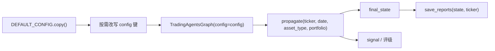
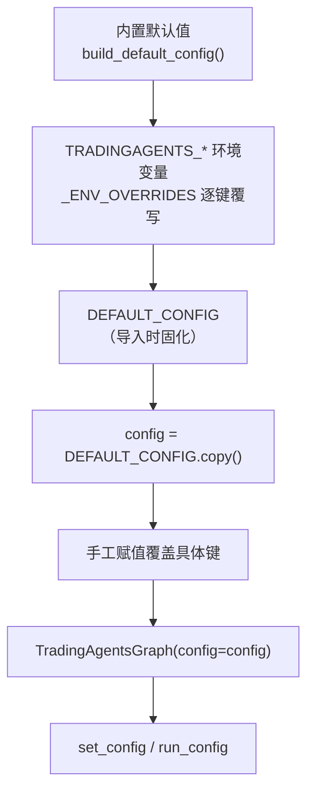

本页面向希望**在自己的代码中调用 TradingAgents**（而非通过命令行）的中级开发者。它覆盖三条主线：如何用 `TradingAgentsGraph` 驱动一次完整分析、如何在 Python 层组装并调整 `config` 字典、以及配置项如何从内置默认值一路流向底层 LLM 客户端与数据工具。本页聚焦"编程接口"视角；环境变量覆写的完整机制参见 [配置系统与环境变量覆盖](29-pei-zhi-xi-tong-yu-huan-jing-bian-liang-fu-gai)，投资组合语义参见 [投资组合上下文感知](30-tou-zi-zu-he-shang-xia-wen-gan-zhi)，回测框架参见 [回溯测试与决策评估框架](27-hui-su-ce-shi-yu-jue-ce-ping-gu-kuang-jia)。

## 编程入口：TradingAgentsGraph

整个框架的编程入口是 `TradingAgentsGraph` 类。它的构造函数接收四个参数：`selected_analysts`（要纳入的分析师团队）、`debug`（是否打印流式调试信息）、`config`（配置字典，为 `None` 时使用 `DEFAULT_CONFIG`）、以及 `callbacks`（可选的回调处理器列表，例如用于统计 LLM/工具调用）。构造函数内部会把 `config` 存入 `self.config`、调用 `set_config()` 将其安装为进程级配置、创建缓存与结果目录、按 `deep_think_llm` 与 `quick_think_llm` 各构建一个 LLM 客户端，并编译 LangGraph 工作流。

Sources: [trading_graph.py](tradingagents/graph/trading_graph.py#L54-L132)

一次运行由 `propagate(company_name, trade_date, asset_type="stock", portfolio=None)` 触发。它会先用 `_validate_trade_date` 校验日期必须严格是 `YYYY-MM-DD` 且不得晚于今天，然后在 `run_config` 上下文与检查点作用域中执行图，并返回一个二元组 `(final_state, signal)`。`final_state` 是运行结束时的完整状态字典（含各分析师报告、辩论历史、最终决策），`signal` 是五档评级之一（Buy / Overweight / Hold / Underweight / Sell），当决策文本无法解析出评级时为 `"REVIEW"`。

Sources: [trading_graph.py](tradingagents/graph/trading_graph.py#L182-L205), [trading_graph.py](tradingagents/graph/trading_graph.py#L350-L382)

`asset_type` 参数在股票流水线与加密流水线之间切换：CLI 会从代码自动识别，而**编程调用者需要显式传入**（加密资产传 `"crypto"`）。运行结束后，`save_reports(final_state, ticker, save_path=None)` 会把与 CLI 完全相同的 Markdown 报告树写到磁盘——每节一个文件（分析师、研究、交易、风险、组合经理）外加一份汇总的 `complete_report.md`；不传 `save_path` 时默认落在 `results_dir/reports/<TICKER>_<时间戳>` 下。

Sources: [trading_graph.py](tradingagents/graph/trading_graph.py#L290-L303), [reporting.py](tradingagents/reporting.py#L40-L126)

下面的流程图概括了从配置到决策的最短编程路径。



## 配置的三层来源

理解配置的关键在于它有三个叠加层次。最底层是内置默认值，由 `build_default_config()` 构造；中间层是 `TRADINGAGENTS_*` 环境变量覆写，在构造时通过 `_ENV_OVERRIDES` 映射表折叠进字典；最上层是调用者传入 `TradingAgentsGraph` 的 `config`。仓库根目录的 `main.py` 演示了最小用法——它直接 `DEFAULT_CONFIG.copy()`，因为环境变量覆写已在导入时应用，用户无需改动脚本即可切换模型或端点。

Sources: [default_config.py](tradingagents/default_config.py#L66-L199), [main.py](main.py#L1-L17)

需要特别注意的是：`DEFAULT_CONFIG` 在**包被导入时**就已固化（模块末尾执行 `DEFAULT_CONFIG = build_default_config()`），因此环境变量的读取发生在导入那一刻。若要在运行时查看"当前环境"对应的默认值，应再次调用 `build_default_config()` 而不是读取 `DEFAULT_CONFIG`。此外，`tradingagents/__init__.py` 会在导入包时加载 `.env`（以及可选的 `.env.enterprise`），所以 `DEFAULT_CONFIG` 的覆写与所有 LLM 客户端都能看到用户的密钥，且已由调用者导出的环境变量永不被覆盖。

Sources: [default_config.py](tradingagents/default_config.py#L66-L71), [default_config.py](tradingagents/default_config.py#L197-L199), [__init__.py](tradingagents/__init__.py#L1-L14)



## 可调整的配置项

下表汇总 `build_default_config()` 暴露的主要配置键，供编程调用者按需覆盖。三个推理/思考强度键默认为 `None`，表示每个供应商使用其自身默认值。

| 配置键 | 默认值 | 说明 |
| --- | --- | --- |
| `llm_provider` | `"openai"` | LLM 供应商，如 openai、google、anthropic、deepseek、ollama |
| `deep_think_llm` | `"gpt-6-sol"` | 复杂推理所用模型 |
| `quick_think_llm` | `"gpt-6-luna"` | 快速任务所用模型 |
| `backend_url` | `None` | 自定义端点；为 `None` 时各客户端回退到自身默认端点 |
| `google_thinking_level` | `None` | Google 思考强度（如 `"high"`、`"minimal"`） |
| `openai_reasoning_effort` | `None` | OpenAI 推理强度（如 `"medium"`、`"high"`） |
| `anthropic_effort` | `None` | Anthropic 努力档位（如 `"high"`、`"low"`） |
| `temperature` | `None` | 跨供应商的采样温度；`None` 表示用各供应商默认值 |
| `llm_max_retries` | `None` | SDK 重试预算；`None` 表示各供应商默认（通常 2） |
| `max_tokens` | `None` | 输出 token 上限；Gemini 映射为 `max_output_tokens` |
| `checkpoint_enabled` | `False` | 是否每步保存状态以支持断点恢复 |
| `output_language` | `"English"` | 报告与最终决策的输出语言（内部辩论仍用英文） |
| `max_debate_rounds` | `1` | 研究辩论轮数 |
| `max_risk_discuss_rounds` | `1` | 风险讨论轮数 |
| `max_tool_rounds` | `20` | 单个分析师在要求出报告前可进行的工具调用轮数 |
| `max_recur_limit` | `100` | LangGraph 递归上限 |
| `results_dir` / `data_cache_dir` / `memory_log_path` | `~/.tradingagents/...` | 结果、缓存与记忆日志路径 |
| `news_article_limit` / `global_news_article_limit` / `global_news_lookback_days` | `20` / `10` / `7` | 新闻抓取参数 |
| `data_vendors` / `tool_vendors` | 见下文 | 类别级与工具级数据供应商链 |
| `holding_period_days` | `5` | 结算是衡量决策结果的时间窗 |
| `benchmark_ticker` / `benchmark_map` | `None` / 区域指数表 | Alpha 基准 |

Sources: [default_config.py](tradingagents/default_config.py#L66-L199)

配置之间存在一个**构造期约束**：分析师每进行一轮工具调用会占用两个图步骤，因此当 `2 * max_tool_rounds + 2 >= max_recur_limit` 时，构造函数会抛出 `ValueError`，提示需要把 `max_recur_limit` 调高。这要求调用者在同时调整这两个键时保持它们的一致性。

Sources: [trading_graph.py](tradingagents/graph/trading_graph.py#L108-L112)

## 环境变量覆写与类型强制

环境变量的键到配置键的映射由 `default_config._ENV_OVERRIDES` 单点维护——新增一个可由环境覆写的键只需在此表加一行，无需改动任何入口脚本。值的类型转换以现有默认值的类型为准：布尔默认值接受 `true/1/yes/on` 与 `false/0/no/off`（大小写不敏感），整型默认值走 `int()`，浮点默认值走 `float()`，其余保持字符串原样。

Sources: [default_config.py](tradingagents/default_config.py#L7-L31), [default_config.py](tradingagents/default_config.py#L42-L63)

| 环境变量 | 目标配置键 |
| --- | --- |
| `TRADINGAGENTS_LLM_PROVIDER` | `llm_provider` |
| `TRADINGAGENTS_DEEP_THINK_LLM` | `deep_think_llm` |
| `TRADINGAGENTS_QUICK_THINK_LLM` | `quick_think_llm` |
| `TRADINGAGENTS_LLM_BACKEND_URL` | `backend_url` |
| `TRADINGAGENTS_OUTPUT_LANGUAGE` | `output_language` |
| `TRADINGAGENTS_MAX_DEBATE_ROUNDS` / `_MAX_RISK_ROUNDS` | `max_debate_rounds` / `max_risk_discuss_rounds` |
| `TRADINGAGENTS_MAX_TOOL_ROUNDS` | `max_tool_rounds` |
| `TRADINGAGENTS_CHECKPOINT_ENABLED` | `checkpoint_enabled` |
| `TRADINGAGENTS_BENCHMARK_TICKER` | `benchmark_ticker` |
| `TRADINGAGENTS_TEMPERATURE` | `temperature` |
| `TRADINGAGENTS_LLM_MAX_RETRIES` / `_MAX_TOKENS` | `llm_max_retries` / `max_tokens` |
| `TRADINGAGENTS_GOOGLE_THINKING_LEVEL` / `_OPENAI_REASONING_EFFORT` / `_ANTHROPIC_EFFORT` | 对应推理/思考键 |

Sources: [default_config.py](tradingagents/default_config.py#L7-L31)

两个语义细节对编程调用者很重要。其一，空字符串被视为"未设置"——`_apply_env_overrides` 会跳过 `None` 或 `""` 的值，因此取消注释 `.env.example` 中留空的路径变量不会把默认路径清空；`results_dir`、`data_cache_dir`、`memory_log_path` 这三个路径变量由 `os.getenv(...) or <默认路径>` 处理，同样在空值时保留默认。其二，非法值**响亮失败**而非静默回退：拼错的布尔值（如 `treu`）或非数字整数会在 `build_default_config()` 处抛出带变量名的 `ValueError`，避免一次无人值守的运行被悄悄配错。

Sources: [default_config.py](tradingagents/default_config.py#L45-L63), [default_config.py](tradingagents/default_config.py#L76-L83), [test_env_overrides.py](tests/test_env_overrides.py#L104-L130)

## 供应商与模型配置

`llm_provider` 决定用哪个客户端。工厂函数 `create_llm_client` 先匹配原生（非 OpenAI 兼容）API——`anthropic`、`google`、`azure`、`bedrock`——其余则判定是否 OpenAI 兼容并走 `OpenAIClient`；无法识别的供应商抛出 `ValueError`。供应商模块采用惰性导入，因此仅导入工厂本身不会拉入重型 SDK。

Sources: [factory.py](tradingagents/llm_clients/factory.py#L7-L56)

从 `config` 到客户端关键字参数的桥接由 `build_llm_kwargs` 完成，它按供应商挑选正确的旋钮名：Google 用 `thinking_level`、OpenAI 用 `reasoning_effort`、Anthropic 用 `effort`；`temperature`、`max_retries` 跨供应商转发，`max_tokens` 在 Gemini 下改名为 `max_output_tokens`。`max_retries` 与 `max_tokens` 都经过专门的强制函数校验——拒绝布尔值与负数（`max_tokens` 还要求为正），非法输入在启动时抛错而非静默禁用重试。

Sources: [factory.py](tradingagents/llm_clients/factory.py#L59-L131)

模型名并非任意即可通过而不作提示。在严格供应商（openai、anthropic、google、xai、deepseek、qwen、glm 等）下，若模型不在已知列表中，客户端会发出 `RuntimeWarning`（仍然继续运行）；而 `ollama`、`openrouter`、`openai_compatible`、`mistral`、`kimi`、`groq`、`nvidia`、`bedrock` 属于任意模型供应商，接受任何字符串且不告警。已知模型来自 `model_catalog` 的策展列表并并入 `LEGACY_MODELS`，因此针对旧版本写的配置在升级后仍能无警告运行。

Sources: [validators.py](tradingagents/llm_clients/validators.py#L8-L34), [base_client.py](tradingagents/llm_clients/base_client.py#L30-L42), [model_catalog.py](tradingagents/llm_clients/model_catalog.py#L232-L258)

关于采样温度，有一个容易被误用的点：当前策展的默认模型是推理优先的，**基本忽略 `temperature`**。因此把 `config["temperature"] = 0.0` 设上去并不能让输出逐字节可复现，若目标是更紧的可复现性，应改用一个非推理模型来命名 `deep_think_llm` / `quick_think_llm`。

Sources: [test_temperature_config.py](tests/test_temperature_config.py#L24-L39), [default_config.py](tradingagents/default_config.py#L100-L104)

## 数据供应商配置

`data_vendors` 是类别级的供应商链，`tool_vendors` 是工具级覆盖（优先级更高）。这里的关键设计是：**所配的值就是精确的供应商链，请求不会被悄悄改道到未选择的供应商**；若要有序回退，就在一个值里用逗号列出多个，例如 `"yfinance,alpha_vantage"`；值 `"default"` 表示使用全部可用供应商。默认配置把股票/技术/新闻交给 `yfinance`、把基本面交给 `sec_edgar,yfinance`、把宏观交给 `fred`、把预测市场交给 `polymarket`。

Sources: [default_config.py](tradingagents/default_config.py#L150-L171)

编程调用者可以只覆盖需要的嵌套键。`set_config` 对字典值键做**一层深合并**，因此 `{"data_vendors": {"core_stock_apis": "alpha_vantage"}}` 这类局部更新会保留 `data_vendors` 下其它未提及的键，而标量键则被整体替换。

Sources: [config.py](tradingagents/dataflows/config.py#L23-L42), [test_dataflows_config.py](tests/test_dataflows_config.py#L40-L52)

## 运行期配置隔离

一个常被忽视的并发要点：构建图会设置进程级配置，而 `set_config` 是合并而非替换，因此后建的图可能被前一个图的供应商"污染"。框架用 `ContextVar` 解决这一点——`run_config` 在每次运行期间把该图自己的配置绑定为"进行中运行的配置"，`run_config_context` 则返回一个可在多次 `next()` 之间持有的上下文，用于 `stream_run` 这种会在步骤间让出控制权的场景。`get_config()` 优先返回运行中配置，其次才是进程级配置，并且始终返回深拷贝以防外部改写泄漏回全局状态。

Sources: [config.py](tradingagents/dataflows/config.py#L10-L75), [test_dataflows_config.py](tests/test_dataflows_config.py#L74-L128)

## 投资组合与回测的编程参数

`propagate` 的 `portfolio` 参数接受一个 `PortfolioContext`。它可用 `model_validate` 从字典构造，也可用 `load_portfolio(path)` 从 JSON 文件读取（读取失败会在运行前抛 `ValueError`，而不是在图中间崩溃）。三种状态必须区分对待：有一个持仓、空仓（`positions` 为空列表）、以及完全没有传入——把"未提供"当作"空仓"会凭空捏造调用者账户的事实。传入组合后，交易员、风险分析师与组合经理会针对真实的持仓书工作。

Sources: [portfolio.py](tradingagents/portfolio.py#L21-L65), [README.md](README.md#L298-L315)

回测层则由 `run_backtest(tickers, dates, config, asset_type, portfolio, selected_analysts, run_id, progress)` 驱动，配合 `iter_grid(start, end, every_n_days)` 生成日期网格、`summarize(result)` 按评级聚合得分。回测使用自己的记忆日志（`results_dir/backtest/<run_id>/trading_memory.md`），绝不写入你的实时日志；由于日志即结果表，用同一个 `run_id` 重跑会跳过已运行的单元格，使被中断的扫描可以原地续跑。

Sources: [backtest.py](tradingagents/backtest.py#L108-L166), [backtest.py](tradingagents/backtest.py#L34-L50)

## 断点恢复的编程用法

当 `checkpoint_enabled` 为 `True` 时，`propagate` 会在内部把图重新编译为带每标的 `SqliteSaver` 的版本，使崩溃的运行能在下次以相同 ticker+date 调用时从最后一个成功节点恢复。检查点线程 ID 由 `_run_signature` 折叠进影响图形态的运行输入（分析师选择、辩论/风险深度、资产模式、组合指纹以及除少数键外的全部配置），因此**在不同配置下的续跑会重新开始而非静默复用旧结果**——不参与签名的只有存放位置、是否检查点以及重试次数。编程调用者若自行流式驱动（如 CLI 的 `stream_run`），必须配对使用 `begin_checkpoint` / `checkpoint_input` / `end_checkpoint`，并在成功时调用 `clear_checkpoint_on_success`。

Sources: [trading_graph.py](tradingagents/graph/trading_graph.py#L44-L48), [trading_graph.py](tradingagents/graph/trading_graph.py#L157-L180), [trading_graph.py](trading_graph.py#L207-L268), [checkpointer.py](tradingagents/graph/checkpointer.py#L28-L38)

## 完整示例：一次带配置与组合的编程运行

下面把本页要素拼成一段可运行的骨架：复制默认配置、覆盖供应商与模型、设输出语言、调低点评轮数、打开断点、传入持仓，并保存报告。

```python
from tradingagents.default_config import DEFAULT_CONFIG
from tradingagents.graph.trading_graph import TradingAgentsGraph
from tradingagents.portfolio import PortfolioContext

config = DEFAULT_CONFIG.copy()
config["llm_provider"] = "anthropic"          # 切换供应商
config["deep_think_llm"] = "claude-opus-5-5"  # 复杂推理模型
config["quick_think_llm"] = "claude-haiku-4-5"
config["output_language"] = "Chinese"
config["max_debate_rounds"] = 2
config["max_risk_discuss_rounds"] = 2
config["temperature"] = 0.0                   # 对非推理模型更可复现
config["checkpoint_enabled"] = True

portfolio = PortfolioContext.model_validate({
    "cash": 25000.0,
    "currency": "USD",
    "positions": [{"ticker": "NVDA", "quantity": 120, "average_price": 150.0}],
})

ta = TradingAgentsGraph(debug=True, config=config)
state, decision = ta.propagate("NVDA", "2026-09-01", asset_type="stock", portfolio=portfolio)
print(decision)                # Buy / Overweight / Hold / Underweight / Sell 或 REVIEW
ta.save_reports(state, "NVDA") # 与 CLI 相同的 Markdown 报告树
```

Sources: [main.py](main.py#L1-L17), [README.md](README.md#L245-L313), [trading_graph.py](tradingagents/graph/trading_graph.py#L182-L205)

## 下一步阅读

完成本页后，建议按以下路径深入：理解配置在运行时如何被图绑定与隔离，请读 [配置系统与环境变量覆盖](29-pei-zhi-xi-tong-yu-huan-jing-bian-liang-fu-gai)；把组合真正纳入决策请读 [投资组合上下文感知](30-tou-zi-zu-he-shang-xia-wen-gan-zhi)；用程序设计评价框架请读 [回溯测试与决策评估框架](27-hui-su-ce-shi-yu-jue-ce-ping-gu-kuang-jia)；若要理解这些配置如何塑造智能体协作，请进入 [总体架构与多智能体协作](11-zong-ti-jia-gou-yu-duo-zhi-neng-ti-xie-zuo)。